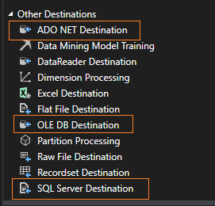

# [SQL Server Integration Services](https://learn.microsoft.com/en-us/sql/integration-services/sql-server-integration-services?view=sql-server-ver16)

To put simply SSIS is the ETL tool for MSSQL Server. Before Azure Data Factory this was the ETL tool for Microosft ecosystem.

Common activity with this tool is extracting data from XML, Csvs, .txt files and load into MSSQL Server.

# How to install SSIS

SSIS is installed as an option during MSSQL installation. There is no separate installation of this. 

# [Control Flow](https://learn.microsoft.com/en-us/sql/integration-services/control-flow/control-flow?view=sql-server-ver16) and [Data Flow](https://learn.microsoft.com/en-us/sql/integration-services/data-flow/data-flow?view=sql-server-ver16)

The SSIS ETL workflow is made up two main components:

Control Flow: This is the 'roadmap/blueprint/overall plan/sequence of steps' of the ETL workflow. It tell what steps to perform in which order. E.g.

First check if the file exists,
Then read the data from it,
Then, put the data to SQL server.

Control flow contains tasks and containers(for loop etc)

Data flow 

It is the actual transformation and movement of data. It contains Source, transformation and destination.

Oversimplified summary: Control flow is the Workflow and Dataflow is the transformation.

> Remember, control flow is the workflow. Dataflow is the transformation. Dataflow task is a task in the control flow.

### Key Differences
| Feature | Control Flow | Data Flow |
|---|---|---|
| Basic Unit | Task | Transformation |
| Focus | Workflow and execution order | Data movement and transformation |
| Processing | Sequential | Parallel |
| Examples | Execute SQL, send email, file transfer | Extract from database, clean data, load to data warehouse |

### Relationship between Control Flow and Data Flow
* The control flow **initiates** and **controls** the data flow.
* A **Data Flow Task** is a type of task in the control flow.
* Multiple data flows can be executed within a single SSIS package.

# SSIS SQL Destination Types

To send data from an SSIS workflow to an MSSQL server, we have three options (called Data Flow Destinations). Here’s a simple guide to help you decide which destination to choose for your SQL Server.

> In SSIS, a destination is a component(Module) that sends data into a database, etc.

| **Destination Type**        | **What It Does**                                             | **When to Use**                                       | **Pros**                                              | **Cons**                                          |
|-----------------------------|-------------------------------------------------------------|-------------------------------------------------------|-------------------------------------------------------|--------------------------------------------------|
| **ADO.NET Destination**     | Loads data into various databases using ADO.NET connections. | For MySQL, Oracle, and other ADO.NET compatible databases. | Supports complex data types and handles large data well. | Sometimes slower than OLE DB in some cases.      |
| **OLE DB Destination**      | Loads data into databases using OLE DB connections.          | Mainly for SQL Server or other OLE DB compatible databases. | Generally faster for SQL Server, widely used in ETL processes. | Less flexible with some modern data types compared to ADO.NET. |
| **SQL Server Destination**  | Loads data directly into SQL Server databases.               | When you need the best performance for SQL Server.    | Fastest performance for loading data into SQL Server. | Only works with SQL Server and needs local execution. |

## What to choose for MSSQL Server?

The **SQL Server Destination** is the fastest but needs the package to run on the same server as SQL Server and usually requires higher permissions.

So, OLE DB Destination could be the best choice for most cases.

# SQL Server Management Studio
SQL Server Management Studio (SSMS) is a tool for managing SQL Server and Azure SQL Database. With SSMS, you can set up, check, and control your SQL Server and databases. You can use it to deploy, monitor, and upgrade your application's data parts, and to create queries and scripts.

SSMS lets you query, design, and manage your databases and data warehouses, whether they are on your local computer or in the cloud.

# SSMS Installation

SSMS can be freely downloaded from microsoft site and installed on your windows system. You can install it almost any version of WIndows. It doesn't require windwos server to be instaslled.
