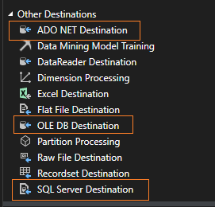

# SSIS SQL Destination Types

To send data from an SSIS workflow to an MSSQL server, we have three options (called Data Flow Destinations). Here’s a simple guide to help you decide which destination to choose for your SQL Server.

> In SSIS, a destination is a component(Module) that sends data into a database, etc.

| **Destination Type**        | **What It Does**                                             | **When to Use**                                       | **Pros**                                              | **Cons**                                          |
|-----------------------------|-------------------------------------------------------------|-------------------------------------------------------|-------------------------------------------------------|--------------------------------------------------|
| **ADO.NET Destination**     | Loads data into various databases using ADO.NET connections. | For MySQL, Oracle, and other ADO.NET compatible databases. | Supports complex data types and handles large data well. | Sometimes slower than OLE DB in some cases.      |
| **OLE DB Destination**      | Loads data into databases using OLE DB connections.          | Mainly for SQL Server or other OLE DB compatible databases. | Generally faster for SQL Server, widely used in ETL processes. | Less flexible with some modern data types compared to ADO.NET. |
| **SQL Server Destination**  | Loads data directly into SQL Server databases.               | When you need the best performance for SQL Server.    | Fastest performance for loading data into SQL Server. | Only works with SQL Server and needs local execution. |

## What to choose for MSSQL Server?

The **SQL Server Destination** is the fastest but needs the package to run on the same server as SQL Server and usually requires higher permissions.

So, OLE DB Destination could be the best choice for most cases.