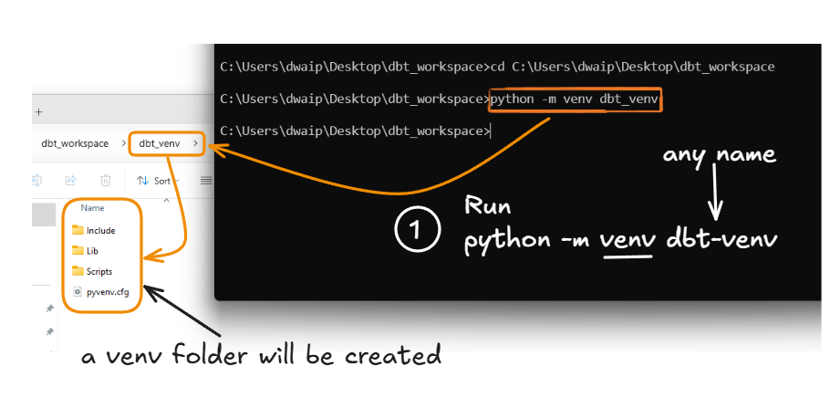
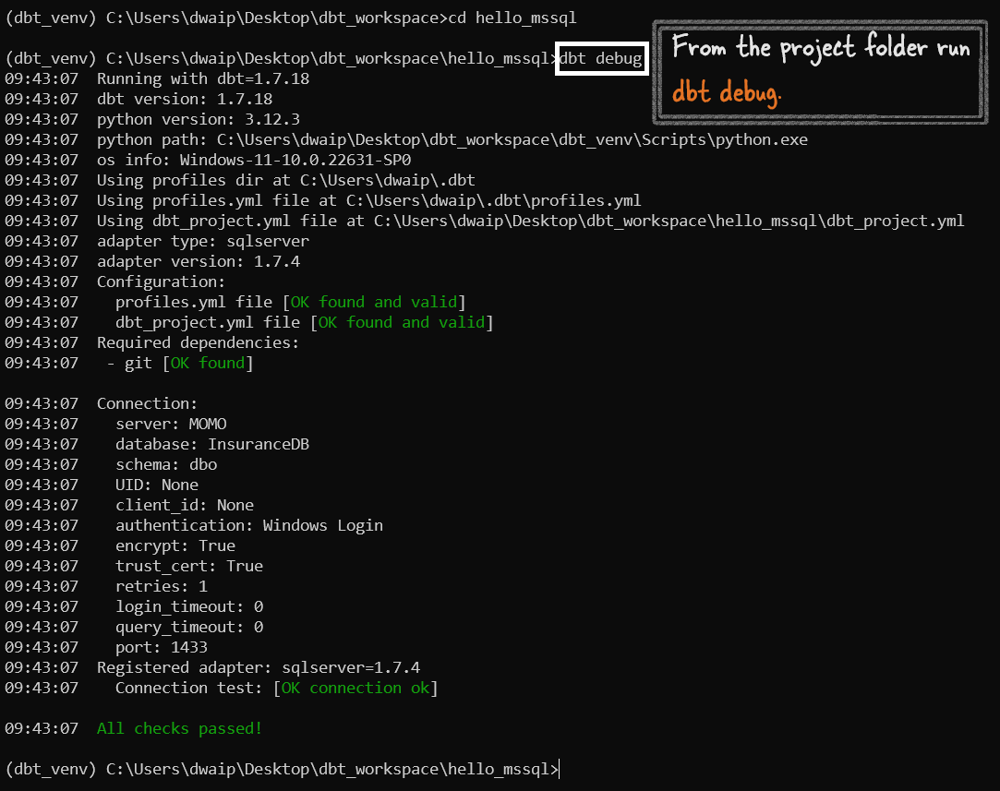

# <span style="color: #7A3DAA; font-family: Segoe UI, sans-serif;">Connect Local dbt with MSSQL Server</span>

This guide will take you through the steps to create a project with dbt and connect it to a Microsoft SQL Server (MSSQL) database.

## <span style="color: #7A3DAA; font-family: Segoe UI, sans-serif;">Steps to follow</span>
1. **Create .dbt Folder**: Create a `.dbt` folder in your user directory, e.g., `C:\Users\dwaip\.dbt`.

2. **Add profiles.yml**: Inside the `.dbt` folder, place a `profiles.yml` file with the following content:

   ```yml
   # Das: This profiles.yml configuration is tested for:
   # - SQL Server 2022 build 16.0.1121.4
   # - Python 3.12.3
   # - Registered adapter: sqlserver=1.7.4
   # - dbt version: 1.7.18
   # - Authentication: Windows Login

   # Profile name should match what's in your dbt_project.yml
   hello_mssql:

   # 'target' specifies the environment (e.g., dev, prod)
   target: dev

   # 'outputs' define configurations for environments
   outputs:

      # Configuration for the 'dev' environment
      dev:

         # Database type
         type: sqlserver

         # ODBC driver for SQL Server
         driver: 'ODBC Driver 17 for SQL Server'

         # SQL Server name or IP
         server: 'MOMO'

         # Default port for SQL Server
         port: 1433

         database: 'InsuranceDB'
         schema: 'dbo'

         # Use Windows login credentials
         trusted_connection: true

         # Enable encryption for data transmission
         encrypt: true

         # Trust the server's SSL certificate (useful for self-signed certificates)
         trust_cert: true
   ```

3. **Create Project Folder**: Create a new folder on your laptop, e.g., `dbt_projects`, and navigate (CD) into it.

4. **Set Up Virtual Environment**: Inside your project folder, create a virtual environment by running `python -m venv dbt_venv`.



5. **Activate Virtual Environment**: Activate the virtual environment by running `.\Scripts\activate`. The `activate.bat` or `activate.ps1` file is inside the `Scripts` folder.

6. **Install dbt and Adapter**: Install dbt core and the SQL Server adapter by running `pip install dbt-core dbt-sqlserver`. Replace `dbt-sqlserver` with the appropriate adapter name if needed.

7. **Initialize dbt Project**: Initialize your dbt project by running `dbt init [project_name]`, e.g., `dbt init hello_mssql`. This will create a folder named `hello_mssql`. Ensure the project name matches the one in your `profiles.yml`.

8. **Run dbt Debug**: Navigate (CD) into the `hello_mssql` folder and run `dbt debug`. Ensure you run `dbt debug` from inside the project folder.



# <span style="color: MediumOrchid; font-family: Segoe UI, sans-serif;">Connect Local dbt with Databricks</span>

1. **Set Up .dbt Folder**: Create a `.dbt` folder in your user directory, e.g., `C:\Users\dwaip\.dbt`.

2. **Add profiles.yml**: Inside the `.dbt` folder, place a `profiles.yml` file with the following content:

   ```yaml
   databricks:
     outputs:
       dev:
         type: databricks
         server_host: [databricks_host_url]
         http_path: [http_path]
         token: [access_token]
         schema: [schema_name]
         catalog: [catalog_name] # optional
         warehouse: [warehouse_name] # optional
     target: dev
   ```

   Replace `[databricks_host_url]`, `[http_path]`, `[access_token]`, `[schema_name]`, `[catalog_name]`, and `[warehouse_name]` with your specific details.

3. **Create Project Folder**: Create a new folder on your laptop, e.g., `dbt_projects`, and navigate (CD) into it.

4. **Set Up Virtual Environment**: Inside your project folder, create a virtual environment by running `python -m venv dbt_venv`.

5. **Activate Virtual Environment**: Activate the virtual environment by running `.\Scripts\activate`. The `activate.bat` or `activate.ps1` file is inside the `Scripts` folder.

6. **Install dbt and Adapter**: Install dbt core and the Databricks adapter by running `pip install dbt-core dbt-databricks`. 

7. **Initialize dbt Project**: Initialize your dbt project by running `dbt init [project_name]`, e.g., `dbt init hello_databricks`. This will create a folder named `hello_databricks`. Ensure the project name matches the one in your `profiles.yml`.

8. **Run dbt Debug**: Navigate (CD) into the `hello_databricks` folder and run `dbt debug`. Ensure you run `dbt debug` from inside the project folder.


# <span style="color: MediumOrchid; font-family: Segoe UI, sans-serif;">Errors</span>

### <span style="color: #AD49B3; font-family: Segoe UI, sans-serif;">1. Profiles.yml File is Invalid</span>

#### <span style="color: #963F9C; font-family: Segoe UI, sans-serif;">Error:</span>
When running `dbt debug`, an error appeared saying the `profiles.yml` file was invalid, with the message: `'yes' is not valid under any of the given schemas`.

#### <span style="color: #7F3585; font-family: Segoe UI, sans-serif;">Resolution:</span>
Change the value of `trusted_connection` from `'yes'` to `true` (without quotes) in the `profiles.yml` file. This ensures dbt correctly recognizes the trusted connection setting.

### <span style="color: #AD49B3; font-family: Segoe UI, sans-serif;">2. dbt_project.yml File Not Found</span>

#### <span style="color: #963F9C; font-family: Segoe UI, sans-serif;">Error:</span>
The `dbt debug` command failed because the `dbt_project.yml` file was not found in the project directory.

#### <span style="color: #7F3585; font-family: Segoe UI, sans-serif;">Resolution:</span>
Create a `dbt_project.yml` file in the project directory and ensure it correctly references the profile name used in the `profiles.yml` file.


### <span style="color: #AD49B3; font-family: Segoe UI, sans-serif;">3. Could Not Find Profile Named 'hello_mssql'</span>

#### <span style="color: #963F9C; font-family: Segoe UI, sans-serif;">Error:</span>
An error occurred because dbt couldn't find a profile named `hello_mssql`, even though the profile was set up in the `profiles.yml`.

#### <span style="color: #7F3585; font-family: Segoe UI, sans-serif;">Resolution:</span>
Ensure that the `profile` in `dbt_project.yml` matches the profile name in `profiles.yml`. For example, if the profile name is `mssql_server` in `profiles.yml`, make sure `dbt_project.yml` references `mssql_server`.

### <span style="color: #AD49B3; font-family: Segoe UI, sans-serif;">4. SSL Certificate Not Trusted</span>

#### <span style="color: #963F9C; font-family: Segoe UI, sans-serif;">Error:</span>
The connection to SQL Server failed with the error: `The certificate chain was issued by an authority that is not trusted`.

#### <span style="color: #7F3585; font-family: Segoe UI, sans-serif;">Resolution:</span>
To resolve this, add `trust_cert: true` to your `profiles.yml` file. This will bypass the SSL certificate validation error and allow dbt to connect to SQL Server.


# <span style="color: #7A3DAA; font-family: Segoe UI, sans-serif;">Connect Local dbt with spark</span>


Further reading
https://github.com/dbt-labs/dbt-spark