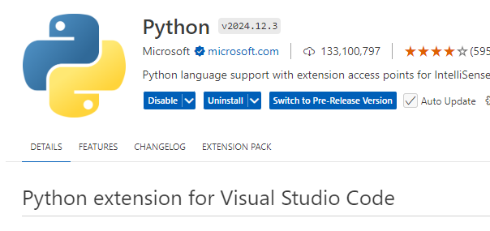

## What is dbt?

dbt stands for data built tool. It's a tool to run SQL as workflows. It's almost all-SQL.

**dbt is the T in ELT.**

## Why dbt?

Opensource, free. Dbt uses only SQL, no learning. Now, mostly things are ELT. And, dbt only works as transformation and no exttaction and load. So dbt is good with the appraoch. ALso, version control, CI/CD document generation etc.

Now, dbt is popular as man many companies are doing ELT. Dbt is the T in the ELT.

## So why not just use a SQL notebook in databricks?

Have you seen how notebooks run, one cell after another. Do you think workflows are always like a train? Long and linear? Workflows have branches like trees. dbt is far more than what databricks sql notebook's one cell at a time offers.

So, to summarize, with dbt, you can run sql on your data which is already `inside` like enjoying in house like lakehouse, beachhouse, warehouse etc.

## Explain more

With dbt you can put your complex sql into small small chunks. All your coding good practices like modular kitchen, git, CI/ABCD you can do with dbt.

## How to install dbt? Is it local or on cloud?

DBT has two ways to install:

Local(dbt core): Here you just install a command line tool. It conneccts with databases etc with 'adapters'

Cloud(dbt cloud): This is not just cloud. It offers all fancy stuffs like: User interface, job scheduling, CI/CD, hosting documentation, monitoring, alerting, integrated IDE, CLI(to connect from local)

## Steps Install dbt locally on Windows

- Install python on your system.
- Install VS Code
- Install python and dbt extensions in VS Code

## Awesome links

[DBT Guides](https://docs.getdbt.com/guides)
[DBT Guides](https://docs.getdbt.com/guides)