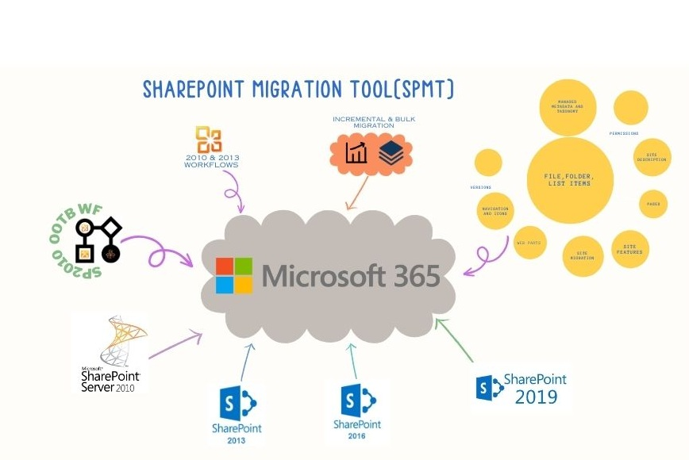

- [Migrating to Microsoft 365 with the SharePoint Migration Tool (SPMT)](#migrating-to-microsoft-365-with-the-sharepoint-migration-tool-spmt)
    - [What Can Be Migrated?](#what-can-be-migrated)
    - [Let's get started](#lets-get-started)

## Migrating to Microsoft 365 with the SharePoint Migration Tool (SPMT)

If you're looking to move your content from on-site SharePoint locations to the cloud with Microsoft 365, there's a free and user-friendly tool just for you. The SharePoint Migration Tool (SPMT) is here to simplify the process of transferring your SharePoint Server sites and content.

#### What Can Be Migrated?

The table below contains the items which can be migrated using SPMT.

| **Supported Feature**                                                                                           | **Description**                                                                                      |
|-----------------------------------------------------------------------------------------------------------------|------------------------------------------------------------------------------------------------------|
| **Migration Sources**                                                         |                                                                                                      |
| On-premises fileshares                                                        | Supports local and network fileshares migration.                                                     |
| SharePoint Server versions                                                    | Migrates from SharePoint Server 2010, 2013, 2016, and 2019.                                           |
| **Content Types**                                                            |                                                                                                      |
| File, folder, list items                                                     | Migrates files, folders, and lists.                                                                  |
| Pages                                                                        | Migrates pages in the site asset library.                                                            |
| **Permissions & Security**                                                  |                                                                                                      |
| Permissions                                                                 | Sets file share and SharePoint permissions separately.                                               |
| **Site Features & Components**                                              |                                                                                                      |
| Managed metadata and taxonomy                                               | Supports content types and term store migration; requires admin permissions.                         |
| Navigation and icons                                                        | Preserves and migrates site navigation for out-of-box sites.                                         |
| Site features                                                               | Supports a wide range of site features.                                                              |
| SharePoint web parts                                                        | Supports SharePoint web parts migration.                                                             |
| Site migration                                                              | Migrates "out-of-the-box" SharePoint sites without coding or third-party tools.                      |
| Site description                                                            | Migrates site descriptions.                                                                          |
| **Workflows & Automation**                                                  |                                                                                                      |
| OOTB Workflows to Power Automate                                            | Migrates SharePoint Server 2010 OOTB workflows to Power Automate.                                    |
| SPD Workflows to Power Automate                                             | Migrates SharePoint Server 2010 and 2013 Designer workflows to Power Automate.                       |
| List, library, content-type workflows                                       | Migrates list, library, and content-type workflows (excluding site workflows).                       |
| Workflow definitions and associations                                       | Migrates workflow definitions and associations, not history data.                                    |
| **Additional Features**                                                       |                                                                                                      |
| Incremental                                                                   | Supports incremental migration by rerunning tasks later.                                             |
| Microsoft Teams                                                               | Allows selection of Teams and channels for migration.                                                |
| Taxonomy migration                                                            | Manages metadata and taxonomy in incremental updates; off by default.                                |
| Bulk migration                                                                | Allows bulk migration via JSON or CSV for numerous sources.                                          |
| Versions                                                                      | Lets you choose what file history to preserve.                                                       |

#### Let's get started
