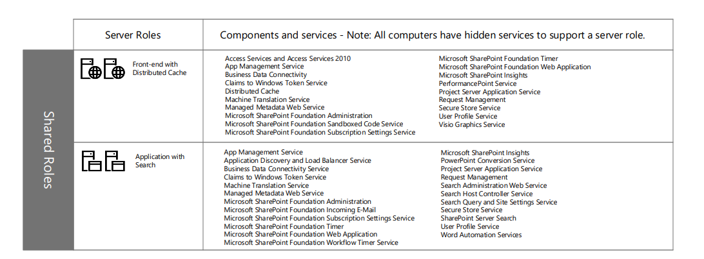
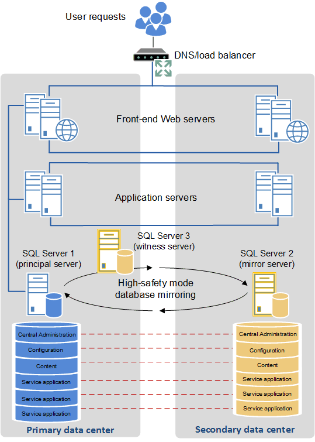

- [Background](#background)
  - [Objectives of Redesign](#objectives-of-redesign)
  - [Project Overview \& Understanding](#project-overview--understanding)
  - [Current System Study](#current-system-study)
  - [Current System Assessment](#current-system-assessment)
    - [Governance](#governance)
    - [Infrastructure \& Platform](#infrastructure--platform)
    - [Information Management](#information-management)
    - [Usability](#usability)
    - [SharePoint Farm Maintenance \& Deployment](#sharepoint-farm-maintenance--deployment)
  - [System Architecture \& Design Recommendations](#system-architecture--design-recommendations)
    - [Available architectural models](#available-architectural-models)
    - [License models](#license-models)
  - [Topology Recommendation](#topology-recommendation)
    - [Services Installed:](#services-installed)
    - [High Availability Explanation:](#high-availability-explanation)
    - [Disaster recovery Recommendations](#disaster-recovery-recommendations)

# Background

The client intends to overhaul their current Microsoft Office SharePoint-based portal application, which comprises approximately 10 site collections. The primary goal is to enhance and simplify content management capabilities.

## Objectives of Redesign

- Deploy the best fit infrastructure and system architecture.
- Utilize generic content types with optimum reusability.
- Ensure consistent use of document management.
- Leverage a collaboration platform that minimizes the learning curve through self-service.
- Standardize enterprise content management using built-in SharePoint tools.
- Implement a MOSS Governance policy to define Roles and Responsibilities, Policies, Processes, Deployment Strategies, and Site Structure.
- Design and deploy a High Availability solution without any single point of failure.
- Integrate plug-in and proprietary applications based on MOSS.

## Project Overview & Understanding

The client has deployed SharePoint to satisfy various organizational needs. Despite this, the implementation is lacking in best practices and future enhancement opportunities. Common challenges for organizations adopting SharePoint include planning, strategy, infrastructure, architecture design, UI Design, migration, and development. These tasks demand a flexible infrastructure as a prerequisite. Yet, often, organizations encounter outdated and improperly configured environments that hinder new implementations. Thus, the baseline architecture is critical for the success of all SharePoint projects.

## Current System Study

We engaged in thorough discussions with the The Client management team to comprehend the requirements for revamping and redesigning the current SharePoint setup. The Client facilitated this by providing VPN access with site-level permissions for us to review the production sites' replicas, minus any sensitive data. We has documented how to remove sensitive data and manage the backup/restore process for site assessments in the development environment, adhering to standard practices during the current system study.

## Current System Assessment

### Governance

- Absence of a defined SharePoint resource governance matrix.
- Lack of clear business ownership for sites, with accountability resting solely on the technical team.
- Existence of an incomplete and outdated governance document.
- Undefined SharePoint administration process and absence of a dedicated administrator for maintenance and governance best practices implementation.
- Lack of application usage and customization policies.

### Infrastructure & Platform

- Non-implementation of SharePoint for High Availability and lack of business continuity plans.
- Presence of single points of failure and absence of a Disaster Recovery farm.
- Outdated server boxes unsuitable for future SharePoint upgrades and virtualization technologies.
- Non-configured sandbox environment.
- Presence of sensitive data in the development environment, which should only reside in the production environment.
- Minimal integration with other Enterprise Web Applications and Data.

### Information Management

- Development of a flat structure taxonomy without hierarchy.
- Presence of unused or obsolete lists/libraries consuming storage space.
- Scattered contents in File Systems potentially holding critical contents without expiration policies.
- Absence of Information Management documentation describing existing SharePoint implementation.
- Lack of reference for lists/libraries containing sensitive information.
- Use of custom ASPX pages outside of the SharePoint publishing feature.
- Underutilization of content and document types.
- Nonexistence of content publishing processes and policies.

### Usability

- Unstructured navigation lacking distinct, easily recognizable groups and consistency.
- The UI of MyThe Client Home page is appealing, but site menus and contents are not easily identifiable against a glittery background.
- Absence of quick links across all sites for better navigation.
- Presence of broken links.

### SharePoint Farm Maintenance & Deployment

- Creation of dedicated web applications for each Site Collection without clear rationale or isolation needs.
- Placement of all custom DLLs in GAC, contrary to Microsoft Best Practices recommending the \BIN folder.
- Execution of backups without an archiving strategy and plan.
- Absence of true business process management or enterprise-level workflow automation solutions, possibly available offline.

## System Architecture & Design Recommendations

Microsoft Office SharePoint Server 2016 provides the flexibility to meet many different deployment solution goals. This includes guidance that would help the client in:
-	Determine the number of server in farm required to meet the solution goals.
-	Plan for the relationships between servers in the farm.
-	Plan for Extranet -facing server farm.
-	Design server-farm topologies to meet availability goals.

### Available architectural models

The table below summarizes the different approaches to deploying and managing SharePoint 2016, ranging from fully cloud-based SaaS solutions to traditional on-premises deployments.

| Model                         | Description |
|-------------------------------|-------------|
| **SharePoint Online/SaaS**    | You consume SharePoint through a Software as a Service (SaaS) with an Office 365 subscription. SharePoint is always up to date, but you are responsible for managing SharePoint itself. | 
| **SharePoint Hybrid**         | Combines SharePoint Online with a SharePoint Server 2016 farm, deployed either in Azure or on-premises. Incorporates SharePoint Online services into your overall SharePoint offering, starts building SaaS management skills in your organization, and moves your SharePoint Server 2016 sites and apps to the cloud at your own pace. |
| **SharePoint in Azure/IaaS**  | Extends your on-premises environment into Azure Infrastructure as a Service (IaaS) for production, disaster recovery, or dev/test SharePoint Server 2016 farms. |
| **SharePoint on-premises**    | Plans, deploys, maintains, and customizes your SharePoint Server 2016 farm in a datacenter that you maintain. |

### License models

| Deployment Model                           | Licensing Requirements |
|--------------------------------------------|------------------------|
| **SharePoint Online**                      | Assign licenses to Azure AD user accounts from your Office 365 subscription, no additional licenses needed |
| **SharePoint Hybrid**                      | - Office 365: Subscription model, no additional licenses needed  - On-premises: Windows Server 2012 R2 or Windows Server 2016  - On-premises: SQL Server 2016 or SQL Server 2014 SP1 or later  - On-premises: SharePoint Server 2016 License  - On-premises: SharePoint Server 2016 Client Access License |
| **SharePoint Server 2016 in Azure (IaaS)** | - Azure subscription  - SharePoint Server 2016 License  - SharePoint Server 2016 Client Access License |
| **SharePoint Server 2016 On-premises**     | - Windows Server 2016 or Windows Server 2012 R2  - SQL Server 2016 or SQL Server 2014 SP1 or later  - SharePoint Server 2016 License  - SharePoint Server 2016 Client Access License |

## Topology Recommendation

We recommend the following farm topology for a high-availability, on-premises SharePoint 2016 farm with six servers, utilizing the latest features such as MinRole

**Front-End with Distributed Cache Servers:**
- **Server 1 & 2**: These servers will handle all the user requests and serve the web pages. They will also host the Distributed Cache service, which is crucial for speeding up the retrieval of data and improving performance by caching frequently accessed information.

**Application with Search Servers:**
- **Server 3 & 4**: These servers will run backend service applications and host the Search service. They handle the processing tasks that support the front-end servers, such as the Search service, which indexes content and processes search queries.

**Database Servers:**
- **Server 5 & 6**: These will be the SQL Server databases configured in a high-availability cluster using SQL Server AlwaysOn Availability Groups. They store all the content and configurations for the SharePoint farm.

### Services Installed:

**Front-End with Distributed Cache Servers (Server 1 & 2):**
- Access Services
- Business Data Connectivity Service
- Managed Metadata Web Service
- User Profile Service
- Distributed Cache
- Microsoft SharePoint Foundation Web Application
- And other front-end related services...

**Application with Search Servers (Server 3 & 4):**
- App Management Service
- Business Data Connectivity Service
- Machine Translation Service
- Managed Metadata Web Service
- Search Host Controller Service
- Search Query and Site Settings Service
- Secure Store Service
- User Profile Service
- And other application services...

**Database Servers (Server 5 & 6):**
- SQL Server with AlwaysOn Availability Groups configured for all SharePoint databases. 

### High Availability Explanation:

**Front-End Servers:**
- Having two front-end servers ensures that if one goes down, the other can continue to serve user requests without interruption. Network Load Balancer (NLB) would be used to distribute the requests evenly between the two servers.

**Application with Search Servers:**
- Two servers with application and search services offer redundancy for these critical components of the SharePoint infrastructure. If one server fails, the other can take over the services without impacting the availability of the SharePoint farm.

**Database Servers:**
- SQL Server AlwaysOn Availability Groups provide high availability for the databases. In the event of a database server failure, the other node in the AlwaysOn group will take over, ensuring the SharePoint farm's data remains accessible. This setup provides both high availability and disaster recovery.

The suggested SharePoint 2016 farm topology is designed to minimize single points of failure, ensuring that user access is uninterrupted, search functionality remains operational, and data is consistently available even in the event of server outages. The use of MinRole ensures that each server is optimized for its role, improving performance and reliability. The distribution of roles across multiple servers, along with the redundancy built into each layer (front-end, application, and database), achieves a highly available environment that aligns with SharePoint 2016's infrastructure advancements.

### Disaster recovery Recommendations

Implement a "stretched farm" where there will be two data centres configured as a single farm. This is possible if two data centres are in close proximity, connected with higg bandwidth fiber optiks link. The bandwidth requiremnt, recommended by Microsoft for such topology is:

- Intra-farm latency of <1ms (one way), 99.9% of the time over a period of ten minutes.
- The bandwidth speed must be at least 1 gigabit per second.
The recommended topology from Microsoft would look something like as shown below:

---