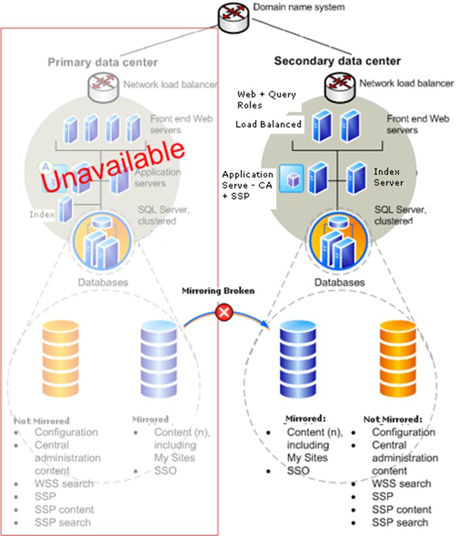

- [Introduction](#introduction)
  - [Purpose](#purpose)
- [Existing System Specification](#existing-system-specification)
  - [Current System study](#current-system-study)
    - [Farm Scenario](#farm-scenario)
  - [Current System Assessment](#current-system-assessment)
  - [General Farm Requirements](#general-farm-requirements)
  - [High Availability (HA) and Disaster Recovery (DR) Requirements](#high-availability-ha-and-disaster-recovery-dr-requirements)
- [Assumptions \& Dependencies](#assumptions--dependencies)
  - [Assumptions](#assumptions)
  - [Scope](#scope)
- [High-level infrastructure layout](#high-level-infrastructure-layout)

# Introduction

Here, I am sharing about a project which I was part of acting as a consultant for architecture.

## Purpose

The client wants to setup a new consolidated SharePoint farm in its European Data Center (EDC) for its intranet and extranet SharePoint applications in an efficient and cost effective manner. This new farm should be implemented in such a way so that it provides high availability (HA), Scalability and Disaster Recovery (DR).

# Existing System Specification

## Current System study

Our team had detailed discussions with the client's management team to understand the needs to consolidate the existing SharePoint environments to new SharePoint environments in a more (cost) efficient and more stable manner. We followed the standard process of studying current system. The following section would highlight the key findings of the system study:

### Farm Scenario

| &nbsp;Particular | Ceva portal | Ceva NET | Extranet |
| --- | --- | --- | --- |
| Farm Topology | One SharePoint 2007 farm in Florida consisting of 2 servers  (WFE and 2 App roles combined),  using a SQL Server cluster | One SharePoint 2007 farm in Texasconsisting of 2 WFE and 2 App servers, using SQL Server 2005 cluster. | One WSS 3.0 server;  located in Texas  containing few 100 sites. |
| Sites | 200 team sites, 15 apps (from Notes). | 1000 sites, multilingual,  custom apps (30% custom, 70% standard). | Few hundred sites. |
| Storage | 50 gb | 100 gb | unspecified |
| Users | 500 – 2000 | 24000 | unspecified |
| Average Requests | 400 | 45000 | unspecified |
| NLB | No Hardware NLB used. Uses Windows (software) NLB. | No Hardware NLB used. Uses Windows (software) NLB. | No Hardware NLB used. Uses Windows (software) NLB. |
| Business Data Catalogue(BDC) | Not configured | Not configured | Not configured. |

## Current System Assessment

Our assessment findings based on current client's SharePoint implementation are:

- Current SharePoint installation is not implemented for High Availability. No business continuity plans defined.
- Single Point of failure. No Disaster Recovery farm exists.
- Absence of redundancy for some of the server roles.
- Absence of scalability for some of the server roles.

## General Farm Requirements

- To design, build, test and deploy the new SharePoint 2007 farm in the EDC meant for intranet/extranet MOSS 2007 applications.
- To Perform English-only out of the box installation.
- To configure search, user profile sync etc.
- To incorporate scalability, High availability and Disaster recovery.
- To implement a supported full backup/restore solution, preferably with NetBackup (VERITAS/Symantec).
- To provide a migration plan.
- To help with test migrations.

## High Availability (HA) and Disaster Recovery (DR) Requirements

The following parameters are to be met in for High availability and Disaster Recovery:

| **Parameter** | **CEVANet** |
| --- | --- |
| **Gold** |
| --- | --- |
| Monitoring | 24x7 on desk |
| Availability | 99.35% |
| “Allowed” downtime per month | Approximately 4.5 hours |
| Recovery time (in the event of a complete failure this is the RTO) | 8 hours |
| Recovery Point Objective (RPO) | 120 minutes |
| Successful failover testing | Once every 12 months |
| Successful Disaster Recovery Testing | Once every 12 months |
| Successful Testing of a Restore from a Backup | Once every 12 months |
| Disaster Recovery Capacity | 80% |

# Assumptions & Dependencies

## Assumptions

1. Development and (user) acceptance environments are already available.
2. SharePoint 2007 SP2 with SQL Server 2008 R2 setup is already available and is clustered and mirrored across two data centers.
3. Hardware ordering/installation and OS installation will be done by Ceva and are available within 4 weeks after ordering.
4. SQL Server storage and resources are available and high available with disaster recovery.
5. The reverse proxy will support SharePoint (possible impact on authentication and/or requires additional configuration)

## Scope

Below activities will be performed to accomplish the task.

1. Discovery
    1. Analyze the existing SharePoint 2007 farms to find the application size, no. of site collections, database size, and user base.
2. Design
    1. Prepare Hardware BOM.
    2. Prepare Software BOM.
    3. Prepare Technical Architecture Specifications.
    4. Prepare Execution Environment Design.
    5. Prepare DR Plan.
    6. Prepare Backup/Restore Plan.
3. Build
    1. MOSS Installation and Farm Setup.
    2. Backup/Restore Implementation.
    3. DR Implementation.
    4. Prepare the install and configuration guide.
    5. Prepare the Technology Policies and Procedures.
    6. Prepare the Scalability Matrix.
4. Migration Support
    1. Provide any Farm related support during application migration.
5. Test & Deploy
    1. Prepare the Test Plan to test the SharePoint Farm.
    2. Execute the Tests.
    3. Provide any Farm related support during the application Go Live.

# High-level infrastructure layout

Below image shows the proposed high-level structure of the Farm

