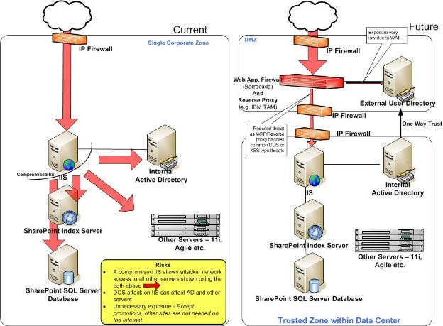
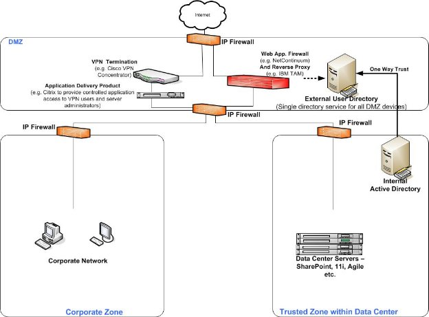
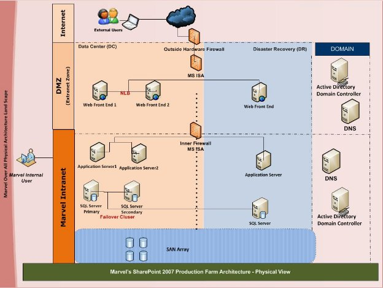
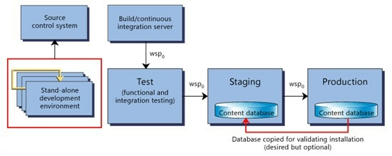
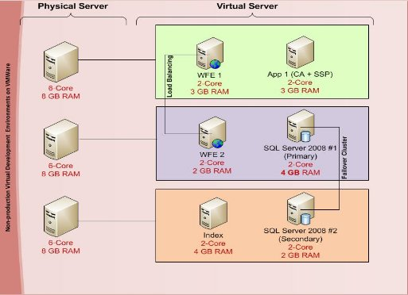

---
layout: default
title: SharePoint Farm Upgrade
parent: SharePoint Office 365
nav_order: 4
---

# Case Study: SharePoint Farm Design for a Media Company

I wokred as a SharePoint Architect for an farm deployment project for a prominent media company, this document captures the essence of our SharePoint Farm design project. Developed in collaboration with our networking and infrastructure teams, it outlines the deployment strategy employed and the considerations made to ensure a robust SharePoint environment.

From SharePoint 2007 through to SharePoint 2016, the landscape of SharePoint has evolved, introducing several features and enhancements like miniRoles etc. However, the fundamental architecture focusing on high availability (HA) remains unchanged. 

## **Background**
Marxxx wants to redesign their existing Microsoft Office SharePoint based portal application which includes around 10 site collections and also wants to improve and simplify the ability to manage content.  

**Objectives of redesign** 

- Deploy the best fit infrastructure and system architecture 
- Using generic content types with optimum reusability 
- Using consistent use of document management
- Using  a collaboration platform with self-service a minimal learning curve 
- Standardize enterprise content management utilizing built-in SharePoint tools 
- Implement a MOSS Governance policy that will define Roles and Responsibilities, Policies, Processes,  Deployment Strategies and Site Structure
- Design and deploy High Availability solution with no single point of failure
- Integration of plug-in and proprietary applications based on MOSS

## **Project Overview & Understanding**
Marxxx has implemented the SharePoint to meet different organizational needs. However, the implementation lacks best practices and scope for future enhancements. On generic terms organizations adopting SharePoint face a variety of tasks – from planning, strategy, infrastructure and architecture design, UI Design, migration, and to development. All these tasks imply flexible infrastructural baseline before actual work starts. However, in reality we face the outdated environment and miss-configured farms that are not ready to implement new requirements. In such cases, baseline architecture becomes foundation stone of all SharePoint projects.

# **Current system study** 
## **Current System study**
HXX has detailed discussions with the Marxxx management team to understand the needs to revamp & redesign the current SharePoint implementation. Marxxx provided the VPN connection with site level permission to view the replica of the production sites without sensitive data. HXX provided a document to Marxxx on how to remove sensitive data and backup/restore the sites in development area for HCL’s assessment. HXX followed the standard process of studying current system. The following section would highlight the key findings of the system study.
## **Current System Assessment** 
HXX's assessment findings based on current Marxxx SharePoint implementation are:

### **Governance**

- No defined SharePoint resource governance matrix.
- Seems to be no clear business owners of sites and accountability lies on only technical team.
- Governance document exist but that is incomplete (only 2 pages) and doesn’t seem to serve the purpose of SharePoint governance. It is out-dated. 
- It seems SharePoint administration process is not defined and there seems to be no dedicated administrator for ongoing maintenance and implement governance best practices. 
- No application usage & customization policies exist 

### **Infrastructure & Platform**
- Current SharePoint installation is not implemented for High Availability. No business continuity plans defined. 
- Single Point of failure. No Disaster Recovery farm exists. 
- Server boxes are out-dated for future upgrade of SharePoint and virtualization technologies. 
- Sandbox environment is not yet configured.
- Development environment consists of sensitive data which ideally should NOT reside in any environments other than production environment.
- Minimal integration observed with other Enterprise Web Applications and Data 

### **Information Management** 
- Current taxonomy was developed without hierarchy – flat structure 
- There are few lists/libraries implemented which are not used or obsolete in current sites and are eating up storage space. 
- Contents scattered in File Systems as well – might be critical contents. No Expiration policies for contents.
- No Information Management documentation are available which narrates existing SharePoint implementation like taxonomy, design document etc,. Neither any user reference manuals.
- There is no ready reference on lists/libraries which contain sensitive information. 
- Some custom ASPX pages are used without using SharePoint publishing feature. 
- Content and document types are not being leveraged.
- Content publishing processes and policies do not exist. 

### **Usability**
- Navigation is not structured in distinct, easily recognizable groups nor is it consistent in structure.
- MyMarvel Home page UI is good, however that the site menus and contents are not clearly identifiable in the glittery background.
- Quick links are not present in all sites to facilitate better navigation through different sites
- Broken Links present.

### **SharePoint Farm Maintenance & Deployment**
- Dedicated Web application created for each Site Collection in current environment without proper reason or Isolation needs
- All custom DLLs are placed in GAC should ideally be in \BIN folder as per Microsoft Best Practices.
- Backup is done, but no archiving strategy and plan found. 
- No true business process management or enterprise-level workflow automation solutions are in place. Might be present offline – not known. 

# **Planning SharePoint Server Farm**
## **Capacity Planning** 
Assuming that 1000 users access the SharePoint web sites and the content size will grow to 2 TB in future, the following is the Capacity Planning based on Microsoft’s System Center Capacity Planner 2007:

### **Usage profile characteristics**

**Figure 1: Usage profile of SharePoint sites.**

## **Topology recommendation by Capacity Planner**

**Figure 2: Topology diagram as per MS System Center Capacity Planner 2007**

## **Hardware recommendation by Capacity Planner** 

### **Hardware profile for the servers** 
The server configuration details are based on Microsoft’s System Center Capacity Planner 2007:

|**Total number of clients/users:**|**1000**|
| -: | - |
|**Number of servers:**|**6**|
|**Number of SAN connections:**|**1**|

#### **Web Front End Servers**

**Server: Web Front End 1**

| Configuration Details       |                                  |
| --------------------------- | -------------------------------- |
| Processor                   | 2.20 GHz Quad Core Processor     |
| Minimum memory              | 8.0 GB                           |
| Disk                        | DiskArray 1\Volume 1 (File System), 146 GB RAID 1 (2 x 146.00 GB SCSI 10,000 RPM) |
|                             | DiskArray 1\Volume 2 (File System), 360 GB RAID 5 (6 x 72.00 GB SCSI 10,000 RPM)  |
| NIC                         | 1 x 1,000 Mb/s                   |
| Roles                       | Web Front End; Query Server      |

**Server: Web Front End 2**

| Configuration Details       |                                  |
| --------------------------- | -------------------------------- |
| Processor                   | 2.20 GHz Quad Core Processor     |
| Minimum memory              | 8.0 GB                           |
| Disk                        | DiskArray 1\Volume 1 (File System), 146 GB RAID 1 (2 x 146.00 GB SCSI 10,000 RPM) |
|                             | DiskArray 1\Volume 2 (File System), 360 GB RAID 5 (6 x 72.00 GB SCSI 10,000 RPM)  |
| NIC                         | 1 x 1,000 Mb/s                   |
| Roles                       | Web Front End                    |

#### **Application Servers**

**Server: Index Server & Query Server**

| Configuration Details       |                                  |
| --------------------------- | -------------------------------- |
| Processor                   | 2.20 GHz Quad Core Processor     |
| Minimum memory              | 8.0 GB                           |
| Disk                        | DiskArray 1\Volume 1 (File System), 1500 GB RAID 5 (6 x 300.00 GB SCSI 15,000 RPM) |
| NIC                         | 1 x 1,000 Mb/s                   |
| Roles                       | Index & Query                    |

#### **Database (SQL) Servers**

**Server: SQL Server Cluster (Failover)**

| Configuration Details       |                                  |
| --------------------------- | -------------------------------- |
| Processor                   | 2.20 GHz Quad Core Processor     |
| Minimum memory              | 16.0 GB                          |
| Disk                        | No local disk devices            |
| NIC                         | 1 x 1,000 Mb/s                   |
| SAN connections             | 2 x 4 Gb/s                       |
| SANs                        | SAN Array\Volume 3 (Log Files), 600 GB RAID 10 (4 x 300.00 GB SCSI 15,000 RPM) |
|                             | SAN Array\Volume 4 (Data Files), 5400 GB RAID 10 (36 x 300.00 GB SCSI 15,000 RPM) |
| Roles                       | SQL Server (Clustered)           |

**Server: SQL Server Cluster (Primary)**

| Configuration Details       |                                  |
| --------------------------- | -------------------------------- |
| Processor                   | 2.20 GHz Quad Core Processor     |
| Minimum memory              | 16.0 GB                          |
| Disk                        | No local disk devices            |
| NIC                         | 1 x 1,000 Mb/s                   |
| SAN connections             | 2 x 4 Gb/s                       |
| SANs                        | SAN Array\Volume 1 (Log Files), 600 GB RAID 10 (4 x 300.00 GB SCSI 15,000 RPM) |
|                             | SAN Array\Volume 2 (Data Files), 5400 GB RAID 10 (36 x 300.00 GB SCSI 15,000 RPM) |
| Roles                       | SQL Server                       |

#### **SAN**

**SAN: SAN Array**

| Configuration Details       |                                  |
| --------------------------- | -------------------------------- |
| Disk                        | SAN Array\Volume 1 (Log Files), 600 GB RAID 10 (4 x 300.00 GB SCSI 15,000 RPM) |
|                             | SAN Array\Volume 2 (Data Files), 5400 GB RAID 10 (36 x 300.00 GB SCSI 15,000 RPM) |
|                             | SAN Array\Volume 3 (Log Files), 600 GB RAID 10 (4 x 300.00 GB SCSI 15,000 RPM) |
|                             | SAN Array\Volume 4 (Data Files), 5400 GB RAID 10 (36 x 300.00 GB SCSI 15,000 RPM) |

## **Software Stack** 

|**Software / Tools**|
| - |
|- Internet Explorer 6.0 and above |
|- Microsoft Office SharePoint Server 2007|
|- Microsoft Office SharePoint Designer 2007|
|- Microsoft Visual Studio 2008 |
|- Microsoft Exchange Server|
|- Microsoft SQL Server 2008 R2|
|- Microsoft Windows Server 2003 R2|
|- Microsoft ForeFront |

## **Browser Support**
### **About browser support**
Microsoft Office SharePoint Server 2007 supports several Web browsers that are commonly used. However, there are certain browsers that might cause some Office SharePoint Server 2007 functionality to be downgraded, limited, or available only through alternative steps. In some cases, functionality might be unavailable for noncritical administrative tasks.

### **Levels of browser support**
Web browser support is divided into two levels: level 1 and level 2. Although administrative tasks on SharePoint sites are optimized for level 1 browser, Office SharePoint Server 2007 also provides support for other browsers that are commonly used. To ensure complete access to all the functionality, it is recommended to use level 1 browser. 
 #### **Level 1 Web browsers**
Level 1 Web browsers take advantage of advanced features provided by ActiveX controls and provide the most complete user experience. Level 1 browsers offer full functionality on all SharePoint sites, including the SharePoint Central Administration Web site. Level 1 browsers are:

- Microsoft Internet Explorer 6.*x* (32-bit)
- Windows Internet Explorer 7.*x* (32-bit)

# **System Architecture & Design Recommendations**

Microsoft Office SharePoint Server 2007 provides the flexibility to meet many different deployment solution goals. This includes guidance that would help Marxxx in:

- Determine the number of server in farm required to meet the solution goals.
- Plan for the relationships between servers in the farm.
- Plan for Extranet -facing server farm.
- Design server-farm topologies to meet availability goals.

## **Overall Design Goals**
The conceptualized design has been prepared considering the Marvel’s need for SharePoint farm implementation. The key design goals are mentioned below:

- Use the minimum number of server farms to host various SharePoint web sites typically required by a Marxxx for their intranet and extranet, considering performance and high availability.
- Create a framework for designing a scalable environment. Design decisions for individual applications do not prevent the addition of other applications in future. For example, an initial deployment would include ten site collections that comprises of document center, document workspace, collaborative team sites or publishing sites that compose an intranet (team sites, My Sites, and published intranet content). By using a similar logical architecture design, Marxxx can add applications to the solution without affecting the design of the initial applications. In other words, the design does not incorporate design choices that limit the use of the environment.
- Provide access for several classes of users without compromising the security of the content within the disparate applications. Users from different network zones (both internal and external) with different authentication providers can participate in collaboration. Also, users can only access the content they are intended to access. By following a similar logical architecture design, Marxxx can create the opportunity to provide access to users in multiple locations and with different objectives.
- Ensure that the design can be used in an extranet environment. Deliberate design choices are made to ensure that the server farms can be securely deployed in a perimeter network (DMZ).

The rest of this article discusses each of the physical components that appear in the landscape model in the following section and discusses the design choices that are applied to the model. The purpose of this approach is to demonstrate the different ways in which logical architecture components can be configured based on the Marvel’s SharePoint Farm needs. 

 ## **System Landscape**

The Landscape has been divided in three zones.

- Extranet/Internet
- Perimeter Network (DMZ)
- Corporate Network (Intranet)

|***Components***|***Position***|***Quantity***|***Role***|
| :- | :- | :- | :- |
|Cisco Firewall|Internet|1 (Optional)|Hardware Firewall|
|ISA 2006 Server|
Perimeter Network & 

Corporate Network
|2|Software Firewall|
|Web Front End Server|Perimeter Network|2|WFE + Query Server|
|Application Server|Corporate Network|2|1 App Server + 1 Index Server|
|SQL Server|Corporate Network|2|Database Server|
|SAN Array|Corporate Network|1|SAN Storage|

 ## **Farm Design Consideration**

HXX has kept the following key design consideration at core while designing the framework of the proposed solution. To attain maximum redundancy with a minimum number of servers, deploy an additional application server to the middle tier for load balancing application server roles that are designed to be redundant. **This server farm topology consists of six servers**. The query role is installed to the front-end Web servers to achieve redundancy.

This topology protects these server roles from direct user connections and optimizes the performance of the overall farm when compared to smaller farms. The SQL server would be a two node clustered installation.

Office SharePoint Server 2007 supports scalable server farms for capacity, performance and availability. Typically, capacity is the first consideration in determining the number of server computers to start with. After factoring in performance, availability also plays a role in determining both the number of servers and the size or capacity of the server computers in a server farm.

### **High Availability for Web Front Ends**
For high availability in a MOSS environment, HXX proposes to use a collection of servers supporting multiple SharePoint sites. A server farm militating against the effects of unexpected downtime in addition to downtime that is related to ongoing maintenance (such as operating system updates etc.). The HXX suggested server farm for Marxxx workloads that builds in availability will consists of six servers (please see the figure 3). 

There will be four servers for MOSS 2007, two dedicated to Web Server along with Query role, while the other two servers will share the Application services, and Indexing roles. All of the Web Server will be **load balanced using NLB**. SQL Server 2008 will be **clustered across two servers** in a primary-secondary cluster.

 #### **NLB**
Network Load Balancer (NLB) is useful for ensuring that stateless applications, such as a Web server running Internet Information Services (IIS), are scalable by adding additional servers as the load increases. 

Windows NLB works in two different modes – ***Uni-cast*** and ***Multicast***. When in unicast mode, NLB replaces the network card's original MAC address. When in multicast mode, NLB adds the new virtual MAC to the network card, but also keeps the card's original MAC address.

**Multiple network adapters in multicast mode for Marvel’s new farm:**

This model is suitable for a cluster in which ordinary network communication among cluster hosts is necessary and in which there is heavy dedicated traffic from outside the cluster subnet to specific cluster hosts.

*Advantages*

- Because there are at least two network adapters, overall network performance is typically enhanced.
- Ordinary network communication among cluster hosts is permitted.

*Disadvantages*

- This model requires a second network adapter.
- Some routers might not support the use of a multicast media access control (MAC) address. This only affects the Network Load Balancing/MAC address (not all MAC addresses) and only when dynamic ARP replies are sent by the cluster to the router. not all MAC addresses

### **Application Servers Redundancy**

The baseline server topology design depends on the requirements for redundancy of application server roles. This matrix below describes the application server roles relative to their redundancy options. 

Application server roles for Office SharePoint Server 2007 fall into two categories:

- Roles that can be redundant 
- Roles that cannot be redundant 

|**Application server role** |**Redundancy Allowed**|
| :- | :- |
|Query|Yes |
|Index |No |
|Windows SharePoint Services 3.0 search|No |
|Excel Calculation Services|Yes |
|Office Project Server 2007|Yes |

#### **Index Role** 
Microsoft has recommended as a best practice, having a dedicated index server available to crawl data and that should not be part of the potentially load-balanced front-end servers that actually serve up the web pages to end-users. The reason for this is indexing requires significant computing resources both on the indexing machine and the machines being crawled.  Microsoft has also recommended having a dedicated Query server if the crawling content is more than 500 GB, this would alleviate the potential performance issues.  

Refer the proposed SharePoint System Landscape, the dedicated Index server will perform the index function of the farm in order to manage crawling of searchable content and will create index files. 

#### **Query Role.** 
The Query role would be combined with the web front end servers in a load balanced fashion. This will provide redundancy for Query server role.

#### **Redundant Application Server**
The Query role would be combined with the web front end servers in a load balanced fashion. This will provide redundancy for Query server role.

### **Availability & Failover for Database Server**

The database server role affects the availability of the solution more than any other role. If a Web server or an application server fails, these roles can quickly be restored or redeployed. However, if a database server fails, the solution depends on restoring the database server. This can potentially include rebuilding the database server and then restoring data from the backup media. In this case, you can potentially lose any new or changed data dating back to the last backup job, depending on how SQL Server 2008 is configured. Additionally, the solution will be completely unavailable for the time it takes to restore the database server role. 

Microsoft enables SQL Server database availability with the SQL Server Always on Technologies program. This consists of

- Database mirroring 
- Failover clustering 
#### **Database Clustering Recommendation**
The proposed design depicts Failover Clustering among two SQL Server 2008 database nodes in the system landscape, which provides availability support for a complete instance of SQL Server. The following diagram shows the Database Failover cluster for SQL Server.

The failover cluster is a combination of one or more nodes or servers, with two or more shared disks. It will appear as a single instance, but has functionality that provides failover from one node to another if the current node becomes unavailable. Office SharePoint Server 2007 references the cluster as a whole, so that failover is automatic and seamless from the perspective of SharePoint Products and Technologies.

### **Scalability**
The architecture is inherently scalable as all product components and integration products are inherently distributed and support scalability by distribution in addition to scale-outs and scale-ups. This would help Marxxx in future to upkeep the system for better performance when the number of users increases.  

**Scale Up Constraints:**

The SharePoint implementation in the new farm will be adaptable to version upgrade (SharePoint 2010) only when the software (O/S and Database) installed are x64. Microsoft recommends, as a part of implementation Best Practices, that all production environment have x64 hardware and software for performance benefits. 

Though there would be x64 hardware support in the new production farm, the design is based on x86 software stack as available with Marxxx at present. 

### **Storage Area Network**
Storage Area Network (SAN) would be used to handle the bulk data storage. All the SQL Server files such as .**mdf**(primary data file), .**ndf**(secondary data files), .**ldf**(log files) etc. would be stored in the SAN. 

## **Network Components**
### **Firewall**
A firewall is a software- or hardware-based barrier against unauthorized access to your network. Firewalls inspect all the traffic going through them.

Configuration of a Firewall that Works

- Opt for a hardware firewall, such as Cisco. Hardware firewalls are more powerful, and give you more control over protecting your Web traffic than a software-based firewall. 
- If Spam Protection is available on your firewall, enable it. Spam firewalls are proving popular in keeping the nastier emails out (viruses, botnets). 
- Standardize all wireless connections on WPA. Not only does the WPA Protocol have better security than WEP, but this way you can recognize (and block) if someone else tries to break in using WEP or an unencrypted connection. 

Much of perimeter security is addressed by the firewall. However, with the increased risk from DoS attacks and malware scripts worming their ways past firewalls, additional security products are now needed for which Microsoft ForeFront is recommended.

ForeFront is a suite of business security products, designed to cover every aspect of network infrastructure. Server operations, client PCs, gateways, network edge—everything’s protected.

ForeFront includes: 

- ForeFront Security for Exchange Server 
- ForeFront Security for SharePoint 
- ForeFront Client Security (FCS) – Malware protection for every client PC. 
- Intelligent Application Gateway (IAG) – Remotely-connecting PCs must verify their compliance before gaining server access. 
- Internet Security and Acceleration (ISA) Server 2006 – Manages security for VPN connections and remotely-accessed applications.

Advantage of ForeFront

- **Protect Exchange and MOSS 2007.** Both servers deal with data coming and going. All day, every day. Cover them both with ForeFront Security for Exchange Server and ForeFront Security for SharePoint.
- **Uniform Reporting.** Instead of trying to piece together six reports from six different applications, you can read ForeFront reports. Collected from all components into one, so problems are quickly spotted. 
- **A wall against the next attack.** Virus and malware attacks are becoming more creative. And sneakier. Since it’s designed to watch the edges of your network, ForeFront will catch new break-in attempts before they find an exploit. 

Forefront goes beyond an antivirus on a desktop. It’s an entire web of security spread out through all network systems, covering all access points in and out.

### **DNS Configuration**
After setting up SharePoint Portal Server and creating the portal site, you must create a public DNS entry to map the public (external) FQDN to the IP address for the public (external) interface of the external ISA Server 2006 computer. The URL containing the FQDN is the URL that users will use to access the portal site across the extranet.

### **Active Directory Configuration**

From a MOSS 2007 point of view the Microsoft Split back-to-back topology scenario has been followed; MOSS web front-end servers are located in the perimeter network while the application and database servers reside in the internal network.

A one-way Active Directory trust exists between the perimeter domain and the internal domain. This is a non-transitive trust where the perimeter domain trusts the internal domain but not the inverse. This serves two main purposes; it allows windows authentication and delegation to occur between services in the perimeter domain and the internal domain and at the same time protects sensitive data such as payroll databases on the internal network.

Forest with a single domain is proposed:

- perimeter.corp.local (perimeter production domain, contains accounts for all members and external collaborators)
- Authenticates users from both perimeter domain and internal domain via domain trust

A one-way domain trust is configured between the corp.com domain and the perimeter.corp.local domain. This is done to allow internal accounts to be used in the perimeter domain which in turn enables windows authentication to be used when accessing backend resources such as SQL databases. This trust means that deploying MOSS web front end servers is as straight forward as adding the web front end role, all IIS configuration is completed by MOSS and remains valid in both the internal and perimeter domains.

## **Farm Security Considerations**
SharePoint Server-farm security will include the following tasks:

 Secure communication planning — decide which methods of secure communication are most appropriate for Marxxx landscape. 
 Server hardening — plan specific hardening settings for each of the server roles in the new server farm.

### **Communication in Server Farm** 
Secure communication between the components of Marxxx SharePoint Farm deployment is a vital element of in-depth security architecture to ensure business critical information is not intercepted and misappropriated during its flow from user request to Web Server to Application Server and Database Server. It’s important to apply secure communication techniques for both inside and outside the firewall. Secure communication provides privacy and integrity of data.

Privacy ensures that data remains private and confidential, and that it cannot be viewed by eavesdroppers armed with network-monitoring software. Privacy is usually provided by means of encryption.

Integrity ensures that data is protected from accidental or deliberate (malicious) modification while in transit. Secure communication channels must provide integrity of data. Integrity is usually provided by using Message Authentication Codes (MACs).

#### **Server-Server Communication**
In this deployment scenario, the communications between servers is done using **IPSec** (Internet Protocol Security), which is an open standard framework that specifies encryption and packet-filtering techniques to enhance network security.

IPSec is a transport-layer mechanism through which ensures the confidentiality and integrity of TCP/IP-based communications between servers. IPSec is completely transparent to applications because encryption, integrity, and authentication services are implemented at the transport level.

Please refer MOSS Installation Manual – Part 2 Appendix B for instructions to setup IPSec. 

#### **Client-Server Communication**
SSL is generally recommended to secure communications between users and servers when sensitive information must be secured. SSL can be configured to require server authentication or both server and client authentication.

SSL can decrease the performance of the network. There are several common guidelines that can be used to optimize pages that use SSL. First, use SSL only for pages that require it. This includes pages that contain or capture sensitive data, such as passwords or other personal data. 

SSL should be used only if the following conditions are true:

- To encrypt the page data.
- To guarantee data is sent to the intended web server.

### **Server Hardening**
The process of “Server Hardening” deals with activities to make servers in the SharePoint farm less vulnerable to attack. This section describes hardening characteristics for Web servers, application servers and database servers.
#### **Web & Application Server Hardening**
The following table summarizes the Microsoft Patterns and Practices guidance for securing Web Server

|**Task** |**Applies To** |**Details**|
| :- | :- | :- |
|Patches and Updates|
- WFE servers

- Application servers
||
|
Ports

|
- WFE servers

- Application servers
|
- Limit Internet-facing ports to port 80 for HTTP and port 443 for HTTPS.

- Use IPSec to encrypt or restrict intranet communication.

&emsp;(*Refer the complete list below*)
|
|Sites and Virtual drives|
- WFE servers

- Application servers hosting Central Admin
|
- Move website to non-system drive.

- Restrict Web permissions in the IIS meta-base.

- Remove FrontPage Server extensions.

|
|Protocols|
- WFE servers

- Application servers
|
- Configure TCP/IP stack to mitigate the threat from network denial of service attacks.

- Disable the NetBIOS and SMB protocols if not used.
|
|Shares|
- WFE servers

- Application servers
|
- Remove all unnecessary shared folders.

- Restrict access to any required shares.
|
|IIS Lockdown|
- WFE servers

- Application servers hosting Central Admin
|- Install URLScan to block requests that contain unsafe characters. It is installed automatically when *IISLockdown* is run.|

The following list depicts the important ports:

- TCP 80, TCP 443 (SSL)
- Direct-hosted SMB (TCP/UDP 445) — disable this port if not used
- NetBIOS over TCP/IP (NetBT) (TCP/UDP ports 137, 138, 139) — disable this port if not used

Ports required for communication between Web servers and service applications (the default is HTTP):

- HTTP binding: 32843
- HTTPS binding: 32844
- net.tcp binding: 32845 (only if a third party has implemented this option for a service application)

Ports required for synchronizing profiles between SharePoint and Active Directory on the server that runs the Forefront Identity Management agent:

- TCP/5725
- TCP/UDP 389 (LDAP service)
- TCP/UDP 88 (Kerberos)
- TCP/UDP 53 (DNS)
- UDP 464 (Kerberos Change Password)
- UDP port 1434 and TCP port 1433 — default ports for SQL Server communication. If these ports are blocked on the SQL Server computer (recommended) and databases are installed on a named instance, configure a SQL Server client alias for connecting to the named instance.
- Block external access to the port that is used for the Central Administration site.
- TCP/25 (SMTP for e-mail integration)

#### **Database Server Hardening**
SharePoint Server 2007 has built-in support for protection against SQL Injection attacks; however, some steps must be taken to protect data from network eavesdropping, password cracking and unauthorized access.

A default instance of SQL Server listens for connection on TCP port 1433. If a client computer is unable to connect to the database on TCP port 1433, it queries SQL Server Resolution Service on UDP port 1434. These standard ports are well known and the use of standard configuration enables the SQL Server Resolution Service to be targeted by malicious software. To protect for these the following steps need to be followed:

 Blocking of TCP port 1433
 Blocking of UDP port 1434
 Configuring SQL Server to listen to non-standard port
 Configure SQL Server client aliases on all Web Server and application servers
 Stop SQL Server Browser service to further secure

## **Secure Topology Design Checklists** 
### **Server topology design** 
Review the following checklist to ensure that your plans meet the criteria for a secure server topology design.

||The topology incorporates dedicated front-end Web servers.|
| :-: | :- |
||Servers that host application server roles and database server roles are protected from direct user access.|
||The SharePoint Central Administration site is hosted on a dedicated application server, such as the index server.|

 ### **Network topology design** 
Review the following checklist to ensure that your plans meet the criteria for a secure networking topology design.

||All servers within the farm reside within a single data center and on the same vLAN.|
| :-: | :- |
||Access is allowed through a single point of entry, which is a firewall.|
||For a more secure environment, the farm is separated into three tiers (front-end Web, application, and database), which are separated by routers or firewalls at each vLAN boundary.|

# **Planning for Extranet Topology**
## **Intranet & Extranet Zones** 

An extranet environment is a private network that is securely extended to share part of an organization's information or processes with remote employees, external partners, or customers.

The following table describes the benefits that the extranet provides for each group.

| Group | Benefits |
|-------|----------|
| **Remote employees** | Remote employees can access corporate information and electronic resources anywhere, anytime, and any place, without requiring a virtual private network (VPN). Remote employees include:<ul><li>Traveling sales employees.</li><li>Employees working from home offices or customer sites.</li><li>Geographically dispersed virtual teams.</li></ul> |
| **External partners** | External partners can participate in business processes and collaborate with employees of your organization. You can use an extranet to help enhance the security of data in the following ways:<ul><li>Apply appropriate security and user-interface components to isolate partners and to segregate internal data.</li><li>Authorize partners to use only sites and data that are necessary for their contributions.</li><li>Restrict partners from viewing other partners’ data.</li></ul>You can optimize processes and sites for partner collaboration in the following ways:<ul><li>Enable employees of your organization and partner employees to view, change, add, and delete content to promote successful results for both companies.</li><li>Configure alerts to notify users when content changes or to start a workflow.</li></ul> |
| **Customers** | Publish branded, targeted content to partners and customers in the following ways:<ul><li>Target content based on product line or by customer profile.</li><li>Segment content by implementing separate site collections within a farm.</li><li>Limit content access and search results based on audience.</li></ul> |

## **Internet-facing Topology**
You can plan to host extranet content inside your corporate network and make it available through an edge firewall, or you can isolate the server farm inside a perimeter network. 

Together, these are the content and collaboration sites that employees will use on a day-to-day basis. Individually, each of these applications represents a distinct type of content. Each type of content:
- Emphasizes different features of Office SharePoint Server 2007.
- Hosts data with different data characteristics.
- Is subject to a different usage profile.
- Requires a different permissions management strategy.

Consequently, design choices for each of these applications are intended to optimize the performance and security for each application. 

The use of a single Shared Services Provider (SSP) brings these three applications together to provide:
- Navigation across the applications.
- Enterprise-wide search.
- Shared profile data. 

The following figure shows the three applications that make up the corporate intranet.

 ### **Split back-to-back topology**
This topology splits the farm between the perimeter and corporate networks. The computers running Microsoft SQL Server database software are hosted inside the corporate network. Web servers are located in the perimeter network. The application server computers can be hosted in either the perimeter network or the corporate network. 

If the server farm is split between the perimeter network and the corporate network with the database servers located inside the corporate network, a **domain trust relationship** is required if Windows accounts are used to access SQL Server. In this scenario, the perimeter domain must trust the corporate domain. If SQL authentication is used, a domain trust relationship is not required. 

- To optimize search performance and crawling, the application servers has been kept inside the corporate network with the database servers. Do not add the query role to the index server if the query role also is located on other servers in the farm. If you place Web servers in the perimeter network and application servers inside the corporate network, you must configure a **one-way trust relationship** in which the perimeter network domain trusts the corporate network domain. This one-way trust relationship is required in this scenario to support inter-server communication within the farm, regardless of whether you are using Windows authentication or SQL authentication to access SQL Server.
#### **Advantages**
- Computers running SQL Server are not hosted inside the perimeter network.
- Farm components both within the corporate network and the perimeter network can share the same databases.
- Content can be isolated to a single farm inside the corporate network, which simplifies sharing and maintaining content across the corporate network and the perimeter network.
- With a separate Active Directory infrastructure, external user accounts can be created without affecting the internal corporate directory.
#### **Disadvantages**
- Complexity of the solution is greatly increased.
- Inter-farm communication is typically split across two domains.

# **Disaster Recovery Recommendations**
## **Disaster Recovery**
As part of the requirement, some kind replication needs to be established between the two sites so as to ensure the availability of data at all the sites. In case of failure of any one of the site the other must be able to take over the entire operations. So as to cater to these requirements, a site replication methodology is designed for Marxxx as shown in the below diagram. The proposed solution comprises of two sites Primary Site and DR Site. Between the Primary Site and the DR Site, data will be replicated asynchronously over the Dark FC/WAN IP network Connectivity. 

## **Disaster Recovery Strategy**

**Figure 5: DC-DR Before**

Two logical farms:

* Only content databases can be successfully mirrored to failover farm.
* A separate configuration database must be maintained on the failover farm.
* All customizations must be done on both farms.
* Patches must be individually applied to both farms.
* SSP databases can be backed up and restored to the failover farm.
* Consult with your SAN vendor to determine whether you can use SAN replication or another supported mechanism to provide availability across data centers.

**Figure 6: DC-DR After**

On failover, traffic is redirected to the secondary farm.

* On failover, you must attach mirrored content databases to the Web applications running in the failover farm.
* Over time, you can either fail back or turn the primary farm into the failover farm.

 ## **Disaster Recovery Configuration Process**
- **Disaster recovery solution for web content:** Use SharePoint QA server for Disaster Recovery, first export the specific site from backup to a blank site and then extract the specific content that needs to be restored. Do not use production server for disaster recovery because the recovery process will overwrite the existing contents.
  - **Rationale:** SharePoint’s built-in recovery solution does not allow granular file/item level recovery. Entire site needs to be restored to recover a single file/item
  - **Technical Details:** Use STSADM to restore the site to QA web server from an existing backup and then recover the file/item

- **Disaster recovery solution for index servers**: 
  - **Solution1:** 
    - The only clean and recommended way to recover from an index corruption is to completely rebuild the index on all the servers in the farm
  - **Solution 2:**
    - Build a new index server
    - Disable and stop ossearch service on the index server
    - Check if the propagation status is idle
    - Copy the Portal\_Content catalog (<Your\_index\_location>\<SSPapplicationGUID>\Projects\Portal\_Content\Indexer\CiFiles\\*.\*) from the query server to the indexer in the same location

     ### **Asynchronous database mirroring**
There are two mirroring operating modes – 

 **Synchronous mode** -   when a session starts, the mirror server synchronizes the mirror database together with the principal database as quickly as possible. As soon as the databases are synchronized, a transaction is committed on both partners, at the cost of increased transaction latency.
 **Asynchronous mode -** as soon as the principal server sends a log record to the mirror server, the principal server sends a confirmation to the client. It does not wait for an acknowledgement from the mirror server. This means that transactions commit without waiting for the mirror server to write the log to disk. Such asynchronous operation enables the principal server to run with minimum transaction latency, at the potential risk of some data loss.

All database mirroring sessions support only one principal server and one mirror server. This configuration is shown in the following illustration.

# **Deployment Architecture**
## **Production DC & DR**

**Figure 5: Production Environment**

## **Non-Production Environments**
### **Development Environment**
SharePoint development environment configuration depends on the processes, type of engagements and type of work. The most popular solution that addresses the development scenarios is using local SharePoint farm, separated from the production servers, with the single installations of the SharePoint server on the development boxes. This provides isolation for builds, tests, and debugging across different teams, projects and production environments. The local environment is mostly isolated by development box and is installed on the host server or on virtual server. The following procedure is an overview of the steps that are required to create a typical SharePoint development environment.

Development Box installation

- Use Windows Server, Visual Studio, and SQL Server. Windows Server 2008, VS 2008 and .NET 3.5, SQL 2008, with TFS 2008 is officially supported environment for SharePoint development. Advantage of Windows 2008 is that it is fast in virtualized environments.
- Install SharePoint on development boxes and prefer not to connect to existed farm instances used on other stages. Development environment should stay apart, to develop and tests in isolated environment.
   ### **QA Environment**
The following diagram depicts the most common development environment, which is recommended by “SharePoint Guidance patterns & practices” team.

 Stand-alone SharePoint environment for development, unit testing and debugging of SharePoint project. Runs continuous integration and builds verification tests before deploying the SharePoint solutions to the test environment.
 Source Control/Build Server to build SharePoint packages (WSP) and to deploy solution to test environment.
 The test environment performs user acceptance testing, manual functional testing, automated functional testing, system testing, security testing, and performance testing. After the solution meets production requirements, the SharePoint solutions are deployed to the staging environment.
 The Staging server uses to test the “production-ready” solution in an environment that closely resembles the production environment. The purpose of this environment is to identify any potential deployment issues. Although the Staging environment is optional for smaller applications where deployment failures are not critical

The staging environment represents the target production environment as closely as possible from the perspective of topology (for example, the server farm and database structure) and components (for example, the inclusion of the Microsoft Active Directory service and load balancing, where applicable).
 ### **Virtualization of Environments**
Virtualization in SharePoint farm is one of the key design factors that simplify server availability by providing number of additional servers that might not be available over physical server models, or solution become very expensive. Microsoft officially supports SharePoint farm in virtualized environment since mid 2007. The following virtualizations technologies are supported: Hyper-V and 3rd party providers like VMware.

One of the key factors for virtualization is that performance of virtualized farm is competitive to the physical farm. Microsoft tests shows:
\- 7.2% less throughput on virtual Web roles with 8GB of RAM than a physical Web role server with 32GB of RAM;
\- 4.4% slower in the page response time on the Hyper-V Web front-end than the physical server;

**Figure 6: Virtual Development Environment**

 ### **Virtualize SharePoint Web Role**
Web front-end servers are responsible for the content rendering and have comparatively lower memory requirements and disk activity than other roles, what makes them is an ideal candidate for virtualization.
 #### **Choose disk type for Query Role**
The query role is responsible for a search performed by users is a good candidate for virtualization. The disk type choice for this role depends on the size of propagated index and the rate of index propagation.
The recommendation for the large indexes and the farm with the high rate of the updated information to use a physical disk volume that is dedicated for the individual query server, rather than a virtual disk file.
 #### **Consider using Index Role on physical server**
The Index server role in a SharePoint farm is often the most memory-intensive role, what makes it less ideal candidate for virtualization. Virtualized Index server role might be appropriate for development environment, small farm or farm with small content usage.
Take into account, that index can vary from 10% to 30% of the total size of the documents being indexed. For the large indexes (above 200 GB) consider using physical disk volume that is dedicated to the individual query server, rather than virtual disk.
For large farms with big amount of crawled data use physical Index server role due to large memory requirements and high disk I/O activity.
 #### **Do not virtualize Database role**
SharePoint database role is the least appropriate role for virtualization in production scenarios, mainly due to the highest amount of disk I/O activity and very high memory and processor requirements. However, it is very common to see the SQL Server virtualized in test farms, quality assurance (QA) farms, and smaller SharePoint environments.
 #### **Do I need to virtualize Application role?**
The decision of virtualizations the application roles, such Excel Services and InfoPath Services, depends on the roles usage. Those roles can be easily virtualized, because they are similar to Web Roles and mostly CPU intensive. When necessary, those servers can be easily moved to dedicated physical servers.
 #### **Virtualized scenario sample**
The following picture demonstrates the common virtualized scenario of SharePoint Farm.

Common deployment scenarios for the SQL role in a SharePoint farm may have multiple farms, both physical and virtual, use a single database server or database cluster, further increasing the amount of resources consumed by the role. For example, in the picture above, the sample SharePoint environment illustrated maintains a two-server SQL cluster that is used by several virtual farms and one production farm.
 #### **Use proper number of CPU**
Do not use more virtual CPUs than physical CPUs on the virtual host computer – this will cause performance issues, because the hypervisor software has to swap out CPU contexts.
The best performance can be realized if the number of virtual processors allocated to running guests does not exceed the number of logical processors (physical processors multiplied by the number of cores) on the host. For example, a four processor quad-core server will be able to allocate up to 16 virtual processors across its running sessions without any significant performance impact. Note that this only applies to sessions that are physically running simultaneously.
 #### **Use proper amount of RAM**
Plan to allocate the memory on virtual sessions according the next rule – divide the total amount of RAM in the server by the number of logical processors (physical processors multiplied by number of cores) in the host server. This will align allocated memory along with NUMA sessions. Otherwise it will provide performance issues.
In some testing, a virtual SharePoint Web server role with an allocation of 32GB of RAM actually performed worse than a virtual server with an allocation of 8GB of RAM.
 #### **Plan to use physical drives**
In virtual scenarios front-end Web servers or Query servers disk performance is not as important as it would be physicals servers of the Index role or a SQL Server database. A fixed-size virtual disk typical provides better performance than a dynamically-sized disk.
If disk speed is a high priority, consider adding physical drives to the host computer. Add new virtual hard drive and map it to an unused physical drive on the host. This configuration, called a “pass-through disk”, is likely to give the best overall disk throughput.
#### **Consider using hardware load balancing**
Hardware load balancing provides the best performance, comparing with the software load balancing. It offloads CPU and I/O pressure from the WFE’s to hardware layer thereby improving availability of resources to SharePoint. Examples of Hardware: F5 BIG IP, Citrix Netscaler, Cisco Content Switch. Software load balancing examples are Windows Network load balancing, Round Robin load balancing with DNS. It is a trade-off between cost and performance.

#### **Be careful with snapshot feature on virtual servers**
Using snapshots for the backup might cause you troubles, because SharePoint timer service might be  unsynchronized during the snapshot process, and once the snapshot is finished, errors or inconsistencies can arise. So, consider backups over the snapshots for the production environments.
#### **Measure virtualized environment performance (only for Hyper-V)**
After completing your virtualized environment installation and configuration, it's crucial to measure how fast your environment operates and optimize it for the best performance. Here are the key parameters to measure:

1. **Processor Performance**
   - **Counter:** `\HYPER-V HYPERVISOR LOGICAL Processor(_Total)\% Total Run Time`
   - **Results:** 
     - **<60% Utilization** is fine.
     - **60%-89%** indicates caution.
     - **>90%** signals significant performance degradation.

2. **Memory Performance**
   - **Counter:** `\MEMORY\AVAILABLE MBytes`
   - This measures the physical memory available to processes running on the computer, as a percentage of the total physical memory installed on the computer.
   - **Results:**
     - **50%** utilization is fine.
     - **10% and below** is critical.

3. **Disk Performance**
   - **Counters:**
     - Read Latency: `\LOGICAL DISK(*)\AVG. DISK SEC/READ`
     - Write Latency: `\LOGICAL DISK(*)\AVG. DISK SEC/WRITE`
   - These measure disk latency on the Hyper-V host operating system.
   - **Results:**
     - **Up to 15ms** is fine.
     - **15ms-25ms** indicates a warning.
     - **>26ms** is critical.