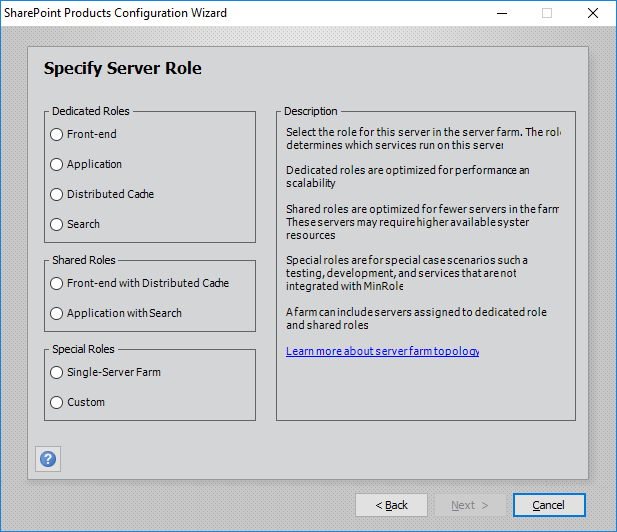
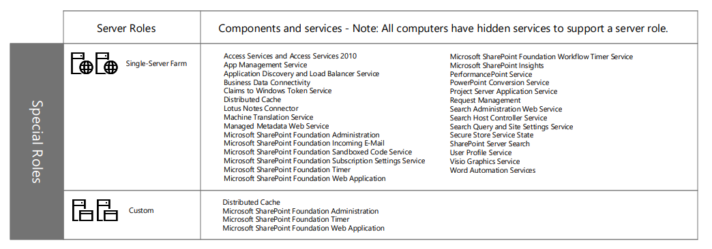

# Understanding SharePoint's MinRole in SP 2016 & 2019 on-prem

### Pre-2016:

Say, you had two servers. You could install **any** service on either of them, in **any combination**. E,g,:

- **Server 1**: Web Front-End + Search + Central Administration
- **Server 2**: Indexing + Application Services

This freedom, and lack of guidance, gave a lot of flexibility. But, you had to be careful about performance issues.

### Post-2016. Welcome MiniRole:

**MinRole** is just a **best combination** of services. Now adminstrator know beforehand, what mix is best. However, it's not just advice; it also makes it easy to deploy these 'best service combination'.

Also, like before, you can still install 'anything anywhere' with 'Custom' MiniRole. This is how the new installer shows them:

#### Dedicated MinRole:

- **Front-End**
- **Application**
- **Distributed Cache**
- **Search**

*From Microsoft Site*

#### Special MiniRole:

- **Single-Farm**: All-in-one. Before called, Standalone Install mode. Used for Dev.
- **Custom**: Anything-anywhere. The-way-you-like-it

*From Microsoft Site*

#### Shared MiniRoles:

- **Front-End + Distributed Cache**
- **Application +  Search**

*From Microsoft Site*

Long story short: MinRole is just 'best mix of SharePoint services' as per Microsoft.

---