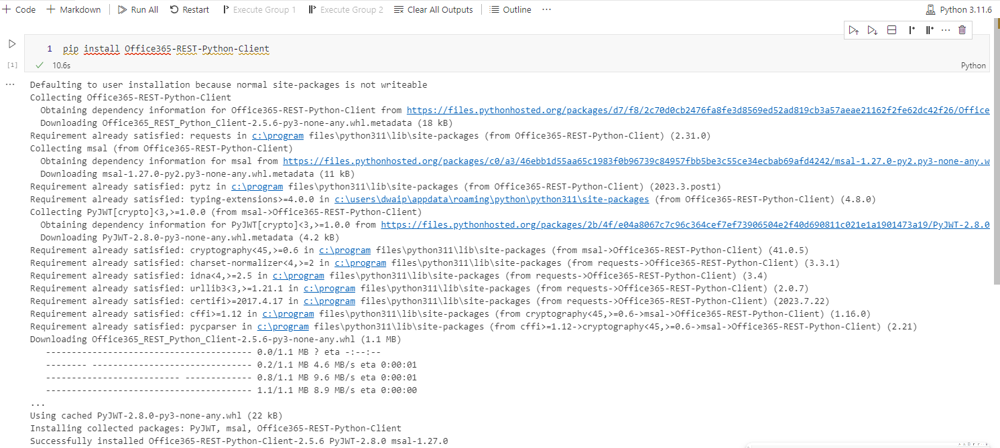
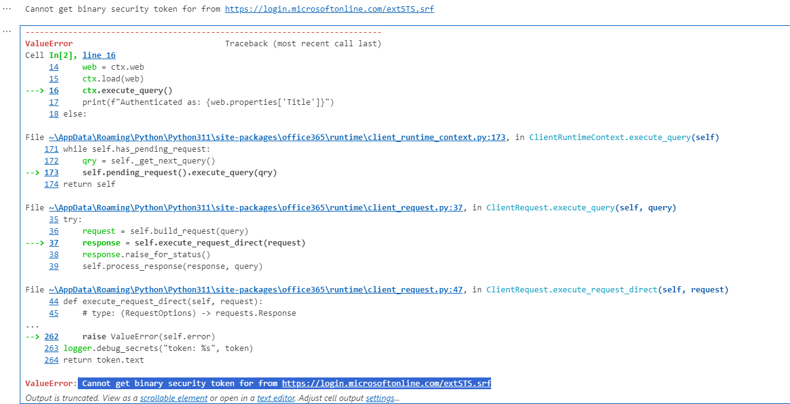

- [How to authenticate from your local python setup with SharePoint online](#how-to-authenticate-from-your-local-python-setup-with-sharepoint-online)
  - [Authenticating to SharePoint Online with Username and Password in Python: Challenges with MFA](#authenticating-to-sharepoint-online-with-username-and-password-in-python-challenges-with-mfa)
  - [Connecting to SharePoint Online from Python Using OAuth as a solution](#connecting-to-sharepoint-online-from-python-using-oauth-as-a-solution)
  - [Prerequisites](#prerequisites)
  - [Step 1: Register an Application in Azure AD](#step-1-register-an-application-in-azure-ad)
  - [Step 2: Grant Permissions to the App](#step-2-grant-permissions-to-the-app)
  - [Step 3: Install Required Python Libraries](#step-3-install-required-python-libraries)
  - [Step 4: Authenticate Using OAuth](#step-4-authenticate-using-oauth)
  - [Step 5: Interact with SharePoint Online](#step-5-interact-with-sharepoint-online)
  - [Takeaways](#takeaways)


## How to authenticate from your local python setup with SharePoint online

The ability to integrate your local python enviornment with SharePoint online can have lot of advantages. Imagine you have a bunch of JSON files and want to put the information from those files into a SharePoint document library. With Python, you can easily write a program to do that.

This article will show you a few ways to connect your Python environment to SharePoint Online.

### Authenticating to SharePoint Online with Username and Password in Python: Challenges with MFA

Authenticating to SharePoint Online directly using a username and password from a Python script can be straightforward for basic scripts and automation tasks. However, this approach faces significant challenges, especially in environments where Modern Authentication policies, including Multi-Factor Authentication (MFA), are enforced. 

For example, I had MFA enabled and I tried to connect with SharePoint onlien from my local VS Code using python. Install the Office365-REST-Python-Client Library

```python

pip install Office365-REST-Python-Client

```



Then, I tried to authanticate

```python

from office365.runtime.auth.authentication_context import AuthenticationContext
from office365.sharepoint.client_context import ClientContext

# SharePoint site URL
site_url = "https://yourdomain.sharepoint.com/sites/yoursite"

# Your Office 365 credentials
username = "yourusername@yourdomain.com"
password = "yourpassword"

ctx_auth = AuthenticationContext(site_url)
if ctx_auth.acquire_token_for_user(username, password):
    ctx = ClientContext(site_url, ctx_auth)
    web = ctx.web
    ctx.load(web)
    ctx.execute_query()
    print(f"Authenticated as: {web.properties['Title']}")
else:
    print("Authentication failed.")

```

This failed:



`Conclusion`

Nowadays, MFA is everywhere, most organizations enforce MFA, hence while direct username/password authentication is theoritically possible, chances are it will fail 99% of the time.

### Connecting to SharePoint Online from Python Using OAuth as a solution

We saw how our basic authentication method using username/password failed. Hence, Modern authentication via OAuth is recommended for secure access. Follow the steps below to connect with SharePoint online using oAuth authantication. oAuth is also used to connect to a lot of other Offie 365 and Azure services. Its very popular.

### Prerequisites

- **Python**: Ensure Python is installed on your system. The examples that I show you will need Python 3.6 or higher
- **Azure AD App Registration**: You will also need access to Azure with sufficient permission to register an application in Azure Active Directory (Azure AD) for OAuth authentication.

### Step 1: Register an Application in Azure AD

1. **Sign in** to the Azure portal and navigate to Azure Active Directory > App registrations > New registration.
2. **Register your app** by providing a name and selecting supported account types. The redirect URI (Web) can be `http://localhost` for testing purposes.
3. **Capture the Application (client) ID** and **Directory (tenant) ID** from the Overview page after registration.
4. Under **Certificates & secrets**, generate a new client secret and note it down.

### Step 2: Grant Permissions to the App

1. Navigate to API permissions > Add a permission > APIs my organization uses > SharePoint.
2. Choose Delegated permissions and add permissions like `Sites.Read.All` (adjust based on your needs).
3. Click "Add permissions" and ensure an administrator grants consent if required.

### Step 3: Install Required Python Libraries

Install the `requests` library to make HTTP requests and `msal` for Microsoft Authentication Library support.

```sh
pip install requests msal
```

### Step 4: Authenticate Using OAuth

```python
from msal import ConfidentialClientApplication

# Replace these with your Azure AD app registration details
client_id = 'YOUR_APP_CLIENT_ID'
client_secret = 'YOUR_APP_CLIENT_SECRET'
tenant_id = 'YOUR_TENANT_ID'

authority_url = f'https://login.microsoftonline.com/{tenant_id}'
resource_url = 'https://graph.microsoft.com'
redirect_uri = 'http://localhost'

# Initialize the MSAL confidential client
app = ConfidentialClientApplication(
    client_id,
    authority=authority_url,
    client_credential=client_secret,
)

# Acquire token for SharePoint
token_response = app.acquire_token_for_client(scopes=[f'{resource_url}/.default'])

# Extract the access token
access_token = token_response.get('access_token', None)
if not access_token:
    raise Exception("Failed to acquire token. Check your credentials and permissions.")

print("Successfully authenticated.")
```

### Step 5: Interact with SharePoint Online

With the access token, you can now make authenticated requests to SharePoint Online. Here is a small example that shows how to list the titles of all SharePoint sites in your organization using the Microsoft Graph API.

```python
import requests

# The endpoint to list all sites
url = f'{resource_url}/v1.0/sites'

# Headers for the request
headers = {
    'Authorization': f'Bearer {access_token}',
    'Accept': 'application/json',
}

response = requests.get(url, headers=headers)
if response.status_code == 200:
    sites = response.json()
    for site in sites.get('value', []):
        print(site.get('displayName'))
else:
    print(f"Failed to retrieve sites: {response.status_code}")
```

### Takeaways

This article showed you how to connect to SharePoint Online from a local Python environment using OAuth for authentication. By following these steps, you've registered an application in Azure AD, granted it necessary permissions, authenticated using the Microsoft Authentication Library (MSAL), and interacted with SharePoint Online via the Microsoft Graph API.

Remember, OAuth provides a secure and robust method for authenticating and interacting with Microsoft services. Knowing about oAuth can be a valuable skill if you want to work with microsoft resources.

---

© D Das  
📧 [das.d@hotmail.com](mailto:das.d@hotmail.com) | [ddasdocs@gmail.com](mailto:ddasdocs@gmail.com)