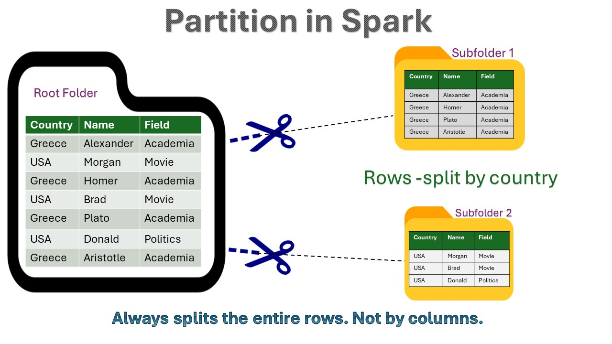
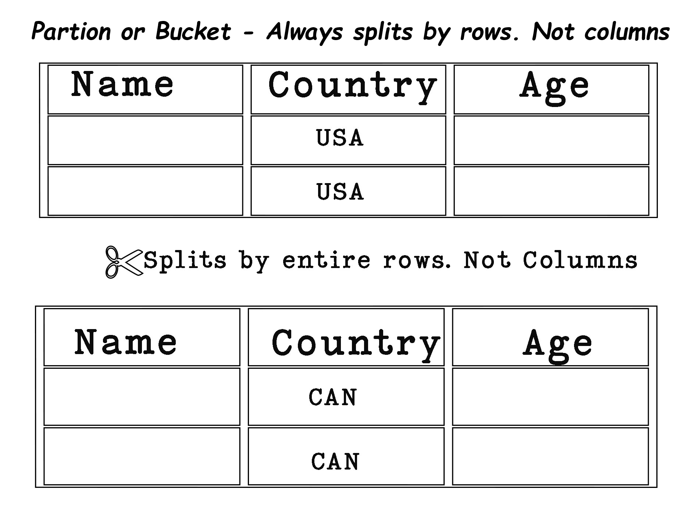

- [Partitioning and Bucketing in Spark](#partitioning-and-bucketing-in-spark)
- [Partitioning](#partitioning)
  - [Example](#example)
- [Bucketing](#bucketing)
- [How partion and bucket info is stored?](#how-partion-and-bucket-info-is-stored)
- [Adding New Rows](#adding-new-rows)
- [Combining Partitioning and Bucketing](#combining-partitioning-and-bucketing)
  - [Example](#example-1)
- [Lets summarize](#lets-summarize)



### Partitioning and Bucketing in Spark

Both are techniques to make things run faster. Both partitioning and bucketing **split rows in a table into separate files**. But, there are differences. In this article I will try to highlight some main points about these two techniques.



### Partitioning

Partitioning in Spark is simple: it splits data by rows, not by columns. For example, all rows where the country is USA become one partition. Columns are not split, so never confuse this with column-based splitting.

Partitioning divides data into separate folders based on the values of one or more columns. Each partition folder contains all rows that share the same value for the partitioning column(s). This helps improve read performance for queries that filter on the partition column.

#### Example

Consider the following sample data:

```python
# Sample data
+---+----+-------+
| id|name|country|
+---+----+-------+
| 1 | A  | USA   |
| 2 | B  | CAN   |
| 3 | C  | USA   |
| 4 | D  | CAN   |
+---+----+-------+
```

Partitioning this data by `country`:

```python
# Partitioning by country
partDF = df.repartition("country")
```

Resulting in partitions:

- **Partition 1 (for USA)**:
  ```python
  +---+----+-------+
  | id|name|country|
  +---+----+-------+
  | 1 | A  | USA   |
  | 3 | C  | USA   |
  +---+----+-------+
  ```

- **Partition 2 (for Canada)**:
  ```python
  +---+----+-------+
  | id|name|country|
  +---+----+-------+
  | 2 | B  | CAN   |
  | 4 | D  | CAN   |
  +---+----+-------+
  ```

When you save this partitioned data to disk:

```python
df.write.partitionBy("country").parquet("/tables_root_folder")
```

This will create a folder structure like this:

```
/table_root_folder/
  ├── country=USA/
  │   └── part-00000.parquet
  └── country=CAN/
      └── part-00000.parquet
```

### Bucketing

Bucketing is another way to organize data. It divides data into a fixed number of files(called buckets) based on the hash value of a specified column. **Each bucket is a separate physical file within the table's folder.** Rows with the same value for the bucket column are stored in the same bucket file. This makes data operations like joins and aggregations faster.

For example, if you bucket a dataset by `customer_id` into 4 buckets, the table's folder will contain 4 bucket files.

```python
# Bucketing by customer_id
df.write.bucketBy(4, "customer_id").saveAsTable("tables_root_folder")
```

The folder structure will look like this:

```
/tables_root_folder/
  ├── part-00000
  ├── part-00001
  ├── part-00002
  └── part-00003
```

### How partion and bucket info is stored?

When using Hive Metastore, both partitioning and bucketing metadata are stored in the Metastore. This includes information about which columns are used for partitioning and bucketing, and the number of buckets.

- **Partitioning Metadata:** The Metastore keeps track of the partition columns and the structure of the directories.
- **Bucketing Metadata:** The Metastore stores information about the bucketing column(s) and the number of buckets.

This metadata allows Spark to efficiently read and write data by knowing the organization of the table.

### Adding New Rows

When you add new rows to a partitioned table, Spark places them in the appropriate partition folder without reorganizing the entire dataset.

```python
# Adding new rows to a partitioned table
new_data.write.mode("append").partitionBy("country").parquet("/path/to/partitioned_data")
```

For a bucketed table, new rows are appended to the existing bucket files based on the hash of the bucketing column. This keeps the bucketing scheme efficient without needing to rebucket the entire dataset.

```python
# Adding new rows to a bucketed table
new_data.write.bucketBy(4, "customer_id").mode("append").saveAsTable("bucketed_table")
```

### Combining Partitioning and Bucketing

You can also combine partitioning and bucketing to leverage the benefits of both techniques. This is useful when you need to optimize data access for multiple dimensions.

#### Example

Consider partitioning by `country` and bucketing by `customer_id`.

```python
# Partitioning by country and bucketing by customer_id
df.write.partitionBy("country").bucketBy(4, "customer_id").saveAsTable("part_buck_table")
```

This creates a folder structure where each partition is further divided into buckets:

```
/part_buck_table/
  ├── country=USA/
  │   ├── part-00000
  │   ├── part-00001
  │   ├── part-00002
  │   └── part-00003
  └── country=CAN/
      ├── part-00000
      ├── part-00001
      ├── part-00002
      └── part-00003
```

### Lets summarize

| Feature                | Partitioning                                             | Bucketing                                                |
|------------------------|----------------------------------------------------------|----------------------------------------------------------|
| **Method**             | Splits data by rows based on column values               | Splits data into a fixed number of buckets based on hash |
| **Storage**            | Separate directories for each partition value            | Separate files (buckets) within the table folder      |
| **Example**            | `df.write.partitionBy("country").parquet("/table_root_folder")` | `df.write.bucketBy(4, "customer_id").saveAsTable("tableName")` |
| **folder Structure**| `/table_root_folder/country=USA/`<br>`/table_root_folder/country=CAN/` | `/table_root_folder/part-00000`<br>`/table_root_folder/part-00001` |
| **Efficiency**         | Optimizes read performance for specific queries          | Optimizes join and aggregation performance               |
| **Metadata Storage**   | Stored in Hive Metastore for partition columns           | Stored in Hive Metastore for bucketing columns and number of buckets |
| **Adding New Rows**    | New rows go to the appropriate partition folder       | New rows are appended to the appropriate bucket files    |
| **Combining**          | Can be combined with bucketing for multi-dimensional optimization | Can be combined with partitioning for multi-dimensional optimization |