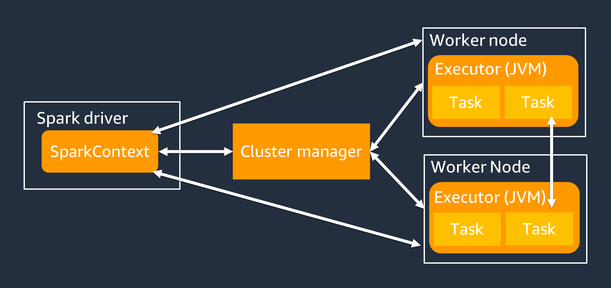
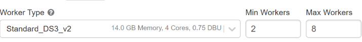
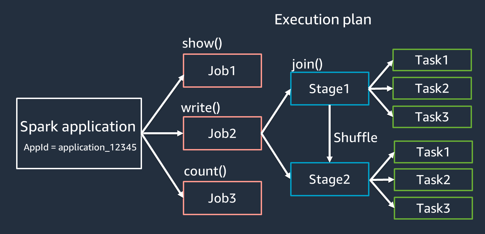

# Spark Architecture
## Spark Components
**Spark Core:** The main part of Spark with a core engine.

**Spark SQL:** A SQL engine, but different from traditional databases. Here, data is processed mainly using DataFrames.

**Spark Streaming:** This part allows Spark to process real-time data.

**Spark MLlib:** A collection of machine learning libraries.

**GraphX:** Used for graphs in reports, such as data collected from networks like Facebook.

**RDDs:** Spark Core has RDDs (Resilient Distributed Datasets), which are the building blocks of Spark.

## Cluster & Nodes
Nodes are individual machines (physical or virtual). Cluster is a group of nodes.
## Driver & Worker



### Driver
- Machine where Main() method runs. It contains the SparkContext object.
- Converts the application into stages using a DAG (Directed Acyclic Graph).
- Schedules tasks on worker nodes and collects the results.
- Should be close to worker nodes for better performance.
### Workers(now Executors)

Workers are simply machines(Virtual/Real). These workers run JVM processes, called Executors. Multiple JVM Process(Executor) can be configured in a worker.

  **Configuration:** In your spark configuration you can set:

  - `--num-executors`: Specifies the total number of executors to be launched for the application.
  - `--executor-cores`: Specifies the number of cores (slots) to be used by each executor.
  - `--executor-memory`: Specifies the amount of memory to be allocated to each executor.

  **Example:** With a worker machine having 16 CPU cores and 64 GB of memory, you can configure Spark to run either 4 executors (4 cores, 16 GB each) or 2 executors (8 cores, 32 GB each).

  <p style="color: #003366; font-family: 'Trebuchet MS', Helvetica, sans-serif; background-color: Beige; padding: 15px; border-left: 5px solid #6699cc; border-radius: 10px; box-shadow: 2px 2px 10px #6699cc;">
  <strong>Note: </strong>Executor is a JVM process running on a worker node that executes tasks. The Spark cluster manager (e.g., YARN, Mesos, or the standalone cluster manager) is responsible for allocating resources to executors.
  </p>

## Slots = Spark cores =  Synapse vCore ≈ Threads

[**Cores in Spark = vCores in Synapse = Slots in Databricks = Total threads = Total parallel tasks**](https://files.training.databricks.com/courses/ilt/Spark-ILT/Spark-ILT-5.1.1/amazon/instructor-notes/Spark%20Architecture.html#:~:text=The%20term%20%22core%22%20is%20unfortunate,these%20threads%2C%20to%20avoid%20confusion.)

<p style="color: #003366; font-family: 'Trebuchet MS', Helvetica, sans-serif; background-color: #F0F8FF; padding: 15px; border-left: 5px solid #6699cc; border-radius: 10px; box-shadow: 2px 2px 10px #6699cc;">
<strong>Note: </strong>Don't confuse cores with Intel/AMD CPU Ads. Cores in Spark means threads.
</p>

<p style="color: #003366; font-family: 'Trebuchet MS', Helvetica, sans-serif; background-color: #DCDCDC; padding: 15px; border-left: 5px solid #6699cc; border-radius: 10px; box-shadow: 2px 2px 10px #6699cc;">
<strong>Note: </strong>Spark supports one task for each virtual CPU (vCPU) core by default. For example, if an executor has four CPU cores, it can run four concurrent tasks.
</p>

<p style="color: #003366; font-family: 'Trebuchet MS', Helvetica, sans-serif; background-color: pink; padding: 15px; border-left: 5px solid #6699cc; border-radius: 10px; box-shadow: 2px 2px 10px #6699cc;">
<strong>Note: </strong>Multiple threads can run on each core, but Spark typically uses one thread per core for each task to simplify execution and avoid the complexities of managing multiple threads on a single core.
</p>

This Databricks spark cluster can run 32 tasks parallely:




In Docker Compose, `SPARK_WORKER_CORES` sets worker threads (cores/slots). A cluster with 3 workers, each set to 2 cores, has 6 total threads.

### Executors, cores & memory for a 10 GB data

Say, you have 10 GB of data to be processed. How can you calcultate the executors, cores and memory for such a secenairo?

| **Step**                           | **Description**                                               | **Calculation/Value**       |
|------------------------------------|---------------------------------------------------------------|-----------------------------|
| **Calculate number of partitions** | Default partition size: 128 MB                                | 10 GB / 128 MB = 80 partitions |
| **Determine CPU cores needed**     | One core per partition for maximum parallelism                | 80 cores                    |
| **Max cores per executor**         | Cores per executor in YARN                                     | 5 cores per executor        |
| **Calculate number of executors**  | Total cores / Cores per executor                               | 80 / 5 = 16 executors       |
|                                    |                                                               |                             |
| **Partition size**                 | Default partition size: 128 MB                                | 128 MB                      |
| **Memory per core**                | Minimum memory per core (4x partition size)                   | 128 MB * 4 = 512 MB         |
| **Executor cores**                 | Cores per executor                                            | 5 cores                     |
| **Executor memory**                | Memory per core * Number of cores per executor                | 512 MB * 5 = 2560 MB        |
|                                    |                                                               |                             |
| **Each Executor Requires**         |                                                               |                             |
| **Cores**                          |                                                               | 5 CPU cores                |
| **Memory**                         |                                                               | 2560 MB                    |


## Application, Jobs, Stages, Tasks



**Applications** -> **jobs** -> **stages** -> **tasks**.


| **Term**          | **Definition**                                                                                                          | **Example**                                                                                                                      |
|-------------------|--------------------------------------------------------------------------------------------------------------------------|----------------------------------------------------------------------------------------------------------------------------------|
| **Application**   | An application in Spark is a complete program that runs on the Spark cluster. This program includes the user's code that uses Spark’s API to perform data processing. | A Spark application can be a Python script that processes data from a CSV file, performs transformations, and writes the results to a database. |
| **Job**           | A job is triggered by an action (e.g., `count()`, `collect()`, `saveAsTextFile()`) in a Spark application. Each action in the code triggers a new job. | If your application has two actions, like counting the number of rows and saving the result to a file, it will trigger two jobs. |
| **Stages**        | A job is divided into stages, where each stage is a set of tasks that can be executed in parallel. Stages are separated by shuffle operations. | If a job involves filtering and then aggregating data, the filtering might be one stage, and the aggregation another, especially if a shuffle operation (like a group by) is required between them. |
| **Tasks**         | A stage is further divided into tasks, where each task is a unit of work that operates on a partition of the data. Tasks are the smallest unit of execution in Spark. | If a stage needs to process 100 partitions of data, it will have 100 tasks, with each task processing one partition. |

### Let's put it all together
Let's see an example to understand these concepts:

1. **Application:** A Spark application that reads data from a CSV file, filters out certain rows, and then calculates the average of a column.
   - Code snippet:
     ```python
     df1 = spark.read.csv("data.csv") //Job1
     df2 = df.filter(df["value"] > 10) //Job2
     average = df2.agg({"value": "avg"}).collect()
     ```

2. **Jobs:**
   - Job 1: Triggered by the action `spark.read.csv()`. This job reads the data from the CSV file.
   - Job 2: Triggered by the action `filtered_df.agg().collect()`. This job includes filtering the data and then calculating the average.

3. **Stages in Job 2:**
   - **Stage 1:** Filtering the data. All tasks in this stage can run in parallel because filtering is a transformation that operates on individual partitions.
   - **Stage 2:** Aggregating the data. This stage requires a shuffle because the aggregation (calculating the average) involves data from all partitions.

4. **Tasks:**
For each stage, Spark creates tasks based on the number of partitions. If there are 10 partitions, Stage 1 (filtering) will have 10 tasks, and Stage 2 (aggregation) will also have 10 tasks, each processing one partition of data.

## Transformation & Actions

In PySpark, operations on data can be classified into two types: **transformations** and **actions**.

### Transformations

Transformations are operations on RDDs that return a new RDD, meaning they create a new dataset from an existing one. **Transformations are lazy**, meaning they are computed only when an action is called.

(e.g., `map`, `filter`): Create a new RDD from an existing one. **They are lazy** and not executed until an action is called.

### Actions

Actions trigger the execution of the transformations to return a result to the driver program or write it to storage. When an action is called, Spark's execution engine computes the result of the transformations.

(e.g., `collect`, `count`): Trigger the execution of the transformations and return a result.

### Example 

```python
# Create an RDD from a list
data = [1, 2, 3, 4, 5]
rdd = spark.sparkContext.parallelize(data)

# Transformation 1: Multiply each number by 2
rdd_transformed = rdd.map(lambda x: x * 2)

# Transformation 2: Filter out even numbers
rdd_filtered = rdd_transformed.filter(lambda x: x % 2 == 0)

# Action: Collect the results
result = rdd_filtered.collect()
```
## Common transformations and actions in PySpark

| **Transformation** | **Example API**                            | **Description**                                     |
|--------------------|--------------------------------------------|-----------------------------------------------------|
| `map`              | `rdd.map(lambda x: x * 2)`                 | Applies a function to each element in the RDD.      |
| `filter`           | `rdd.filter(lambda x: x % 2 == 0)`         | Returns a new RDD containing only elements that satisfy a predicate. |
| `flatMap`          | `rdd.flatMap(lambda x: (x, x * 2))`        | Similar to `map`, but each input item can be mapped to 0 or more output items (returns a flattened structure). |
| `mapPartitions`    | `rdd.mapPartitions(lambda iter: [sum(iter)])` | Applies a function to each partition of the RDD.    |
| `distinct`         | `rdd.distinct()`                           | Returns a new RDD containing the distinct elements. |
| `union`            | `rdd1.union(rdd2)`                         | Returns a new RDD containing the union of elements. |
| `intersection`     | `rdd1.intersection(rdd2)`                  | Returns a new RDD containing the intersection of elements. |
| `groupByKey`       | `rdd.groupByKey()`                         | Groups the values for each key in the RDD.          |
| `reduceByKey`      | `rdd.reduceByKey(lambda a, b: a + b)`      | Merges the values for each key using an associative function. |
| `sortBy`           | `rdd.sortBy(lambda x: x)`                  | Returns a new RDD sorted by the specified function. |

| **Action**         | **Example API**                            | **Description**                                     |
|--------------------|--------------------------------------------|-----------------------------------------------------|
| `collect`          | `rdd.collect()`                            | Returns all the elements of the RDD as a list.      |
| `count`            | `rdd.count()`                              | Returns the number of elements in the RDD.          |
| `first`            | `rdd.first()`                              | Returns the first element of the RDD.               |
| `take`             | `rdd.take(5)`                              | Returns the first `n` elements of the RDD.          |
| `reduce`           | `rdd.reduce(lambda a, b: a + b)`           | Aggregates the elements of the RDD using a function.|
| `saveAsTextFile`   | `rdd.saveAsTextFile("path")`               | Saves the RDD to a text file.                       |
| `countByKey`       | `rdd.countByKey()`                         | Returns the count of each key in the RDD.           |
| `foreach`          | `rdd.foreach(lambda x: print(x))`          | Applies a function to each element of the RDD.      |


## What is a Shuffle?

A **shuffle** in Spark is the process of redistributing data across different nodes in the cluster. It involves copying data between Executors(JVM Proceses). It typically happens when a transformation requires data exchange between partitions, involving disk I/O, data serialization, and network I/O.

Shuffle is one of the most substantial factors in degraded performance of your Spark application. While storing the intermediate data, it can exhaust space on the executor's local disk, which causes the Spark job to fail.

### When Does a Shuffle Occur?

| **Operation**   | **Example**                               | **Description** |
|-----------------|-------------------------------------------|-----------------|
| `groupByKey`    | `rdd.groupByKey()`                        | Groups elements by key, requiring all data for a key to be in the same partition. |
| `reduceByKey`   | `rdd.reduceByKey(lambda a, b: a + b)`     | Combines values for each key using a function, requiring data colocation. |
| `sortByKey`     | `rdd.sortByKey()`                         | Sorts data, requiring all data for a key to be in the same partition. |
| `join`          | `rdd1.join(rdd2)`                         | Joins two RDDs or DataFrames, requiring data with the same key to be colocated. |
| `distinct`      | `rdd.distinct()`                          | Removes duplicates, requiring comparison across partitions. |

### How to Optimize Shuffle in Spark

| **Optimization**                | **Description**                                                                                                                                       | **Example/Note**                                                                                             |
|---------------------------------|-------------------------------------------------------------------------------------------------------------------------------------------------------|--------------------------------------------------------------------------------------------------------------|
| **Avoid join() unless essential** | The join() operation is a costly shuffle operation and can be a performance bottleneck.                                                              | Use join only if necessary for your business requirements.                                                   |
| **Avoid collect() in production** | The collect() action returns all results to the Spark driver, which can cause OOM errors.                                                             | Default setting: `spark.driver.maxResultSize = 1GB`.                                                          |
| **Cache/Persist DataFrames**      | Use `df.cache()` or `df.persist()` to cache repetitive DataFrames to avoid additional shuffle or computation.                                          | ```python df_high_rate = df.filter(col("star_rating") >= 4.0) df_high_rate.persist() ```                     |
| **Unpersist when done**           | Use `unpersist` to discard cached data when it is no longer needed.                                                                                    | ```python df_high_rate.unpersist() ```                                                                       |
| **Overcome data skew**            | Data skew causes uneven distribution of data across partitions, leading to performance bottlenecks.                                                    | Ensure data is uniformly distributed across partitions.                                                      |
| **Use bucketing**                 | Bucketing pre-shuffles and pre-sorts input on join keys, writing sorted data to intermediary tables to reduce shuffle and sort costs.                  | Reduces load on executors during sort-merge joins.                                                           |
| **Shuffle and broadcast hash joins** | Use broadcast hash join for small-to-large table joins to avoid shuffling.                                                                            | Applicable only when the small table can fit in the memory of a single Spark executor.                        |
| **Optimize join**                 | Use high-level Spark APIs (SparkSQL, DataFrame, Datasets) for joins instead of RDD API or DynamicFrame join. Convert DynamicFrame to DataFrame if needed. | ```python df_joined = df1.join(df2, ["key"]) ```                                                              |
