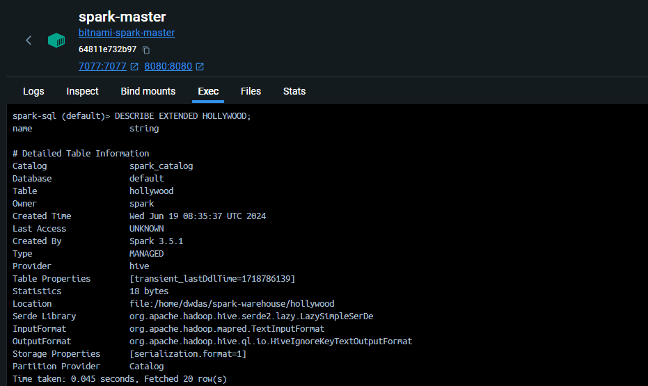
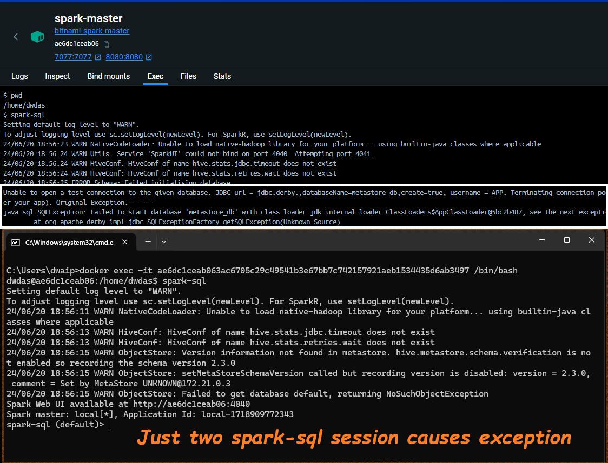
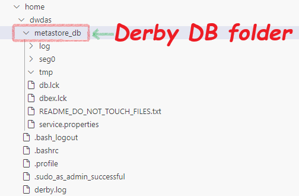

# Spark Database, Tables, Warehouse, Metastore & Catalogs

- A Spark Database is just a folder named **databasename.db** inside the **spark-warehouse** folder.
- A Managed/Internal/Spark-Metastore table is a subfolder within the **databasename.db** folder. Partitions are also stored as subfolders.
- The location of the warehouse folder is set by the **spark.sql.warehouse.dir** setting.
- If **spark.sql.warehouse.dir** is not set, Spark uses a default directory, usually a **spark-warehouse** folder in the current working directory of the application.
- You can find out the warehouse directory by running the command `SET spark.sql.warehouse.dir` in the spark-sql prompt.

    


- You can set the warehouse directory in your session with `.config("spark.sql.warehouse.dir", "/path/to/your/warehouse")`.


## SPARK Managed Tables (AKA Internal / Spark-Metastore Tables) Using Spark-SQL Shell

When you create tables in the spark-sql shell using commands like the one below, Spark will create a managed table. The table data will be stored in the `spark-warehouse` folder, and the Derby database (`metastore_db` folder) will contain its metadata.

```sql
CREATE TABLE Hollywood (name STRING);
```

The table will be permanent, meaning you can query it even after restarting Spark. Here is an example output of `DESCRIBE EXTENDED Hollywood` in the spark-sql shell:




- **Catalog**: `spark_catalog` - Spark uses its own internal catalog to manage metadata.
- **Database**: `default` - The default database provided by Spark.
- **Type**: `MANAGED` - Indicates that Spark manages the table's lifecycle.
- **Provider**: `hive` - Refers to Spark's capability to handle Hive-compatible metadata.
- **Serde Library**: `org.apache.hadoop.hive.serde2.lazy.LazySimpleSerDe` - Serialization and deserialization library.
- **InputFormat**: `org.apache.hadoop.mapred.TextInputFormat` - Input format for reading the table data.
- **OutputFormat**: `org.apache.hadoop.hive.ql.io.HiveIgnoreKeyTextOutputFormat` - Output format for writing the table data.
- **Location**: `file:/home/dwdas/spark-warehouse/hollywood` - File path where the table data is stored.
- **Partition Provider**: `Catalog` - Indicates that the catalog manages partitions.

### Key Takeaways:

- **Built-in Catalog**: Even without a standalone Hive installation, Spark provides managed table functionality by leveraging its built-in catalog and Hive-compatible features.
- **SQL-like Operations**: You can use SQL-like operations to manage tables within Spark.
- **Embedded Deployment Mode**: By default, Spark SQL uses an embedded deployment mode of a Hive metastore with an Apache Derby database.
- **Production Use**: The default embedded deployment mode is not recommended for production use due to the limitation of only one active SparkSession at a time.


<p style="color: navy; font-family: 'Trebuchet MS', Helvetica, sans-serif; background-color: #f8f8f8; padding: 15px; border-left: 5px solid grey; border-radius: 10px; box-shadow: 2px 2px 10px grey;">
<strong>Remember:</strong><br>
This Derby-mini-Hive method that Spark uses to manage internal tables has a limitation: only one active session is allowed at a time. Attempting multiple `spark-sql` sessions will result in a Derby database exception.
</p>



Would you take this to production?

## Metastore in Spark

The metastore in Spark stores metadata about tables, like their names and the locations of their files (e.g., Parquet files). In Spark, the metastore is typically configured in one of two common ways, but there are also more advanced options available.

1. **Standalone Hive Metastore:** You can install and configure a standalone Hive metastore server. This server would manage the metadata independently and communicate with your Spark application.

2. **Embedded Hive Metastore with Derby**

Spark includes a built-in metastore that uses an embedded Apache Derby database. This database starts in the application's working directory and stores data in the `metastore_db` folder. It's a convenient, pseudo-metastore suitable for small applications or datasets. To use this, simply enable Hive support in your Spark session with `enableHiveSupport()`:

```python
from pyspark.sql import SparkSession

spark = SparkSession.builder \
    .appName("EmbeddedMetastoreExample") \
    .enableHiveSupport() \
    .getOrCreate()
```


<p style="color: navy; font-family: 'Trebuchet MS', Helvetica, sans-serif; background-color: #f8f8f8; padding: 15px; border-left: 5px solid grey; border-radius: 10px; box-shadow: 2px 2px 10px grey;">
<strong>Again:</strong><br>
By default, Hive uses an embedded Apache Derby database to store its metadata. While this is a convenient option for initial setup, it has limitations. Notably, Derby can only support one active user at a time. This makes it unsuitable for scenarios requiring multiple concurrent Hive sessions. So, the solution is to use a standard database like MySQL/Postgrees or MSSQL as the metastore DB. And, let the poor derby take  some rest.
</p>

## Catalog types in Spark

1. In-Memory Catalog: Default catalog. Stores data memory. Everything vanishes when session is closed. For some quick queries etc.

2. Hive Catalog: A mini-version comes shipped with Spark. You need to enable hive support to use it. Data is stoerd permanently. Can have a full-fledged hivve as well.

3. JDBC Catalog: When you want a full-database like MSSQL to store the catalog information. Can be like Hive+MSSQL.

4. Custom Catalogs: Custom catalogs can be implemented using ExtendedCatalogInterface. AWS glue, Synapese databricks.

5. Delta Lake Catalog: When using Delta Lake, it provides its own catalog implementation.

## What happens when you enter `spark-sql` on a freshly installed Spark server?

Imagine you have a fresh standalone Spark server. You log into the server through the terminal, and your current directory is `/home/dwdas`. The moment you enter the `spark-sql` command, Spark starts an embedded Derby database and creates a `metastore_db` folder in your current directory. This folder serves as the root of the Derby database. Essentially, Spark "boots a Derby instance on `metastore_db`".

By default, a fresh Spark setup uses its in-house Derby database as a 'metastore' to store the names and file locations of the Spark tables you create. This is Spark's basic way to manage its tables. Though you can upgrade it and use an external metastore and other advanced features.




> 


<p style="color: navy; font-family: 'Trebuchet MS', Helvetica, sans-serif; background-color: #f8f8f8; padding: 15px; border-left: 5px solid grey; border-radius: 10px; box-shadow: 2px 2px 10px grey;">
<strong>Remember:</strong><br>
Your current directory is crucial because everything is created inside it. This often confuses new learners who forget this, making it hard to find their tables later.<br>
</p>


<p style="color: navy; font-family: 'Trebuchet MS', Helvetica, sans-serif; background-color: #f8f8f8; padding: 15px; border-left: 5px solid grey; border-radius: 10px; box-shadow: 2px 2px 10px grey;">
<strong>Remember:</strong><br>
<span style="color: darkgreen;">Spark SQL does not use a Hive metastore under the cover. By default, it uses in-memory catalogs if Hive support is not enabled.</span><br>
<span style="color: darkred;">Spark-shell: By default, uses in-memory catalogs unless configured to use Hive metastore.</span><br>
<span style="color: darkblue;">Set <code>spark.sql.catalogImplementation</code> to <code>hive</code> or <code>in-memory</code> to control this.</span><br>
</p>


## What Happens When You Create a Table in Spark-SQL?

Let's open the spark-sql and enter this simple command:

```sql
CREATE TABLE movies (title STRING, genre STRING);
INSERT INTO movies VALUES ('Inception', 'Sci-Fi');
```

You will see logs like these:

```plaintext
24/06/20 07:44:39 WARN ResolveSessionCatalog: A Hive serde table will be created as there is no table provider specified. You can set spark.sql.legacy.createHiveTableByDefault to false so that native data source table will be created instead.
```


**Explanation**:
- When you execute a `CREATE TABLE` statement without specifying a table provider, Spark’s session catalog defaults to creating a Hive SerDe table. The session catalog interprets and resolves SQL commands.

- **Note**: To create a native Spark SQL table, set `spark.sql.legacy.createHiveTableByDefault` to `false`.

  - In `spark-defaults.conf`:

    ```properties
    spark.sql.legacy.createHiveTableByDefault=false
    ```

  - In Spark SQL shell:

    ```sh
    spark-sql --conf spark.sql.legacy.createHiveTableByDefault=false
    ```

  - In PySpark session:

    ```python
    from pyspark.sql import SparkSession

    spark = SparkSession.builder \
        .appName("example") \
        .config("spark.sql.legacy.createHiveTableByDefault", "false") \
        .enableHiveSupport() \
        .getOrCreate()
    ```

You might also see a warning like this:

```plaintext
24/06/20 07:44:40 WARN HiveMetaStore: Location: file:/home/dwdas/spark-warehouse/movies specified for non-external table: movies
```

**Explanation**: This indicates the default storage location for non-external tables is `spark-warehouse`.

**Note**: Change the default location by setting `spark.sql.warehouse.dir`.
To change the warehouse directory:

- In `spark-defaults.conf`:

    ```properties
    spark.sql.warehouse.dir=/your/custom/path
    ```

- In Spark SQL shell:

    ```sh
    spark-sql --conf spark.sql.warehouse.dir=/your/custom/path
    ```

- In PySpark session:

    ```python
    from pyspark.sql import SparkSession

    spark = SparkSession.builder \
        .appName("example") \
        .config("spark.sql.warehouse.dir", "/your/custom/path") \
        .getOrCreate()
    ```
### Key Takeaway

   When you run `spark-sql` with default settings, it will start a Derby database and create a `metastore_db` folder inside your current directory. So, be mindful of your current directory.

If you create a table in a PySpark session, Spark will create both a `metastore_db` and a `spark-warehouse` folder.