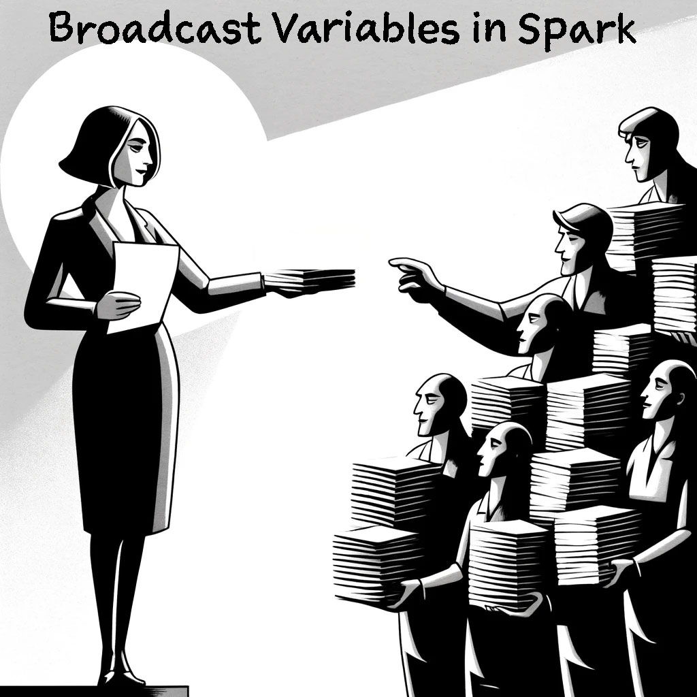

- [Understanding Broadcast Variables in Spark](#understanding-broadcast-variables-in-spark)
- [When to Use Broadcast Variables](#when-to-use-broadcast-variables)
  - [How Broadcast Variables Prevent Shuffle and Improve Performance](#how-broadcast-variables-prevent-shuffle-and-improve-performance)
- [Example](#example)
  - [Scenario Without Broadcast Variables](#scenario-without-broadcast-variables)
  - [Scenario With Broadcast Variables](#scenario-with-broadcast-variables)
  - [How Broadcast Variables Improve Performance](#how-broadcast-variables-improve-performance)
- [Summary](#summary)



## Understanding Broadcast Variables in Spark

Imagine a scenario from the movie "The Matrix" where Morpheus shares a training program with Neo and the other rebels. Instead of loading the training program into the simulation multiple times for each person, Morpheus sends it once to each person's mind, and they use it as needed.

This is similar to broadcast variables in Spark. **These variables are used mainly for performance tuning**. Using broadcast variables, you can send small read-only tables to all worker nodes in a cluster. This can reduce shuffling and make operations faster.

## When to Use Broadcast Variables

Broadcast variables should be used when you need to send a small table to all nodes. This is ideal for joins where one table is small (like a dimension table). It is not suitable for large tables, as it would cause an out-of-memory exception. If the size of the broadcasted table is larger than the memory, it will surely cause OOM.

### How Broadcast Variables Prevent Shuffle and Improve Performance

When performing a join or grouping operation on multiple DataFrames, related data usually needs to be grouped together. This involves shuffling data across all worker nodes, which is a costly operation and reduces performance due to data movement.

However, if you broadcast a small dimension table:
- The driver node sends a read-only copy of the entire dimension table to all worker nodes.
- This avoids splitting and shuffling the dimension table's data.
- Each worker node caches the local read-only copy of the dimension table.
- This allows each core within the worker nodes to use the local copy, making the join operation faster as the small table is not shuffled across the cluster.

## Example

Here I will give you two scenario and show you how broadcast variables may imporve joins in a Spark cluster.

### Scenario Without Broadcast Variables

Suppose you have a small lookup table (e.g., `lookup_dict`) and a large dataset (`rdd`). You want to join the large dataset with the lookup table.

```python
# Small lookup table
lookup_dict = {"A": 1, "B": 2, "C": 3}

# Large RDD
rdd = sc.parallelize(["A", "B", "C", "D", "E", "F", "G", "H"])

# Join operation without broadcast
lookup_rdd = sc.parallelize(list(lookup_dict.items()))
joined_rdd = rdd.map(lambda x: (x,)).join(lookup_rdd)
```

In this scenario, Spark needs to shuffle data to perform the join operation, which is expensive and time-consuming.

### Scenario With Broadcast Variables

Using a broadcast variable, you can send the lookup table to all nodes just once, avoiding the shuffle operation.

```python
# Small lookup table
lookup_dict = {"A": 1, "B": 2, "C": 3}

# Broadcast the lookup table
broadcast_var = sc.broadcast(lookup_dict)

# Large RDD
rdd = sc.parallelize(["A", "B", "C", "D", "E", "F", "G", "H"])

# Use the broadcast variable to look up values
result_rdd = rdd.map(lambda x: (x, broadcast_var.value.get(x, 0)))

# Collect and print the results
print(result_rdd.collect())
```

### How Broadcast Variables Improve Performance

When you join or group DataFrames, Spark usually shuffles data across all worker nodes, which is slow and costly.

- **Avoiding Shuffle**:
  - **Without Broadcast**: Spark shuffles the lookup table data across the network to join with the large dataset.
  - **With Broadcast**: The lookup table is sent once to all nodes, allowing local lookups without moving data around.

- **Efficiency**:
  - **Without Broadcast**: The join operation involves heavy data movement and sorting, which is slow.
  - **With Broadcast**: The lookup is done locally on each node using the cached copy, making the operation much faster and reducing network traffic.

## Summary

Broadcast variables are useful for distributing small datasets (like lookup tables) to all nodes in a Spark cluster. By broadcasting the lookup table, you avoid the need to shuffle data during join operations, which can significantly improve performance by reducing network overhead and computation time. This makes operations faster and more efficient.

