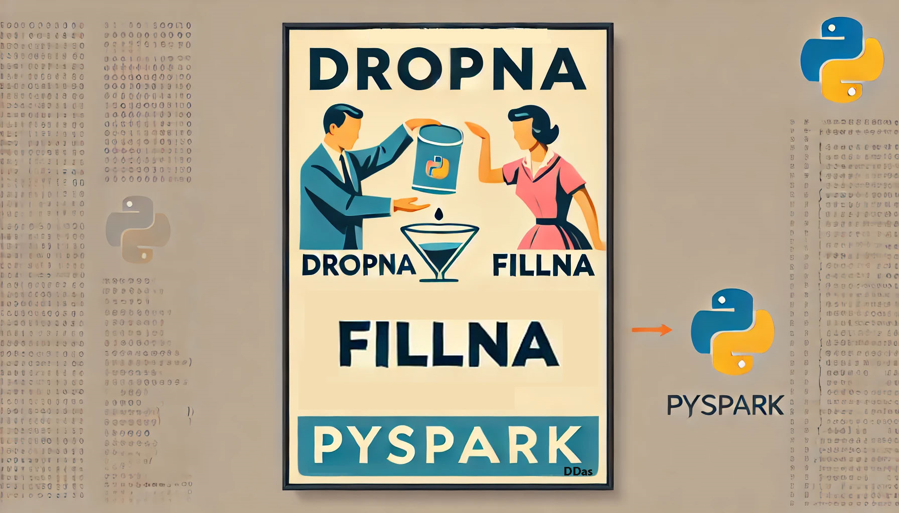

<details open markdown="block">
  <summary>
    Table of contents
  </summary>
  {: .text-delta }
1. TOC
{:toc}
</details>




# <span style="color:blue">dropna & fillna - Handling missing values in dfs</span>

In PySpark dataframes, missing values are represented as `NULL` or `None`. Here, I will show you how to handle these missing values using various functions in PySpark.


## <span style="color:green">Dropping Rows with Null Values</span>

- **Drop Rows with Any Null Values**:
  ```python
  df.dropna()  # or df.na.drop()
  ```
  
  

  This will drop rows that have even one null value.
  

- **Drop Rows Where All Values Are Null**:
  ```python
  df.dropna(how='all')  # or df.na.drop("all")
  ```
  This will drop rows where all values are null.

- **Drop Rows with Null Values in Specific Columns:**

  Drop rows if `country` **OR** `region` have null values
  ```python
  df = df.dropna(subset=["country", "region"])
  # Alternative: df.na.drop(subset=["country", "region"])
  ```

## <span style="color:purple">Filling Missing Values</span>

- **Fill Null Values in Specific Columns**:
  ```python
  df.fillna({"price": 0, "country": "unknown"})
  ```
  If the `price` column has null values, replace them with `0`. If the `country` column has null values, replace them with `"unknown"`.
- **Using a Dictionary**
  ```python
  replacements = {
      "age": 0,
      "country": "Unknown",
      "region": "Unknown",
      "income": 0,  # Adding more columns as needed
      "population": 0
  }
  df = df.fillna(replacements)
  # Alternative: df.na.fill(replacements)
  ```

## <span style="color:orange">Replacing Specific Values</span>

- **Using replace**:
  ```python
  df.replace({None: "godknows"}, subset=["country"])
  ```
  This will replace `None` (null) values in the `country` column with `"godknows"`.

- **Using withColumn, when & otherwise**:
  ```python
  from pyspark.sql.functions import when

  df = df.withColumn("country", when(df["country"].isNull(), "godknows").otherwise(df["country"]))
  ```
  This will replace null values in the `country` column with `"godknows"`.

 - **Using Filter**
   ```python
   df.filter(df["age"] > 30)
   # Alternative: df.where(df["age"] > 30)
   ```

## <span style="color:red">Imputation</span>

- **Fill Null Values with Mean of the Column**:
  ```python
  from pyspark.sql.functions import mean

  mean_price = df.select(mean("price")).collect()[0][0]
  df = df.na.fill({"price": mean_price})
  ```
  This will replace null values in the `price` column with the mean value of that column.