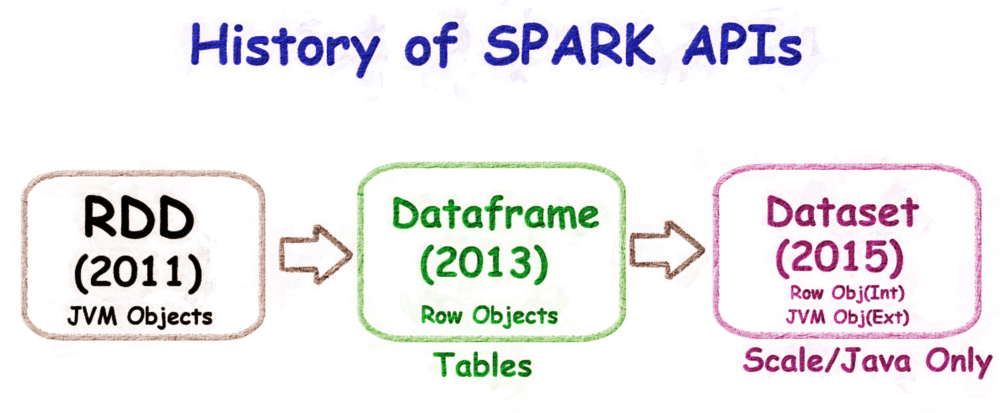
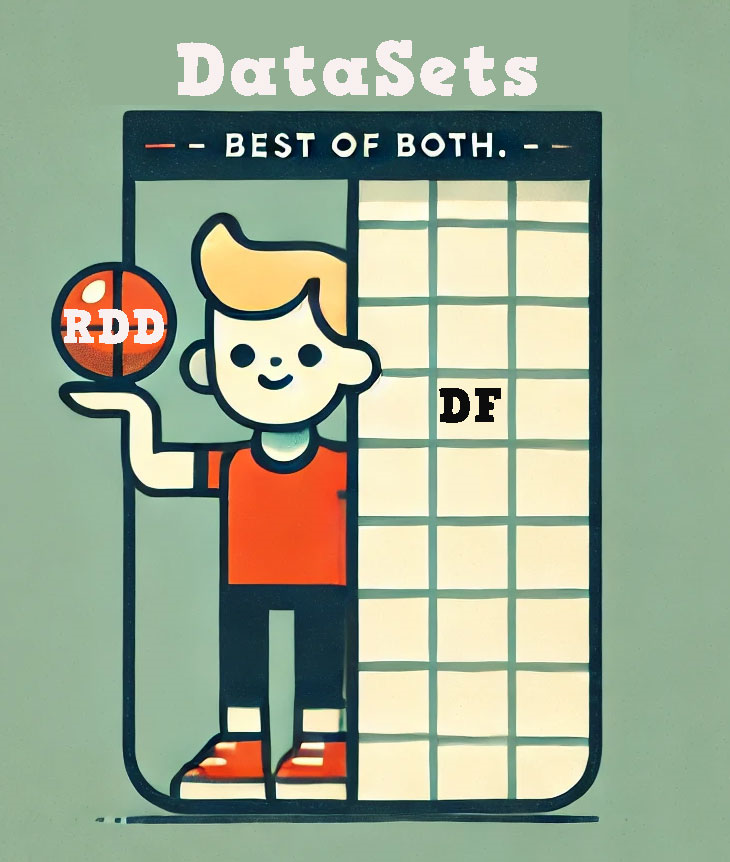

# Understanding RDDs, DataFrames, and Datasets in Apache Spark
Apache Spark provides three main ways to handle data: RDDs, DataFrames, and Datasets. Let's see what they are and why three?

## RDD (Resilient Distributed Dataset)

Imagine you have a Python list. Now, if we make this list capable of parallel processing, that’s an RDD. It’s just a collection of JVM objects that Spark can process in parallel. Most of the features that Spark boasts about, such as in-memory processing, lazy evaluation, partitioning for parallel processing, and fault tolerance, are all due to RDDs. They are the foundation of Spark's powerful capabilities.

### Features of RDDs
- Functional operations like `map`, `filter`, and `reduce`. But, no SQL-capability.
- This is like C programming. Godo for hard-code programmers who need find-grained control.
- However, **RDDs do not have type safety**. This means you might run into runtime errors if your data types are not consistent. Look at this example:

    ```python
    from pyspark import SparkContext

    # Initialize SparkContext
    sc = SparkContext("local", "RDD Example")

    # Create an RDD with mixed data types
    data = [1, 2, "three", 4]
    rdd = sc.parallelize(data)

    # This will cause a runtime error because 'three' cannot be squared
    rdd.foreach(lambda x: print(x ** 2))
    ```

    Here, trying to square the string "three" will cause a runtime error. This is a main problem of RDDs – they are not type safe.

- Also **RDDs are read-only**(Immutable). You can't change them:

    ```python
    # Create an RDD
    data = [1, 2, 3, 4, 5]
    rdd = sc.parallelize(data)
    rdd[0] = 10  # This will cause an error

    # See, how dataframe doesn't have this issue
    # Create a DataFrame
    data = [(1,), (2,), (3,)]
    df = spark.createDataFrame(data, ["value"])

    # Modify the value 1 to 10
    df = df.withColumn("value", when(col("value") == 1, 10).otherwise(col("value")))
    ```

### Functions in RDDs

- **Transformations:** map(), filter(), reduceByKey(), groupByKey(), union(), intersection()
- **Actions:** count(), collect(), reduce(), take(n), foreach(), first()

## DataFrame

Now, let’s think about SQL programmers. They are used to working with tables. This is where DataFrames come in. A DataFrame is like a table with rows and columns.

**Advantages of DataFrames:**
- **Schema Support:** Dataframes are just like tables. They have schema, they have columns. Columns are of type, like int, string etc.
- **SQL Query engine:** You can run a SQL query using a DataFrame. When the query is run, it uses the Spark SQL engine. This engine does the query optimization and execution optimization for you. This is not possible with RDDs. When working with big data, this is a big deal. What if your query takes an eternity to complete? The Spark SQL engine ensures that your queries run efficiently and quickly.
- **Easy to use:** Using DataFrames is also very easy, especially if you are familiar with SQL, because you can run SQL queries directly on them. Plus, DataFrames can integrate easily with various data sources like Hive, Avro, Parquet, and JSON. This makes DataFrames not only powerful but also very flexible and user-friendly.

However, **DataFrames are not type safe**, similar to RDDs. This means type errors can still occur at runtime.

## Dataset



Datasets combine the best features of RDDs and DataFrames. They offer both type safety and optimized execution.

**Why Datasets?**
- **Type Safety:** Datasets provide compile-time type checking, reducing runtime errors.
- **Optimized Execution:** They use the same optimized execution engine as DataFrames, which means efficient processing and query optimization.
- **Functional and Relational Operations:** Datasets support both functional programming (like RDDs) and SQL operations (like DataFrames).
- **Ease of Use:** They combine the ease of use of DataFrames with the type safety of RDDs.

> Dataset is only for Java and Scale. No PySpark

## Evolution Summary

- **RDDs (2011):** Just a collection of JVM objects. Good for parallel processing and lets you use many functional APIs like map, filter, etc. However, they lacked type safety and could cause runtime errors.
- **DataFrames (2013):** Introduced SQL-like tables and the Spark SQL engine. Now, we have tables to work on with schemas. They are also faster than RDDs due to the optimized engine but still lack type safety.
- **Datasets (2015):** Combine type safety, optimized execution, and ease of use, offering the best of both RDDs and DataFrames.

## Conclusion

### RDD, Dfs, Ds conversion
- RDDs: toDF() and rdd() for conversion.
- DataFrames: rdd() for RDDs, as[] for Datasets.
- Datasets: toDF() for DataFrames, rdd() for RDDs.

### What to use?


If you use Pyspark, use Dataframe. If you use Scale use Dataset. Period. RDD? If you are a coding ninja working for a product company and spend your time living inside a compuer ram. Use RDD.