<details open markdown="block">
  <summary>
    Table of contents
  </summary>
  {: .text-delta }
1. TOC
{:toc}
</details>

  
# Working with Secret Scopes in Azure Databricks
## Introduction

Azure Databricks offers two secret scopes: Azure Key Vault-backed and Databricks-backed. This guide walks you through their creation, access in PySpark, and prerequisites such as Databricks CLI installation and understanding key vault-related roles. By the end, you'll possess all the fundamental knowledge required to use key vaults with Azure Databricks.

## Different Types of Secret Scopes

1. **Databricks-backed Secret Scope**: 
   This is a proprietary scope managed by Databricks. Secrets stored in this scope are encrypted and can be accessed only by users with the necessary permissions.

2. **Azure key-vault backed Secret Scope**: 
   If you create a secret scope in Databricks that references an Azure Key Vault, then the scope is Azure Key Vault-backed. The actual secrets are stored in Azure Key Vault, and Databricks retrieves them from there when needed.


## Create Databricks-backed Secret Scope

### Pre-requiesites
You may need to install databricks CLI if you don't have it installed already.
#### Install Databricks CLI

Databricks-backed secret scopes are created using the Databricks CLI and Secrets API. The #secrets/createScope UI in Databricks is reserved for Azure Key Vault-backed secret scopes. Thus, we'll employ the Databricks CLI for this task:

1. Ensure you have Python installed on your system.
2. Use pip, Python’s package manager, to install the CLI:
   ```bash
   pip install databricks-cli
   ```

#### Log into Databricks using the CLI

Once the CLI is installed, the next step is to log in to your Databricks workspace:

1. Open a terminal or command prompt and enter
   ```bash
   databricks configure --token
   ```

2. You will be asked to enter Host. Copy the databricks URI from the browser which will be of format, `https://<databricks-instance>#workspace`.
3. You'll be prompted for a Token. In the Databricks UI's top-right, go to User Settings > Developer Tab > 'Generate new token'. Set a name, validity days, and click 'Generate'. Copy the token and paste in the CLI.

    <span style="color:blue">Note:</span> The databricks Host and token is saved inside <span style="color:red">"C:\Users\user-name\databrickscfg"</span>

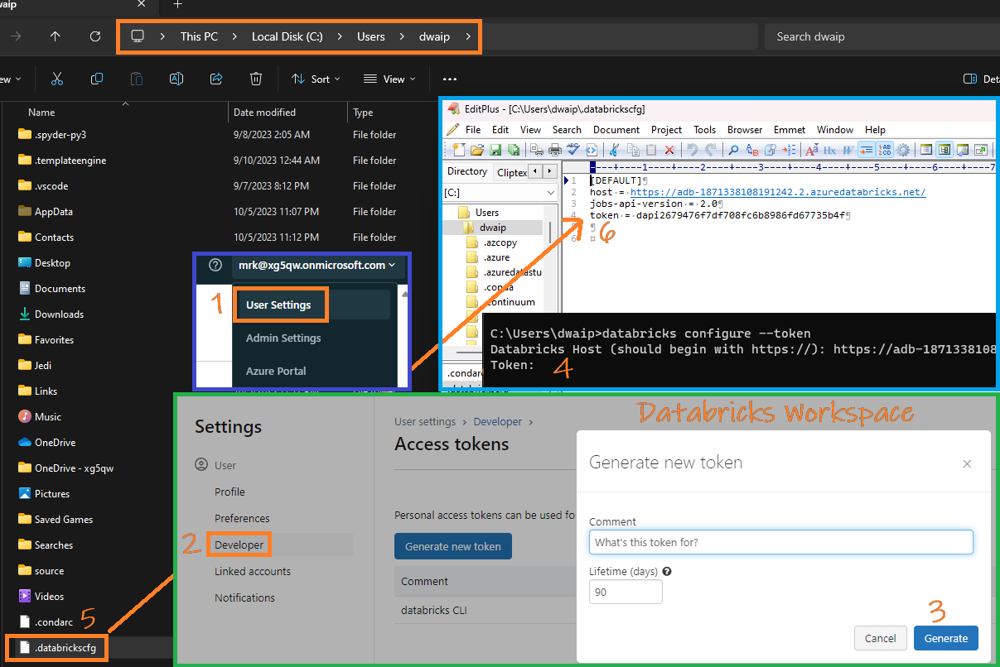

### Create secret scope

Suppose you want to create a secret scope with the following details:

- **Scope Name**: `my-scope`
- **Backend Type**: Databricks-managed (i.e., `DATABRICKS`)
- **Initial Manage Principal**: `users` (Means, all users. Must for non-premium acts)

With these details, the command will look like:

```bash
databricks secrets create-scope --scope myscope --scope-backend-type DATABRICKS --initial-manage-principal users
```
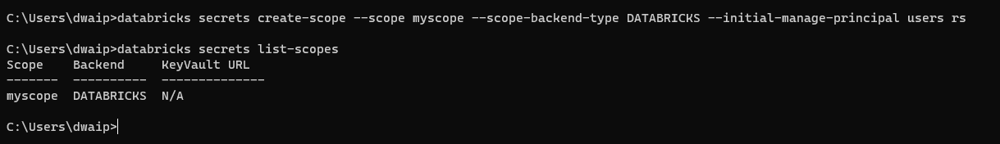

<span style="color:blue">**Note:**</span> 
<span style="color:black">In Databricks, when creating a secret scope, the default assigns `MANAGE` permission only to the creator. For non-Premium accounts, override this by granting `MANAGE` permission to all users using </span><span style="color:red">`--initial-manage-principal users`</span><span style="color:black"> during scope creation.</span>


## Create Azure-Key-Vault-Managed Secret Scope

1. **Create a Key Vault**: Set up a Key Vault in Azure using the standard way.

2. **Get Key Vault Details**: Go to the 'Properties' of your Key Vault and make a note of the 'Vault URI' and 'Resource ID'.

3. **Open Databricks Secret Scope UI**: 
   - Go to your Databricks URL.
   - Add `#secrets/createScope` right after `.net`. 'S' is caps. Here's how it should look:
     
     [https://databricks-instance.azuredatabricks.net#secrets/createScope](https://databricks-instance.azuredatabricks.net#secrets/createScope)
     
   This is a workaround, as there's no direct link in the UI to this page.

4. **Set Up the Secret Scope**:
   - Give it a name under 'Scope'.
   - Pick a 'Manage Principal'.
   - In the 'DNS Name' field, put the 'Vault URI' you copied earlier from Key Vault properties.
   - For 'Resource ID', use the 'Resource ID' you noted down, something like:

     `/subscriptions/someid/resourceGroups/resgropname/providers/Microsoft.KeyVault/vaults/keyvaultname`
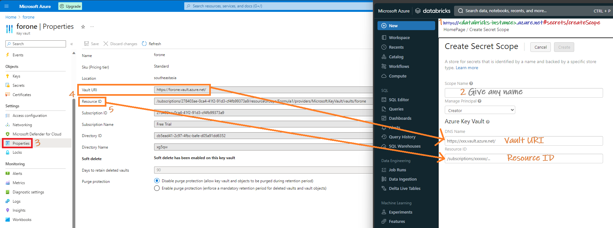
5. **Create the Secret Scope**: Click 'Create'. After you do, you'll get a confirmation. But keep in mind, once created, you can't see this scope in the Databricks UI. To check it, you'll have to use the `databricks secrets list-scopes` command in the Databricks CLI.

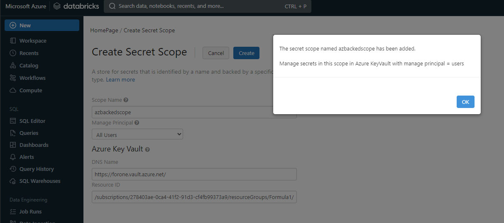

6. **Check the Secret Scope**: Keep in mind, once created, you can't see this scope in the Databricks UI. To check it, you'll have to use the `databricks secrets list-scopes` command in the Databricks CLI.
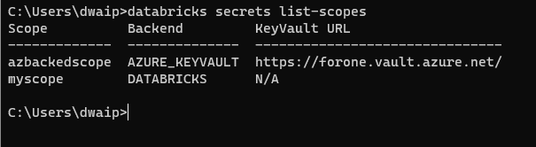

## Working with secret scopes
### Adding secrets to scope

Add secrets to Databricks scopes using dbrk CLI. For azure-key-vault-backed secrets, use the Azure portal. Ensure admin role on the azure keyvault, even if you created it. More details in the following sections.

**Add Secret to Databricks-backed scope**:

To add run the following command in databricks CLI

```bash
databricks secrets put --scope <scope-name> --key <key-name> --string-value <your-actual-secret-value>
```

If your secret is stored in a file, you can use the following instead:

```bash
databricks secrets put --scope <scope-name> --key <key-name> --binary-file <path-to-file>
```

**Add Secret to Azure-Key-Vault-backed scope**:

<span style="color:blue">**Note:**</span> 
<span style="color:black">To add secrets in Azure Key Vault, you must use the Azure SetSecret REST API or Azure portal UI. `Put` operation using databricks CLI will NOT work. </span><span>


### Listing Secrets from Scope

#### List Azure-Key-Vault-Backed scopes

To list Azure Key Vault-backed scopes, run `dbutils.secrets.list(scope='az-kv-backed-secret-scope-name')`, in Azure Databricks. 

**Remember:**

1. Databricks interacts with Azure Key Vault using the **AzureDatabricks** application identity, not the logged-in user's identity.
2. Grant required **role to AzureDatabricks app** in Azure Key Vault:
   - Open your Azure Key Vault.
   - Go to **Access control(IAM)**, **Role assignments**. Click **Add Icon**. Select **Add role assignment**.
  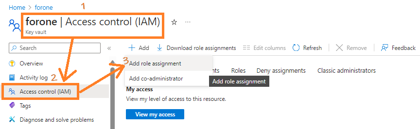
   - In the **Members tab**, select the desired role, e.g. **Key Vaults Secrets**.User, click next
  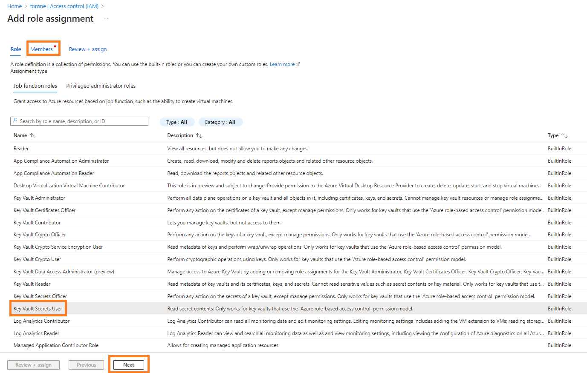
   - Now click on **Select members** and choose **AzureDatabricks**. Then click **Select**.
  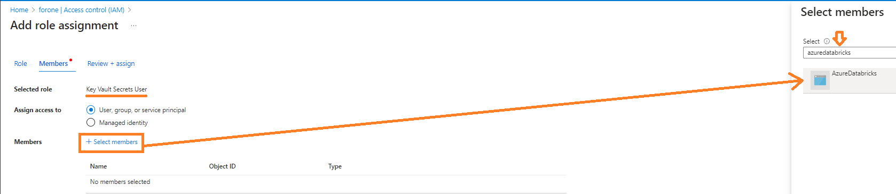
   - Finally click **Review + assign**
  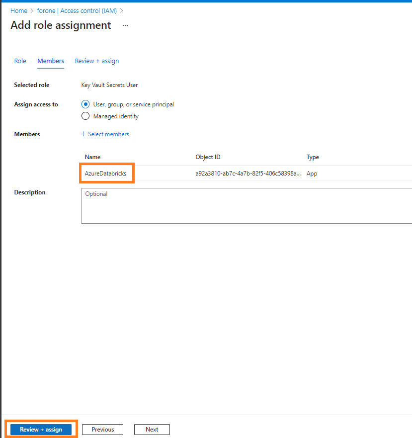
3. Finally you can run the list command in databricks without issues
   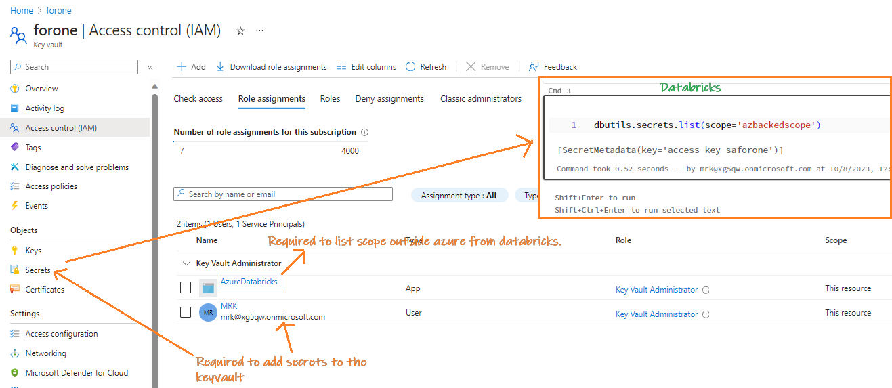


#### List Databricks-backed Secret scopes

To list Databricks-backed scopes, run `dbutils.secrets.list(scope='databricks-backed-scope-name')`, in Databricks. This is relatively simple operation and doesn't require additinal roles in Azure.

### Delete a Secret Scope

To delete a specific secret scope:

```bash
databricks secrets delete-scope --scope <scope-name>
```

Replace `<scope-name>` with the name of the secret scope you wish to delete.

**Caution**: Be certain about deleting a secret scope, as this action cannot be undone and any secrets within the scope will be permanently removed.

---

## Connecting ADLS to Databricks using OAuth2 with Service Principal Using Azure-backed Secret Scopes

### Quick check:
- Ensure you have an **Azure Key Vault** set up.
- The **Azure Key Vault** should be configured as the backend of the Databricks Azure-backed **Secret Scope** you've created.
- To execute **dbutils.secrets.get** an App callled **AzureDatabricks** should have role added to the Azure Keyvault
- Refer to **Common Error** section to see common errors for such operations

### Setting Up Secrets in Azure Key Vault:

1. **Using the steps below add 3 entries in Azure KeyVault**:
    - Navigate to the **Azure Key Vault** that's linked to the Databricks **Secret Scope** you created.
    - Under **Secrets**, click on the '+ Generate/Import' option.
    - Add the following three secret entries:
        1. **regappDirectoryID**: This is the **Directory (Tenant) ID** found under the 'Overview' section of your registered application in Azure.
        2. **regappClientID**: This is the **Application (Client) ID**, also found under the 'Overview' section of your registered app.
        3. **regappClientSecret**: Navigate to **Certificates and Secrets** in your registered app. Create a **New Client Secret** and use its value here.
    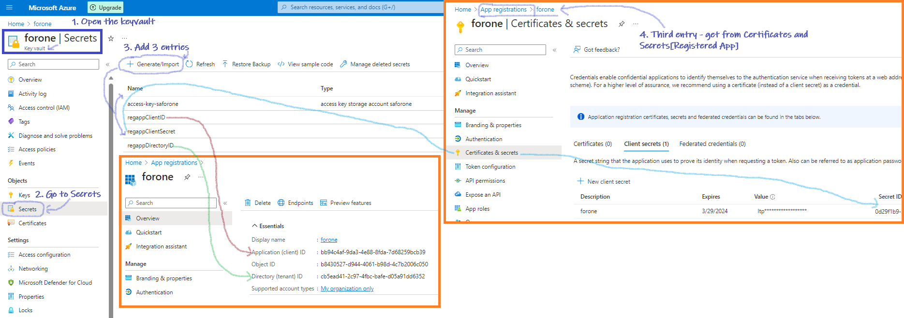
   
### Code for OAuth Authentication:
2. **Code for OAuth Authentication**:
    To access a file in ADLS, use the following code:

    ```python
    storage_account = "saforone"

    regappClientID = dbutils.secrets.get(scope="azbackedscope", key="regappClientID")
    regappDirectoryID = dbutils.secrets.get(scope="azbackedscope", key="regappDirectoryID")
    regappClientSecret = dbutils.secrets.get(scope="azbackedscope", key="regappClientSecret")

    # Set OAuth as the authentication type for the specified storage account.
    spark.conf.set(f"fs.azure.account.auth.type.{storage_account}.dfs.core.windows.net", "OAuth")

    # Define the token provider type for OAuth (client credentials flow).
    spark.conf.set(f"fs.azure.account.oauth.provider.type.{storage_account}.dfs.core.windows.net", "org.apache.hadoop.fs.azurebfs.oauth2.ClientCredsTokenProvider")

    # Provide the **Application (Client) ID** of the Azure AD registered application.
    spark.conf.set(f"fs.azure.account.oauth2.client.id.{storage_account}.dfs.core.windows.net", regappClientID)

    # Set the client secret of the registered application.
    spark.conf.set(f"fs.azure.account.oauth2.client.secret.{storage_account}.dfs.core.windows.net", regappClientSecret)

    # Specify the **OAuth 2.0 token endpoint**.
    spark.conf.set(f"fs.azure.account.oauth2.client.endpoint.{storage_account}.dfs.core.windows.net", f"https://login.microsoftonline.com/{regappDirectoryID}/oauth2/token")

    # For debugging: retrieve and print the client ID configuration.
    print(spark.conf.get(f"fs.azure.account.oauth2.client.id.{storage_account}.dfs.core.windows.net"))
    ```
---

### Common Errors And Resolutions

#### Key Vault Access Denied
When attempting to add keys to the key vault, one might encounter errors such as:

> The operation is not allowed by RBAC.
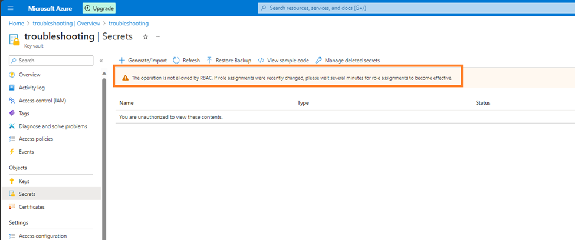

**Solution**: Assign a role like **Key Vault Administrator** to the logged-in user. This should allow the user to add or remove keys.
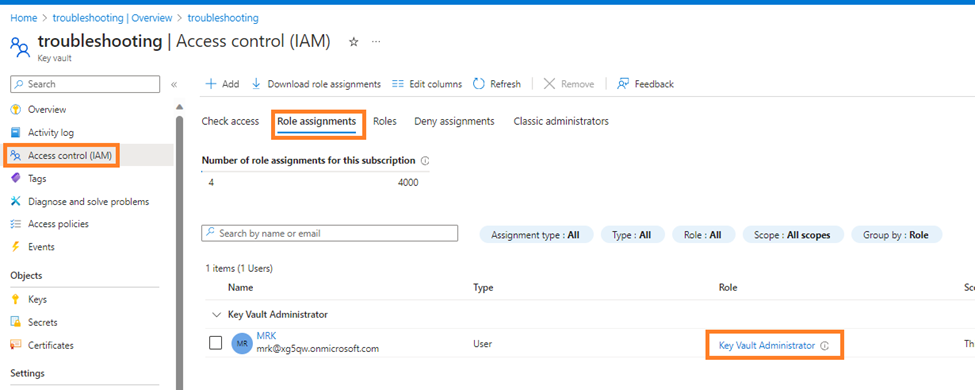

---

#### DeniedWithNoValidRBAC
After addressing the first issue, another challenge might arise. When trying to access keys from Databricks using commands like `dbutils.secrets.list(scope='foronescope')`, errors such as **DeniedWithNoValidRBAC** and **ForbiddenByRbac** might appear.
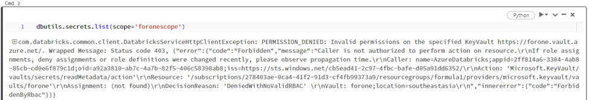

**Root Cause**: Insufficient permission for AzureDatabricks Identity. A hint lies in the error log:

> Caller: name=AzureDatabricks;appid=2ff814a6-3304-4ab8-85cb-cd0e6f879c1d

**Solution**: Recognize that it's the AzureDatabricks service's identity Azure evaluates, not our group identity. Ensure AzureDatabricks has the right permissions, especially the Admin role.

> **Reference**: A related issue can be found in [this GitHub discussion](#).
>
> Summary: 
> 1. For **AzureDatabricks**: Assign the Admin role.
> 2. Assign the **Key Vault Administrator** role to the logged-in user

---
---