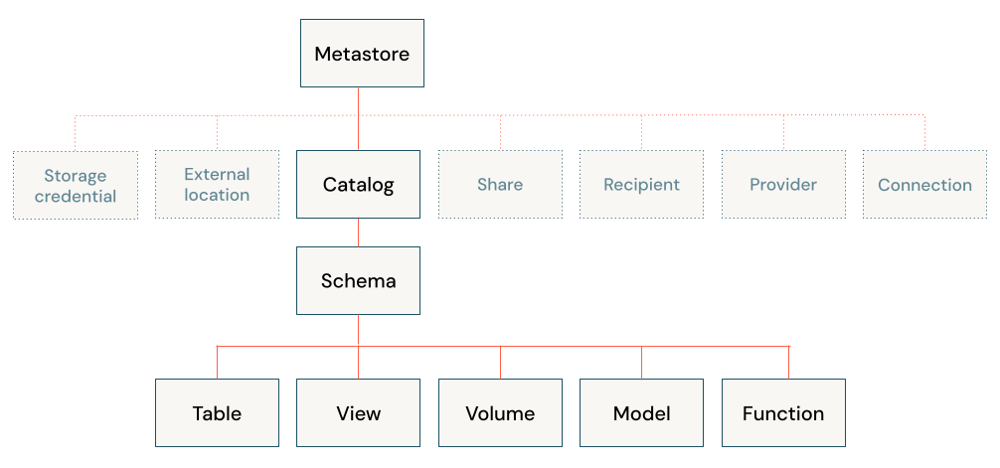

# Catalogs and Metastore

Catalogs, Metastore related concepts come into picture the moment you start something SQL in Spark. The moment you start to use Spark as a Database rather than just on-the-fly processor of data.

What is a metastore? Simply a store for metadata. When you store your Data in Spark itself, you store it as tables inside databases. This metastore is a way to keep that information. Whcih databas stores which table etc. And interstingly this metastore itself ia antoher database to store information about database. Database to store database info. haha!

By default, Spark uses 'Hive metatore' as a metastore technology. metastore_db is the Hive's database name which stores the metadata. When you hear Hive catalog, this is the catalog to further classify the data. Like different levels. Folder, subfolder, files.

By detault, when you use Spark to store data the data is stored in spark-warehouse folder. B

Databricks is actually spark. So initially they used to use Hive metastore to manage the info about tables and db.

## Hive Metastore in Databricks

## [[Unity Catalog Metastore in Databricks](https://learn.microsoft.com/en-us/azure/databricks/data-governance/unity-catalog/)]

Unity Catalog in Azure Databricks helps you manage your data by keeping all access control, tracking, and data discovery in one place. It makes it easier to control who can see and use your data, keeps track of data usage, and helps you find the data you need quickly.

**Key Features:**

1. **One-Time Setup for All:** Set up your data access rules once and they work everywhere.
2. **Easy Security:** Use familiar SQL commands to set who can see what.
3. **Automatic Tracking:** Keeps a log of who accessed the data and shows how the data is used.
4. **Find Data Easily:** Tag and search for your data easily.
5. **System Data Access:** Check audit logs and usage details.

**How It’s Organized:**

- **Metastore:** The main place where all data info and access rules are kept.
  - **One Per Region:** Usually set up automatically with a new workspace.
- **Hierarchy:**
  1. **Catalogs:** Big containers for your data, like folders.
  2. **Schemas:** Inside catalogs, like subfolders, holding tables and more.
  3. **Detailed Data:**
     - **Volumes:** Storage for unstructured data.
     - **Tables:** Data organized in rows and columns.
     - **Views:** Saved searches or queries on your tables.
     - **Functions:** Small bits of code that do calculations.
     - **Models:** AI models stored and managed.

This setup makes it simple to manage, secure, and find your data across all your Azure Databricks workspaces.

### [Query Hive Metastore from Unity Metastore](https://learn.microsoft.com/en-us/azure/databricks/data-governance/unity-catalog/hive-metastore)

Query the Hive metastore in Unity Catalog
The Unity Catalog metastore is additive, meaning it can be used with the per-workspace Hive metastore in Azure Databricks. The Hive metastore appears as a top-level catalog called hive_metastore in the three-level namespace.

For example, you can refer to a table called sales_raw in the sales schema in the legacy Hive metastore by using the following notation:

SQL
SQL

Copy
SELECT * from hive_metastore.sales.sales_raw;
Python
Python

Copy
display(spark.table("hive_metastore.sales.sales_raw"))