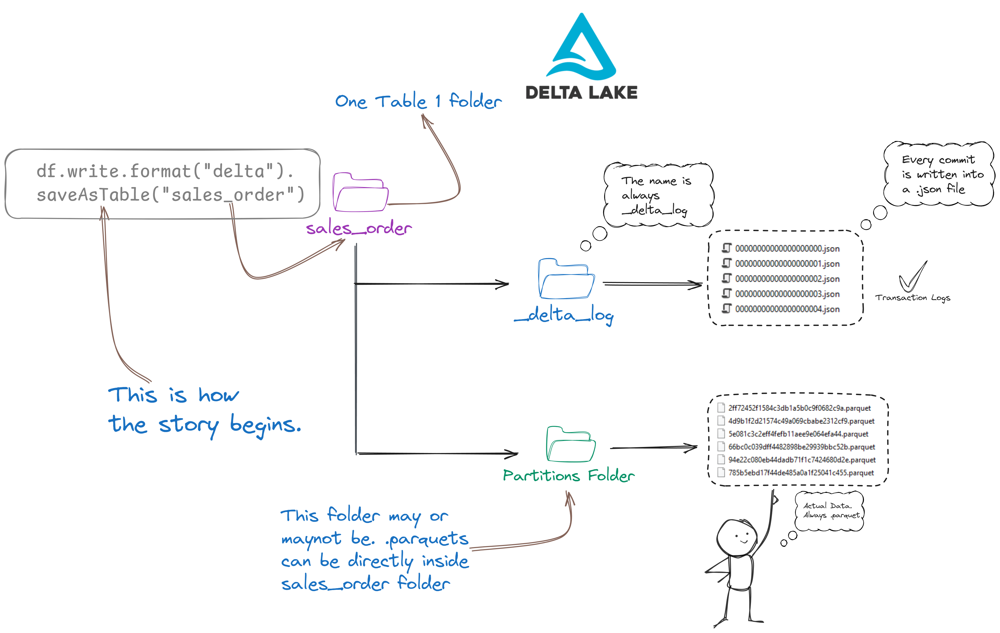

  

    Table of contents
  

  {: .text-delta }
1. TOC
{:toc}

# What is databricks?

Databricks is like repackaged Apache Spark with some extra goodies inside the box. You can’t use Databricks on its own—you always have to start it from within Azure, GCP, or AWS. When you use Databricks, it uses your Azure subscription and resources like Azure VMs, Azure Storage, network and secuirty, to set up a Spark environment in the background. So, everything runs on your Azure account. You don’t get a separate bill from Databricks; you just pay your regular Azure bill, and the money is split between Databricks and Microsoft.

>Fun fact. All Databricks Spark cluster is created inside Azure. Azure manages it using Azure Kubernetes Service.

Now, when I say Databricks is Spark with some extra features, here’s what I mean:

- **Databricks Runtime**: This is Spark, but it’s been made faster with some `Databricks engine oil`.
- **Databricks Workflows**: This is a special feature from Databricks that you won’t find in open-source Spark.
- **Databricks Workspace**: This is like the main dashboard, and it’s completely from Databricks.

Databricks is like a branded bottled water where the content, water, is open-source, but you still pay extra for the assurance and conveneince. Also, Databricks works like Uber—it uses Azure, GCP, etc.’s infrastructure and charges a fancy service fee.

If you don’t want Databricks and prefer to stick to open-source, you can have your own cluster (on-prem or on Azure VMs), use Azure HDInsight (a bit of management and extra features from Microsoft, but just Microsoft, no other party), or Google Dataproc (similar to Microsoft).

# Architecture of Azure Databricks Spark Cluster

There are drivers/masters and workers/slaves. So how does the Driver look like? Eh. The your spark notebook is the driver. It contains the main progreamms which make use of workers.

Driver
Worker
Jobs
Task
Slot

Every cluseter has **Only One Driver** JVM and multiple Executor JVMs

# 

# Databricks Architecture
- **Control Plane**: This is where all the management happens. It includes the Databricks web app, Unity Catalog, Cluster Manager, Workflow Manager, Jobs, Notebooks, etc. Think of it as the control center where you manage everything.

- **Data/Compute Plane**: This is where the actual work gets done. It has the clusters and the data. The Data Plane is where your data is processed, and where the machines that do the work are located.
  - **Serverless Compute Plane**: Here, everything is managed inside the Databricks account, even though the actual servers are in Azure, AWS, or GCP.
  - **Classic Compute Plane**: In this setup, the servers are mainly managed from your cloud account (like Azure, AWS, or GCP).

- **Personas**: This is the look and feel of your Databricks web UI. There are different personas like Data Science and Engineering, Analyst, and Practitioner, each giving you a different experience based on what you do.

## Databricks Clusters

- Databricks has two types of clusters: 
  - **All-purpose:** Mainly for interactive work. Like, you want to run cells and see what's happening. Many users can use an all-purpose cluster.
  - **Job:** When things don't need any interaction. To run jobs.

- And two modes of clusters
  - **Standard/Multi-Node:** THis is the default mode. 1 Driver + Multiple Worker Nodes.
  - **Single node:** 1-Drive. No Worker. Driver works as both driver and worker. For light work load.

- Runtime has three versions
  - **Standard:** Normal spark and normal stuff.
  - **Machine Learning:** Has some useful machine learning libraries installed
  - **Photon**: Has some speed for SQL

- And Access mode
  - **Single User**:  is always there
  - **Shared:** Many users can access the same nodes. Seprate environment for each user. One fails, doesn't affecct other.
  - **No Isolattioin shared:** Multiple users can access. But, enviornment is the same. One process fails, all users affected.

# Demystifying Lakehouse and Delta Lake

Many people get confused by terms like Lakehouse architecture, Data Warehouse, and Data Lake. But the concepts are easy to understand. We just have to oversimplify them a little bit to get the hang ot it:

- **Data Warehouse:** A very large SQL database.
- **Data Lake:** A cloud-based file system, like Amazon S3 or Google Drive.
- **Data Lakehouse/Lakehouse Architecture:** If you store data in a Data Lake in Delta format, it becomes a Data Lakehouse. "Lakehouse Architecture" is just a term for this approach.

# The special _delta_log folder

Spark knows a table is a Delta table if the `_delta_log` folder is present. This folder signals to Spark that the directory is a Delta table. If you try to write data in a different format to this directory, Spark will throw an error because it already recognizes it as a Delta table. Without the `_delta_log` folder, Spark will not treat the directory as a Delta table; it could be just a regular directory or another type of table.

