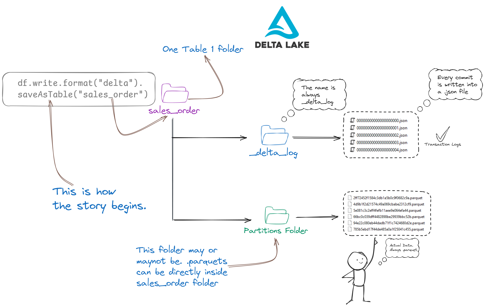

# Demystifying Lakehouse and Delta Lake

Many people get confused by terms like Lakehouse architecture, Data Warehouse, and Data Lake. But the concepts are easy to understand. We just have to oversimplify them a little bit to get the hang ot it:

- **Data Warehouse:** A very large SQL database.
- **Data Lake:** A cloud-based file system, like Amazon S3 or Google Drive.
- **Data Lakehouse/Lakehouse Architecture:** If you store data in a Data Lake in Delta format, it becomes a Data Lakehouse. "Lakehouse Architecture" is just a term for this approach.

# The special _delta_log folder

Spark knows a table is a Delta table if the `_delta_log` folder is present. This folder signals to Spark that the directory is a Delta table. If you try to write data in a different format to this directory, Spark will throw an error because it already recognizes it as a Delta table. Without the `_delta_log` folder, Spark will not treat the directory as a Delta table; it could be just a regular directory or another type of table.

[Delta Lake cheatsheet pdf](Files/Delta_Lake_Cheatsheet.pdf)