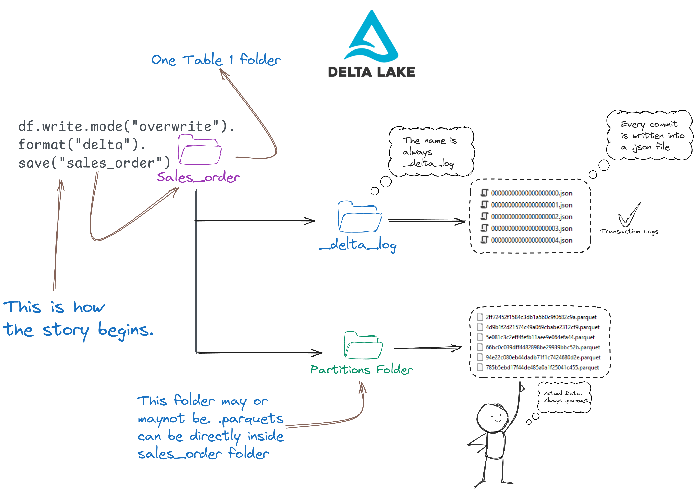

# Demystifying Lakehouse and Delta Lake

People new to this often get confused with heavy terms like Lakehouse architecture, Data Warehouse, Data Lakes Data Lakehouse. But, the concept is very simple to understand:

Data warehouse: It's simply a large SQL database. Very very large.
Data Lake: It's just a file system on the cloud. There are many brands offerieng this. Like Amazon S3. ADLS etc. Even you can treat your Google Drive as a Data Lake.

Data Lakehouse/Lakehouse architecture: This is where things get confusing. To make it simple. Just remember, if you store your data in Data Lake in Delta format it becomes Data Lakehouse. "Lakehouse Archiecture" is just a heavy term for this approach.

