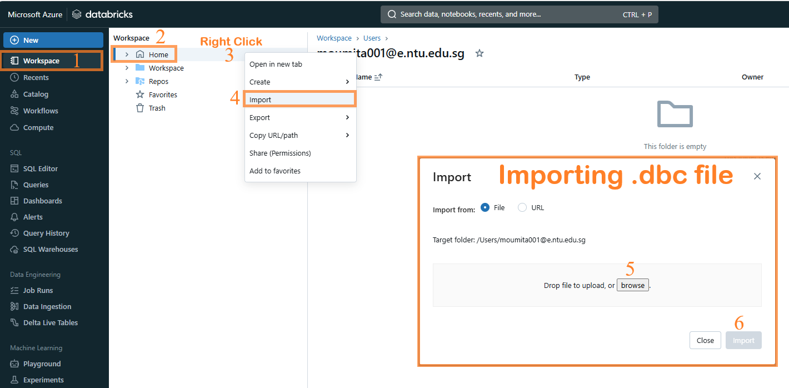
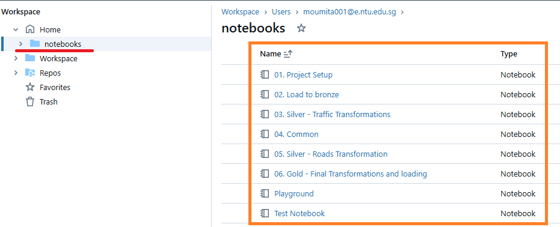

## End to end Project using Databricks and Unity Catalog

### Concepts Covered:
We will use Delta Lake format as this is the format recommended for real-time projects.
For access control we will use Unity Catalog
We will use Spark structured streaming to see how 
We will use batch processing mode
We will use CI/CD using Azure Devops

### Drawbacks of ADLS

ADLS **!=** Database

Relational database is acidic. They store quality data. This quality is can't be guarantted in ADLS

Delta lake makes a lakehouse.

### Importing project(.dbc) file

It will import all the notebooks and your import will look like this:

