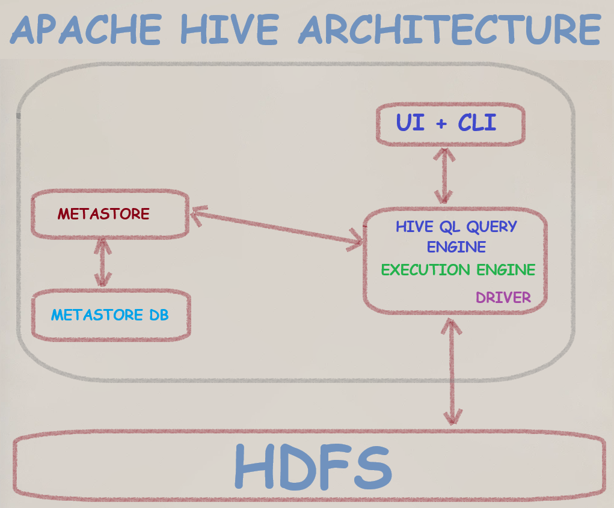

<details open markdown="block">
  <summary>
    Table of contents
  </summary>
  {: .text-delta }
TOC
{:toc}
</details>

# Overview

## What is Spark?

Its mainly a processing engine more like Mapreduce v2. It has no internal storage sytem like HDFS, but uses external file system lie ADLS, HDFS, S3 etc. Its processing engine is called Spark Core. It has standalone resource manager by default to manage its clusters.

## What is Apache Hive?

**Apache Hive** is a database  like MSSQL Server. Its actually a data warehouse. It stores data in Hadoop File system(HDFS) as tables. Hive's query language is called **HiveQL**, similar to SQL. he **Hive metastore** stores information about Hive tables. Developed by Facebook, Hive later became an Apache project.



## What is Hadoop?

Hadoop is a distributed file system and processing framework similar to an MSSQL cluster but designed for handling large-scale file systems and big data. Here are its main components:

- **Hadoop Distributed File System (HDFS)**: The file system for big data, akin to NTFS or FAT in traditional systems.
- **MapReduce**: The older generation of big data processing, similar to Spark.
- **YARN (Yet Another Resource Negotiator)**: The cluster manager.
- **Hadoop Common**: The set of shared libraries and utilities.

## Is Spark replacing MapReduce?

Yes, Spark is like the next version of MapReduce.

## Is branded Spark (Synapse/Databricks) replacing traditional Spark, Hadoop, and Hive?

Imagine your company is new to data engineering and needs to process a lot of data. How long will it take to set up with Azure compared to using free open-source products on bare metal?

With Azure, you just sign up and create the setup with a few clicks. If the company has the budget, the entire setup takes about an hour. On the other hand, using traditional Spark, Hive, and Hadoop, setting up servers, networks, installation, configuration, and connectivity can become a year-long project.

That’s the difference between open-source and paid services. Open-source is free but risky. Paid services cost money but are easy, fast, accountable, and well-maintained.

## Never heard of Hive. We use only Spark and Synapse Analytics.

If you always use branded products like Synapse and Databricks, you might not use Hive much. However, Hive catalogs are still used in Databricks. Just run a command like `DESCRIBE EXTENDED TableName`, and you'll see where Hive is involved. But you don't have to worry about the setup.

# Spark Database, Tables, Warehouse, Metastore & Catalogs

- A Spark Database is just a folder named **databasename.db** inside the **spark-warehouse** folder.
- A Managed/Internal/Spark-Metastore table is a subfolder within the **databasename.db** folder. Partitions are also stored as subfolders.
- The location of the warehouse folder is set by the **spark.sql.warehouse.dir** setting.
- If **spark.sql.warehouse.dir** is not set, Spark uses a default directory, usually a **spark-warehouse** folder in the current working directory of the application.
- You can find out the warehouse directory by running the command `SET spark.sql.warehouse.dir` in the spark-sql prompt.

    


- You can set the warehouse directory in your session with `.config("spark.sql.warehouse.dir", "/path/to/your/warehouse")`.


## SPARK Managed Tables (AKA Internal / Spark-Metastore Tables) Using Spark-SQL Shell

When you create tables in the spark-sql shell using commands like the one below, Spark will create a managed table. The table data will be stored in the `spark-warehouse` folder, and the Derby database (`metastore_db` folder) will contain its metadata.

```sql
CREATE TABLE Hollywood (name STRING);
```

The table will be permanent, meaning you can query it even after restarting Spark. Here is an example output of `DESCRIBE EXTENDED Hollywood` in the spark-sql shell:


- **Catalog**: `spark_catalog` - Spark uses its own internal catalog to manage metadata.
- **Database**: `default` - The default database provided by Spark.
- **Type**: `MANAGED` - Indicates that Spark manages the table's lifecycle.
- **Provider**: `hive` - Refers to Spark's capability to handle Hive-compatible metadata.
- **Serde Library**: `org.apache.hadoop.hive.serde2.lazy.LazySimpleSerDe` - Serialization and deserialization library.
- **InputFormat**: `org.apache.hadoop.mapred.TextInputFormat` - Input format for reading the table data.
- **OutputFormat**: `org.apache.hadoop.hive.ql.io.HiveIgnoreKeyTextOutputFormat` - Output format for writing the table data.
- **Location**: `file:/home/dwdas/spark-warehouse/hollywood` - File path where the table data is stored.
- **Partition Provider**: `Catalog` - Indicates that the catalog manages partitions.

### Key Takeaways:

- **Built-in Catalog**: Even without a standalone Hive installation, Spark provides managed table functionality by leveraging its built-in catalog and Hive-compatible features.
- **SQL-like Operations**: You can use SQL-like operations to manage tables within Spark.
- **Embedded Deployment Mode**: By default, Spark SQL uses an embedded deployment mode of a Hive metastore with an Apache Derby database.
- **Production Use**: The default embedded deployment mode is not recommended for production use due to the limitation of only one active SparkSession at a time.


<p style="color: navy; font-family: 'Trebuchet MS', Helvetica, sans-serif; background-color: #f8f8f8; padding: 15px; border-left: 5px solid grey; border-radius: 10px; box-shadow: 2px 2px 10px grey;">
<strong>Remember:</strong><br>
This Derby-mini-Hive method that Spark uses to manage internal tables has a limitation: only one active session is allowed at a time. Attempting multiple `spark-sql` sessions will result in a Derby database exception.
</p>


Would you take this to production?

## Metastore in Spark

The metastore in Spark stores metadata about tables, like their names and the locations of their files (e.g., Parquet files). In Spark, the metastore is typically configured in one of two common ways, but there are also more advanced options available.

1. **Standalone Hive Metastore:** You can install and configure a standalone Hive metastore server. This server would manage the metadata independently and communicate with your Spark application.

2. **Embedded Hive Metastore with Derby**

Spark includes a built-in metastore that uses an embedded Apache Derby database. This database starts in the application's working directory and stores data in the `metastore_db` folder. It's a convenient, pseudo-metastore suitable for small applications or datasets. To use this, simply enable Hive support in your Spark session with `enableHiveSupport()`:

```python
from pyspark.sql import SparkSession

spark = SparkSession.builder \
    .appName("EmbeddedMetastoreExample") \
    .enableHiveSupport() \
    .getOrCreate()
```


<p style="color: navy; font-family: 'Trebuchet MS', Helvetica, sans-serif; background-color: #f8f8f8; padding: 15px; border-left: 5px solid grey; border-radius: 10px; box-shadow: 2px 2px 10px grey;">
<strong>Again:</strong><br>
By default, Hive uses an embedded Apache Derby database to store its metadata. While this is a convenient option for initial setup, it has limitations. Notably, Derby can only support one active user at a time. This makes it unsuitable for scenarios requiring multiple concurrent Hive sessions. So, the solution is to use a standard database like MySQL/Postgrees or MSSQL as the metastore DB. And, let the poor derby take  some rest.
</p>

## Catalog types in Spark

1. In-Memory Catalog: Default catalog. Stores data memory. Everything vanishes when session is closed. For some quick queries etc.

2. Hive Catalog: A mini-version comes shipped with Spark. You need to enable hive support to use it. Data is stoerd permanently. Can have a full-fledged hivve as well.

3. JDBC Catalog: When you want a full-database like MSSQL to store the catalog information. Can be like Hive+MSSQL.

4. Custom Catalogs: Custom catalogs can be implemented using ExtendedCatalogInterface. AWS glue, Synapese databricks.

5. Delta Lake Catalog: When using Delta Lake, it provides its own catalog implementation.

## What happens when you enter `spark-sql` on a freshly installed Spark server?

Imagine you have a fresh standalone Spark server. You log into the server through the terminal, and your current directory is `/home/dwdas`. The moment you enter the `spark-sql` command, Spark starts an embedded Derby database and creates a `metastore_db` folder in your current directory. This folder serves as the root of the Derby database. Essentially, Spark "boots a Derby instance on `metastore_db`".

By default, a fresh Spark setup uses its in-house Derby database as a 'metastore' to store the names and file locations of the Spark tables you create. This is Spark's basic way to manage its tables. Though you can upgrade it and use an external metastore and other advanced features.


> 


<p style="color: navy; font-family: 'Trebuchet MS', Helvetica, sans-serif; background-color: #f8f8f8; padding: 15px; border-left: 5px solid grey; border-radius: 10px; box-shadow: 2px 2px 10px grey;">
<strong>Remember:</strong><br>
Your current directory is crucial because everything is created inside it. This often confuses new learners who forget this, making it hard to find their tables later.<br>
</p>


<p style="color: navy; font-family: 'Trebuchet MS', Helvetica, sans-serif; background-color: #f8f8f8; padding: 15px; border-left: 5px solid grey; border-radius: 10px; box-shadow: 2px 2px 10px grey;">
<strong>Remember:</strong><br>
<span style="color: darkgreen;">Spark SQL does not use a Hive metastore under the cover. By default, it uses in-memory catalogs if Hive support is not enabled.</span><br>
<span style="color: darkred;">Spark-shell: By default, uses in-memory catalogs unless configured to use Hive metastore.</span><br>
<span style="color: darkblue;">Set <code>spark.sql.catalogImplementation</code> to <code>hive</code> or <code>in-memory</code> to control this.</span><br>
</p>


## What Happens When You Create a Table in Spark-SQL?

Let's open the spark-sql and enter this simple command:

```sql
CREATE TABLE movies (title STRING, genre STRING);
INSERT INTO movies VALUES ('Inception', 'Sci-Fi');
```

You will see logs like these:

```plaintext
24/06/20 07:44:39 WARN ResolveSessionCatalog: A Hive serde table will be created as there is no table provider specified. You can set spark.sql.legacy.createHiveTableByDefault to false so that native data source table will be created instead.
```


**Explanation**:
- When you execute a `CREATE TABLE` statement without specifying a table provider, Spark’s session catalog defaults to creating a Hive SerDe table. The session catalog interprets and resolves SQL commands.

- **Note**: To create a native Spark SQL table, set `spark.sql.legacy.createHiveTableByDefault` to `false`.

  - In `spark-defaults.conf`:

    ```properties
    spark.sql.legacy.createHiveTableByDefault=false
    ```

  - In Spark SQL shell:

    ```sh
    spark-sql --conf spark.sql.legacy.createHiveTableByDefault=false
    ```

  - In PySpark session:

    ```python
    from pyspark.sql import SparkSession

    spark = SparkSession.builder \
        .appName("example") \
        .config("spark.sql.legacy.createHiveTableByDefault", "false") \
        .enableHiveSupport() \
        .getOrCreate()
    ```

You might also see a warning like this:

```plaintext
24/06/20 07:44:40 WARN HiveMetaStore: Location: file:/home/dwdas/spark-warehouse/movies specified for non-external table: movies
```

**Explanation**: This indicates the default storage location for non-external tables is `spark-warehouse`.

**Note**: Change the default location by setting `spark.sql.warehouse.dir`.
To change the warehouse directory:

- In `spark-defaults.conf`:

    ```properties
    spark.sql.warehouse.dir=/your/custom/path
    ```

- In Spark SQL shell:

    ```sh
    spark-sql --conf spark.sql.warehouse.dir=/your/custom/path
    ```

- In PySpark session:

    ```python
    from pyspark.sql import SparkSession

    spark = SparkSession.builder \
        .appName("example") \
        .config("spark.sql.warehouse.dir", "/your/custom/path") \
        .getOrCreate()
    ```
### Key Takeaway

   When you run `spark-sql` with default settings, it will start a Derby database and create a `metastore_db` folder inside your current directory. So, be mindful of your current directory.

If you create a table in a PySpark session, Spark will create both a `metastore_db` and a `spark-warehouse` folder.

## Spark RDDs
## Spark In-memory computing

When we talk about in-memory its not just conventioal caching. Its actually storing data in RAM, processing in RAM etc. So, spark uses it and thats why its faster than mapreduce.

# Spark Architecture
## Spark Components
**Spark Core:** The main part of Spark with a core engine.

**Spark SQL:** A SQL engine, but different from traditional databases. Here, data is processed mainly using DataFrames.

**Spark Streaming:** This part allows Spark to process real-time data.

**Spark MLlib:** A collection of machine learning libraries.

**GraphX:** Used for graphs in reports, such as data collected from networks like Facebook.

**RDDs:** Spark Core has RDDs (Resilient Distributed Datasets), which are the building blocks of Spark.

## Cluster & Nodes
Nodes are individual machines (physical or virtual). Cluster is a group of nodes.
## Driver & Worker
### Driver
- Machine where Main() method runs. It contains the SparkContext object.
- Converts the application into stages using a DAG (Directed Acyclic Graph).
- Schedules tasks on worker nodes and collects the results.
- Should be close to worker nodes for better performance.
### Workers(now Executors)

Workers are simply machines(Virtual/Real). These workers run JVM processes, called Executors. Multiple JVM Process(Executor) can be configured in a worker.

  **Configuration:** In your spark configuration you can set:

  - `--num-executors`: Specifies the total number of executors to be launched for the application.
  - `--executor-cores`: Specifies the number of cores (slots) to be used by each executor.
  - `--executor-memory`: Specifies the amount of memory to be allocated to each executor.

  **Example:** With a worker machine having 16 CPU cores and 64 GB of memory, you can configure Spark to run either 4 executors (4 cores, 16 GB each) or 2 executors (8 cores, 32 GB each).

  <p style="color: #003366; font-family: 'Trebuchet MS', Helvetica, sans-serif; background-color: #f0f8ff; padding: 15px; border-left: 5px solid #6699cc; border-radius: 10px; box-shadow: 2px 2px 10px #6699cc;">
  <strong>Note: </strong>Executor is a JVM process running on a worker node that executes tasks. The Spark cluster manager (e.g., YARN, Mesos, or the standalone cluster manager) is responsible for allocating resources to executors.
  </p>

## Databricks "slots" = Spark "cores" = Threads

[**Cores in Spark = Slots in Databricks = Total threads.**](https://files.training.databricks.com/courses/ilt/Spark-ILT/Spark-ILT-5.1.1/amazon/instructor-notes/Spark%20Architecture.html#:~:text=The%20term%20%22core%22%20is%20unfortunate,these%20threads%2C%20to%20avoid%20confusion.)

<p style="color: #003366; font-family: 'Trebuchet MS', Helvetica, sans-serif; background-color: #f0f8ff; padding: 15px; border-left: 5px solid #6699cc; border-radius: 10px; box-shadow: 2px 2px 10px #6699cc;">
<strong>Note: </strong>Don't confuse cores with Intel/AMD CPU Ads. Cores in Spark means threads.
</p>

In Docker Compose, `SPARK_WORKER_CORES` sets worker threads (cores/slots). A cluster with 3 workers, each set to 2 cores, has 6 total threads.


### Calculate no of executors for a 100 GB Data

How to determine the number of executors to assign for a 10GB file in HDFS

1. **Calculate the number of partitions**:
   - Default partition size is 128 MB.
   - 10 GB / 128 MB = 10 * 1024 MB / 128 MB = 80 partitions.
   
2. **Determine the number of CPU cores needed for maximum parallelism**:
   - Each partition can be processed by one core.
   - Therefore, you need 80 cores for maximum parallelism.

3. **Find the maximum allowed CPU cores per executor**:
   - You can use 5 cores per executor in YARN.

4. **Calculate the number of executors**:
   - Total cores needed: 80
   - Cores per executor: 5
   - Number of executors = Total cores / Cores per executor = 80 / 5 = 16

### Calculate cores and memory for executor

To determine the cores and memory required for each executor, follow these steps:

1. **Partition size**: The default partition size is 128 MB.

2. **Minimum memory per core**: Assign a minimum of 4x memory for each core.
   - 128 MB * 4 = 512 MB

3. **Executor cores**: 5 CPU cores per executor (if using YARN).

4. **Executor memory**: Multiply the memory per core by the number of cores per executor.
   - 512 MB * 5 cores = 2560 MB

So, each executor requires:

- **Cores**: 5 CPU cores
- **Memory**: 2560 MB

## Application, Jobs, Stages, Tasks
- **Application**: The full python code. Contains multiple jobs.
- **Jobs**: Job can have multiple stages
- **Stages**: Each stage has many tasks.
- **Tasks**: Each task processes a single partition of data. It is a block of data + Some transformation.

### Application
- **Definition:** An application in Spark is a complete program that runs on the Spark cluster. This program includes the user's code that uses Spark’s API to perform data processing.
- **Example:** A Spark application can be a Python script that processes data from a CSV file, performs transformations, and writes the results to a database.

### Job
- **Definition:** A job is triggered by an action (e.g., `count()`, `collect()`, `saveAsTextFile()`) in a Spark application. Each action in the code triggers a new job.
- **Example:** If your application has two actions, like counting the number of rows and saving the result to a file, it will trigger two jobs.

### Stages
- **Definition:** A job is divided into stages, where each stage is a set of tasks that can be executed in parallel. Stages are separated by shuffle operations.
- **Example:** If a job involves filtering and then aggregating data, the filtering might be one stage, and the aggregation another, especially if a shuffle operation (like a group by) is required between them.

### Tasks
- **Definition:** A stage is further divided into tasks, where each task is a unit of work that operates on a partition of the data. Tasks are the smallest unit of execution in Spark.
- **Example:** If a stage needs to process 100 partitions of data, it will have 100 tasks, with each task processing one partition.

### Let's put it all together
Let's see an example to understand these concepts:

1. **Application:** A Spark application that reads data from a CSV file, filters out certain rows, and then calculates the average of a column.
   - Code snippet:
     ```python
     df1 = spark.read.csv("data.csv") //Job1
     df2 = df.filter(df["value"] > 10) //Job2
     average = df2.agg({"value": "avg"}).collect()
     ```

2. **Jobs:**
   - Job 1: Triggered by the action `spark.read.csv()`. This job reads the data from the CSV file.
   - Job 2: Triggered by the action `filtered_df.agg().collect()`. This job includes filtering the data and then calculating the average.

3. **Stages in Job 2:**
   - **Stage 1:** Filtering the data. All tasks in this stage can run in parallel because filtering is a transformation that operates on individual partitions.
   - **Stage 2:** Aggregating the data. This stage requires a shuffle because the aggregation (calculating the average) involves data from all partitions.

4. **Tasks:**
For each stage, Spark creates tasks based on the number of partitions. If there are 10 partitions, Stage 1 (filtering) will have 10 tasks, and Stage 2 (aggregation) will also have 10 tasks, each processing one partition of data.

## Transformation & Actions

In PySpark, operations on data can be classified into two types: **transformations** and **actions**.

### Transformations

Transformations are operations on RDDs that return a new RDD, meaning they create a new dataset from an existing one. **Transformations are lazy**, meaning they are computed only when an action is called.

(e.g., `map`, `filter`): Create a new RDD from an existing one. **They are lazy** and not executed until an action is called.

### Actions

Actions trigger the execution of the transformations to return a result to the driver program or write it to storage. When an action is called, Spark's execution engine computes the result of the transformations.

(e.g., `collect`, `count`): Trigger the execution of the transformations and return a result.

### Example 

```python
# Create an RDD from a list
data = [1, 2, 3, 4, 5]
rdd = spark.sparkContext.parallelize(data)

# Transformation 1: Multiply each number by 2
rdd_transformed = rdd.map(lambda x: x * 2)

# Transformation 2: Filter out even numbers
rdd_filtered = rdd_transformed.filter(lambda x: x % 2 == 0)

# Action: Collect the results
result = rdd_filtered.collect()
```

| **Transformation** | **Example API**                            | **Description**                                     |
|--------------------|--------------------------------------------|-----------------------------------------------------|
| `map`              | `rdd.map(lambda x: x * 2)`                 | Applies a function to each element in the RDD.      |
| `filter`           | `rdd.filter(lambda x: x % 2 == 0)`         | Returns a new RDD containing only elements that satisfy a predicate. |
| `flatMap`          | `rdd.flatMap(lambda x: (x, x * 2))`        | Similar to `map`, but each input item can be mapped to 0 or more output items (returns a flattened structure). |
| `mapPartitions`    | `rdd.mapPartitions(lambda iter: [sum(iter)])` | Applies a function to each partition of the RDD.    |
| `distinct`         | `rdd.distinct()`                           | Returns a new RDD containing the distinct elements. |
| `union`            | `rdd1.union(rdd2)`                         | Returns a new RDD containing the union of elements. |
| `intersection`     | `rdd1.intersection(rdd2)`                  | Returns a new RDD containing the intersection of elements. |
| `groupByKey`       | `rdd.groupByKey()`                         | Groups the values for each key in the RDD.          |
| `reduceByKey`      | `rdd.reduceByKey(lambda a, b: a + b)`      | Merges the values for each key using an associative function. |
| `sortBy`           | `rdd.sortBy(lambda x: x)`                  | Returns a new RDD sorted by the specified function. |

| **Action**         | **Example API**                            | **Description**                                     |
|--------------------|--------------------------------------------|-----------------------------------------------------|
| `collect`          | `rdd.collect()`                            | Returns all the elements of the RDD as a list.      |
| `count`            | `rdd.count()`                              | Returns the number of elements in the RDD.          |
| `first`            | `rdd.first()`                              | Returns the first element of the RDD.               |
| `take`             | `rdd.take(5)`                              | Returns the first `n` elements of the RDD.          |
| `reduce`           | `rdd.reduce(lambda a, b: a + b)`           | Aggregates the elements of the RDD using a function.|
| `saveAsTextFile`   | `rdd.saveAsTextFile("path")`               | Saves the RDD to a text file.                       |
| `countByKey`       | `rdd.countByKey()`                         | Returns the count of each key in the RDD.           |
| `foreach`          | `rdd.foreach(lambda x: print(x))`          | Applies a function to each element of the RDD.      |

# Q & A

**Which of the following statements about the Spark driver is incorrect?**

A. The Spark driver is the node in which the Spark application's main method runs to coordinate the Spark application.  
B. The Spark driver is horizontally scaled to increase overall processing throughput.  
C. The Spark driver contains the SparkContext object.  
D. The Spark driver is responsible for scheduling the execution of data by various worker nodes in cluster mode.  
E. The Spark driver should be as close as possible to worker nodes for optimal performance.  

**Answer: B. The Spark driver is horizontally scaled to increase overall processing throughput.**

**Explanation:**
- **A** is correct because the Spark driver indeed runs the application's main method and coordinates the application.
- **B** is incorrect because the Spark driver is a single entity and is not horizontally scalable. The driver manages and coordinates tasks but does not scale horizontally to increase throughput.
- **C** is correct because the Spark driver contains the SparkContext object, which is the entry point for Spark functionality.
- **D** is correct because the Spark driver schedules the execution of tasks on worker nodes.
- **E** is correct because the driver should be close to the worker nodes to minimize latency and improve performance.

**Which of the following describes nodes in cluster-mode Spark?**

A. Nodes are the most granular level of execution in the Spark execution hierarchy.  
B. There is only one node and it hosts both the driver and executors.  
C. Nodes are another term for executors, so they are processing engine instances for performing computations.  
D. There are driver nodes and worker nodes, both of which can scale horizontally.  
E. Worker nodes are machines that host the executors responsible for the execution of tasks.  

**Answer: E. Worker nodes are machines that host the executors responsible for the execution of tasks.**

**Explanation:**
- **A** is incorrect because tasks, not nodes, are the most granular level of execution.
- **B** is incorrect because in a cluster mode, there are multiple nodes, including separate driver and worker nodes.
- **C** is incorrect because nodes and executors are not the same; nodes host executors.
- **D** is incorrect because typically, only worker nodes scale horizontally, not driver nodes.
- **E** is correct because worker nodes are indeed machines that host executors, which execute the tasks assigned by the driver.

**Which of the following statements about slots is true?**
A. There must be more slots than executors.  
B. There must be more tasks than slots.  
C. Slots are the most granular level of execution in the Spark execution hierarchy.  
D. Slots are not used in cluster mode.  
E. Slots are resources for parallelization within a Spark application.  

**Answer: E. Slots are resources for parallelization within a Spark application.**

**Explanation:**
- **A** is incorrect because there is no requirement for having more slots than executors.
- **B** is incorrect because the number of tasks does not necessarily have to exceed the number of slots.
- **C** is incorrect because tasks, not slots, are the most granular level of execution.
- **D** is incorrect because slots are indeed used in cluster mode to enable parallel task execution.
- **E** is correct because slots are resources that allow tasks to run in parallel, providing the means for concurrent execution.

**Which of the following is a combination of a block of data and a set of transformers that will run on a single executor?**
A. Executor  
B. Node  
C. Job  
D. Task  
E. Slot  

**Answer: D. Task**

**Explanation:**
- **A** is incorrect because an executor is a process running on a worker node that executes tasks.
- **B** is incorrect because a node can host multiple executors.
- **C** is incorrect because a job is a higher-level construct encompassing multiple stages and tasks.
- **D** is correct because a task is the unit of work that includes a block of data and the computation to be performed on it.
- **E** is incorrect because a slot is a resource for parallel task execution, not the unit of work itself.

**Which of the following is a group of tasks that can be executed in parallel to compute the same set of operations on potentially multiple machines?**
A. Job  
B. Slot  
C. Executor  
D. Task  
E. Stage  

**Answer: E. Stage**

**Explanation:**

- **A** is incorrect because a job is an entire computation consisting of multiple stages.
- **B** is incorrect because a slot is a resource for parallel task execution.
- **C** is incorrect because an executor runs tasks on worker nodes.
- **D** is incorrect because a task is a single unit of work.
- **E** is correct because a stage is a set of tasks that can be executed in parallel to perform the same computation.

**Which of the following describes a shuffle?**

A. A shuffle is the process by which data is compared across partitions.  
B. A shuffle is the process by which data is compared across executors.  
C. A shuffle is the process by which partitions are allocated to tasks.  
D. A shuffle is the process by which partitions are ordered for write.  
E. A shuffle is the process by which tasks are ordered for execution.  

**Answer: A. A shuffle is the process by which data is compared across partitions.**

**Explanation:**

- **A** is correct because shuffling involves redistributing data across partitions to align with the needs of downstream transformations.
- **B** is incorrect because shuffling happens across partitions, not specifically executors.
- **C** is incorrect because partition allocation to tasks is not the definition of a shuffle.
- **D** is incorrect because shuffling is not about ordering partitions for write operations.
- **E** is incorrect because shuffling does not involve ordering tasks for execution.

**DataFrame df is very large with a large number of partitions, more than there are executors in the cluster. Based on this situation, which of the following is incorrect? Assume there is one core per executor.**

A. Performance will be suboptimal because not all executors will be utilized at the same time.  
B. Performance will be suboptimal because not all data can be processed at the same time.  
C. There will be a large number of shuffle connections performed on DataFrame df when operations inducing a shuffle are called.  
D. There will be a lot of overhead associated with managing resources for data processing within each task.  
E. There might be risk of out-of-memory errors depending on the size of the executors in the cluster.  

**Answer: A. Performance will be suboptimal because not all executors will be utilized at the same time.**

**Explanation:**

- **A** is incorrect because having more partitions than executors does not necessarily mean executors will be underutilized; they will process partitions sequentially.
- **B** is correct because more partitions than executors mean data processing cannot happen all at once, affecting performance.
- **C** is correct because a high number of partitions can lead to many shuffle operations.
- **D** is correct because managing many tasks increases overhead.
- **E** is correct because large data volumes can risk out-of-memory errors if executor memory is insufficient.

**Which of the following operations will trigger evaluation?**

A. DataFrame.filter()  
B. DataFrame.distinct()  
C. DataFrame.intersect()  
D. DataFrame.join()  
E. DataFrame.count()  

**Answer: E. DataFrame.count()**

**Explanation:**
- **A** is incorrect because `DataFrame.filter()` is a transformation, which defines a computation but does not trigger it.
- **B** is incorrect because `DataFrame.distinct()` is also a transformation.
- **C** is incorrect because `DataFrame.intersect()` is a transformation.
- **D** is incorrect because `DataFrame.join()` is a transformation.
- **E** is correct because `DataFrame.count()` is an action that triggers the actual execution of the computation.

**Which of the following describes the difference between transformations and actions?**

A. Transformations work on DataFrames/Datasets while actions are reserved for native language objects.  
B. There is no difference between actions and transformations.  
C. Actions are business logic operations that do not induce execution while transformations are execution triggers focused on returning results.  
D. Actions work on DataFrames/Datasets while transformations are reserved for native language objects.  
E. Transformations are business logic operations that do not induce execution while actions are execution triggers focused on returning results.  

**Answer: E. Transformations are business logic operations that do not induce execution while actions are execution triggers focused on returning results.**

**Explanation:**
- **A** is incorrect because both transformations and actions work on DataFrames/Datasets.
- **B** is incorrect because there is a clear difference between transformations and actions.
- **C** is incorrect because it incorrectly describes the role of transformations and actions.
- **D** is incorrect because both transformations and actions work on DataFrames/Datasets.
- **E** is correct because transformations define the computations without triggering them, while actions trigger the execution and return the results.