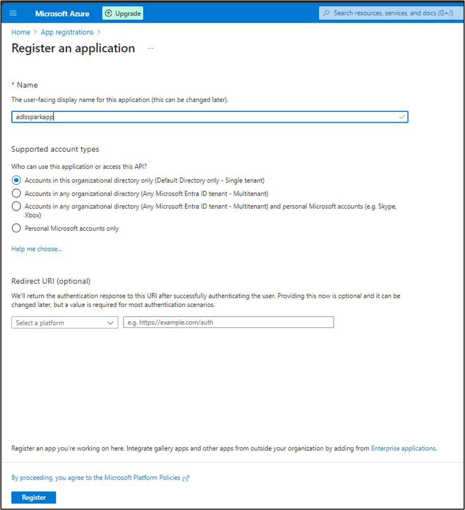
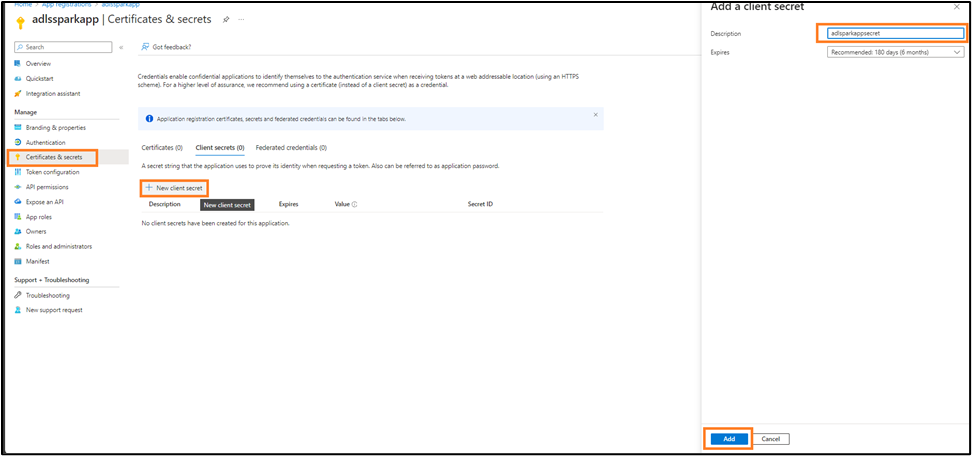
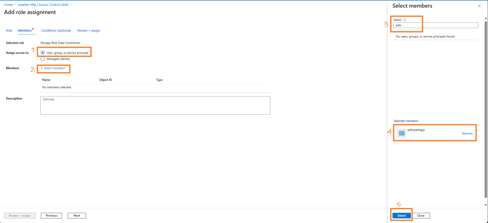
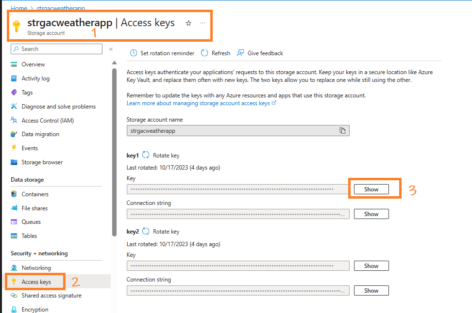
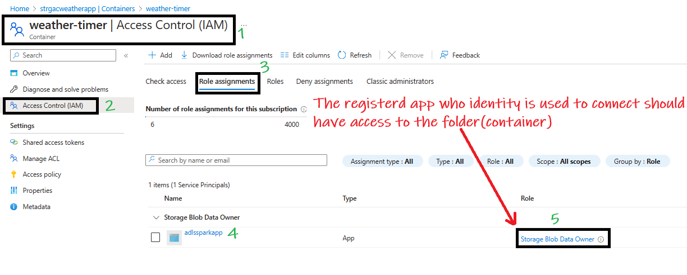

## Table of contents
- [Project Sparkzure Part1 - Connecting Local Spark to Azure Data Lake](#project-sparkzure-part1---connecting-local-spark-to-azure-data-lake)
  - [Overview](#overview)
  - [Kickstart: Integrating Spark with Azure Data Lake](#kickstart-integrating-spark-with-azure-data-lake)
    - [Create the containerized setup](#create-the-containerized-setup)
    - [Register an App for OAuth Authentication](#register-an-app-for-oauth-authentication)
      - [Register a new App using App Registration](#register-a-new-app-using-app-registration)
      - [Copy Ids and secret From The App](#copy-ids-and-secret-from-the-app)
      - [Give the App Permission to the Container](#give-the-app-permission-to-the-container)
    - [Access ADLS Data From Spark Using OAuth Authentication and Service Principal](#access-adls-data-from-spark-using-oauth-authentication-and-service-principal)
      - [Open VS Code and Connect To the Container](#open-vs-code-and-connect-to-the-container)
      - [Run the code](#run-the-code)
    - [Access data in ADLS container using Storage Account's Access Key Method](#access-data-in-adls-container-using-storage-accounts-access-key-method)
  - [Common Errors](#common-errors)
    - [AuthorizationPermissionMismatch During OAuth Authenticaiton](#authorizationpermissionmismatch-during-oauth-authenticaiton)
  - [Appendix](#appendix)
    - [Why Does Spark Rely on Hadoop Libraries to Access Azure Data Lake Storage (ADLS)?](#why-does-spark-rely-on-hadoop-libraries-to-access-azure-data-lake-storage-adls)
    - [Understanding Essential JARs for Azure Data Lake Operations with Spark](#understanding-essential-jars-for-azure-data-lake-operations-with-spark)
- [Project Sparkzure Part2 - Sorting Files in ADLS Container Using Standalone Spark](#project-sparkzure-part2---sorting-files-in-adls-container-using-standalone-spark)
    - [Overview of the Article](#overview-of-the-article)
    - [My Environment](#my-environment)
    - [The scenario](#the-scenario)
    - [Kickstart](#kickstart)
      - [Environment Setup](#environment-setup)
        - [Download the jars by running this command from terminal:](#download-the-jars-by-running-this-command-from-terminal)
        - [Copy the jars to the SPARK\_HOME/Jars location](#copy-the-jars-to-the-spark_homejars-location)
      - [Run the Spark Code](#run-the-spark-code)
    - [Conclusion](#conclusion)
    - [Appendix](#appendix-1)
      - [Programmatic options for Creating Containers, Sorting Files etc:](#programmatic-options-for-creating-containers-sorting-files-etc)
- [Understanding Spark Configuration: `spark.jars.packages` vs `spark.jars`](#understanding-spark-configuration-sparkjarspackages-vs-sparkjars)
  - [The Role of `.config('spark.jars.packages', '...')`](#the-role-of-configsparkjarspackages-)
    - [How it Works](#how-it-works)
    - [Example Usage](#example-usage)
  - [The Utility of `.config('spark.jars', '...')`](#the-utility-of-configsparkjars-)
    - [How it Functions](#how-it-functions)
    - [Example Implementation](#example-implementation)
  - [Conclusion](#conclusion-1)

---
# Project Sparkzure Part1 - Connecting Local Spark to Azure Data Lake

## Overview

Azure Databricks to Azure Data Lake is easy and straightforward. All the requied jars pre-installed in Databricks. All you need to do is to create a session and connect. However, connecting a local Spark instance to Azure Data Lake can be complicated, especially when managing JAR dependencies. In this project, I will show you how to connect your local Spark application to ADLS and run a Spark query using Visual Studio Code. The local Spark application will be hosted in a container, but it can also be hosted locally locally ;-)

## Kickstart: Integrating Spark with Azure Data Lake

### Create the containerized setup

Our environment is set up inside a Docker container running Ubuntu on a Windows OS host. Within this container, Python 3 and Spark are installed. But the steps can be used in local environments as well.

- **Check the python version in the container and find out site-packages directory**
   - Often, systems have both Python 2.x and Python 3.x installed. Use the following commands to determine which versions are available:
     ```bash
     python --version
     python3 --version
     ```
    

  - Determine where PySpark is installed using `pip`. Your enviornment may have multiple python installation especially if its linux or in a docker. You need to find the right `site-packages` directory so that the packages are copied to right location. To find out run this command in docker terminal or normal command prompt: 
  
     ```bash
     pip3 show pyspark | grep Location
     ```
     Alternatively, you can get the location by running the command:
     ```bash
     python3 -c "from distutils.sysconfig import get_python_lib; print(get_python_lib())"
     ```
   
    

- **Install `wget`**
   - `wget` is a tool for downloading files from the internet. If you don’t have it in your environment you can get it using the given command:
     ```bash
     apt-get update && apt-get install -y wget
     ```

-  **Download Hadoop ADLS JARs**

    - I've downloaded and placed the jars [here](Hadoop_Azure_Jars.zip). Download and copy it to a desired location.
    - Alternatively, run the command below to download jars to your home directory
    
     ```bash
    cd ~
    wget https://repo1.maven.org/maven2/org/apache/hadoop/hadoop-azure/3.3.3/hadoop-azure-3.3.3.jar
    wget https://repo1.maven.org/maven2/org/apache/hadoop/hadoop-azure-datalake/3.3.3/hadoop-azure-datalake-3.3.3.jar
    wget https://repo1.maven.org/maven2/org/apache/hadoop/hadoop-common/3.3.3/hadoop-common-3.3.3.jar
    wget https://repo1.maven.org/maven2/com/microsoft/azure/azure-storage/8.6.6/azure-storage-8.6.6.jar
    wget https://repo1.maven.org/maven2/com/azure/azure-security-keyvault-secrets/4.3.0/azure-security-keyvault-secrets-4.3.0.jar
    wget https://repo1.maven.org/maven2/com/azure/azure-identity/1.3.0/azure-identity-1.3.0.jar
    ```
    - After downloading, place the jars in any desired folder. These jars will be referenced during spark session creation.
    - Alternatively you can use download the jars [on-the-fly](mavencoordinates.html) using maven coordinates using `.config('spark.jars.packages', '...')`
    
### Register an App for OAuth Authentication

If you want to access a file(say CSV) in **Azure** through **OAuth** authentication, you need to create an **App registration** and grant this app permission to the CSV. This registered App's identity is used by **Spark** to authenticate. The same principle applies in **Databricks**, where an app is already created, named **AzureDatabricks**. Follow the steps below to register the app and give it permission to the file.

#### Register a new App using App Registration
- In the Azure Portal to search for **App registrations**', select it, and opt for '+ New registration'. 
  
  
  
- Give a name, say **`adlssparkapp`**, choose 'Accounts in this organizational directory only', keep the Redirect URI empty, and click **Register**. 
  
  

#### Copy Ids and secret From The App

- After registration, jot down the **Application ID** and **Directory ID**. 
  
  

- Go to **Manage** > **Certificates & secrets**, select **+ New client secret**, label it **`SparkAppSecret`**, set an expiration, and click  'Add'. 
  
  

- Post-creation, make note of the **one-time** viewable secret value essential for the Spark-Azure handshake. 
  
  

#### Give the App Permission to the Container

- Open the container, navigate to **Access Control (IAM)** > **Role assignments**, click **Add** > **Add role assignment**, select **Storage Blob Contributor**, 
  

- Search for the app **`adlssparkapp`**, and click **OK**.

  


### Access ADLS Data From Spark Using OAuth Authentication and Service Principal

With the app now registered and the key, ID, and secret in hand, we can proceed to execute the main code. Follow the steps outlined below to continue:

#### Open VS Code and Connect To the Container

- **Open VS Code**: Launch Visual Studio Code and click the remote container icon at the bottom left.
   
   

- **Attach to Container**: From the top menu, choose "Attach to running container".
   
   

-  **Select Container**: Pick the displayed running container. 
   
   
   
   This action launches a new VS Code instance connected to that container.
   
   

-  **Create Notebook**: In this instance, create a .ipynb (Jupyter notebook) to execute the subsequent section's code.
   

- **Connect to the python version where we copied the hadoop jars**
   There could be multiple python versions in a linux enviornment. From VS Code choose the python version whcih has our jars

   

#### Run the code
    
    Run the code below in the jupyter notebok:

```python
from pyspark.sql import SparkSession
# Initialize a Spark session with necessary configurations for connecting to ADLS
#Offline version
spark = SparkSession.builder \
    .appName("ADLS Access") \
    .config("spark.jars", "/usr/local/lib/python3.8/dist-packages/pyspark/jars/hadoop-azure-3.3.3.jar,/usr/local/lib/python3.8/dist-packages/pyspark/jars/hadoop-azure-datalake-3.3.3.jar,/usr/local/lib/python3.8/dist-packages/pyspark/jars/hadoop-common-3.3.3.jar") \
    .getOrCreate()

# Or using maven coordinates
# Online version
spark = SparkSession.builder \
    .appName("ADLS Access") \
    .config("spark.jars.packages", 
            "org.apache.hadoop:hadoop-azure:3.3.3,"
            "org.apache.hadoop:hadoop-azure-datalake:3.3.3,"
            "org.apache.hadoop:hadoop-common:3.3.3") \
    .getOrCreate()


# Define credentials and storage account details for ADLS access
storage_account = "<The_Storage_Act_Name_Containing_Container>"
app_client_id = "<The_Client_ID_From_Registered_App>"
app_directory_tenant_id = "<The_Client_ID_From_Registered_App>"
app_client_secret = "<The_Secret_Value_From_Registered_App>"

# Configure Spark to use OAuth authentication for ADLS access
spark.conf.set(f"fs.azure.account.auth.type.{storage_account}.dfs.core.windows.net", "OAuth")
spark.conf.set(f"fs.azure.account.oauth.provider.type.{storage_account}.dfs.core.windows.net", "org.apache.hadoop.fs.azurebfs.oauth2.ClientCredsTokenProvider")
spark.conf.set(f"fs.azure.account.oauth2.client.id.{storage_account}.dfs.core.windows.net", app_client_id)
spark.conf.set(f"fs.azure.account.oauth2.client.secret.{storage_account}.dfs.core.windows.net", app_client_secret)
spark.conf.set(f"fs.azure.account.oauth2.client.endpoint.{storage_account}.dfs.core.windows.net", f"https://login.microsoftonline.com/{app_directory_tenant_id}/oauth2/token")

# Define the path to the dataset in ADLS and read the CSV file using Spark
path = "abfss://<containerName>@<storaegaccountname>.dfs.core.windows.net/<CSV_File_Name.csv>"
spark.read.format("csv").load(path).show()

```
### Access data in ADLS container using Storage Account's Access Key Method

Another methods to access ADLS is using the Access key method. Here we get the access key from the storage account then use it to access the files inside it. To use this method, follow these steps:

-  **Get the Access Keys from the Storage Account**
   - In your storage account, under the `Security + networking` section in the left sidebar, find and select `Access keys`.
   - You’ll be presented with two keys: `key1` and `key2`. Both keys can be used to authenticate, so choose one and copy it. This will be used in the subsequent steps.
  
    

-  **Execute the code**  
After getting the access key use this code. Replace your access key in the access key location:

```python
# Import the required module for creating a Spark session.
from pyspark.sql import SparkSession

# Initialize the Spark session. The builder pattern is utilized to configure the session.
# We set the application name to "ADLS Access" for identification in Spark UI.
# Necessary JAR files are specified for Spark to connect and interact with Azure Data Lake Storage (ADLS).
spark = SparkSession.builder \
    .appName("ADLS Access") \
    .config("spark.jars", "/usr/local/lib/python3.8/dist-packages/pyspark/jars/hadoop-azure-3.3.3.jar,/usr/local/lib/python3.8/dist-packages/pyspark/jars/hadoop-azure-datalake-3.3.3.jar,/usr/local/lib/python3.8/dist-packages/pyspark/jars/hadoop-common-3.3.3.jar") \
    .getOrCreate()

# Specify the Azure storage account name and the associated access key for authentication purposes.
storage_account_name = "<The_Storage_Account_Name>"
storage_account_key = "<key1_or_key2>"

# Configure Spark to utilize AzureBlobFileSystem. This is essential for Azure Blob storage connectivity.
spark.conf.set(f"fs.azure", "org.apache.hadoop.fs.azurebfs.AzureBlobFileSystem")

# Authenticate the Spark session by providing the access key for the specified Azure storage account.
spark.conf.set(f"fs.azure.account.key.{storage_account_name}.dfs.core.windows.net", storage_account_key)

# Read the desired CSV file located in ADLS into a DataFrame (df) using Spark.
df = spark.read.csv(f"abfss://<container_name>@{storage_account_name}.dfs.core.windows.net/<filename.csv>")
```

## Common Errors

### AuthorizationPermissionMismatch During OAuth Authenticaiton

While executing the code you may encounter errors like:

```
AuthorizationPermissionMismatch, "This request is not authorized to perform this operation using this permission."
```
or

```
java.nio.file.AccessDeniedException: Operation failed: "This request is not authorized to perform this operation using this permission.", 403, HEAD, https://strgacweatherapp.dfs.core.windows.net/weather-timer/2023-10-19-09.json?upn=false&action=getStatus&timeout=90
	at org.apache.hadoop.fs.azurebfs.AzureBlobFileSystem.checkException(AzureBlobFileSystem.java:1384)
```


OAuth uses a registered apps identity to connect. This app should have permission to the folder where the file resides.



## Appendix

### Why Does Spark Rely on Hadoop Libraries to Access Azure Data Lake Storage (ADLS)?

**Long story short**: In a standalone Spark setup, we use specific Hadoop JARs solely for connecting to ADLS. It's important to note that these are just JARs and don't represent the full Hadoop ecosystem. 

Apache Spark is used for distributed data processing. But for data storage it relies on other systems like ADLS, S3 etc. But why, when connecting Spark to ADLS, do we bring Hadoop into the picture? Let’s find out.

**Spark's Core Functionality:**
Spark is designed to process data, not to understand the intricacies of every storage system. It can pull data from various sources, but it doesn't always have native integrations for each one.

**Hadoop's Role:**
Hadoop, primarily known for its distributed file system (HDFS), also **offers connectors to diverse storage systems**. Over time, it has become the standard bridge between storage solutions and big data tools.

**ADLS and Hadoop Integration:**
When Microsoft developed ADLS, they provided a connector to the Hadoop FileSystem API. This approach made sense. Why reinvent the wheel when big data tools already communicate efficiently with HDFS via Hadoop's API?

**Conclusion**

HSpark uses Hadoop libraries to access ADLS due to the standardized and robust nature of the Hadoop FileSystem API. Microsoft integrated ADLS with this Hadoop API to ensure that ADLS would be compatible with a broad range of big data tools, such as Spark and Hive. This decision was to use the extensive community support of the Hadoop ecosystem and also allowed Microsoft to reuse what was already working In essence, the Hadoop API serves as a bridge between Spark and ADLS.


### Understanding Essential JARs for Azure Data Lake Operations with Spark

1. **hadoop-azure-3.3.3.jar**:
   - **Description**: This library provides support for Azure Blob Storage integration with Hadoop. It contains the `WASB` (Windows Azure Storage Blob) file system connector.
   - **Use-Cases**: Reading/writing data from/to Azure Blob Storage (often ADLS Gen1) using Hadoop's FileSystem API.

2. **hadoop-azure-datalake-3.3.3.jar**:
   - **Description**: This is the Data Lake connector for Hadoop, providing support for ADLS Gen1.
   - **Use-Cases**: If you're working with ADLS Gen1, this JAR lets Spark access the data lake using the Hadoop FileSystem API.

3. **hadoop-common-3.3.3.jar**:
   - **Description**: The core library for Hadoop, it contains common utilities and the Hadoop FileSystem API.
   - **Use-Cases**: Fundamental for almost all Hadoop-related operations. It's the foundational library upon which other Hadoop components rely.

4. **azure-storage-8.6.6.jar**:
   - **Description**: Azure's storage SDK, facilitating interaction with Azure Storage services like Blob, Queue, and Table.
   - **Use-Cases**: Interacting with Azure Blob Storage (and by extension, ADLS Gen2 which is built on Blob). It's essential for Spark to communicate and access Azure storage services.

5. **azure-security-keyvault-secrets-4.3.0.jar**:
   - **Description**: Provides capabilities to interact with Azure Key Vault's secrets. It facilitates fetching, setting, or managing secrets.
   - **Use-Cases**: Whenever you need to securely access or manage secrets (like storage account keys or database connection strings) stored in Azure Key Vault from your Spark application.

6. **azure-identity-1.3.0.jar**:
   - **Description**: Azure SDK's identity library, providing various credentials classes for Azure Active Directory (AAD) token authentication.
   - **Use-Cases**: Authenticating against Azure services using AAD-based credentials, especially when trying to securely access resources like Key Vault or ADLS Gen2.


---

# Project Sparkzure Part2 - Sorting Files in ADLS Container Using Standalone Spark

### Overview of the Article

In Part 1, we dived into accessing ADLS files with Pyspark and Hadoop Jars. Now, let's switch gears a bit. In this article, we'll explore how to sort—by creating containers and moving/renaming files—the content in an Azure Data Lake Container using just a Standalone Spark application. While there's always the route of Azure Data Factory, Databricks, or Azure Logic Apps, I want to spotlight this approach. Why? Because it's not only a viable alternative, but it also comes with the perk of being nearly cost-free compared to the other Azure services I mentioned.

### My Environment

- **Deployment Platform:** Docker
- **Operating System:** Ubuntu
- **Python Version:** 3.8.10
- **Development IDE:** Visual Studio Code connected to the container
- **Spark Setup:** Standalone Spark installed as part of Pyspark(`pip install pyspark`)
- **Spark Home** /usr/local/lib/python3.8/dist-packages/pyspark/
- **Jars Location** /usr/local/lib/python3.8/dist-packages/pyspark/jars/

### The scenario

We have a container name "weather-timer" that contains JSON files formatted as `YYYY-10-22-12.json`. These files hold weather information retrieved from a web API. The files need to be sorted in the format  `year=yyyy/month=mm/day=dd/hour=hh.json`. This is a real-world requirement, as a structure like this can make partition pruning more efficient during query time if you're using a system like Apache Hive or Delta Lake.

### Kickstart

#### Environment Setup

For ADLS connectivity in standalone PySpark, we need to download these 3 super-important Jars:
- `hadoop-azure-<version>.jar`: Supports Azure Blob Storage and Spark integration.
- `hadoop-azure-datalake-<version>.jar`: For for ADLS access, including authentication features.
- `hadoop-common-<version>.jar`: Contains utilities for the other JARs.

##### Download the jars by running this command from terminal:

Run teh following command in terminal. Note: The version of jars might change over time.

 ```bash
cd ~
wget https://repo1.maven.org/maven2/org/apache/hadoop/hadoop-azure/3.3.3/hadoop-azure-3.3.3.jar
wget https://repo1.maven.org/maven2/org/apache/hadoop/hadoop-azure-datalake/3.3.3/hadoop-azure-datalake-3.3.3.jar
wget https://repo1.maven.org/maven2/org/apache/hadoop/hadoop-common/3.3.3/hadoop-common-3.3.3.jar
   
```
##### Copy the jars to the SPARK_HOME/Jars location

```bash
   cd ~  # assuming you downloaded the JARs in the home directory
   cp *.jar /usr/local/lib/python3.8/dist-packages/pyspark/jars/
```
#### Run the Spark Code

This is the code for performing the sorting. It checks if there are containers. If not, it makes them. Before you run the code, make sure you replace placeholders like `<YOUR_STORAGE_ACT_NAME>`, `<YOUR_REG_APP_CLIENT_ID>`, `<YOUR_REG_APP_TENANT_ID>`, `<YOUR_REG_APP_CLIENT_SECRET>`, `<YOUR_CONTAINER_NAME>`, and paths to JAR files with the actual values.. Also, update any other settings to match your system.

```python

# Importing the necessary module for SparkSession from the PySpark library.
from pyspark.sql import SparkSession

#Note: The location of jars is where we copied them after downloadign with wget. Just 3 jars.
spark = SparkSession.builder \
    .appName("ADLS Access") \
    .config("spark.jars", 
            "/usr/local/lib/python3.8/dist-packages/pyspark/jars/hadoop-azure-3.3.3.jar,"\
            "/usr/local/lib/python3.8/dist-packages/pyspark/jars/hadoop-azure-datalake-3.3.3.jar,"\
            "/usr/local/lib/python3.8/dist-packages/pyspark/jars/hadoop-common-3.3.3.jar") \
    .getOrCreate()


# Configuring PySpark for Azure Data Lake Storage (ADLS) Authentication using OAuth and Service Principal
# Credentials and configurations
storage_account_name = "<YOUR_STORAGE_ACT_NAME>"
regapp_client_id = "<YOUR_REG_APP_CLIENT_ID>" # Application (client) ID of the registered app
regapp_directory_id = "<YOUR_REG_APP_TENANT_ID>" # Directory (tenant) ID of the registered app
regapp_client_secret = "<YOUR_REG_APP_CLIENT_SECRET>"

# Set the authentication type to OAuth for the specified storage account---------------
spark.conf.set(f"fs.azure.account.auth.type.{storage_account_name}.dfs.core.windows.net", "OAuth")

# Define the token provider type for OAuth. The 'ClientCredsTokenProvider' is specified for the client credentials flow.
spark.conf.set(f"fs.azure.account.oauth.provider.type.{storage_account_name}.dfs.core.windows.net", "org.apache.hadoop.fs.azurebfs.oauth2.ClientCredsTokenProvider")

# Provide the client ID (application ID) of the registered application in Azure Active Directory (AD).
spark.conf.set(f"fs.azure.account.oauth2.client.id.{storage_account_name}.dfs.core.windows.net", regapp_client_id)

# Set the client secret of the registered application. This acts as a password for the application to verify its identity.
spark.conf.set(f"fs.azure.account.oauth2.client.secret.{storage_account_name}.dfs.core.windows.net", regapp_client_secret)

# Specify the OAuth 2.0 token endpoint, allowing the application to retrieve tokens for authentication.
spark.conf.set(f"fs.azure.account.oauth2.client.endpoint.{storage_account_name}.dfs.core.windows.net", f"https://login.microsoftonline.com/{regapp_directory_id}/oauth2/token")
#----------------------------------------------------------------------------------------
#---------Code to perform the sorting----------------------------------------------------
# Define the ADLS Gen2 base path
base_path = f"abfss://<YOUR_CONTAINER_NAME>@<YOUR_STORAGE_ACT_NAME>.dfs.core.windows.net/"

conf = spark._jsc.hadoopConfiguration()
conf.set("fs.abfss.impl", "org.apache.hadoop.fs.azurebfs.AzureBlobFileSystem")
uri = spark._jvm.java.net.URI
path_obj = spark._jvm.org.apache.hadoop.fs.Path(base_path)
file_system = spark._jvm.org.apache.hadoop.fs.FileSystem.get(uri(base_path), conf)

old_files = [status.getPath().toString() for status in file_system.globStatus(spark._jvm.org.apache.hadoop.fs.Path(base_path + "*-*.json"))]

# Diagnostic: Check the number of files fetched
print(f"Number of files to be processed: {len(old_files)}")

# Test with a subset (for diagnostic purposes)
subset_of_files = old_files[:5]

for old_file_path in old_files:
    # Extract year, month, day, and hour from the old file path
    filename = old_file_path.split('/')[-1]
    year, month, day, hour = filename.split('-')[:4]

    # Construct the new directory structure based on the desired format
    new_directory = base_path + f"year={year}/month={month}/day={day}/"
    
    # Check if the directory exists; if not, create it
    if not file_system.exists(spark._jvm.org.apache.hadoop.fs.Path(new_directory)):
        file_system.mkdirs(spark._jvm.org.apache.hadoop.fs.Path(new_directory))

    # Construct the new file path
    new_file_path = new_directory + f"hour={hour}"

    # Diagnostic: Printing the move action
    print(f"Moving {old_file_path} to {new_file_path}")

    # Rename (move) the file to the new path and check if it's successful
    success = file_system.rename(spark._jvm.org.apache.hadoop.fs.Path(old_file_path), spark._jvm.org.apache.hadoop.fs.Path(new_file_path))

    # Diagnostic: Check if the move was successful
    print(f"Move success: {success}")

print("Files rearranged successfully for the subset!")
#---------Code to perform the sorting----------------------------------------------------

```
### Conclusion

There are many ways to organize files in a container, like using ADF, Databricks, or Logic Apps. But this way is good too because it's free, unlike some pretty-expensive options like Databricks. I shared this article to let us know there's another option out there. It shows how we perform such operation on Azure DataLake from an outside standalone application.


### Appendix

#### Programmatic options for Creating Containers, Sorting Files etc:

If you want to compare what other programmatic options we have to peroform such operation, here is the comparison:

1. **Reading/Writing Large Datasets**: 
    - **Best Tool**: PySpark.
    - **Reason**: Spark is designed for distributed data processing. Reading and processing large datasets from ADLS Gen2 into Spark dataframes will be efficient.
    
2. **Listing Files in a Container/Directory**:
    - **Best Tool**: PySpark or Hadoop FileSystem API.
    - **Reason**: PySpark provides simple methods to list files, but if you're already interfacing with Hadoop's FileSystem API for other tasks, it's also a good choice.
    
3. **Renaming or Moving Files**:
    - **Best Tool**: Hadoop FileSystem API.
    - **Reason**: While this can be done with the Azure SDK, the Hadoop FileSystem API provides a more direct interface when working alongside Spark.
    
4. **Creating Containers or Directories**:
    - **Best Tool**: Azure SDK (`azure-storage-file-datalake`).
    - **Reason**: Creating containers or directories is a simple storage management task. The Azure SDK provides direct methods to do this without unnecessary overhead.
    
5. **Setting Permissions or Managing Access**:
    - **Best Tool**: Azure SDK.
    - **Reason**: Managing permissions or access control is more straightforward with the Azure SDK, which provides methods tailored for these tasks.

---

# Understanding Spark Configuration: `spark.jars.packages` vs `spark.jars`

Apache Spark offers robust options for integrating external libraries, crucial for expanding its native capabilities. Two such configurations often used are `spark.jars.packages` and `spark.jars`. Understanding the distinct roles and applications of these configurations can significantly enhance how you manage dependencies in your Spark applications.

## The Role of `.config('spark.jars.packages', '...')`

This configuration is quintessential when it comes to managing library dependencies via Maven coordinates. It's designed to streamline the process of including external libraries in your Spark application.

### How it Works
- **Maven Coordinates**: You specify the library using its Maven coordinates in the format `'groupId:artifactId:version'`.
- **Automatic Download**: Spark automates the download process, fetching the specified library from Maven Central or another configured Maven repository.
- **Ease of Use**: This method is particularly user-friendly, ensuring you're incorporating the correct library version without manually downloading the JAR files.

### Example Usage
```python
.config('spark.jars.packages', 'org.apache.spark:spark-sql-kafka-0-10_2.12:3.3.0')
```
In this instance, Spark is instructed to download and include the Kafka connector compatible with Spark version 2.12 and version 3.3.0 of the library.

## The Utility of `.config('spark.jars', '...')`

Contrasting `spark.jars.packages`, the `spark.jars` configuration is utilized when directly referencing locally stored JAR files.

### How it Functions
- **Local File Path**: You provide the absolute path to the JAR file already present on your system.
- **No Automatic Download**: Spark bypasses any downloading process, relying on the specified JAR file's presence in the given location.
- **Custom or Offline Use**: This approach is ideal for using custom library versions or in environments with restricted internet access.

### Example Implementation
```python
.config('spark.jars', '/opt/shared-data/spark-sql-kafka-0-10_2.13-3.4.0.jar')
```
Here, Spark is directed to incorporate a Kafka connector JAR file located at `/opt/shared-data/spark-sql-kafka-0-10_2.13-3.4.0.jar`.

## Conclusion

In summary, `spark.jars.packages` is a hassle-free solution for incorporating libraries using Maven coordinates, automating the downloading and version management. In contrast, `spark.jars` is suited for scenarios where you have a local JAR file, offering more control over the specific version and source of the library being used. The choice between these configurations hinges on your project's requirements and operational environment, providing flexibility in managing your Spark application's dependencies.


© D Das  
📧 [das.d@hotmail.com](mailto:das.d@hotmail.com) | [ddasdocs@gmail.com](mailto:ddasdocs@gmail.com)