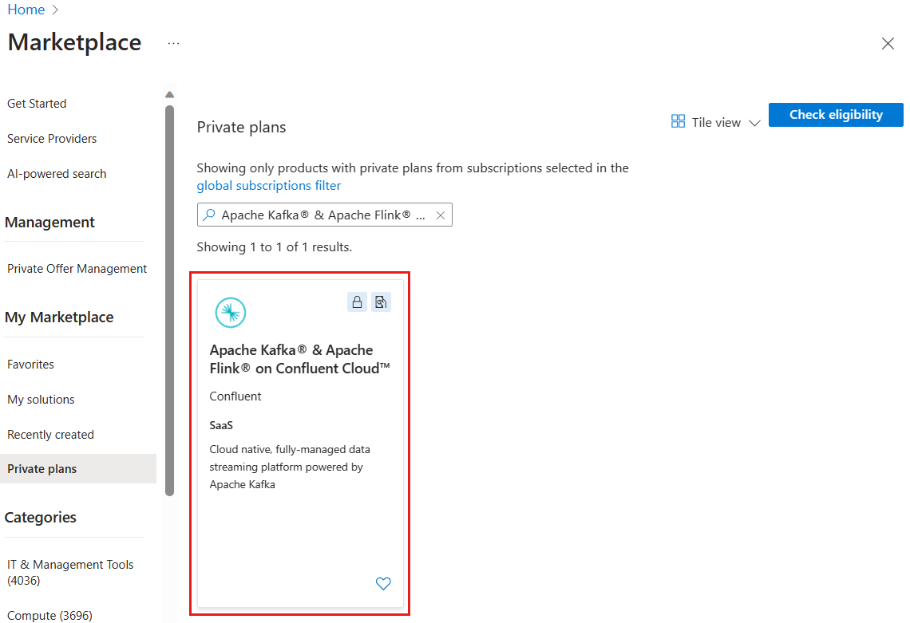

# Azure Event Hubs Vs Kafka: A Quick Comparison

## What is Azure Event Hubs?

Azure Event Hubs is an event ingestion and stream processing service. Sounds complex? Well, it can receive data from millions of events (like posts from a viral hashtag) and process them, then maybe send them to be stored in a database. It’s almost the same as Kafka, the open-source and free product, and also similar to Amazon Kinesis and Google Pub/Sub.

I mentioned Event Hubs is similar to Kafka. That means Azure Event Hubs is not Kafka. Kafka is an open-source platform that anyone can set up and run. On the other hand, Azure Event Hubs is a proprietary product by Microsoft. However, Event Hubs offers a Kafka-compatible endpoint, meaning you can run your existing Kafka work without any code changes.

Again, Event Hubs is not Kafka. But it supports Kafka natively. “Natively” is the key part.

## Azure Event Hubs Vs Kafka

**Who manages the platform?**  
With Kafka, you have full control since you’re running it yourself. With Azure Event Hubs, Microsoft manages the service (backend servers, etc.), so you don’t have to worry about maintenance or scaling.

**How easy is it?**   
Event Hubs is easier if you want a managed service without the hassle of setup. Kafka requires you to handle everything from setup to scaling.

<b>Event Hubs:</b>There are no servers, disks, or networks to manage and monitor and no brokers to consider or configure, ever. You create a namespace, which is an endpoint with a fully qualified domain name, and then you create Event Hubs (topics) within that namespace.

**Integration:**   
Event Hubs integrates smoothly with other Azure services, making it a good choice if you’re already in the Azure ecosystem.

## Why Use Azure Event Hubs?

Open-source Kafka on-premises is appealing because you don’t pay for licensing. But it’s not a “set it and forget it” solution. Servers need updates, maintenance, and support. All this is covered if you use Event Hubs. You won’t have to worry about backend servers or patching. And, the product will be supported by Microsoft, meaning you can chase them if something goes wrong. Can you do this with open-source products like Kafka? No, you can’t.

## How is Auzre EventHub Setup/Installed?

All this while, I've been saying that Kafka installation is complex. It's not as complex as I've made it seem, though it is still more involved than setting up Event Hubs. For example, in HDInsight, Microsoft provides a ready-made template for Kafka setup, making it as simple as setting up Event Hubs. With HDInsight, everything is done through the browser, with all setup on the cloud. Additionally, there's Confluent Cloud on Azure (and other clouds) that further simplifies the process.

Did you know you can have a kind of Azure-Kafka? These are actual Kafka servers, which can be easily set up using Azure HDInsight. This means you don’t have to install the software on-prem or on Docker. It’s like a hybrid solution. You use a bit of Azure (their servers, etc.) but still have actual Kafka.

> Also, Confluent Company provides Kafka on Azure MarketPlace.

## All installation methods

| **Installation Method**          | **Details**                                                                     |
|----------------------------------|---------------------------------------------------------------------------------|
| **On Your Own Servers**          |                                                                                 |
| Manual Installation              | Set up Kafka on your own servers when you want full control.                    |
| Docker                           | Run Kafka inside a Docker container for easy management and portability.        |
| Kubernetes                       | Deploy Kafka on a Kubernetes cluster when you need easy scaling.                |
| **On the Cloud**                 |                                                                                 |
| Virtual Machines                 | Install Kafka on cloud VMs when using cloud infrastructure.                     |
| Managed Services                 |                                                                                 |
| Confluent Cloud                  | Use Confluent Cloud for fully managed Kafka when you want hassle-free management.|
| Amazon MSK                       | Opt for Amazon MSK if you're on AWS and need managed Kafka.                     |
| Azure Event Hubs                 | Choose Azure Event Hubs for a Kafka-compatible service on Azure.                |
| **Hybrid**                       | Deploy Kafka on both servers and cloud when you need both on-premises and cloud.|
| **For Developers (Local Use)**   |                                                                                 |
| Docker                           | Run Kafka locally inside Docker for development and testing.                    |
| Confluent Platform               | Use Confluent Platform for an easy local setup with extra tools.                |

## Can you replace Kafka fully with Azure Event Hubs?

If you have a streaming data source, **you can replace** Kafka with Azure Event Hubs instead. Event Hubs can handle the ingestion, streaming, and processing of real-time data. You won’t need Kafka at all. Here’s how open-source tools map to Azure services for streaming projects:

1. Kafka - Azure Event Hubs
2. Kafka Streams - Azure Stream Analytics
3. Kafka Connect - Azure Data Factory

With these, there will not be a need for Kafka in the entire project.Look at the table below, it shows open-source products and their Azure counterpart.

| **Open-Source Tool**                         | **Azure Equivalent**                        | **Functionality**                                                                                       |
|----------------------------------------------|---------------------------------------------|----------------------------------------------------------------------------------------------------------|
| **Kafka (Streaming Data Platform)**          | **Azure Event Hubs**                        | Can replace Kafka for ingesting and streaming large volumes of real-time data.                           |
| **Kafka Streams (Stream Processing)**        | **Azure Stream Analytics**                  | Can replace Kafka Streams for real-time data processing and transformation as data flows through Event Hubs. |
| **Kafka Connect (Data Integration)**         | **Azure Data Factory**                      | Can replace Kafka Connect by connecting and transforming data across different sources.                  |
| **Schema Registry (Data Schema Management)** | **Azure Event Grid / Azure Schema Registry**| Can replace Schema Registry for managing and ensuring compatibility of event schemas.                     |
| **Kafka Topics (Data Segmentation)**         | **Event Hubs Partitions**                   | Can replace Kafka Topics by segmenting data streams for organization and scaling.                        |
| **Monitoring and Management**                | **Azure Monitor / Azure Metrics**           | Can replace custom Kafka monitoring tools for managing and monitoring streaming data.                    |
