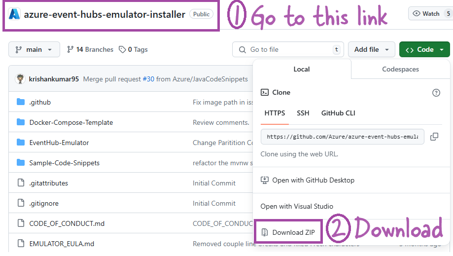
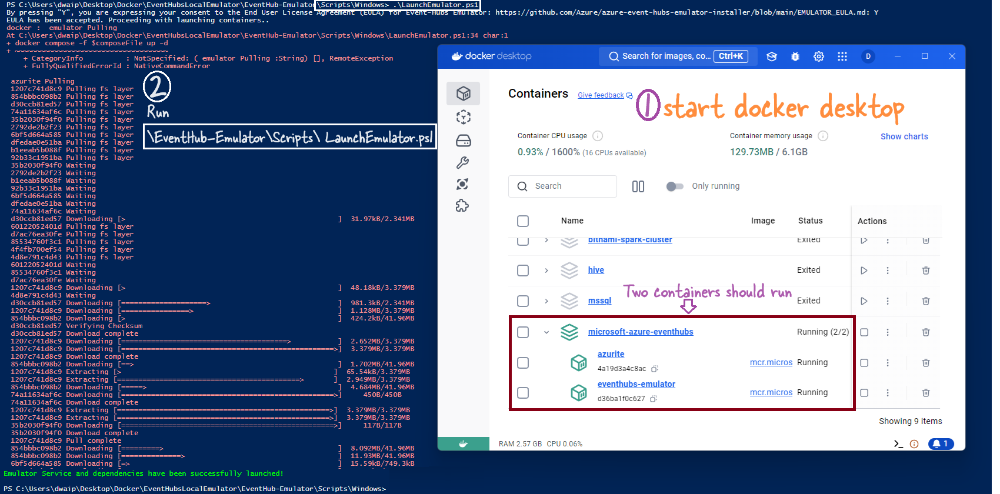
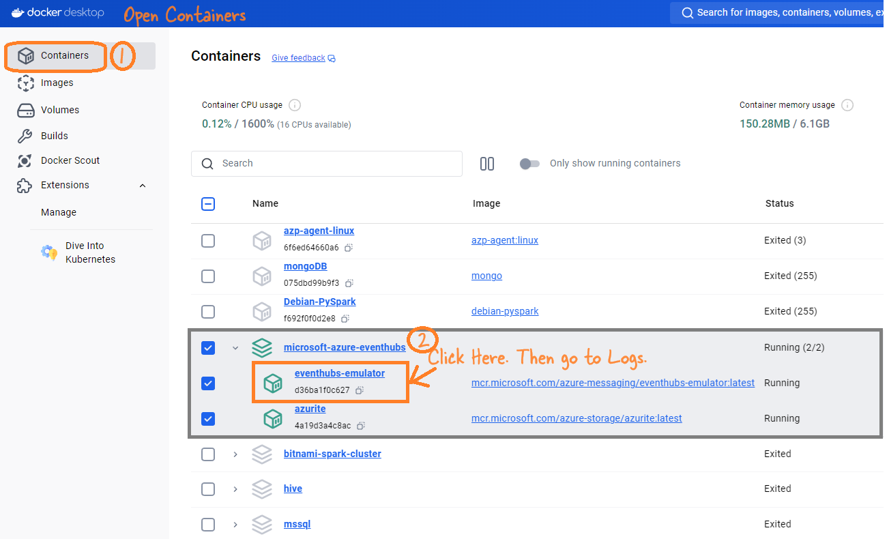
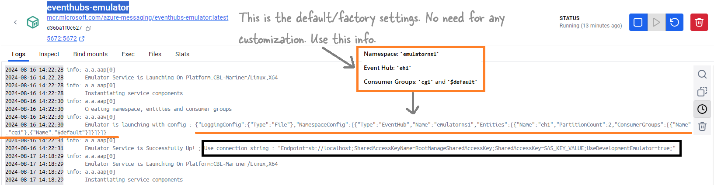

# <span style="color: MediumOrchid; font-family: Segoe UI, sans-serif;">Azure Event Hubs Local Emulator - End to End</span>

## <span style="color: #963F9C; font-family: Segoe UI, sans-serif;">Introduction</span>

Want to learn Azure Event Hubs but don’t have an Azure account, or maybe your free credits have expired? Worried about the charges? No problem! Here’s a solution that lets you run everything locally in a fake environment that’s so good, you won’t even notice the difference. The best part? It’s all local, so after setting it up, you can run everything even without an internet connection.

It’s simple: we’ll create a few Docker containers to mimic Azure Event Hubs on your machine. Just make sure you have Docker Desktop installed on your Windows or Mac PC, and you’re good to go.

## <span style="color: #963F9C; font-family: Segoe UI, sans-serif;">What You Need</span>

Here’s what you need on your machine:

- **Docker Desktop**: If you don’t have it, grab it from their website.
- **VS Code and Python**: You’ll need these, along with Jupyter Notebook and a few plugins. If something doesn’t work, just install the necessary plugin.

## <span style="color: #963F9C; font-family: Segoe UI, sans-serif;">Setting It Up</span>

1. **Get the Emulator**: Head over to the [GitHub page](https://github.com/Azure/azure-event-hubs-emulator-installer) and download the zip file.

   

2. **Unzip and Get Ready**: Unzip the file to a folder on your computer.

3. **Start Docker**: Launch Docker Desktop.

4. **Run the Script**:
   - Open PowerShell as an admin (right-click and choose “Run as administrator”).
   - Run this command to allow scripts to run:
     ```powershell
     Start-Process powershell -Verb RunAs -ArgumentList 'Set-ExecutionPolicy Bypass –Scope CurrentUser'
     ```
   - Navigate to `\EventHub-Emulator\Scripts\Windows` in the unzipped folder and run:
     ```powershell
     .\LaunchEmulator.ps1
     ```
   - You should be able to see two containers running.

   

## <span style="color: #963F9C; font-family: Segoe UI, sans-serif;">Lets test the Fake Local Event Hubs</span>

Now that your fake, free, local Azure Event Hubs environment is up and running, let’s see if it actually works:

- **Check the Logs**: In Docker, click on the `eventhubs-emulator` container to view the logs. This will give you the connection info:

   

   - **Namespace**: `emulatorns1`
   - **Event Hub**: `eh1`
   - **Consumer Groups**: `cg1` and `$default`

   

- **Run the Notebook**: Instead of cluttering this guide with code, I’ve put everything you need into a Jupyter notebook. Just download it [here](FakeLocalEventHub_Test.ipynb), and run it cell by cell. The setup is straightforward, and the code should run smoothly.

## <span style="color: #963F9C; font-family: Segoe UI, sans-serif;">Resources</span>

Here are a couple of links you might find useful:

- [GitHub: Azure Event Hubs Emulator Installer](https://github.com/Azure/azure-event-hubs-emulator-installer?tab=readme-ov-file#tab/automated-script)
- [Blog: Introducing Local Emulator for Azure Event Hubs](https://techcommunity.microsoft.com/t5/messaging-on-azure-blog/introducing-local-emulator-for-azure-event-hubs/ba-p/4146454)

<p style="color: #804000; font-family: 'Trebuchet MS', Helvetica, sans-serif; background-color: BurlyWood; padding: 15px; border-left: 5px solid #b35900;">
That's it! Now you have your own local setup to practice with Azure Event Hubs without any of the usual hassles. Enjoy!
</p>

If you have questions, reach out to me at das.d@hotmail.com