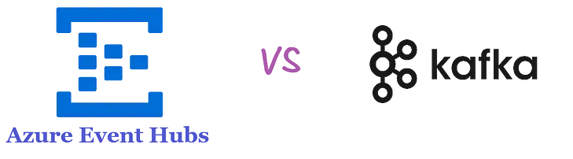

# Azure Event Hubs Vs Kafka: A Quick Comparison

## What is Azure Event Hubs?

Azure Event Hubs is an important service in Azure for ingesting and processing streaming (real-time/near-real-time) data. In the open-source world, we have Kafka for similar needs. If you’re using AWS, Amazon Kinesis serves this purpose, and Google Cloud offers Google Pub/Sub.

Let’s be clear: Azure Event Hubs is not Kafka. Kafka is an open-source platform that anyone can set up and run. On the other hand, Azure Event Hubs is a proprietary product by Microsoft. However, Event Hubs offers a Kafka-compatible endpoint, meaning you can run existing Kafka work without any code change.

Again: Event Hub is not Kafka. But, it supports Kafka natively. “Natively” is the important part.

## Azure Event Hubs Vs Kafka

**Who manages the platform?**  
With Kafka, you have full control since you’re running it yourself. With Azure Event Hubs, Microsoft manages the service (backend servers, etc.), so you don’t have to worry about maintenance or scaling.

**How easy is it?**  
Event Hubs is easier if you want a managed service without the hassle of setup. Kafka requires you to handle everything from setup to scaling.

>**Event Hubs:** There are no servers, disks, or networks to manage and monitor and no brokers to consider or configure, ever. You create a namespace, which is an endpoint with a fully qualified domain name, and then you create Event Hubs (topics) within that namespace.

**Integration:**  
Event Hubs integrates smoothly with other Azure services, making it a good choice if you’re already in the Azure ecosystem.

## Why Use Azure Event Hubs?

Open-source Kafka on-premises is appealing because you don’t pay for licensing. But it’s not a “set it and forget it” solution. Servers need updates, maintenance, and support. All this is covered if you use Event Hubs. You won’t have to worry about backend servers or patching. And, the product will be supported by Microsoft, meaning you can chase them if something goes wrong. Can you do this with open-source products like Kafka? No, you can’t.

## How are they installed/Setup?

Setting up Event Hubs is as simple as logging into the Azure portal and selecting the resource. Everything is set up with just a browser. But Kafka requires installation. It can be installed on-prem, on Docker containers, or on the cloud. Did you know you can have a kind of Azure-Kafka? These are actual Kafka servers, which can be easily set up using Azure HDInsight. This means you don’t have to install the software on-prem or on Docker. It’s like a hybrid solution. You use a bit of Azure (their servers, etc.) but still have actual Kafka.

## Can You Use Kafka with Azure Event Hubs?

Yes, you can. Even though Azure Event Hubs isn’t Kafka, it has a Kafka-compatible endpoint. This means you can continue using your Kafka tools and applications with Event Hubs without much change.
