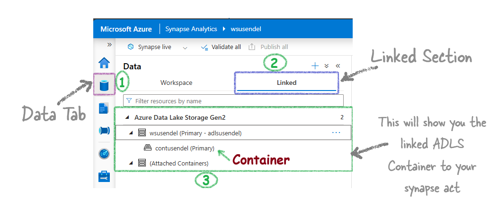
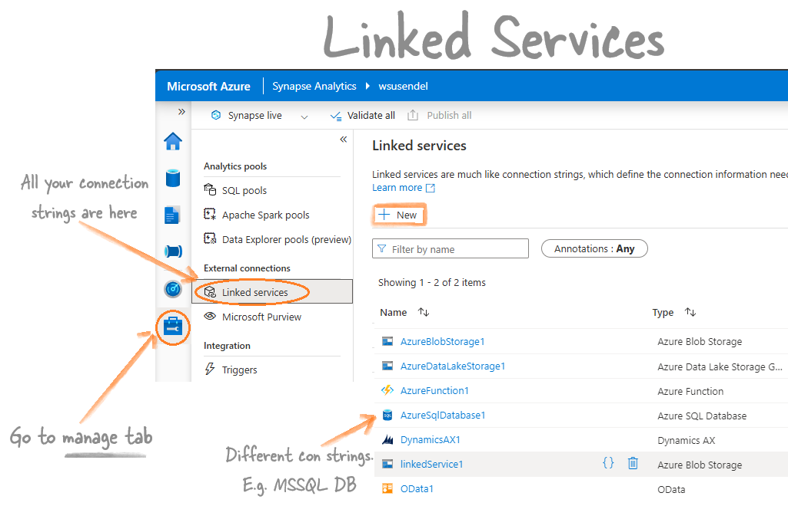
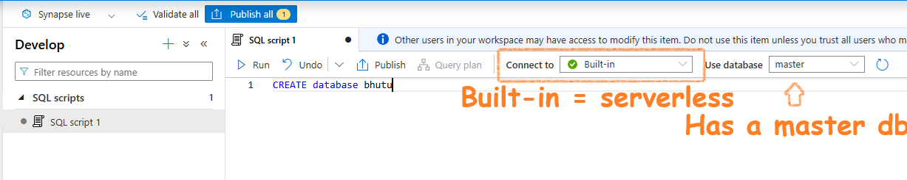
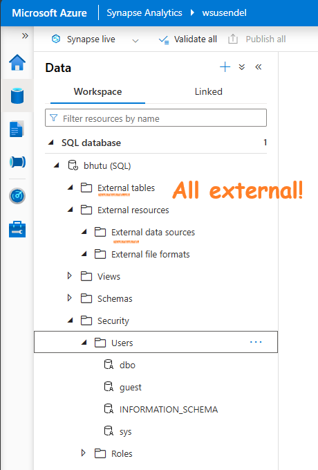

- [The Core Concepts of Synapse Analytics](#the-core-concepts-of-synapse-analytics)
  - [Synapse Workspace](#synapse-workspace)
  - [Linked Services](#linked-services)
  - [Synapse SQL Pools](#synapse-sql-pools)
    - [Serverless SQL Pool](#serverless-sql-pool)
    - [Dedicated Pool (AKA SQL DW)](#dedicated-pool-aka-sql-dw)
  - [Synapse Spark Pool](#synapse-spark-pool)
  - [Pipelines](#pipelines)
  - [Integration Datasets](#integration-datasets)
  - [Integration runtime](#integration-runtime)
  - [The Databases Types in Synapse](#the-databases-types-in-synapse)

# The Core Concepts of Synapse Analytics

Here are the building blocks of Azure Synapse Analytics

## Synapse Workspace

It's the main portal of Synapse. It is present in a particular region. It has a ADLS G2 account linked and a folder there. It is always under a resource group.

A Synapse workspace must be connected to a storage account (ADLS Gen2) and a file system (container inside that ADLS Gen2). Synapse will ask you to choose/create a new ADLS account and a container inside it

You can see the connected ADLS storage from Data tab/Linked area.

## Linked Services

    

        Linked serviecs - Just a fancy name for connection Strings
    

Manage Tab, External connections contains Linked Services section in Synapase and In Azure Data Factory.

## Synapse SQL Pools

Don't get confused with the term `pool`. Synapse gives you two SQL products:

1. A serverless MSSQL database
2. A dedicated MSSQL database.

For serverless, all characters are fictitious. It's not like the old-school MSSQL where data stays inside in SQL's own format. For serverless, it's mainly data stored in ADLS folders.

**Question:** So, serverless is just a query engine with no actual tables, master db, etc., like MSSQL?

**Answer:** Yes, it has master db, tables, views, schemas, etc., but all the tables and databases there are fictitious. They are made-up showpieces derived from ADLS files.

For instance, if you create a database using the serverless SQL pool:

This is what you will see. Notice that everything is just a shell. The data is external:

However, with the dedicated MSSQL, everything is real and traditional. It is a SQL warehouse. Hence, it old name was SQL Data Warehouse. The Dedicated pool is just a fancy name.

### Serverless SQL Pool

The only thing real here is the SQL query engine. All data are fictiocious.

- Just a query running engine. All data is external.
- On-demand: Only pay for the queries you run. It stays online, but don’t worry. You don’t pay anything until you run something.
- Doesn’t have its own storage: Doesn’t store anything. It only runs queries in ADLS, etc.
- Cheap: Very cheap. $0 if you don’t run a single SQL query.

### Dedicated Pool (AKA SQL DW)

A full SQL Warehouse (a large SQL server) that you own. This means there is a traditional, old-school SQL database with real, dedicated storage, not just some abstract storage solution using ADLS (no insults to Serverless Pool ;-). It’s the poor man’s engine).

- **Full-blown SQL Warehouse**: Just a few years ago, it was called SQL Data Warehouse.
- **Own local storage, not international calls to ADLS**: It has its own storage, just like SQL Server. No, it’s not ADLS; it’s real SQL storage.
- **Once on, you pay by the hour**: Since it’s dedicated, Microsoft covers the hardware costs for your dedicated SQL server. Whether you use it or not, you pay by the hour, and it’s quite expensive. Run it for a day, and your full trial subscription might be gone.

## Synapse Spark Pool

Synapse gives you a ready-to-use Apache Spark environment called a Serverless Spark Pool. It's like the Serverless SQL Pool, meaning you only pay when you use it. In the background, it's a Spark cluster, but it's called a Pool. In Databricks, you create a Spark cluster for a Spark environment. In Synapse, you create a Spark Pool. The end result is the same.

**Points to Remember:**
- It's just an Apache Spark cluster behind the scenes.
- Use it to run Spark jobs or Spark queries.
- You can write Spark logic in PySpark, SparkSQL, Scala, or even C#.
- There are two ways to run Spark code in Synapse:
  - **Spark Notebooks:** Like Jupyter notebooks.
  - **Spark Job Definitions:** For running batch Spark jobs using jar files.

## Pipelines

Pipelines in Synapse are the same as Azure Data Factory Pipelines. They are 100% identical.

An activity is a task you want to perform. A pipeline is a group of activities, like copying data or running a notebook.

**Points to Remember:**
- Syapse Pipelines is actually ADF.
- Pipelines are collections of activities (tasks like copying data, running a notebook, etc.).
- **Data Flows:** A type of activity that lets you create transformations without code using graphics. It runs on **Spark behind the scenes**.
- **Triggers:** To execute pipelines on a schedule.

## Integration Datasets

These are pointers to your data. They are required when you create an activity like a Copy activity.

- Tell me where the data is? In a blob storage.
- What is the format? CSV.
- Tell me the connection string (Linked service) to that file/folder.

You create it from the Data section in Synapse.

## [Integration runtime](IntegrationRuntime.html)

Copying data is one of the main activities in Synapse and ADF. The main tool used for this is **Integration Runtime**. It's like a **bridge** that connects Synapse and ADF with data from on-premises and external sources.

There are **3 types** of Integration Runtime:

1. **Azure Integration Runtime:** This is used to copy data within Azure or between cloud services.
2. **Self-hosted Integration Runtime:** This is the bridge to copy data from your local machine to the Azure cloud. It is a software you install on your local computer.
3. **Azure-SSIS Integration Runtime:** This allows you to lift and shift your SSIS packages to Azure.

## The Databases Types in Synapse

Before we dive into this, let's ask ourselves: How many types of pools are there in Synapse? Even though I don't like the term "pool" (and I can't use "server"), we have to use it. There are three types: Serverless SQL, Dedicated SQL, and Serverless Spark pool.

So, it's simple—there are three types of databases, one for each:

1. **Serverless SQL Database**: Created using the Serverless SQL pool.
2. **Dedicated SQL Database**: Created using the Dedicated SQL pool. Note: This is essentially a data warehouse.
3. **Spark Database**:
   1. **v1 [Lake Database]**: Created using a serverless Spark pool and PySpark, called a Spark [Lake] database.
   2. **v2 [Delta Lake Database/Lakehouse]**: Similar to v1, but the format of the .parquet files is Delta.

> So, does Apache Spark have database connections? Yes, of course. How else would it run SparkSQL and what about that magic command %%sql? It has robust database capabilities.