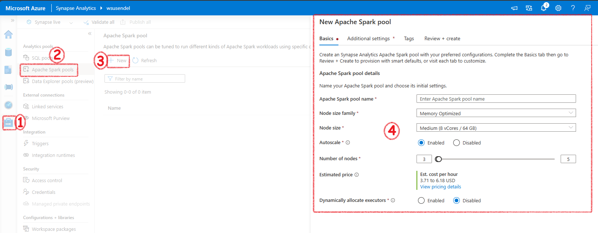

<details open markdown="block">
  <summary>
    Table of contents
  </summary>
  {: .text-delta }
1. TOC
{:toc}
</details>

## Use Azure Synapse Serverless SQL Pool to Query Files in a Data Lake

### What are Serverless SQL pools and what they are capable of?

Serverless SQL pools are less expensive SQL databases. Compared to Dedicated SQL pool which is more expensive and you have to pay it if you use it or not. Serverless sql pools are good for on-demand data query.

### Query CSV, JSON, and Parquet Files Using a Serverless SQL Pool

**Querying CSV Files:**
```sql
SELECT TOP 100 *
FROM OPENROWSET(
    BULK 'https://mydatalake.blob.core.windows.net/data/files/*.csv',
    FORMAT = 'csv',
    PARSER_VERSION = '2.0'
) WITH (
    product_id INT,
    product_name VARCHAR(20) COLLATE Latin1_General_100_BIN2_UTF8,
    list_price DECIMAL(5,2)
) AS rows
```

**Querying JSON Files:**
```sql
SELECT doc
FROM OPENROWSET(
    BULK 'https://mydatalake.blob.core.windows.net/data/files/*.json',
    FORMAT = 'csv',
    FIELDTERMINATOR ='0x0b',
    FIELDQUOTE = '0x0b',
    ROWTERMINATOR = '0x0b'
) WITH (doc NVARCHAR(MAX)) as rows
```

**Querying Parquet Files:**
```sql
SELECT *
FROM OPENROWSET(
    BULK 'https://mydatalake.blob.core.windows.net/data/orders/year=*/month=*/*.*',
    FORMAT = 'parquet'
) AS orders
WHERE orders.filepath(1) = '2020'
  AND orders.filepath(2) IN ('1','2');
```

### Create External Database Objects in a Serverless SQL Pool

**Creating a Database:**
```sql
CREATE DATABASE SalesDB
    COLLATE Latin1_General_100_BIN2_UTF8
```

**Creating an External Data Source:**
```sql
CREATE EXTERNAL DATA SOURCE files
WITH (
    LOCATION = 'https://mydatalake.blob.core.windows.net/data/files/'
)
```

**Using External Data Source in Queries:**
```sql
SELECT *
FROM OPENROWSET(
    BULK 'orders/*.csv',
    DATA_SOURCE = 'files',
    FORMAT = 'csv',
    PARSER_VERSION = '2.0'
) AS orders
```

**Creating a Database Scoped Credential:**
```sql
CREATE DATABASE SCOPED CREDENTIAL sqlcred
WITH
    IDENTITY = 'SHARED ACCESS SIGNATURE',
    SECRET = 'sv=xxx...';
GO

CREATE EXTERNAL DATA SOURCE secureFiles
WITH (
    LOCATION = 'https://mydatalake.blob.core.windows.net/data/secureFiles/',
    CREDENTIAL = sqlcred
);
GO
```

**Creating an External File Format:**
```sql
CREATE EXTERNAL FILE FORMAT CsvFormat
WITH (
    FORMAT_TYPE = DELIMITEDTEXT,
    FORMAT_OPTIONS (
        FIELD_TERMINATOR = ',',
        STRING_DELIMITER = '"'
    )
);
GO
```

**Creating an External Table:**
```sql
CREATE EXTERNAL TABLE dbo.products
(
    product_id INT,
    product_name VARCHAR(20),
    list_price DECIMAL(5,2)
)
WITH
(
    DATA_SOURCE = files,
    LOCATION = 'products/*.csv',
    FILE_FORMAT = CsvFormat
);
GO

-- Query the table
SELECT * FROM dbo.products;
```

## How to transform data using a serverless SQL pool

### Use a CREATE EXTERNAL TABLE AS SELECT (CETAS) Statement to Transform Data

**Steps:**
1. **Create External Data Source:**
    ```sql
    CREATE EXTERNAL DATA SOURCE files
    WITH (
        LOCATION = 'https://mydatalake.blob.core.windows.net/data/files/',
        TYPE = BLOB_STORAGE,  -- For serverless SQL pool
        CREDENTIAL = storageCred
    );
    ```

2. **Create Database Scoped Credential:**
    ```sql
    CREATE DATABASE SCOPED CREDENTIAL storagekeycred
    WITH
        IDENTITY='SHARED ACCESS SIGNATURE',  
        SECRET = 'sv=xxx...';

    CREATE EXTERNAL DATA SOURCE secureFiles
    WITH (
        LOCATION = 'https://mydatalake.blob.core.windows.net/data/secureFiles/',
        CREDENTIAL = storagekeycred
    );
    ```

3. **Create External File Format:**
    ```sql
    CREATE EXTERNAL FILE FORMAT ParquetFormat
    WITH (
        FORMAT_TYPE = PARQUET,
        DATA_COMPRESSION = 'org.apache.hadoop.io.compress.SnappyCodec'
    );
    ```

4. **Use CETAS to Transform Data:**
    ```sql
    CREATE EXTERNAL TABLE SpecialOrders
        WITH (
            LOCATION = 'special_orders/',
            DATA_SOURCE = files,
            FILE_FORMAT = ParquetFormat
        )
    AS
    SELECT OrderID, CustomerName, OrderTotal
    FROM
        OPENROWSET(
            BULK 'sales_orders/*.csv',
            DATA_SOURCE = 'files',
            FORMAT = 'CSV',
            PARSER_VERSION = '2.0',
            HEADER_ROW = TRUE
        ) AS source_data
    WHERE OrderType = 'Special Order';
    ```

### Encapsulate a CETAS Statement in a Stored Procedure

**Benefits:**
- Reduces network traffic.
- Provides a security boundary.
- Eases maintenance.
- Improves performance.

**Example Stored Procedure:**
```sql
CREATE PROCEDURE usp_special_orders_by_year @order_year INT
AS
BEGIN
    -- Drop the table if it already exists
    IF EXISTS (
            SELECT * FROM sys.external_tables
            WHERE name = 'SpecialOrders'
        )
        DROP EXTERNAL TABLE SpecialOrders

    -- Create external table with special orders
    -- from the specified year
    CREATE EXTERNAL TABLE SpecialOrders
        WITH (
            LOCATION = 'special_orders/',
            DATA_SOURCE = files,
            FILE_FORMAT = ParquetFormat
        )
    AS
    SELECT OrderID, CustomerName, OrderTotal
    FROM
        OPENROWSET(
            BULK 'sales_orders/*.csv',
            DATA_SOURCE = 'files',
            FORMAT = 'CSV',
            PARSER_VERSION = '2.0',
            HEADER_ROW = TRUE
        ) AS source_data
    WHERE OrderType = 'Special Order'
    AND YEAR(OrderDate) = @order_year;
END
```

### Include a Data Transformation Stored Procedure in a Pipeline

**Pipeline Activities:**
1. **Delete Activity:** Deletes the target folder for the transformed data in the data lake if it already exists.
2. **Stored Procedure Activity:** Connects to your serverless SQL pool and runs the stored procedure that encapsulates your CETAS operation.

**Example Pipeline Steps:**
- **Delete Target Folder:**
    - Use a Delete activity to remove the existing folder.
- **Run Stored Procedure:**
    - Use a Stored procedure activity to execute the `usp_special_orders_by_year` procedure.

**Benefits:**
- Schedules operations to run at specific times or based on events (e.g., new files added to the source storage location).

## Create a Lake Database in Azure Synapse Analytics

### Understand Lake Database Concepts and Components

**Traditional Relational Database:**
- Schema composed of tables, views, and other objects.
- Tables define entities with attributes as columns, enforcing data types, nullability, key uniqueness, and referential integrity.
- Data is tightly coupled with table definitions, requiring all manipulations to be through the database system.

**Data Lake:**
- No fixed schema; data stored in structured, semi-structured, or unstructured files.
- Analysts can work directly with files using various tools, without relational database constraints.

**Lake Database:**
- Provides a relational metadata layer over files in a data lake.
- Includes definitions for tables, column names, data types, and relationships.
- Tables reference files in the data lake, allowing SQL queries and relational semantics.
- Data storage is decoupled from the database schema, offering more flexibility.

**Components:**
- **Schema:** Define tables and relationships using data modeling principles.
- **Storage:** Data stored in Parquet or CSV files in the data lake, managed independently of database tables.
- **Compute:** Use serverless SQL pools or Apache Spark pools to query and manipulate data.

### Describe Database Templates in Azure Synapse Analytics

**Lake Database Designer:**
- Start with a new lake database on the Data page.
- Choose a template from the gallery or start with a blank database.
- Add and customize tables using the visual database designer interface.

**Creating Tables:**
- Specify the type and location of files for storing underlying data.
- Create tables from existing files in the data lake.
- Store database files in a consistent format within the same root folder.

**Database Designer Interface:**
- Drag-and-drop surface for editing tables and relationships.
- Specify names, storage settings, key usage, nullability, and data types for columns.
- Define relationships between key columns in tables.
- Publish the database when the schema is ready for use.

### Create a Lake Database

**Steps:**
1. **Create a Lake Database:**
    - Use the lake database designer in Azure Synapse Studio.
    - Add a new lake database on the Data page.
    - Select a template or start with a blank database.
    - Add and customize tables using the visual interface.

2. **Specify Table Settings:**
    - Define the type and location of files for data storage.
    - Create tables from existing files in the data lake.
    - Ensure all database files are in a consistent format within the same root folder.

3. **Database Designer Features:**
    - Drag-and-drop interface to edit tables and relationships.
    - Define schema by specifying table names, storage settings, columns, and relationships.
    - Publish the database to start using it.

### Use a Lake Database

**Using a Serverless SQL Pool:**
- Query lake database tables using a serverless SQL pool in a SQL script.
- Example:
    ```sql
    USE RetailDB;
    GO

    SELECT CustomerID, FirstName, LastName
    FROM Customer
    ORDER BY LastName;
    ```
- No need for OPENROWSET function; the serverless SQL pool handles file mapping.

**Using an Apache Spark Pool:**
- Work with lake database tables using Spark SQL in an Apache Spark pool.
- Example to insert a new record:
    ```sql
    %%sql
    INSERT INTO `RetailDB`.`Customer` VALUES (123, 'John', 'Yang')
    ```
- Example to query the table:
    ```sql
    %%sql
    SELECT * FROM `RetailDB`.`Customer` WHERE CustomerID = 123
    ```

## Transform Data with Spark in Azure Synapse Analytics

### Use Apache Spark to Modify and Save Dataframes

**Modify and Save Dataframes:**
- **Load Data:** Use `spark.read` to load data into a dataframe.
    ```python
    order_details = spark.read.csv('/orders/*.csv', header=True, inferSchema=True)
    display(order_details.limit(5))
    ```

- **Transform Data:** Use dataframe methods and Spark functions for transformations.
    ```python
    from pyspark.sql.functions import split, col

    # Create new columns and remove the original column
    transformed_df = order_details.withColumn("FirstName", split(col("CustomerName"), " ").getItem(0)).withColumn("LastName", split(col("CustomerName"), " ").getItem(1))
    transformed_df = transformed_df.drop("CustomerName")

    display(transformed_df.limit(5))
    ```

- **Save Data:** Save the transformed dataframe to the data lake.
    ```python
    transformed_df.write.mode("overwrite").parquet('/transformed_data/orders.parquet')
    print("Transformed data saved!")
    ```

### Partition Data Files for Improved Performance and Scalability

**Partitioning Data:**
- **Create Derived Field and Partition Data:**
    ```python
    from pyspark.sql.functions import year, col

    # Load source data
    df = spark.read.csv('/orders/*.csv', header=True, inferSchema=True)

    # Add Year column
    dated_df = df.withColumn("Year", year(col("OrderDate")))

    # Partition by year
    dated_df.write.partitionBy("Year").mode("overwrite").parquet("/data")
    ```

**Filtering Partitioned Data:**
- **Read Partitioned Data:**
    ```python
    orders_2020 = spark.read.parquet('/partitioned_data/Year=2020')
    display(orders_2020.limit(5))
    ```

### Transform Data with SQL

**Define Tables and Views:**
- **Save Dataframe as an External Table:**
    ```python
    order_details.write.saveAsTable('sales_orders', format='parquet', mode='overwrite', path='/sales_orders_table')
    ```

**Query and Transform Data Using SQL:**
- **Create Derived Columns and Save Results:**
    ```python
    # Create derived columns
    sql_transform = spark.sql("SELECT *, YEAR(OrderDate) AS Year, MONTH(OrderDate) AS Month FROM sales_orders")

    # Save the results
    sql_transform.write.partitionBy("Year","Month").saveAsTable('transformed_orders', format='parquet', mode='overwrite', path='/transformed_orders_table')
    ```

**Query the Metastore:**
- **Query the Transformed Data:**
    ```sql
    %%sql

    SELECT * FROM transformed_orders
    WHERE Year = 2021
        AND Month = 1
    ```

**Drop Tables:**
- **Clean Up Metastore:**
    ```sql
    %%sql

    DROP TABLE transformed_orders;
    DROP TABLE sales_orders;
    ```
## Background

Here we will see how to handle data usig Spark in Synapse.

## Let's get started

First thing we would need is a Spark Pool. The serverless Spark is similar to Serverless SQL Pool. That means, only when it is working you need to pay money. No need to worry when you are not proccessing anything. You wont be charged a penny. The spark pool decides the number of nodes in the actual spark cluster in the background. If you want to work with Spark, you must create a Serverless Spark pool.

In Azure Databricks and in general Spark enviorments you create a spark cluster. But, in synapse you create a Serverless Spark Pool. This pool manages the Spark cluster for you.



It will ahve auto pause etc. 

## Background

Here I will show you how to run query using Serverless SQL pool. Every SA workspae comes with a built-in serverless SQL pool. Its just an engine to run your SQL queries with no own storage. Just an engine.

Its built-in/serverless/online/Auto


## Using Serverless SQL Pool
### Let's get started

Firs let's upload some data. We know every SA workspace is connected to a default ADLS folder. Let's upload a csv file to it.


### Let's run the script

```sql
SELECT *

FROM
OPENROWSET( 
    BULK 'abfss://contusendel@adlsusendel.dfs.core.windows.net/customers-100.csv',
    FORMAT = 'csv',
    HEADER_ROW = TRUE,
    PARSER_VERSION = '2.0'
)AS [result]
```

```sql
SELECT Country, Count(*)
FROM
OPENROWSET( 
    BULK 'abfss://contusendel@adlsusendel.dfs.core.windows.net/customers-100.csv',
    FORMAT = 'csv',
    HEADER_ROW = TRUE,
    PARSER_VERSION = '2.0'
)AS [result]

GROUP by Country
```


## Using Dedicated SQL Pool
