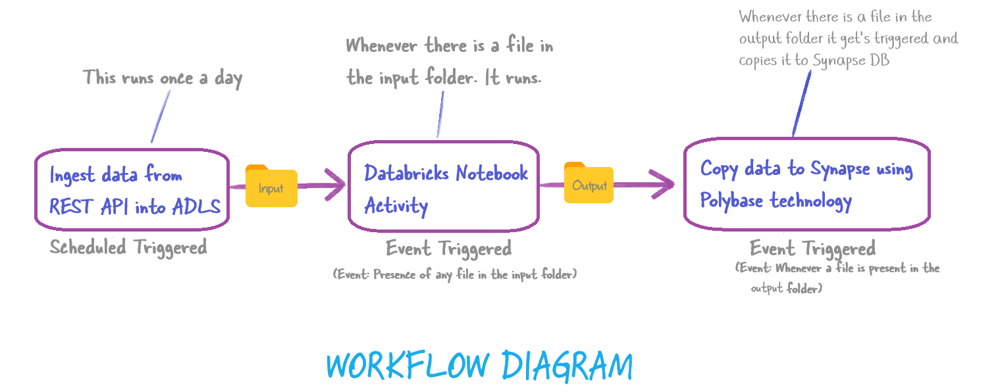

This project will clear three areas:

How to ingest data from a REST API to ADLS
Mounting ADLS on Databricks
Transform data in ADLS using Databricks
How to load the processed data into Synapse using ADF Polybase
How to use Azure data factory triggers

Resoruces used:

ADF
ADLS
Azure Databricks(Transformation)
Azure Synapse

