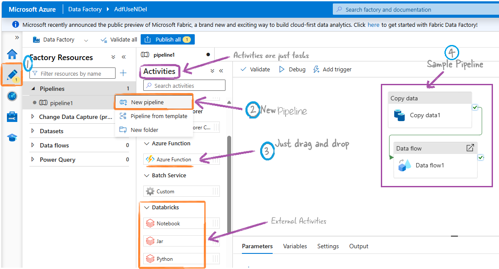

- [Synapse ETL Pipelines](#synapse-etl-pipelines)
  - [Activities](#activities)
    - [Copy data](#copy-data)
    - [Data flow](#data-flow)
    - [Other Activities](#other-activities)
    - [Control Flow Activities](#control-flow-activities)
    - [Additional Activities](#additional-activities)
  - [Integration Runtime](#integration-runtime)
  - [Linked Service](#linked-service)
  - [Datasets](#datasets)

#  Synapse ETL Pipelines

    

        In Synapse or ADF, a pipeline is simply a workflow. It's a collection of activities.
    

##  Activities

    

        These are just the tasks/steps in a pipeline.
    

### Copy data 

This lets you import data into the cloud. It's so important that you can build a project using just this activity. [Learn more](https://learn.microsoft.com/en-us/azure/data-factory/copy-activity-overview).

### [Data flow](https://learn.microsoft.com/en-us/azure/data-factory/transform-data)
- **Data flow:** The most important activity for data transformation.
  - **Mapping Data Flows:** Use a GUI to create data transformation steps. Azure runs these on a behind-the-scenes Spark cluster managed by Azure. [Learn more](https://learn.microsoft.com/en-us/training/modules/code-free-transformation-scale/4-author-azure-data-factory-mapping-data-flow).
  - **Wrangling Data Flows:** Use Excel-like Power Query for data preparation, integrating with Power Query Online and using Spark for execution.

Now, if you want to bypass ADF and do your own coding, manage your own env etc you you can use these activities.

- **HDInsight Activities:** Use Hive, Pig, MapReduce, or Spark on your HDInsight cluster in Azure.

- **Databricks Activities:**
  - Notebook Activity
  - Jar Activity
  - Python Activity

- **Custom Activity:** Execute custom code or scripts.

**Note:** Data Flow activities run on Apache Spark clusters. Microsoft makes things easy by adding a GUI, but Dataflows are essentially Spark activities.

### Other Activities
- **Azure ML Studio (Classic) Activity:** Execute machine learning pipelines.
- **Stored Procedure Activity:** Execute a stored procedure in a database.
- **Custom Activity:** Execute custom code or scripts.

### Control Flow Activities
These activities control the execution flow of a pipeline.

- **If Condition Activity:** Execute different paths based on conditions.
- **For Each Activity:** Iterate over a collection of items.
- **Until Activity:** Repeat an activity until a condition is met.
- **Wait Activity:** Pause the pipeline execution for a specified duration.

### Additional Activities
- **Web Activity:** Make HTTP requests.
- **Azure Function Activity:** Invoke an Azure Function.
- **Execute Pipeline Activity:** Call another pipeline.

 
## Integration Runtime
It's the infrastructure part. It provides the hardware and running environment, and it connects to on-premises systems or local laptops.

## Linked Service

These are connection strings or configurations that define how to connect to data sources or compute environments.

## Datasets
These represent the data that gets processed in the pipeline.
