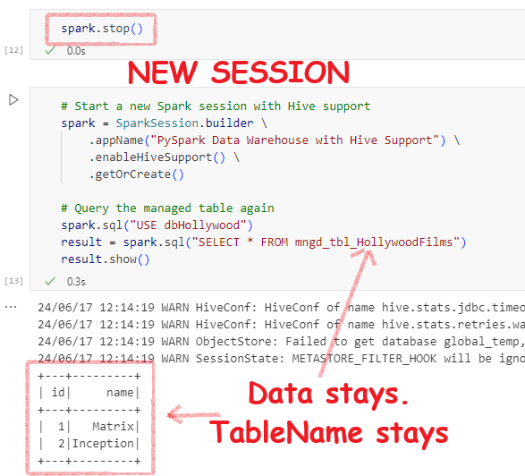
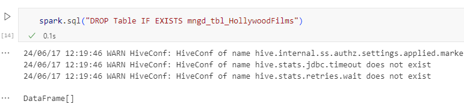
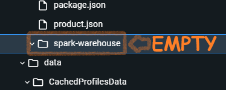

<details open markdown="block">
  <summary>
    Table of contents
  </summary>
  {: .text-delta }
1. TOC
{:toc}
</details>

# Create a Warehouse with Just a simple Pyspark setup

I am sad; I have just Python and I managed to pip install PySpark. I want to create a decent warehouse on my laptop. Am I being impractical? I read somewhere a DW is for data at rest, spark is for data in motion. Well, no. Let's see what comes free with PySpark:

**Built-in Hive**: PySpark comes with a small Hive setup plus a Derby database by default as the Hive metastore. This means you can create managed tables just like you did in Synapse Analytics.

**Automatic spark-warehouse folder**: PySpark automatically creates a `spark-warehouse` directory to store table data. This directory is created in your working directory, and all managed tables are stored as Parquet files within this directory.

**Automatic .Parquet**: When you create tables using Hive support in PySpark, the data is stored in Parquet format by default.

**Bonus! Delta Table Support**: You just have to pip install delta, and then you can save the data in the enhanced Delta format, making it an even better warehouse.


First, let me create a Spark session with Hive support.

```python
from pyspark.sql import SparkSession

# Start Spark session with Hive support
spark = SparkSession.builder \
    .appName("PySpark Data Warehouse with Hive Support") \
    .enableHiveSupport() \
    .getOrCreate()
```

Then let me create a database and an empty table inside it:

```python
# Create a database
spark.sql("CREATE DATABASE IF NOT EXISTS dbHollywood")

# Switch to the new database
spark.sql("USE dbHollywood")

# Create a managed table
spark.sql("""
CREATE TABLE IF NOT EXISTS mngd_tbl_HollywoodFilms (
    id INT,
    name STRING
)
""")
```
THis is how the folders are getting creatd in the spark-warehouse folder:


Now, let me insert some data:

```python
spark.sql("USE dbHollywood")

# Insert data into the managed table
spark.sql("""
INSERT INTO mngd_tbl_HollywoodFilms VALUES
(1, 'Matrix'),
(2, 'Inception')
""")
```
Wow, these parquet fiels were auto-craeted. I didnt mention any format. In hive support data is auto-stored as .parquet.


Now, if I query the table in teh same session I see this:


Now, let me stop the session and create a new session to see if things are just a one-night stand or a lifetime friendship. If I have no metatore I can't query using the table name, though the backend data  might be present.





Now, let me try to delete the table and then the database and see if the data goes away or not. Else, how can I call them managed tables?




Here is the snapshot of the spark-warehouse folder. Only DB folder, table folder completely deleted.


Now, let me delete the database(ignore the warning)


The database parent folder completely gone:




## Using Delta Tables

Now, I am very satisfied with my warehouse and I want to use Spark Tables v2. Which is Delta table. The difference is that in delta table you can update the fields and also spark tables are basic and delta acidic(haha).

To have delta table feature in our plain old python envirnmetn. Let's instll **delta-spark** library:

```bash
pip install delta-spark
```

Then, we will create the session with both delta and hive support. Create a database, then a managed table with delta. Then we will insert some data and then append the data. 

```python
from pyspark.sql import SparkSession
from delta import configure_spark_with_delta_pip
from pyspark.sql.types import StructType, StructField, IntegerType, StringType
from pyspark.sql import Row

# Configure Spark session with Delta Lake and Hive support
spark = configure_spark_with_delta_pip(
    SparkSession.builder
    .appName("DeltaLakeExample")
    .config("spark.sql.extensions", "io.delta.sql.DeltaSparkSessionExtension")
    .config("spark.sql.catalog.spark_catalog", "org.apache.spark.sql.delta.catalog.DeltaCatalog")
    .enableHiveSupport()  # Enable Hive support
).getOrCreate()

# Create a database
spark.sql("CREATE DATABASE IF NOT EXISTS Hollywood")

# Switch to the new database
spark.sql("USE Hollywood")

# Create a managed Delta table
spark.sql("""
CREATE TABLE IF NOT EXISTS mgd_delta_movies (
    moviename STRING
) USING delta
""")

# Insert data using SQL
spark.sql("""
INSERT INTO mgd_delta_movies (moviename)
VALUES 
    ('Titanic'),
    ('Inception')
""")

# Define schema
schema = StructType([StructField("moviename", StringType(), True)])

# Create DataFrame with defined schema
data = [Row(name='Scream')]

df = spark.createDataFrame(data, schema=schema)

# Insert the DataFrame data into the managed Delta table
df.write.format("delta").mode("append").saveAsTable("mgd_delta_movies")
```
How, do we know that the tables are delta and they are manged? Its simple

- We didn't give any path for during create table command. 
- And the folder for the table is inside spark-warehouse/db_folder/

Thats not engouh? Lets run some commands dbas use to find out:

```python
spark.sql("DESCRIBE FORMATTED Hollywood.Mgd_Delta_Movies").show(truncate=False)
```


Also

```python
spark.sql("DESCRIBE DETAIL Hollywood.Mgd_Delta_Movies").show(truncate=False)
```
---
