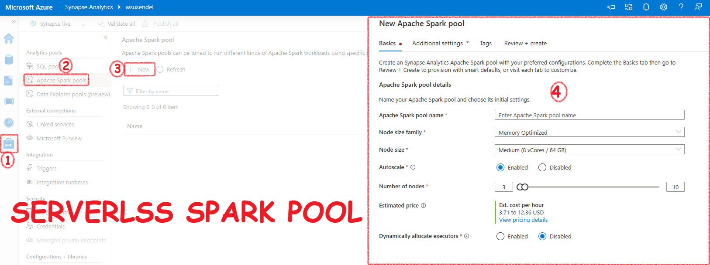

- [The Core Concepts of Synapse Analytics](#the-core-concepts-of-synapse-analytics)
  - [Synapse Workspace](#synapse-workspace)
  - [Linked Services](#linked-services)
  - [Synapse SQL Pools](#synapse-sql-pools)
    - [Serverless SQL Pool](#serverless-sql-pool)
    - [Dedicated Pool (AKA SQL DW)](#dedicated-pool-aka-sql-dw)
  - [Synapse Spark Pool](#synapse-spark-pool)
  - [Pipelines](#pipelines)
  - [Integration Datasets](#integration-datasets)
  - [Integration runtime](#integration-runtime)

# The Core Concepts of Synapse Analytics

Here are the building blocks of Azure Synapse Analytics

## Synapse Workspace

- It is like the IDE for Synapse.

> **Remember**: A Synapse workspace must be connected to a storage account (ADLS Gen2) and a file system (container inside that ADLS Gen2). At the time of creating a workspace you are asked to choose or create a new ADLS account and a container inside it

You can see the connected ADLS storage from Data tab/Linked area.

- Your workspace can perform analytics using SQL or Apache Spark. The term 'Pool' is used for this. It's just the name for the application. For traditional users, 'Pool' might sound like a new technology, but it's simply the runtime infrastructure.

## Linked Services

These are just connection strings used by the Synapse workspace to connect to external resources.

## Synapse SQL Pools

Synapse SQL gives you two SQL products: a dedicated SQL Warehouse (Large SQL Server) and an on-demand SQL query running engine.

### Serverless SQL Pool

Just an SQL query running engine.

- Just a query running engine.
- On-demand: Only pay for the queries you run. It stays online, but don’t worry. You don’t pay anything until you run something.
- Doesn’t have its own storage: Doesn’t store anything. It only runs queries in ADLS, etc.
- Cheap: Very cheap. $0 if you don’t run a single SQL query.

### Dedicated Pool (AKA SQL DW)

A full SQL Warehouse (a large SQL server) that you own. This means there is a traditional, old-school SQL database with real, dedicated storage, just like the good old MSSQL Server, not just some abstract storage solution using ADLS (no insults to Serverless Pool ;-). It’s the poor man’s engine).

- **Full-blown SQL Warehouse**: Just a few years ago, it was called SQL Data Warehouse.
- **Own local storage, not international calls to ADLS**: It has its own storage, just like SQL Server. No, it’s not ADLS; it’s real SQL storage.
- **Once on, you pay by the hour**: Since it’s dedicated, Microsoft covers the hardware costs for your dedicated SQL server. Whether you use it or not, you pay by the hour, and it’s quite expensive. Run it for a day, and your full trial subscription might be gone.

## Synapse Spark Pool

Synapse gives you a ready-to-use Apache Spark environment called a Serverless Spark Pool. It's like the Serverless SQL Pool, meaning you only pay when you use it. In the background, it's a Spark cluster, but it's called a Pool. In Databricks, you create a Spark cluster for a Spark environment. In Synapse, you create a Spark Pool. The end result is the same.

**Points to Remember:**
- It's just an Apache Spark cluster behind the scenes.
- Use it to run Spark jobs or Spark queries.
- You can write Spark logic in PySpark, SparkSQL, Scala, or even C#.
- There are two ways to run Spark code in Synapse:
  - **Spark Notebooks:** Like Jupyter notebooks.
  - **Spark Job Definitions:** For running batch Spark jobs using jar files.

## Pipelines

Pipelines in Synapse are the same as Azure Data Factory Pipelines. They are 100% identical.

An activity is a task you want to perform. A pipeline is a group of activities, like copying data or running a notebook.

**Points to Remember:**
- Syapse Pipelines is actually ADF.
- Pipelines are collections of activities (tasks like copying data, running a notebook, etc.).
- **Data Flows:** A type of activity that lets you create transformations without code using graphics. It runs on **Spark behind the scenes**.
- **Triggers:** To execute pipelines on a schedule.

## Integration Datasets

These are pointers to your data. They are required when you create an activity like a Copy activity.

- Tell me where the data is? In a blob storage.
- What is the format? CSV.
- Tell me the connection string (Linked service) to that file/folder.

You create it from the Data section in Synapse.

## [Integration runtime](IntegrationRuntime.html)

Copying data is one of the main activities in Synapse and ADF. The main tool used for this is **Integration Runtime**. It's like a **bridge** that connects Synapse and ADF with data from on-premises and external sources.

There are **3 types** of Integration Runtime:

1. **Azure Integration Runtime:** This is used to copy data within Azure or between cloud services.
2. **Self-hosted Integration Runtime:** This is the bridge to copy data from your local machine to the Azure cloud. It is a software you install on your local computer.
3. **Azure-SSIS Integration Runtime:** This allows you to lift and shift your SSIS packages to Azure.

