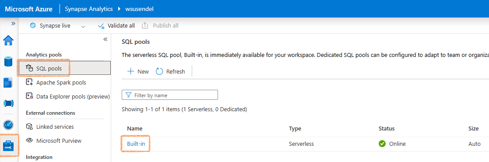
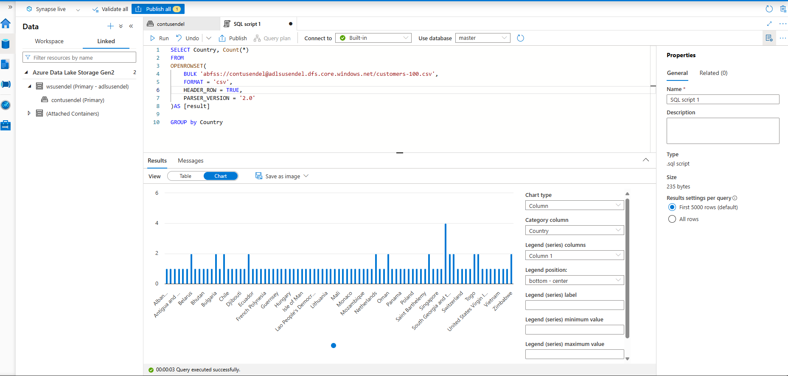

## Background

Here I will show you how to run query using Serverless SQL pool. Every SA workspae comes with a built-in serverless SQL pool. Its just an engine to run your SQL queries with no own storage. Just an engine.

Its built-in/serverless/online/Auto



## Using Serverless SQL Pool
### Let's get started

Firs let's upload some data. We know every SA workspace is connected to a default ADLS folder. Let's upload a csv file to it.


### Let's run the script

```sql
SELECT *

FROM
OPENROWSET( 
    BULK 'abfss://contusendel@adlsusendel.dfs.core.windows.net/customers-100.csv',
    FORMAT = 'csv',
    HEADER_ROW = TRUE,
    PARSER_VERSION = '2.0'
)AS [result]
```

```sql
SELECT Country, Count(*)
FROM
OPENROWSET( 
    BULK 'abfss://contusendel@adlsusendel.dfs.core.windows.net/customers-100.csv',
    FORMAT = 'csv',
    HEADER_ROW = TRUE,
    PARSER_VERSION = '2.0'
)AS [result]

GROUP by Country
```


## Using Dedicated SQL Pool
