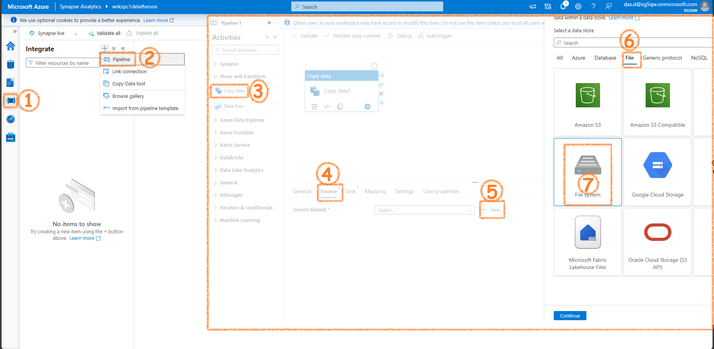

## Background

Here we will see how to handle data usig Spark in Synapse.

## Let's get started

First thing we would need is a Spark Pool. The serverless Spark is similar to Serverless SQL Pool. That means, only when it is working you need to pay money. No need to worry when you are not proccessing anything. You wont be charged a penny. The spark pool decides the number of nodes in the actual spark cluster in the background. If you want to work with Spark, you must create a Serverless Spark pool.

It will ahve auto pause etc. 