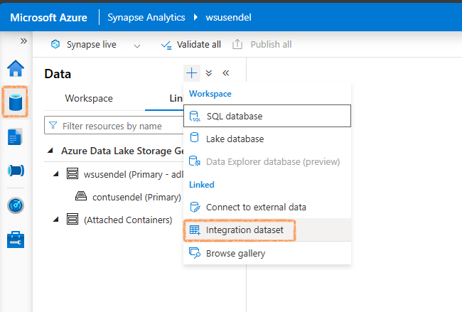

- [Uploading CSV Files from Laptop to ADLS using Copy Data Activity and SHIR](#uploading-csv-files-from-laptop-to-adls-using-copy-data-activity-and-shir)
  - [Create and Configure an Integration Runtime](#create-and-configure-an-integration-runtime)
  - [Create Two Linked Services (Connection Strings)](#create-two-linked-services-connection-strings)
    - [Linked Service to Laptop's Folder](#linked-service-to-laptops-folder)
      - [A commonly encountered error](#a-commonly-encountered-error)
    - [Linked Service to ADLS](#linked-service-to-adls)
  - [Create a Pipeline with Copy Data Activity](#create-a-pipeline-with-copy-data-activity)
  - [Execute the Pipeline](#execute-the-pipeline)
- [Appendix:](#appendix)

## Uploading CSV Files from Laptop to ADLS using Copy Data Activity and SHIR

We have some CSV files on our laptop that we want to upload to a folder in Azure Data Lake Storage (ADLS). The Microsoft-recommended way to do this is by using a pipeline with the Copy Data activity, connecting through a Self-hosted Integration Runtime (SHIR). Let's walk through the steps to achieve this:

### Create and Configure an Integration Runtime

The first of all steps it to have an integration runtime which is the backbone of our connection to the local folder. 
- In your synapse workspace go to **Manage** -> **Integration** -> **Integration runtime**. 
- Click on **New**, then in the settings, you will have two options. Choose an **express setup**.


   <p style="color: #006600; font-family: 'Trebuchet MS', Helvetica, sans-serif; background-color: #e6ffe6; padding: 15px; border-left: 5px solid #00cc66;">
   Express setup is a quicker option as it both installs and links the local IR environment with the synapse setup. If you prefer to do a manual setup, refer to to appenxis.
   </p>

### Create Two Linked Services (Connection Strings)

Next, we need to create two connection strings (also known as Linked Services): one to the local laptop's folder (source) and another to the ADLS (destination).

#### Linked Service to Laptop's Folder

1. In Synapse workspace, go to **Manage** -> **Linked Services** -> **New**.
2. Select **File System** and provide a name for the linked service.
3. Select the Integration Runtime we created earlier.

4. Specify the path to the CSV files on your laptop and provide a user name and password which has read/write access to the folder.


   <p style="color: #006600; font-family: 'Trebuchet MS', Helvetica, sans-serif; background-color: #e6ffe6; padding: 15px; border-left: 5px solid #00cc66;">
   Here, sa is a local user which  has read/write access to the folder. 
   </p>
   
   

##### A commonly encountered error

After setting up the linked service when you Test connection it may  fail. 

   

This has nothing to do with the setup but a windows security feature which causes the issue. To resolve this, open **Command Prompt** as **Administrator** and run the following commands:

   ```shell
   cd C:\Program Files\Microsoft Integration Runtime\5.0\Shared
   .\dmgcmd.exe -DisableLocalFolderPathValidation
   ```

This will disable local folder path validation, and Test connection will pass this time.

   

#### Linked Service to ADLS

1. Navigate to **Manage** -> **Linked Services** -> **New**.
2. Select **Azure Data Lake Storage Gen2** and provide the necessary details like account name, account key, or SAS token.


### Create a Pipeline with Copy Data Activity

Now that the linked services are configured, create a pipeline to copy data:

1. In Synapse workspace, go to **Integrate** -> **Pipelines** -> **New Pipeline**.

   

2. **Add Copy Data Activity**: Drag and drop the **Copy Data** activity onto the pipeline canvas.
3. **Configure the Source**: Select the linked service for the laptop's folder and specify the file path and format (CSV).
4. **Configure the Sink**: Select the linked service for ADLS and specify the destination folder.

### Execute the Pipeline

1. **Validate the Pipeline**: Ensure all configurations are correct and validate the pipeline.
2. **Run the Pipeline**: Execute the pipeline to start the data transfer from your laptop to ADLS.

## Appendix:

The integratoin runtime  can also be downloaded and installed seprately from Microsoft software store


Install it on your local machine. The steps are pretty simple. Just click click.
    



