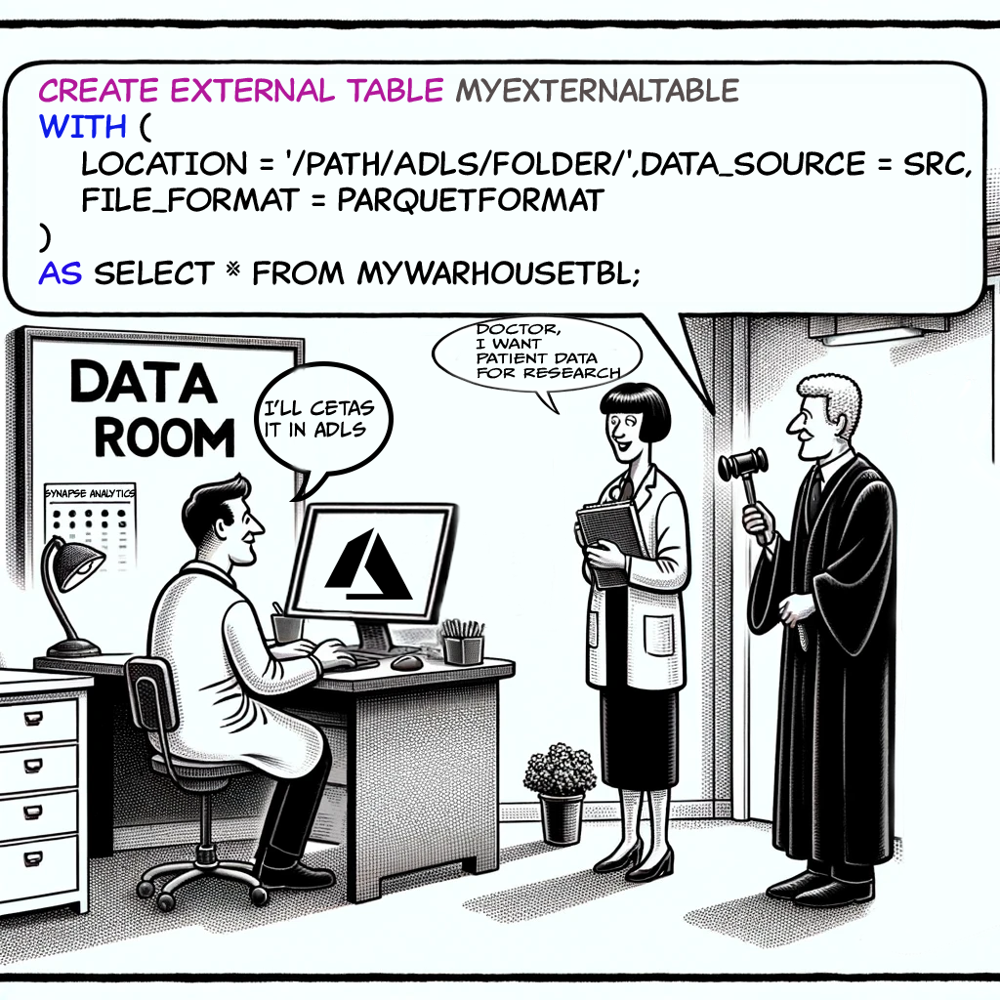

- [Background](#background)
    - [If you have Synapse, why not save the data in Synapse SQL warehouse?](#if-you-have-synapse-why-not-save-the-data-in-synapse-sql-warehouse)
  - [Give me some real examples](#give-me-some-real-examples)
    - [Removing Patient's Identity and Sharing Their Data as ADLS Tables](#removing-patients-identity-and-sharing-their-data-as-adls-tables)
    - [Inlet wants to store chip Sensor data and Share as Tables for university students](#inlet-wants-to-store-chip-sensor-data-and-share-as-tables-for-university-students)
- [CETAS Scenarios](#cetas-scenarios)
  - [Pull Data from Synapse Warehouse and put It in ADLS CETAS Tables](#pull-data-from-synapse-warehouse-and-put-it-in-adls-cetas-tables)
    - [Get the access sorted](#get-the-access-sorted)
    - [Custom DB to store connection info - Serverless SQL only](#custom-db-to-store-connection-info---serverless-sql-only)
    - [Pull-from-Warehouse and Put-in ADLS CETAS](#pull-from-warehouse-and-put-in-adls-cetas)
  - [Pull Data from ADLS and Pur as ADLS CETAS Tables](#pull-data-from-adls-and-pur-as-adls-cetas-tables)
    - [Get the access sorted](#get-the-access-sorted-1)
    - [Pull from ADLS \& Put in ADLS as CETAS](#pull-from-adls--put-in-adls-as-cetas)
- [Service Principal Method and SAS Methods](#service-principal-method-and-sas-methods)
  - [Service Principal Authentication Setup](#service-principal-authentication-setup)
  - [Shared Access Signature (SAS) Setup](#shared-access-signature-sas-setup)
- [Alternative to CETAS?](#alternative-to-cetas)
    - [1. Azure Synapse Spark Pools](#1-azure-synapse-spark-pools)
    - [2. Azure Data Factory (ADF)](#2-azure-data-factory-adf)
    - [3. PolyBase](#3-polybase)


# <span style="color: Teal">Background</span>


CETAS is just a **CREATE TABLE *TableName*** command. But, the table is created in Azure Data Lake and is called an External Table. **External** here means it's not inside the Synapse SQL data warehouse (Fancy name: Dedicated SQL Pool).

### If you have Synapse, why not save the data in Synapse SQL warehouse?

Because Synapse SQL warehouse storage is expensive and not meant for everyone to access.


## Give me some real examples

### Removing Patient's Identity and Sharing Their Data as ADLS Tables

A hospital wants to share patient data stored in its Synapse SQL warehouse with researchers. Will they let the entire world access their Synapse warehouse? No way, that would land them in jail. Patient data can't be shared directly. So, they create CETAS in Azure Data Lake with data from their SQL warehouse.

**Benefits**: Avoids jail time and helps the research world make new medicines.




### Inlet wants to store chip Sensor data and Share as Tables for university students

Inlet company collects a huge amount of sensor data from chips in ADLS. They have an external university research team that wants to analyze it. The in-house team connects to Synapse using PySpark to clean the data. Then, using Synapse SQL (serverless), they create neat, report-ready CETAS tables in ADLS. The external university is given access to these tables only, keeping Inlet's internal Synapse warehouse out of the entire process.

Hence, CETAS is an important command for creating external tables and storing the data from your SQL query permanently as tables in ADLS.

# <span style="color: CadetBlue">CETAS Scenarios</span>

## Pull Data from Synapse Warehouse and put It in ADLS CETAS Tables

Suppose you are a data engineer with access to both the Azure Data Lake Gen2 account and the Synapse workspace. The patient records are present in the SQL warehouse, and you want to export this data into ADLS as a table.


### Get the access sorted

1. **Enable Managed Identity for Synapse Workspace:**

    Here, we will use Managed Identity. Why? Because it's the simplest, and Azure handles everything for us. But there are other options for access too, like the **Service Principal** method and the **SAS** method.

   - Go to your Synapse workspace in the Azure portal.
   - Under the "Identity" section, ensure the "System-assigned managed identity" is enabled.

2. **Grant Access to Managed Identity on ADLS Gen2:**

   - Go to your ADLS Gen2 account in the Azure portal.
   - Navigate to the "Access Control (IAM)" section.
   - Click on "Add role assignment."
   - Assign the role "Storage Blob Data Contributor" to the managed identity of your Synapse workspace.

### Custom DB to store connection info - Serverless SQL only

When using CETAS with a serverless SQL pool, don't use the built-in database for connection info, credentials, or file formats. Instead, create a new database to keep things organized. For a dedicated SQL pool, you can use the built-in database.

1. **Create Custom Database:**

   ```sql
   CREATE DATABASE MyCustDbForCETASInfo;
   ```

2. **Use Custom Database:**

   ```sql
   USE MyCustDbForCETASInfo;
   ```


### Pull-from-Warehouse and Put-in ADLS CETAS

Next, create an external table in ADLS Gen2 using managed identity for authentication.

1. **Create Database Scoped Credential:**

   ```sql
   USE MyCustDbForCETASInfo;

   CREATE DATABASE SCOPED CREDENTIAL MyADLSCredential
   WITH
   IDENTITY = 'Managed Identity';
   ```

2. **Create External Data Source:**

   ```sql
   CREATE EXTERNAL DATA SOURCE MyADLS
   WITH (
       TYPE = HADOOP,
       LOCATION = 'abfss://myfilesystem@myadlsaccount.dfs.core.windows.net',
       CREDENTIAL = MyADLSCredential
   );
   ```

3. **Create External File Format:**

   ```sql
   CREATE EXTERNAL FILE FORMAT ParquetFormat
   WITH (
       FORMAT_TYPE = PARQUET
   );
   ```

4. **Create and fill the CETAS Table:**

   ```sql
   CREATE EXTERNAL TABLE SalesDataExternal
   WITH (
       LOCATION = '/salesdata/',
       DATA_SOURCE = MyADLS,
       FILE_FORMAT = ParquetFormat
   )
   AS
   SELECT * FROM SalesData;
   ```

## Pull Data from ADLS and Pur as ADLS CETAS Tables

Like the Inlet company case study, let's say you have lots of .parquet files as data. You want to clean this data and create tables in ADLS itself using Synapse. To do this follow these steps,

### Get the access sorted

The creation of managed identity etc have been left out. As I explained them before.

### Pull from ADLS & Put in ADLS as CETAS

1. **Create Database Scoped Credential:**

   ```sql
   CREATE DATABASE SCOPED CREDENTIAL MyADLSCredential
   WITH
   IDENTITY = 'Managed Identity';
   ```

2. **Create External Data Source:**

   ```sql
   -- Create an external data source for the Azure storage account
   CREATE EXTERNAL DATA SOURCE MyADLS
   WITH (
       TYPE = HADOOP, -- For dedicated SQL pool
       -- TYPE = BLOB_STORAGE, -- For serverless SQL pool
       LOCATION = 'abfss://myfilesystem@myadlsaccount.dfs.core.windows.net',
       CREDENTIAL = MyADLSCredential
   );
   ```

3. **Create External File Format:**

   ```sql
   CREATE EXTERNAL FILE FORMAT ParquetFormat
   WITH (
       FORMAT_TYPE = PARQUET
   );
   ```

4. **Query Data from ADLS:**

   ```sql
   SELECT *
   FROM OPENROWSET(
       BULK 'abfss://myfilesystem@myadlsaccount.dfs.core.windows.net/path/to/data/',
       FORMAT = 'PARQUET'
   ) AS [result]
   ```

5. **Create the CETAS Table:**

   ```sql
   CREATE EXTERNAL TABLE ProcessedDataExternal
   WITH (
       LOCATION = '/processeddata/',
       DATA_SOURCE = MyADLS,
       FILE_FORMAT = ParquetFormat
   )
   AS
   SELECT * FROM OPENROWSET(
       BULK 'abfss://myfilesystem@myadlsaccount.dfs.core.windows.net/path/to/data/',
       FORMAT = 'PARQUET'
   ) AS [result];
   ```

# <span style="color: Navy">Service Principal Method and SAS Methods</span>

We used managed  identity in our examples. Apart from Managed Identity, you have a couple of other options for connecting Synapse to Azure Data Lake Storage (ADLS):

1. **Service Principal Authentication:** A service principal is like a special user for applications to access Azure resources. You create a service principal and give it the needed permissions on ADLS. Its like *functional id*.

2. **Shared Access Signature (SAS):** A Shared Access Signature (SAS) allows limited access to your storage account for a specific time and with specific permissions.

Here’s how you can set up each method:

## Service Principal Authentication Setup

1. **Create a Service Principal:** You can create a service principal using the Azure portal, Azure CLI, or PowerShell. Here is an example using Azure CLI:
     ```sh
     az ad sp create-for-rbac --name <service-principal-name> --role "Storage Blob Data Contributor" --scopes /subscriptions/<subscription-id>/resourceGroups/<resource-group>/providers/Microsoft.Storage/storageAccounts/<storage-account>
     ```

2. **Grant Access to the Service Principal on ADLS Gen2:** Assign the necessary role to the service principal:
     ```sh
     az role assignment create --assignee <appId> --role "Storage Blob Data Contributor" --scope /subscriptions/<subscription-id>/resourceGroups/<resource-group>/providers/Microsoft.Storage/storageAccounts/<storage-account>
     ```

3. **Configure the External Data Source in Synapse:** Use the service principal credentials in your SQL script:
     ```sql
     CREATE DATABASE SCOPED CREDENTIAL MyADLSCredential
     WITH
     IDENTITY = 'service-principal-id',
     SECRET = 'service-principal-password';

     CREATE EXTERNAL DATA SOURCE MyADLS
     WITH (
         TYPE = HADOOP,
         LOCATION = 'abfss://myfilesystem@myadlsaccount.dfs.core.windows.net',
         CREDENTIAL = MyADLSCredential
     );
     ```

## Shared Access Signature (SAS) Setup

1. **Generate a SAS Token:**
  You can generate a SAS token through the Azure portal, Azure Storage Explorer, Azure CLI, or programmatically using Azure Storage SDKs. Here is an example using Azure CLI:
     ```sh
     az storage account generate-sas --permissions rwdlacup --account-name <storage-account> --services b --resource-types co --expiry <expiry-date>
     ```

2. **Configure the External Data Source in Synapse:** Use the SAS token in your SQL script:
     ```sql
     CREATE DATABASE SCOPED CREDENTIAL MyADLSSASCredential
     WITH
     IDENTITY = 'SHARED ACCESS SIGNATURE',
     SECRET = 'sas-token';

     CREATE EXTERNAL DATA SOURCE MyADLS
     WITH (
         TYPE = HADOOP,
         LOCATION = 'abfss://myfilesystem@myadlsaccount.dfs.core.windows.net',
         CREDENTIAL = MyADLSSASCredential
     );
     ```

Managed Identity is usually recommended because it's easy to use and secure, but Service Principal and SAS can be useful in certain situations where Managed Identity might not work.

# <span style="color: CornflowerBlue">Alternative to CETAS?</span>

### 1. Azure Synapse Spark Pools

Spark capability, pyspark-notebooks comes with Synapse. You can use spark pools in Synapse. This can be more efficeint than JDBC for huge volume of data handling.

```python
from pyspark.sql import SparkSession

# Initialize Spark session
spark = SparkSession.builder \
    .appName("SynapseSparkPoolExample") \
    .getOrCreate()

# Read data from ADLS
df = spark.read \
    .format("parquet") \
    .load("abfss://myfilesystem@myadlsaccount.dfs.core.windows.net/path/to/data/")

# Process the data
processed_df = df.filter(df['SalesDate'] >= '2023-01-01')

# Write the processed data back to ADLS
processed_df.write \
    .mode("overwrite") \
    .format("parquet") \
    .save("abfss://myfilesystem@myadlsaccount.dfs.core.windows.net/processeddata/")

# Register the Parquet files as a table in the Spark session
spark.sql("CREATE EXTERNAL TABLE IF NOT EXISTS SalesDataExternal USING parquet LOCATION 'abfss://myfilesystem@myadlsaccount.dfs.core.windows.net/processeddata/'")

```

### 2. Azure Data Factory (ADF)
ADF is one of the core component of Synapse. It's main job is to tranfer data from here to there. This can be a preferred option to avoid lengthy coding etc. Typical steps to perform the activity would be:

- **Create a pipeline**: This is the workflow for the entire activity.
- **Use Copy Activity**: This is a very important activity to copy data and used frequently in pipelines.

### 3. PolyBase
PolyBase is a technology for MSSQL Server. It allows you to query external data as if it were part of the database.

In Synapse we created CETAS etc. We were already using Polybase technology.