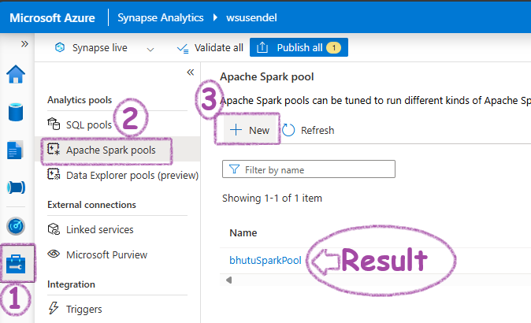
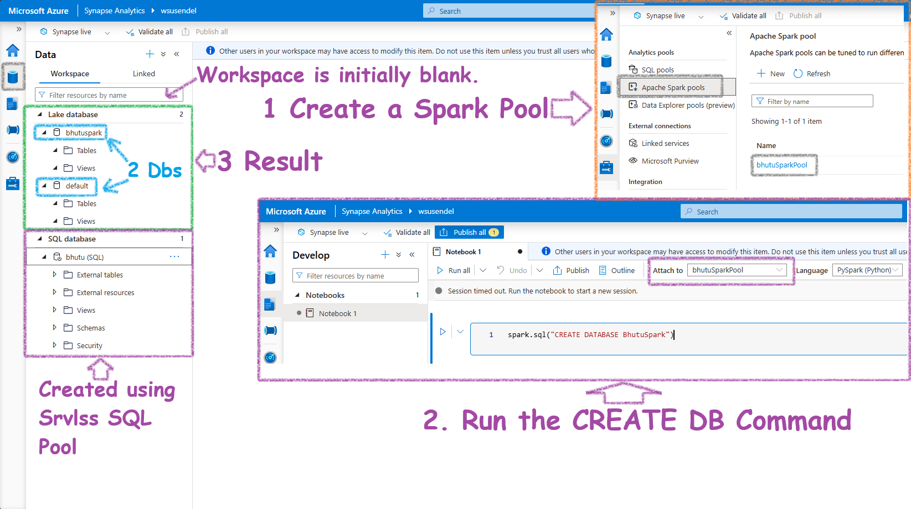
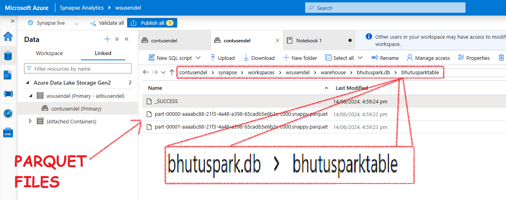

- [The Databases Types in Synapse](#the-databases-types-in-synapse)
- [Spark Databases](#spark-databases)
  - [Spark DB v1 - Lake Database](#spark-db-v1---lake-database)
    - [What Happens after the CREATE DB Command?](#what-happens-after-the-create-db-command)
    - [What happens after the CREATE TABLE command?](#what-happens-after-the-create-table-command)
    - [What happens after the INSERT data command?](#what-happens-after-the-insert-data-command)
    - [Summary](#summary)
  - [Spark DB v2 - Delta Lake/Lakehouse](#spark-db-v2---delta-lakelakehouse)
  - [Managed and External Spark Tables](#managed-and-external-spark-tables)
    - [Managed Tables](#managed-tables)
    - [External Tables](#external-tables)
  - [How to create Managed and External Spark Tables](#how-to-create-managed-and-external-spark-tables)
    - [Empty Managed Table](#empty-managed-table)
    - [Empty External Table](#empty-external-table)
    - [Managed Tables From Existing Data](#managed-tables-from-existing-data)
    - [External Tables From Existing Data](#external-tables-from-existing-data)
    - [DESCRIBE EXTENDED TABLENAME](#describe-extended-tablename)

# The Databases Types in Synapse

Before we dive into this, let's ask ourselves: **How many types of pools** are there in Synapse?. **There are three types**: Serverless SQL, Dedicated SQL, and Serverless Spark pool.

So, it's simple—there are three types of databases, one for each:

1. **Serverless SQL Database**: Created using the Serverless SQL pool.
2. **Dedicated SQL Database**: Created using the Dedicated SQL pool. Note: This is essentially a data warehouse.
3. **Spark Database[Lake Database]**:
   1. **Spark DB v1**: Created using a serverless Spark pool and Spark notebook, called a Spark [Lake] database.
   2. **Spark DB v2(Lakehouse, Delta)**: Similar to v1, but the format of the .parquet files is Delta.

> So, does Apache Spark have database connections? Yes, of course. How else would it run SparkSQL and what about that magic command %%sql? It has robust database capabilities.

# Spark Databases

## Spark DB v1 - Lake Database

A Lake database is a type of DB created by a Spark Pool using a Spark notebook. It’s all virtual; it's not a good-old SQL database but an illusion. The actual data is stored in the ADLS container as folders—one database, one folder. Let's see this in action.

First, the show always starts with a Spark pool. The Serverless Spark pool doesn't come pre-created like the built-in SQL pool. So, let's create one:




Next, open a PySpark notebook and run this command:

```sql
%%sql
CREATE DATABASE BhutuSpark -- Or, spark.sql("CREATE DATABASE BhutuSpark")
```


### What Happens after the CREATE DB Command?

Initially, in a fresh workspace, the Workspace in the Data Tab is completely empty, even if you have an inbuilt SQL pool.


A few minutes after the Spark SQL command to create the database completes, you will see a Lake database structure appearing under the Data workspace. Initially, this will be completely empty. Also, you will notice two databases: the one you created and a default database.


Synapse creates a folder in the connected ADLS container. In the UI, you will see a database structure (tables, views, users, etc.), but in the background, every Spark database is actually a folder in the ADLS container. When you create tables inside the database, there will again be subfolders inside the parent folder.



Now, let's run a command to create an empty table for simplicity:

```sql
%%sql
CREATE TABLE bhutuspark.BhutuSparkTable (
    id INT,
    name STRING
) USING parquet
-- For Pyspark, put inside spark.sql("the command above")
```

This is what you will see in the Data Workspace. Notice it created a table.


### What happens after the CREATE TABLE command?

Serverless SQL and Serverless Spark Pools create their own virtual databases. All data is virtual. What does this mean? The data is not stored inside them like old-school databases; the data is actually stored in your ADLS container. Let's see this:


It creates a folder structure like this:

*ContainerName*/**synapse**/**workspaces**/*WorkSpaceName*/**warehouse**/*DBName.db*/*TableName*


### What happens after the INSERT data command?

Now, let's put some data inside the table:


```sql
INSERT INTO bhutuspark.BhutuSparkTable VALUES (1, 'Alice'), (2, 'Bob')
-- You can use pyspark also, spark.sql("the above command")
```

What will you see? You will see .parquet files inside the table folder. Also, note there are two parquet files. We will just note this for now.



### Summary

- A Lake database, or Spark database, is an illusion-DB created using a Spark pool and a notebook.
- The actual data is stored in Azure Data Lake Storage (ADLS) as folders.
- Each Spark database is one folder, and each table is a subfolder inside that folder.
- The version 1 of Spark tables **only supports Insert** not update or delete.

## Spark DB v2 - Delta Lake/Lakehouse

## Managed and External Spark Tables

In Spark, there are two main types of tables you can create: **Managed Tables** and **External Tables**. Let’s explore what these terms mean and see some examples using both SQL and PySpark.

<p style="color: #003366; font-family: 'Trebuchet MS', Helvetica, sans-serif; background-color: #f0f8ff; padding: 15px; border-left: 5px solid #6699cc; border-radius: 10px; box-shadow: 2px 2px 10px #6699cc;">
<strong>Note:</strong> Spark tables are inherently external since their data is stored in an ADLS container, unlike traditional SQL servers. So, when you hear <em>"External Table,"</em> it means truly external – not inside the default ADLS container, but in a location you specify, like another container or S3. Don't get confused; external means external-external!
</p>


### Managed Tables

A managed table is a Spark SQL table where Spark manages both the metadata and the data. When you create a managed table, Spark will create a folder for the table here: **warehouse**/*DBName.db*/*TableName*

Full path of the folder will be:

*DefaultSynapseADLSContainer*/**synapse**/**workspaces**/*WorkSpaceName*/**warehouse**/*DBName.db*/*TableName*

<p style="color: #003366; font-family: 'Trebuchet MS', Helvetica, sans-serif; background-color: #f0f8ff; padding: 15px; border-left: 5px solid #6699cc; border-radius: 10px; box-shadow: 2px 2px 10px #6699cc;">
<strong>Note:</strong> Don't get excited by hearing "Internal." Here, nothing is internal unlike old-school MSSQL servers. All data is stored outside in some container. "Internal" only means that the container is the default, well-known location.
</p>

<p style="color: navy; font-family: 'Trebuchet MS', Helvetica, sans-serif; background-color: #f8f8f8; padding: 15px; border-left: 5px solid grey; border-radius: 10px; box-shadow: 2px 2px 10px grey;">
<strong>Summary:</strong><br>
<span style="color: darkgreen;">1. Data is stored in a Spark-connected ADLS container.</span><br>
<span style="color: darkred;">2. Spark handles the storage.</span><br>
<span style="color: darkblue;">3. Dropping a managed table deletes both the table metadata and the data.</span><br>
<span style="color: Teal;">4. DO NOT provide the LOCATION field > Table becomes EXTERNAL.</span>
</p>

### External Tables

All Spark tables store data externally. But, an external table is where the data is really external. Meaning, the .parquet/.csv files aren't saved in the default location like:

*DefaultSynapseADLSContainer*/**synapse**/**workspaces**/*WorkSpaceName*/**warehouse**/*DBName.db*/*TableName*

Instead, it stays where it is. Say in some other container or S3, etc. Here Spark creates the shell, but the data is really far away.

<p style="color: navy; font-family: 'Trebuchet MS', Helvetica, sans-serif; background-color: #f8f8f8; padding: 15px; border-left: 5px solid grey; border-radius: 10px; box-shadow: 2px 2px 10px grey;">
<strong>Summary:</strong><br>
<span style="color: darkgreen;">1. You manage the storage location.</span><br>
<span style="color: darkred;">2. Data is stored in a user-specified location.</span><br>
<span style="color: darkblue;">3. Dropping the table only removes the metadata, not the data.</span><br>
<span style="color: Teal;">4. The LOCATION field in SQL is a must</span>
</p>

## How to create Managed and External Spark Tables

### Empty Managed Table
**SparkSQL:**
```sql
CREATE TABLE dbName.mngd_movies (
    movieName STRING,
)
USING parquet;  -- Format: parquet, delta csv, etc.
-- WARNING: DO NOT USE LOCATION. Becomes, external
```
**PySpark-saveAsTable:**
```python
# Step 1: Define the schema for the table
schema = StructType([
    StructField("movieName", StringType(), True)
])

# Step 2: Create an empty DataFrame using the schema
empty_df = spark.createDataFrame([], schema)

# Step 3: Write the empty DataFrame to a managed table
empty_df.write.mode('overwrite').saveAsTable('dbName.mngd_movies')
```

### Empty External Table
**SparkSQL:**
```sql
CREATE TABLE dbName.mngd_movies (
    movieName STRING,
)
USING parquet;  -- Format: parquet, delta csv, etc.
LOCATION 'abfss://your-container@your-storage-account.dfs.core.windows.net/your-path/';
-- WARNING: USE LOCATION. Else, managed
```
### Managed Tables From Existing Data

**PySpark-saveAsTable:**
```python
# Step 1: Read the CSV file into a Spark DataFrame
csv_file_path = 'abfss://your-container@your-storage-account.dfs.core.windows.net/movies.csv'
movies_df = spark.read.csv(csv_file_path, header=True, inferSchema=True)
# Step 2: Create a managed table
movies_df.write.saveAsTable('mngd_movies')
```
**SparkSQL:**
```sql
-- Read the CSV file and create a temporary view
CREATE OR REPLACE TEMPORARY VIEW temp_movies
USING csv
OPTIONS (
    path 'abfss://your-container@your-storage-account.dfs.core.windows.net/movies.csv',
    header 'true'
);

-- Create a managed table from the temporary view
CREATE TABLE dbName.mngd_movies AS SELECT * FROM temp_movies;
```
### External Tables From Existing Data

**SparkSQL:**
```sql
CREATE TABLE dbName.ext_movies (
    movieName STRING
)
USING csv
OPTIONS (header 'true')
LOCATION 'abfss://your-container@your-storage-account.dfs.core.windows.net/movies.csv';
```
### DESCRIBE EXTENDED TABLENAME
In order to see the details of the table a very useful command is. THis tells if the table is managed and where is the location of the folder for this table in the attached ADLS container.

```sql
DESCRIBE EXTENDED TABLEAME
```
