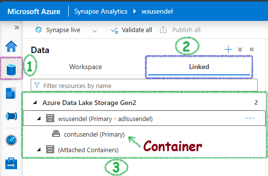

- [Integration Runtime in Azure Synapse Analytics and Azure Data Factory](#integration-runtime-in-azure-synapse-analytics-and-azure-data-factory)
  - [A very simplistic introduction](#a-very-simplistic-introduction)
  - [Types of Integration Runtime](#types-of-integration-runtime)
    - [1. Azure Integration Runtime:](#1-azure-integration-runtime)
    - [2. Self-hosted Integration Runtime:](#2-self-hosted-integration-runtime)
    - [3. Azure-SSIS Integration Runtime:](#3-azure-ssis-integration-runtime)
  - [All connectivity tools in Azure ecosystem](#all-connectivity-tools-in-azure-ecosystem)
  - [Self-hosted IR vs On-premises Data Gateway](#self-hosted-ir-vs-on-premises-data-gateway)
  - [Summary](#summary)

#  Integration Runtime in Azure Synapse Analytics and Azure Data Factory

## A very simplistic introduction

Copying data is the main activity in Synapse and ADF. The main tool to do this **Integration Runtime** is used. It's like a **bridge** that connects Synapse and ADF with data from on-premises and external sources.

However, it's more than just a bridge. It provides the CPU and memory needed for copying and transforming data. It also offers an environment to run your SSIS packages. It can scale up or down if more power is needed. Plus, it ensures that your data transfer is secure.

Where is IR used? It is used in ADF/Synapse pipelines.

## Types of Integration Runtime

There are three types of Integration runtime.

### 1. Azure Integration Runtime:

A cloud-based compute resource for running data integration and transformation tasks in Azure Data Factory and Azure Synapse Analytics.

- **Managed Service**: It is fully managed by Microsoft, running in the cloud.
- **Data Movement**: Primarily handles data movement within the cloud or between cloud services.
- **Activity Dispatch**: Manages and executes data transformation activities in the cloud.
- **Network Access**: Has limitations accessing on-premises resources directly due to network boundaries and security considerations.
- **How to create?**
   - Navigate to Azure Synapse Analytics or ADF.
   - Select the Manage tab.
   - Under Integration Runtimes, click on + New.
   - Choose Azure, and follow the setup wizard.

### 2. Self-hosted Integration Runtime:
 A tool for connecting and moving data between on-premises sources and Azure cloud services.

  - **Installed On-Premises**: Deployed within your on-premises network or in a virtual machine that has network access to your on-premises data sources.
  - **Bridge for Connectivity**: Acts as a secure bridge between on-premises data sources and the cloud.
  - **Data Movement**: Facilitates secure and efficient data transfer from on-premises sources to the cloud and vice versa.
  - **Security**: Ensures secure data transfer using encryption and secure authentication methods.
  - **How to create?**
    - Download the Self-hosted IR installer from the Azure portal.
    - Install the runtime on a machine within your network.
    - Register the self-hosted IR with the Azure Data Factory or Synapse workspace.
    - Configure network settings to allow secure data movement.
    - Set up high availability by adding multiple nodes.

### 3. Azure-SSIS Integration Runtime:

A service to to run SQL Server Integration Services (SSIS) packages in the Azure cloud.

   - Allows you to **lift and shift SSIS packages** to the cloud.
   - Provides a fully managed environment for running SSIS packages in Azure.
   - **How to create?**
     - Navigate to the ADF or Synapse workspace.
     - Go to the Manage tab, and click on Integration Runtimes.
     - Choose Azure-SSIS and follow the creation wizard.
     - Select the pricing tier and node size.
     - Configure the custom setup by installing necessary components.
     - Connect to the SSISDB or create a new one in Azure SQL Database.

## All connectivity tools in Azure ecosystem

| **Product**                         | **Purpose**                                                                                           | **Usage**                                                                | **From**                    | **To**                       |
|-------------------------------------|-------------------------------------------------------------------------------------------------------|-------------------------------------------------------------------------|-----------------------------|------------------------------|
| **On-premises Data Gateway**        | Connects cloud services with on-premises data sources.                                        | Power BI, Power Apps, Power Automate, Azure Analysis Services, Logic Apps| On-premises data sources    | Cloud services               |
| **Self-hosted IR** | For data movement and transformation between on-premises and cloud services.                       | Azure Data Factory (ADF) and Azure Synapse Analytics                     | On-premises data sources    | ADF and Synapse              |
| **Azure IR**  | Executes data flows, data movement, and transformation activities within Azure cloud.                   | Data integration and ETL tasks within Azure cloud                        | Cloud data sources          | Synapse and other cloud services |
| **Azure Synapse Link**              | Provides live data copying from operational stores to Synapse for real-time analytics.                  | Near real-time data replication and analytics                            | Operational data stores (e.g., Azure Cosmos DB) | Synapse                    |
| **PolyBase**                        | Allows querying of external data as if it were in Synapse.                                             | Data virtualization and querying                                        | External data sources (e.g., Azure Blob Storage, ADLS, SQL Server, Oracle, Hadoop) | Synapse                    |
| **Linked Services**                 | It is like a connection string.                     | Managing connections to storage accounts, databases, and other services | External resources          | Synapse and other Azure services |

## Self-hosted IR vs On-premises Data Gateway

The on-premise gateway is quite similar to the self-hosted IR. Are they the same? Can they be used interchangeably? The table below provides the answers:

| Feature                         | Self-hosted Integration Runtime                               | On-premises Data Gateway                                   |
|---------------------------------|--------------------------------------------------------------|-----------------------------------------------------------|
| **Purpose**                     | Facilitates data integration for Azure Data Factory and Synapse Pipelines. | Connects on-premises data sources to Power BI, Power Apps, Power Automate, and Logic Apps. |
| **Supported Services**          | Azure Data Factory, Azure Synapse Analytics.                 | Power BI, Power Apps, Power Automate, Logic Apps.         |
| **Data Transfer Capabilities**  | Handles ETL processes, data movement, and SSIS execution. | Enables real-time connectivity for reporting and app development. |
| **Installation**                | Download and install the .msi file  on your machine |Same, the .exe needs to be downloaded to your local computer and installed. Just like good-old .exe installation. |
| **Security**                    | Secure data transfer with encrypted communication.           | Secure data transfer with encryption and local network connectivity. |

## Summary

Azure Integration Runtime (IR) is a key tool in ADF and Azure Synapse Analytics. It helps move and transform data between different places, like from your on-premises servers to the cloud or within the cloud itself. Azure IR provides the computing power needed to handle these tasks efficiently. Without it, moving and preparing data for analysis would be difficult, slow, and require a lot more manual work.