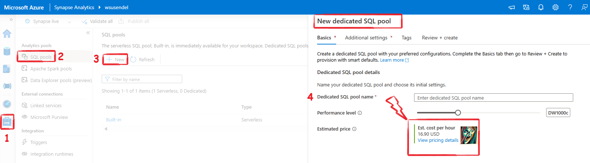
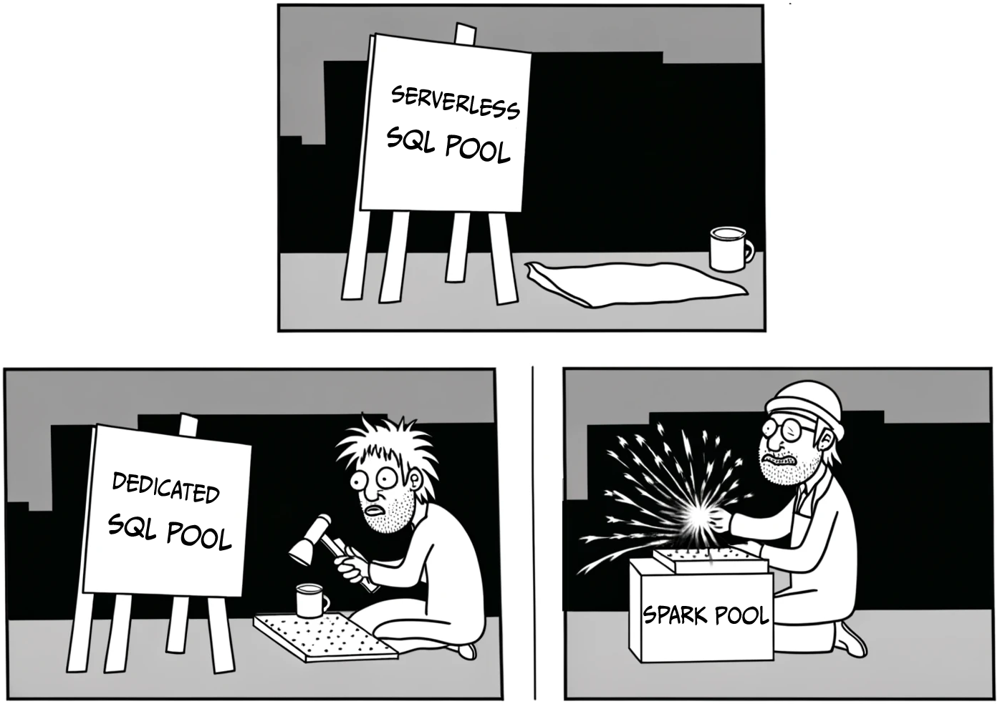
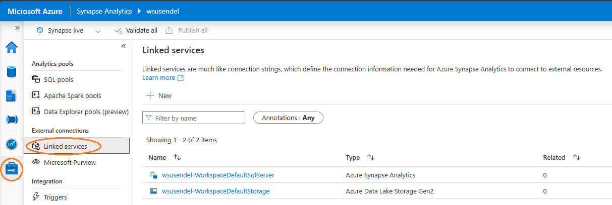

- [Introduction to Azure Synapse Analytics](#introduction-to-azure-synapse-analytics)
- [Pools in Syanpse Analytics](#pools-in-syanpse-analytics)
- [Ways to Connect to Azure Synapse Analytics](#ways-to-connect-to-azure-synapse-analytics)
- [Summary](#summary)

## Introduction to Azure Synapse Analytics

Azure Synapse Analytics is a powerful platform for data integration, storage, and analytics. It has several key components:

1. **Synapse Studio**: This is the main graphical interface for Azure Synapse Analytics. It helps you manage and use the platform. Each Synapse Studio instance comes with an Azure Data Lake Storage (ADLS) container. You can add more containers through linked services.

2. **Linked Services**: These allow you to integrate various data sources like Azure Cosmos DB, SQL Server, and Power Platform Dataverse.

3. **Azure Data Lake**: This is the core storage for Synapse Analytics. Every Synapse instance has an ADLS container, and you can add more using linked services.

4. **Azure Data Factory**: This component is used to ingest and process data within Synapse Analytics.

## Pools in Syanpse Analytics

Think of the term "pool" in as a type of server or warehouse. Although this isn't technically accurate, it helps to understand what a pool does:

- A **built-in serverless SQL pool** Works like an on-demand SQL server. Cheaper and built-in. Fine-tuned to query ADLS data using OPENROWSET.
- A **dedicated SQL pool(sqlxxxxxxx)** A full-fledged large SQL server which stores a data warehouse. Earlier called **SQL Data Warehouse.**
- A **Spark pool(sparkxxxxxxx)** This is a Spark server.

## Ways to Connect to Azure Synapse Analytics

1. **Azure Linked Service**: Connects to various data sources like Cosmos DB, SQL Server, and Power Platform Dataverse.
2. **Power BI Integration**: Allows seamless integration with Power BI for data visualization and reporting.
3. **Microsoft Purview**: Helps with data governance and management.
4. **Azure Machine Learning**: Enables advanced analytics and machine learning capabilities within Synapse.

## Summary
The table below explains the types of data, key operations, and the languages used.

| **Category**             | **Definition**                                                                                     | **Details**                                                                                                                                                                      |
|--------------------------|---------------------------------------------------------------------------------------------------|----------------------------------------------------------------------------------------------------------------------------------------------------------------------------------|
| **Types of Data**        | **Structured**          | Data in table format with rows and columns. Sources include SQL Server or files like .csv and Excel.                                       |
|                          | **Semi-structured**     | Data with some structure but not like a table, e.g., JSON files. Needs adjustments to become structured.                                    |
|                          | **Unstructured**        | Data without a specific format, like PDF files.                                                                                         |
| **Data Operations**      | **Data Integration**    | Connecting different data sources. The first step to link different data sources.                                                      |
|                          | **Data Transformation** | Cleaning and organizing data to make it ready for use. Involves cleaning, sorting, and aligning data.                                       |
|                          | **Data Consolidation**  | Combining data from multiple sources into one place to avoid silos.                                                                     |
| **Languages Used**       | **SQL**                 | The main language for data tasks. Widely used for all data-related work.                                                                              |
|                          | **Python**              | A popular language with many libraries for data work. Very useful for data operations.                                                               |
|                          | **Others**              | Languages like Scala, R, .NET, and more, used for various data tasks.                                                                                                       |
| **Types of Data**        |                                                                                                    |
| Operational Data         | Fresh data from operations, stored in SQL DB (e.g., Amazon daily sales).                                                                  |
| Analytical Data          | Cleaned data for reports, usually in a warehouse. Data engineers convert operational data to analytical data.                                 |
| **Data Pipelines**       | Workflows to ingest, transform, and export data.                                                                                          |
| **Data Lake**            | Its a storage place where any data stays in its natural format as files or blobs. Data begins its journey here. It is very cheap store data. Sometimes it acts as a collection point of data. It is actually Azure blob storage.                            |
| Brands                   | Azure Data Lake Storage G2, Databricks DataLake, Snowflake, Amazon S3/Lakeformation, Google Biglake, Dermio Lakehouse, Starbrust Data Lakehouse, Cloudera Data Platform, Teradata Vantage Cloud, Oracle Cloud Infra, Vertica Unified Analytics Platform |
| **Data Warehouse**       | Structured data storage with disciplined, large capacity. Like the sun compared to the earth (SQL server).                            |
| Brands                   | Azure Synapse, Snowflake, Google BigQuery, Amazon Redshift, IBM Db2 Warehouse, Firebolt                                                                                       |
| **Apache Spark**         | - Open-source big data engine.                                                                                       |
|                          | - Handles batch and real-time processing.                                                                            |
|                          | - Started at UC Berkeley in 2009.                                                                                    |
|                          | - Enhances Hadoop for interactive queries and streaming.                                                             |
|                          | - Supports Java, Scala, Python, and R.                                                                               |
|                          | - Includes libraries for machine learning, stream, and graph processing.                                             |
|                          | - Core handles task distribution, scheduling, and I/O.                                                               |
|                          | - Uses RDD for easy data handling.                                                                                   |
|                          | - Efficiently processes data across server clusters.                                                                 |

**Main Tools for Azure Data Engineering:**
- Azure Synapse Analytics
- Azure Data Lake Storage Gen2
- Azure Stream Analytics
- Azure Data Factory
- Azure Databricks

**Things to Remember:**
- Data in a relational database is ALWAYS structured.
- In a data lake, data is stored as files.

**Quiz:**
Which Azure service provides capabilities for running data pipelines AND managing analytical data in a data lake or relational data warehouse?

**Answer**: Azure Synapse Analytics.