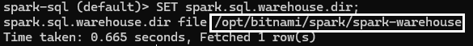
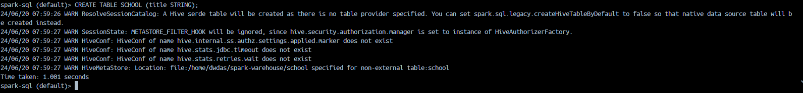
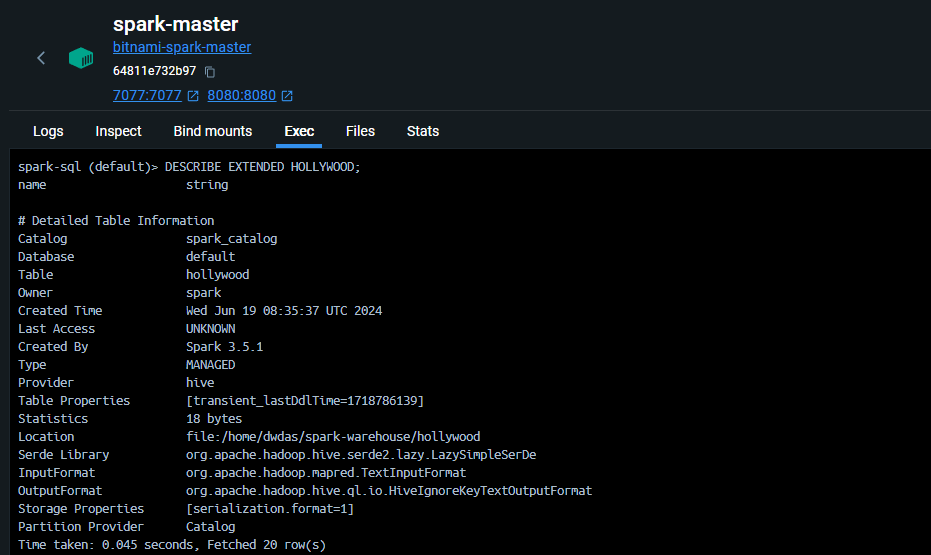
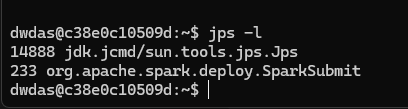

## Core conceps

- A Spark Database is just a folder of format **databasename.db** inside **spark-warehouse** folder.
- A Managed/Internal/Spark-Metastore table is  a  subfolder inside the **databasename.db**
- The partitions are also folders
- The warehouse folder is the base folder. This contain Datbase folder, tables subfolder folder, partion subfolders.
- The location of warehouse folder is set by **spark.sql.warehouse.dir**.
- By default, if spark.sql.warehouse.dir is not set, Spark uses a default directory, which is usually a **spark-warehouse** folder in the current working directory of the application.
- You can also find it out by this command in spark-sql prompt: SET spark.sql.warehouse.dir



- It is usually set as .config("spark.sql.warehouse.dir", "/path/to/your/warehouse") in session.


spark-sql commands:

show tables
select current_database()

spark-defaults.conf

## What happens when we start spark-sql shell on a fresh mmachine.

Say, I have a standalone spark server. I log into the server thruogh terminal. My current directory is /home/dwdas. The momenet I enter spark-sql. This is what happens:

- Spark starts a debry database and creates a metastore_db folder inside the current folder. This folder is the root folder of the derby database. Technically 'boots a derby instance on metastore_db'

Note: my spark-defaults.conf file is completely commented out. Meaning, everything happenign is the default behaviour. Also, i didnt do anything related to hive, neither do I have any hive installation etc. Its just a standalone pure spark machine. I just stareted the spark-sql shell.

So, without any customizaztion and anything related to hive, Spark still needs to manage the internal tables. It uses its in-house derby database for this case to store name and file location of the spark-tables locally that we will create.


Now, let me create a table using spark-sql and store some data and see what happens:

Your version looks quite good and covers the essential details. I've made some minor corrections for clarity and added a bit more detail where necessary:

```plaintext
24/06/20 07:44:39 WARN ResolveSessionCatalog: A Hive serde table will be created as there is no table provider specified. You can set spark.sql.legacy.createHiveTableByDefault to false so that native data source table will be created instead.
```



**Explanation**:
- **Message**: Spark is informing you that it will create a Hive SerDe (Serializer/Deserializer) table because no specific table provider was specified in the `CREATE TABLE` statement.
- - **Catalog Role**: When you execute a `CREATE TABLE` statement without specifying a table provider, the `ResolveSessionCatalog` warning is triggered. This indicates that Spark’s session catalog is defaulting to creating a Hive SerDe table. The session catalog is responsible for interpreting and resolving the SQL commands you issue, and by default, it chooses to create a Hive-compatible table if no specific provider is mentioned.
- **Reason**: By default, Spark falls back to creating a Hive-compatible table when no table provider is specified.
- **Note**: If we want a native Spark SQL data source table instead of a Hive-compatible table, we need to set the configuration property `spark.sql.legacy.createHiveTableByDefault` to `false`.

- This can be done using the `spark-defaults.conf` file:
  ```properties
  spark.sql.legacy.createHiveTableByDefault=false
  ```
- Or when starting the Spark SQL shell:
  ```sh
  spark-sql --conf spark.sql.legacy.createHiveTableByDefault=false
  ```
- Also, this property can be set during session creation in PySpark:
  ```python
  from pyspark.sql import SparkSession

  spark = SparkSession.builder \
      .appName("example") \
      .config("spark.sql.legacy.createHiveTableByDefault", "false") \
      .getOrCreate()
  ```

```plaintext
24/06/20 07:44:40 WARN HiveMetaStore: Location: file:/home/dwdas/spark-warehouse/movies specified for non-external table:movies
```

**Explanation**:
- **Message**: Spark is indicating that the specified location for storing the table data is `file:/home/dwdas/spark-warehouse/movies`, which is the default directory for Spark's warehouse.
- - **Catalog Role**: The Hive metastore warning relates to the location where the table’s data will be stored. This is managed by the Hive catalog, which stores metadata about where each table’s data is located. For non-external (managed) tables, the catalog specifies that data should be stored in the default warehouse directory unless otherwise configured.
- **Note**: The default location for non-external tables is `spark-warehouse` inside the current working directory. However, this location can be changed by setting the `spark.sql.warehouse.dir` property either in the Spark configuration file or during the Spark session creation.

- To change the warehouse directory using the `spark-defaults.conf` file:
  ```properties
  spark.sql.warehouse.dir=/your/custom/path
  ```
- Or when starting the Spark SQL shell:
  ```sh
  spark-sql --conf spark.sql.warehouse.dir=/your/custom/path
  ```
- Also, this property can be set during session creation in PySpark:
  ```python
  from pyspark.sql import SparkSession

  spark = SparkSession.builder \
      .appName("example") \
      .config("spark.sql.warehouse.dir", "/your/custom/path") \
      .getOrCreate()
  ```
### Configuring the Catalog

You can configure the catalog behavior using various properties. Here are some key properties related to the catalog:

#### `spark.sql.catalogImplementation`

- Specifies the default catalog implementation. Options are `hive` for Hive support or `in-memory` for Spark’s native catalog.
- Configuration:
  ```properties
  spark.sql.catalogImplementation=hive
  ```

#### `spark.sql.warehouse.dir`

- Sets the default location for the database warehouse directory where managed table data is stored.
- Configuration:
  ```properties
  spark.sql.warehouse.dir=/your/custom/path
  ```

### Example Configurations in `spark-defaults.conf`

To use the Hive catalog and set a custom warehouse directory, your `spark-defaults.conf` might include:

```properties
spark.sql.catalogImplementation=hive
spark.sql.warehouse.dir=/your/custom/path
```

### Setting Configuration at Runtime

You can also set these properties when creating a Spark session in PySpark:

```python
from pyspark.sql import SparkSession

spark = SparkSession.builder \
    .appName("example") \
    .config("spark.sql.catalogImplementation", "hive") \
    .config("spark.sql.warehouse.dir", "/your/custom/path") \
    .getOrCreate()
```


### SPARK Managed Tables(AKA Internal / Spark-Metastore Tables)

I have a simple spark enviornment. There is no items like HDFS, Hive etc instlled by me. Let's see what happens if I create a table using spark-sql CLI.

I opened the spark-sql CLI from the terminal and ran the followng statements:

```sql
CREATE TABLE Hollywood (name STRING);
INSERT INTO Hollywood VALUES ('Inception'), ('Titanic');
SELECT * FROM Hollywood;
```

A table was created and I was able to see the results of the select statement. When I ran DESCRIBE EXTENDED HOLLYWOOD; it showed the folloiwng:



- **Catalog:** `spark_catalog` - Spark uses its own internal catalog to manage metadata.
- **Database:** `default` - The default database provided by Spark.
- **Table:** `hollywood` - The name of your table.
- **Owner:** `spark` - Indicates the owner of the table.
- **Created Time:** `Wed Jun 19 08:35:37 UTC 2024` - The timestamp when the table was created.
- **Type:** `MANAGED` - Indicates that Spark manages the table's lifecycle.
- **Provider:** `hive` - Although Hive is mentioned here, it likely refers to Spark's capability to handle Hive-compatible metadata.
- **Serde Library:** `org.apache.hadoop.hive.serde2.lazy.LazySimpleSerDe` - Serialization and deserialization library.
- **InputFormat:** `org.apache.hadoop.mapred.TextInputFormat` - Input format for reading the table data.
- **OutputFormat:** `org.apache.hadoop.hive.ql.io.HiveIgnoreKeyTextOutputFormat` - Output format for writing the table data.
- **Location:** `file:/home/dwdas/spark-warehouse/hollywood` - File path where the table data is stored.
- **Partition Provider:** `Catalog` - Indicates that the catalog manages partitions.

Even without a standalone Hive installation, Spark can still provide this functionality by leveraging its built-in catalog and Hive-compatible features. This allows you to use SQL-like operations and manage tables within Spark.




<p style="color: navy; font-family: 'Trebuchet MS', Helvetica, sans-serif; background-color: #f8f8f8; padding: 15px; border-left: 5px solid grey; border-radius: 10px; box-shadow: 2px 2px 10px grey;">
<strong>Summary:</strong><br>
<span style="color: darkgreen;">1. Data is stored in a Spark-connected ADLS container.</span><br>
<span style="color: darkred;">2. Spark handles the storage.</span><br>
<span style="color: darkblue;">3. Dropping a managed table deletes both the table metadata and the data.</span><br>
<span style="color: Teal;">4. DO NOT provide the LOCATION field > Table becomes EXTERNAL.</span>
</p>

> Every Spark managed table is a folder inside a db folder

When you use enableHiveSupport() in Spark without specifying an external Hive metastore, Spark creates a default embedded metastore using Derby. Here’s how it works:

Hive Metastore and Metastore Database in Spark
Embedded Derby Metastore:

When you don't configure an external Hive metastore, Spark uses an embedded Derby database by default.
The metadata for your tables is stored in a local Derby database file.
Location of Derby Database:

The Derby database is typically stored in the metastore_db directory within your Spark working directory.
This directory contains the metadata for your Hive tables.
Default Warehouse Directory:

The data files for your managed tables are stored in the default warehouse directory, usually spark-warehouse within your Spark working directory, unless configured otherwise.
These files are stored in Parquet format, with associated .crc files for checksums.

Now let's clear some concepts:

spark-warehouse folder: Its the folder where SparkSQL stores
spark-catalogue
Spark tables - Manged and External
Hive, Derby database
enableHiveSupport()
metastoer(aka metastore_db) and catalogues

=> Metastore (aka metastore_db) is a relational database that is used by Hive, Presto, Spark, etc. to manage the metadata of persistent relational entities (e.g. databases, tables, columns, partitions) for fast access. Additionally, a spark-warehouse is the directory where Spark SQL persists tables. 😀

Spark SQL by default uses an In-Memory catalog/metastore deployed with Apache Derby database. 

spark.sql.warehouse.dir 

Unless configured otherwise, Spark will create an internal Derby database named metastore_db with a derby.log. Looks like you've not changed that.

When not configured by the hive-site.xml, the context automatically creates metastore_db in the current directory and creates a directory configured by spark.sql.warehouse.dir, which defaults to the directory spark-warehouse in the current directory that the Spark application is started

$HIVE_HOME/conf/hive-site.xml
hive.metastore.warehouse.dir

The base Apache Hadoop framework is composed of the following modules:

Hadoop Common — contains libraries and utilities needed by other Hadoop modules;
Hadoop Distributed File System (HDFS) — a distributed file-system that stores data on commodity machines, providing very high aggregate bandwidth across the cluster;
Hadoop YARN — (introduced in 2012) a platform responsible for managing computing resources in clusters and using them for scheduling users’ applications;
Hadoop MapReduce — an implementation of the MapReduce programming model for large-scale data processing.

Serde library
The default external catalog implementation is controlled by spark.sql.catalogImplementation internal property and can be one of the two possible values: hive and in-memory.

Can there be hive without hadoop. Yes, a local spark has hive locally, you wont need a complex hadoop installation.

The Apache Hive ™ data warehouse software facilitates querying and managing large datasets residing in distributed storage. Hive provides a mechanism to project structure onto this data and query the data using a SQL-like language called HiveQL.
Apache Hive is a data warehouse infrastructure built on top of Hadoop for providing data summarization, query, and analysis.

In a simple Spark installation, hive-site.xml might not be directly included  since Spark itself doesn't manage Hive configurations. Here are two possibilities:

Spark with Pre-installed Hive:
If you installed Spark alongside a pre-existing Hive installation, then hive-site.xml might be located in the typical Hive configuration directory:

/etc/hive/conf/hive-site.xml
Spark without Hive:
If Spark is installed independently without Hive, you likely won't find hive-site.xml. In this case, Spark wouldn't rely on Hive configurations by default.

```python
from pyspark.sql import SparkSession

# Create or get a Spark session
spark = SparkSession.builder \
    .appName("MyApp") \
    .getOrCreate()

# Get the current value of spark.sql.warehouse.dir
warehouse_dir = spark.conf.get("spark.sql.warehouse.dir")
print(f"Warehouse Directory: {warehouse_dir}")
```

When working with Hive, one must instantiate SparkSession with Hive support, including connectivity to a persistent Hive metastore, support for Hive serdes, and Hive user-defined functions. Users who do not have an existing Hive deployment can still enable Hive support. When not configured by the hive-site.xml, the context automatically creates metastore_db in the current directory and creates a directory configured by spark.sql.warehouse.dir, which defaults to the directory spark-warehouse in the current directory that the Spark application is started. Note that the hive.metastore.warehouse.dir property in hive-site.xml is deprecated since Spark 2.0.0. Instead, use spark.sql.warehouse.dir to specify the default location of database in warehouse. You may need to grant write privilege to the user who starts the Spark application.