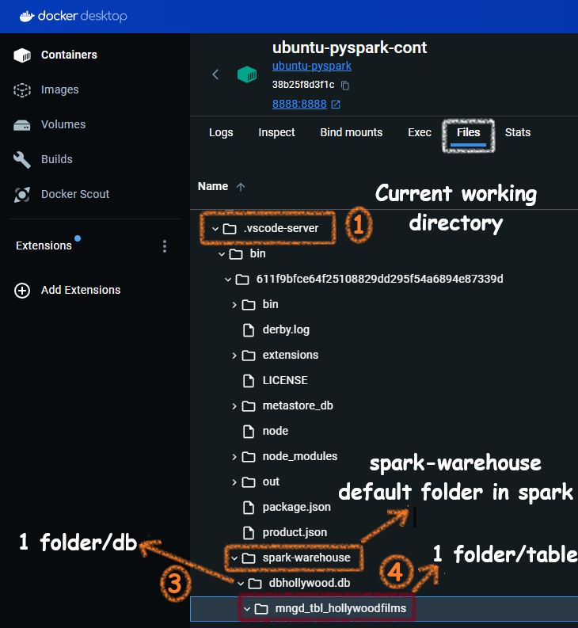
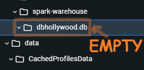
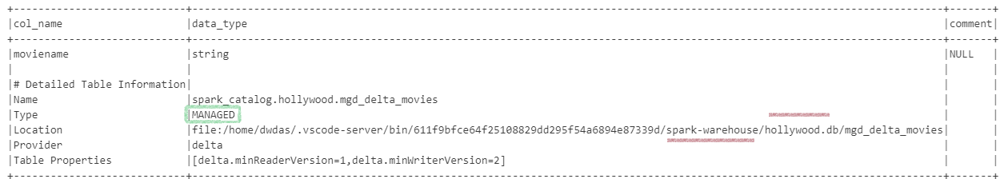

# Create a Warehouse with Just a simple Pyspark setup

I am sad; I have just Python and I managed to pip install PySpark. I want to create a decent warehouse on my laptop. Am I being impractical? I read somewhere a DW is for data at rest, spark is for data in motion. Well, no. Let's see what comes free with PySpark:

**Built-in Hive**: PySpark comes with a small Hive setup plus a Derby database by default as the Hive metastore. This means you can create managed tables just like you did in Synapse Analytics.

**Automatic spark-warehouse folder**: PySpark automatically creates a `spark-warehouse` directory to store table data. This directory is created in your working directory, and all managed tables are stored as Parquet files within this directory.

**Automatic .Parquet**: When you create tables using Hive support in PySpark, the data is stored in Parquet format by default.

**Bonus! Delta Table Support**: You just have to pip install delta, and then you can save the data in the enhanced Delta format, making it an even better warehouse.


First, let me create a Spark session with Hive support.

```python
from pyspark.sql import SparkSession

# Start Spark session with Hive support
spark = SparkSession.builder \
    .appName("PySpark Data Warehouse with Hive Support") \
    .enableHiveSupport() \
    .getOrCreate()
```

Then let me create a database and an empty table inside it:

```python
# Create a database
spark.sql("CREATE DATABASE IF NOT EXISTS dbHollywood")

# Switch to the new database
spark.sql("USE dbHollywood")

# Create a managed table
spark.sql("""
CREATE TABLE IF NOT EXISTS mngd_tbl_HollywoodFilms (
    id INT,
    name STRING
)
""")
```
THis is how the folders are getting creatd in the spark-warehouse folder:




Now, let me insert some data:

```python
spark.sql("USE dbHollywood")

# Insert data into the managed table
spark.sql("""
INSERT INTO mngd_tbl_HollywoodFilms VALUES
(1, 'Matrix'),
(2, 'Inception')
""")
```
Wow, these parquet fiels were auto-craeted. I didnt mention any format. In hive support data is auto-stored as .parquet.


Now, if I query the table in teh same session I see this:


Now, let me stop the session and create a new session to see if things are just a one-night stand or a lifetime friendship. If I have no metatore I can't query using the table name, though the backend data  might be present.


Now, let me try to delete the table and then the database and see if the data goes away or not. Else, how can I call them managed tables?


Here is the snapshot of the spark-warehouse folder. Only DB folder, table folder completely deleted.




Now, let me delete the database(ignore the warning)


The database parent folder completely gone:


## Using Delta Tables

Now, I am very satisfied with my warehouse and I want to use Spark Tables v2. Which is Delta table. The difference is that in delta table you can update the fields and also spark tables are basic and delta acidic(haha).

To have delta table feature in our plain old python envirnmetn. Let's instll **delta-spark** library:

```bash
pip install delta-spark
```

Then, we will create the session with both delta and hive support. Create a database, then a managed table with delta. Then we will insert some data and then append the data. 

```python
from pyspark.sql import SparkSession
from delta import configure_spark_with_delta_pip
from pyspark.sql.types import StructType, StructField, IntegerType, StringType
from pyspark.sql import Row

# Configure Spark session with Delta Lake and Hive support
spark = configure_spark_with_delta_pip(
    SparkSession.builder
    .appName("DeltaLakeExample")
    .config("spark.sql.extensions", "io.delta.sql.DeltaSparkSessionExtension")
    .config("spark.sql.catalog.spark_catalog", "org.apache.spark.sql.delta.catalog.DeltaCatalog")
    .enableHiveSupport()  # Enable Hive support
).getOrCreate()

# Create a database
spark.sql("CREATE DATABASE IF NOT EXISTS Hollywood")

# Switch to the new database
spark.sql("USE Hollywood")

# Create a managed Delta table
spark.sql("""
CREATE TABLE IF NOT EXISTS mgd_delta_movies (
    moviename STRING
) USING delta
""")

# Insert data using SQL
spark.sql("""
INSERT INTO mgd_delta_movies (moviename)
VALUES 
    ('Titanic'),
    ('Inception')
""")

# Define schema
schema = StructType([StructField("moviename", StringType(), True)])

# Create DataFrame with defined schema
data = [Row(name='Scream')]

df = spark.createDataFrame(data, schema=schema)

# Insert the DataFrame data into the managed Delta table
df.write.format("delta").mode("append").saveAsTable("mgd_delta_movies")
```
How, do we know that the tables are delta and they are manged? Its simple

- We didn't give any path for during create table command. 
- And the folder for the table is inside spark-warehouse/db_folder/

Thats not engouh? Lets run some commands dbas use to find out:

```python
spark.sql("DESCRIBE FORMATTED Hollywood.Mgd_Delta_Movies").show(truncate=False)
```


Also

```python
spark.sql("DESCRIBE DETAIL Hollywood.Mgd_Delta_Movies").show(truncate=False)
```

> Every Spark managed table is a folder inside a db folder

When you use enableHiveSupport() in Spark without specifying an external Hive metastore, Spark creates a default embedded metastore using Derby. Here’s how it works:

Hive Metastore and Metastore Database in Spark
Embedded Derby Metastore:

When you don't configure an external Hive metastore, Spark uses an embedded Derby database by default.
The metadata for your tables is stored in a local Derby database file.
Location of Derby Database:

The Derby database is typically stored in the metastore_db directory within your Spark working directory.
This directory contains the metadata for your Hive tables.
Default Warehouse Directory:

The data files for your managed tables are stored in the default warehouse directory, usually spark-warehouse within your Spark working directory, unless configured otherwise.
These files are stored in Parquet format, with associated .crc files for checksums.

Now let's clear some concepts:

spark-warehouse folder: Its the folder where SparkSQL stores
spark-catalogue
Spark tables - Manged and External
Hive, Derby database
enableHiveSupport()
metastoer(aka metastore_db) and catalogues

=> Metastore (aka metastore_db) is a relational database that is used by Hive, Presto, Spark, etc. to manage the metadata of persistent relational entities (e.g. databases, tables, columns, partitions) for fast access. Additionally, a spark-warehouse is the directory where Spark SQL persists tables. 😀

Spark SQL by default uses an In-Memory catalog/metastore deployed with Apache Derby database. 

spark.sql.warehouse.dir 

Unless configured otherwise, Spark will create an internal Derby database named metastore_db with a derby.log. Looks like you've not changed that.

When not configured by the hive-site.xml, the context automatically creates metastore_db in the current directory and creates a directory configured by spark.sql.warehouse.dir, which defaults to the directory spark-warehouse in the current directory that the Spark application is started

$HIVE_HOME/conf/hive-site.xml
hive.metastore.warehouse.dir

The base Apache Hadoop framework is composed of the following modules:

Hadoop Common — contains libraries and utilities needed by other Hadoop modules;
Hadoop Distributed File System (HDFS) — a distributed file-system that stores data on commodity machines, providing very high aggregate bandwidth across the cluster;
Hadoop YARN — (introduced in 2012) a platform responsible for managing computing resources in clusters and using them for scheduling users’ applications;
Hadoop MapReduce — an implementation of the MapReduce programming model for large-scale data processing.

Serde library
The default external catalog implementation is controlled by spark.sql.catalogImplementation internal property and can be one of the two possible values: hive and in-memory.

Can there be hive without hadoop. Yes, a local spark has hive locally, you wont need a complex hadoop installation.

The Apache Hive ™ data warehouse software facilitates querying and managing large datasets residing in distributed storage. Hive provides a mechanism to project structure onto this data and query the data using a SQL-like language called HiveQL.
Apache Hive is a data warehouse infrastructure built on top of Hadoop for providing data summarization, query, and analysis.

In a simple Spark installation, hive-site.xml might not be directly included  since Spark itself doesn't manage Hive configurations. Here are two possibilities:

Spark with Pre-installed Hive:
If you installed Spark alongside a pre-existing Hive installation, then hive-site.xml might be located in the typical Hive configuration directory:

/etc/hive/conf/hive-site.xml
Spark without Hive:
If Spark is installed independently without Hive, you likely won't find hive-site.xml. In this case, Spark wouldn't rely on Hive configurations by default.

```python
from pyspark.sql import SparkSession

# Create or get a Spark session
spark = SparkSession.builder \
    .appName("MyApp") \
    .getOrCreate()

# Get the current value of spark.sql.warehouse.dir
warehouse_dir = spark.conf.get("spark.sql.warehouse.dir")
print(f"Warehouse Directory: {warehouse_dir}")
```

When working with Hive, one must instantiate SparkSession with Hive support, including connectivity to a persistent Hive metastore, support for Hive serdes, and Hive user-defined functions. Users who do not have an existing Hive deployment can still enable Hive support. When not configured by the hive-site.xml, the context automatically creates metastore_db in the current directory and creates a directory configured by spark.sql.warehouse.dir, which defaults to the directory spark-warehouse in the current directory that the Spark application is started. Note that the hive.metastore.warehouse.dir property in hive-site.xml is deprecated since Spark 2.0.0. Instead, use spark.sql.warehouse.dir to specify the default location of database in warehouse. You may need to grant write privilege to the user who starts the Spark application.