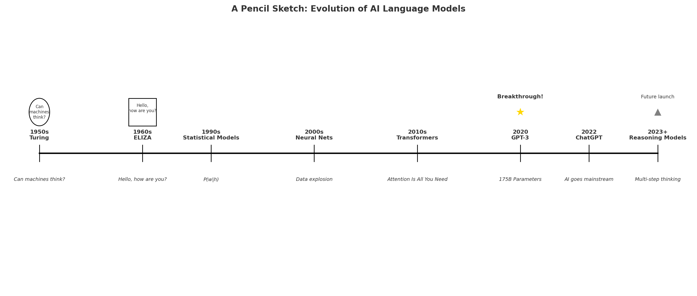

# Evolution of LLMs through Time
---

## 1950s–1980s: The Early Sparks of NLP

**1950:** Alan Turing, often called the father of theoretical computer science and AI, introduces the idea of the “Turing Test.” In a famous BBC radio interview, he remarks,  
> “We can only see a short distance ahead, but we can see plenty there that needs to be done.”  

Legend has it that, during an early demonstration of mechanical ‘translation’ (really just a basic dictionary lookup), Turing joked with his colleagues, “If we only had a bigger dictionary, maybe the machine would translate my jokes into French better than I can.” The joke got more laughter than the translations did!

**1960s:** Joseph Weizenbaum at MIT creates **ELIZA**, a rudimentary chatbot that mimics a psychotherapist. Weizenbaum’s mother reportedly used ELIZA to vent about family gossip, only to exclaim one day, “This machine is more patient than your father ever was!” That snippet became an MIT hallway anecdote, repeated for decades.

**1970s–1980s:** Computers are still expensive, but researchers attempt rule-based “machine translation” in labs around the world. The impetus is mostly about cracking Russian-to-English translations for the Cold War era. Marvin Minsky at MIT is famously skeptical of purely rule-based systems, quipping,
> “If you pile too many rules onto a donkey, you don’t get a thoroughbred—you just get a confused donkey.”  

These decades lay the foundation for the next big leap: moving away from manually encoding grammar rules to letting machines *learn* language patterns from data.

---

## 1980s: Statistical Methods and the Birth of Data-Driven NLP

**Late 1980s:** As computational power grows, scientists pivot to **statistical** approaches. IBM’s Jelinek leads a team that uses big corpora and hidden Markov models to predict words in sequences. “Every time I fire a linguist, the performance of the speech recognizer goes up,” Jelinek allegedly jokes—a quip that becomes infamous in AI lore (though it’s debated whether he really said it quite that way).

Researchers like John McCarthy—an AI luminary—are amused by these new approaches but caution,
> “We should not abandon reason for statistics. Ideally, we’d want both.”  

---

## 1990s: Faster Machines, Bigger Data

**Early 1990s:** With faster hardware, HPC centers, and the explosion of the internet, language modeling starts analyzing larger text corpora. The punch card days are long gone, replaced by Unix terminals and mainframe clusters. Meanwhile, AI scientist **Geoffrey Hinton** is tinkering with early neural networks. He often jokes with colleagues in the break room,
> “I’m just teaching a computer how to dream. No big deal.”  

**Late 1990s:** Speech recognition improves significantly, and IBM’s Watson lab sees success in capturing context. The mood is optimistic—“One day, these machines might even beat humans on game shows!” some researchers tease, foreshadowing Watson’s future Jeopardy triumph in 2011.

---

## 2012: The Deep Learning Boom

A major breakthrough hits when Geoffrey Hinton’s team at the University of Toronto applies **deep neural networks** to image recognition (and soon after, to language). They stun the world with massive accuracy gains on benchmarks. Yoshua Bengio and Yann LeCun, also pioneers of deep learning, hail the triumph. Bengio is quoted in a conference hallway:
> “If you stack enough layers, you might just discover the secret sauce of language.”  

By now, word embeddings like Word2Vec (Mikolov) show that machines can learn semantic relationships (king–man + woman = queen). People start speculating: “If it works for images and word embeddings, what else can these deep nets do?”

---

## 2018: BERT Lands on the Scene

**Google** introduces **BERT** (Bidirectional Encoder Representations from Transformers). Jacob Devlin and Ming-Wei Chang lead the project. BERT quickly becomes a standard in natural language tasks—sentiment analysis, Q&A, name it.  
When asked if BERT was a big deal, one Google researcher joked,
> “It’s not just a big deal, it’s the biggest masked-language-modeling deal we’ve ever seen!”  

It was a pun referencing BERT’s technique of “masking” parts of the input text.

---

## 2020: GPT-3, the 175-Billion-Parameter Titan

OpenAI’s **GPT-3** emerges, boasting 175 billion parameters. Sam Altman, CEO of OpenAI, famously tweets,  
> “We’re seeing the first glimpses of a new computing platform.”  

GPT-3’s ability to generate fluent text about everything from cooking recipes to quantum physics dazzles the public. Some researchers mention that GPT-3 occasionally produces nonsense or “hallucinations.” Ilya Sutskever, co-founder of OpenAI, shrugs,
> “Hallucinations? That’s just the model’s creative side!”  

---

## 2022: ChatGPT Makes AI Go Mainstream

When **ChatGPT** launches, it’s the first time many non-technical people truly see the power of large language models. The internet floods with screenshots of ChatGPT writing poetry, debugging code, or even passing certain standardized tests. “I asked ChatGPT to write my wedding vows, and they were better than mine!” one user exclaims in a viral post.

In academic circles, concerns about AI-driven plagiarism and misinformation escalate. Geoffrey Hinton wryly notes in a panel discussion,
> “I didn’t expect my work on neural nets to one day help students cheat on essays. But here we are.”  

---

## 2023: Open Source LLMs, GPT-4, and the Reasoning Era

Open-source LLMs like **LLaMA**, **Alpaca**, and **Vicuna** appear, delivering impressive results and fueling a wave of community-driven AI development. Meta’s LLaMA 2 and 3 push the boundaries of how many parameters can realistically be trained, while continuing to expand context windows and language support.

**OpenAI** releases **GPT-4**, quietly noting improved “reasoning” abilities. Critics wonder if it’s truly more “intelligent,” or just bigger. Meanwhile, new “reasoning models” like **o1** claim to emulate human multi-step thinking. Sam Altman hints in a conference talk,
> “We’re not just predicting the next word anymore; we’re giving the model time to *think.*”  

Researchers debate if this truly represents reasoning or just more advanced pattern matching. But one can’t deny the results—these systems are solving complex coding tasks, passing tough math tests, and generating entire short films from text prompts.

---

## Epilogue: The Quest Continues

From Turing’s early jokes about translation to modern systems that can chat, code, and conjure entire narratives, language models have grown in leaps and bounds. Every decade brought its own luminaries—Weizenbaum, Minsky, McCarthy, Hinton, Bengio, LeCun, Sutskever—each adding a piece to the puzzle. Today’s AI might still be “parrots” at heart, but they’re parrots with billions of parameters, advanced neural architectures, and a penchant for surprisingly creative outputs.

What comes next? Perhaps models that can truly reason, or advanced multimodal systems that integrate text, images, and sound seamlessly. As Alan Turing might say if he were here today,
> “We still can’t see all that lies ahead—but the journey has never been more exciting.”

---

