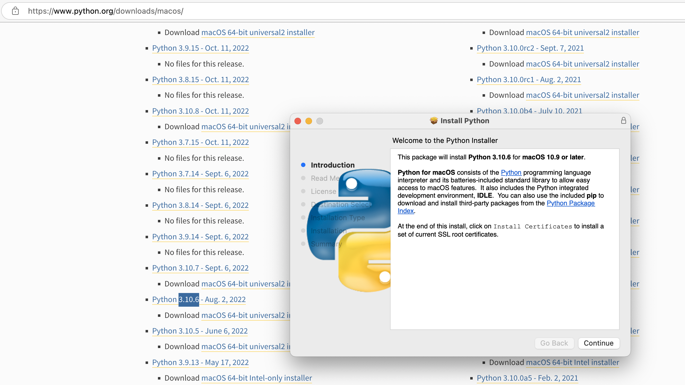
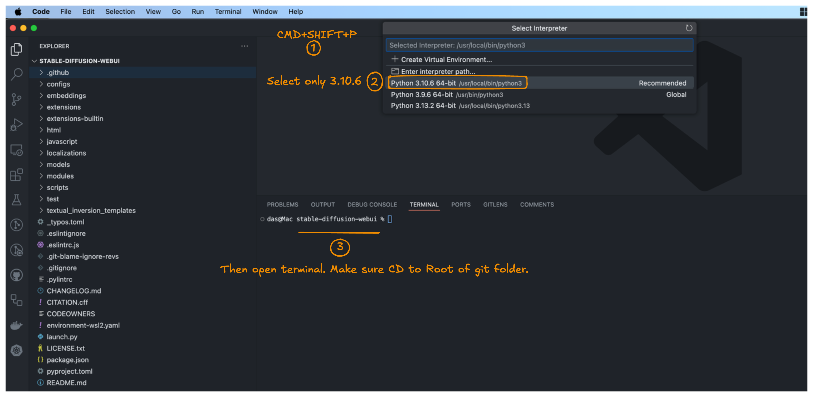
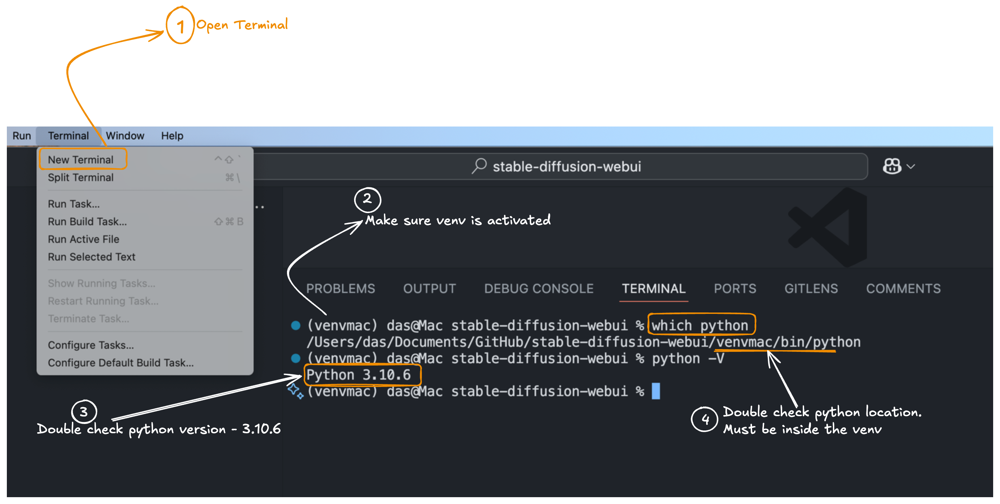
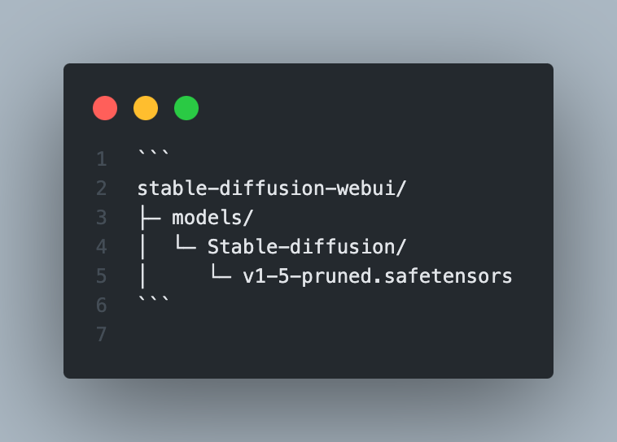
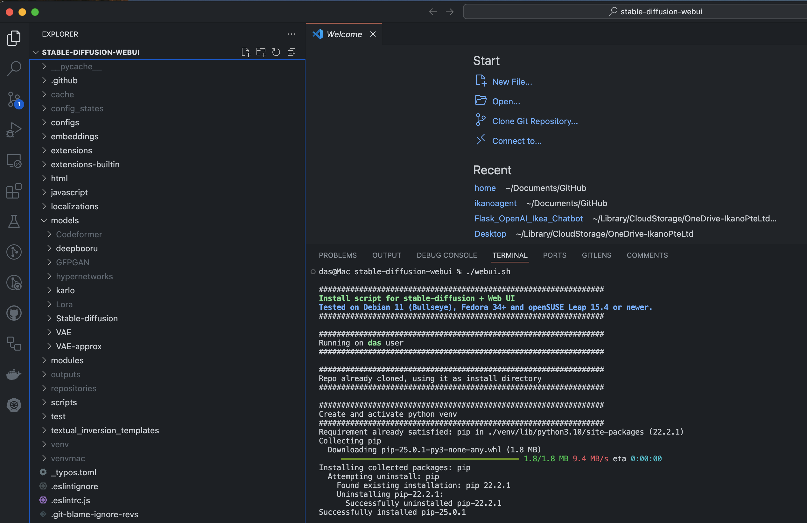
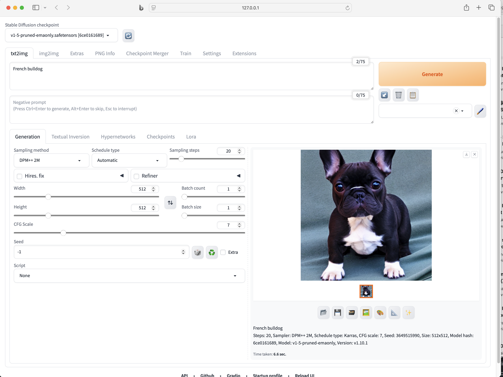

# Installing and Running Stable Diffusion Locally on Mac M3 Pro/Max

In this guide, I’ll show you how to run **Stable Diffusion** on your Mac M3 Pro/Max using the **AUTOMATIC1111** Web UI. The process is straightforward: clone the [AUTOMATIC1111/stable-diffusion-webui](https://github.com/AUTOMATIC1111/stable-diffusion-webui) repository, then run everything locally in VS Code. This approach reduces the risk of version conflicts and keeps everything tidy.

<div style="page-break-after: always;"></div> 

## Prerequisites

You’ll need:

- **Git**  
- **Python 3.10.6**  

Even if you have other Python versions, installing 3.10.6 specifically for this project will help avoid version conflicts.



<div style="page-break-after: always;"></div>

## Step 1:  Clone the Repository

Open your preferred project folder in VS Code. Then, clone the [AUTOMATIC1111/stable-diffusion-webui](https://github.com/AUTOMATIC1111/stable-diffusion-webui.git) repository:


## Step 2: Select the Python Interpreter

After cloning, choose **Python 3.10.6** as your interpreter in VS Code. This ensures you won’t run into version conflicts.



<div style="page-break-after: always;"></div>

## Step 3: Open the Terminal

In VS Code, open a terminal and go to the folder where you cloned the repository:




<div style="page-break-after: always;"></div>

## Step 4: (Optional) Create a Virtual Environment

Although the `webui.sh` script will create a virtual environment automatically, you can also set one up beforehand. If you do, the script will skip creating another.

Make sure you’re using **Python 3.10.6**, then run:
```bash
python3 -m venv venv
source venv/bin/activate
```
You’ll know you’re in the virtual environment if `(venv)` appears in your terminal prompt.


## Step 5: Place Your Model Checkpoint

- Download a model from Hugging Face (for instance, **Stable Diffusion v1.5**).  
- You’ll get a file such as `v1-5-pruned.safetensors` or `v1-5-pruned.ckpt`.  
- Move that file here:
  ```
  stable-diffusion-webui/models/Stable-diffusion/
  ```

So your folder might look like:



<div style="page-break-after: always;"></div>

### 6. Run the `webui.sh` Script

Now, run the AUTOMATIC1111 Web UI:

1. Make the script executable (if needed):
   ```bash
   chmod +x webui.sh
   ```
2. Launch it:
   ```bash
   ./webui.sh
   ```



**How it works:**
- The script checks for required dependencies (PyTorch, transformers, etc.) and installs them if necessary.  
- It detects the GPU backend. On Apple Silicon M3 Pro/Max, **MPS** (Metal Performance Shaders) will be used.

<div style="page-break-after: always;"></div>

## Step 6: Access the Web UI

After the setup completes, you’ll see a message like:
```
Running on local URL:  http://127.0.0.1:7860
```
Open that link in your browser. The AUTOMATIC1111 **Stable Diffusion Web UI** will be ready to generate images!



<div style="page-break-after: always;"></div>

## Using the AUTOMATIC1111 Web UI

Once you’re in the interface, here’s a quick overview:

1. **txt2img**  
   - Type your prompt in the text box.  
   - Adjust settings like **Sampling Steps**, **Sampling Method** (Euler, DPM++, etc.), and **Batch Size**.  
   - Click **Generate**.

2. **img2img**  
   - Upload an image and provide a prompt to modify it.  
   - Set the **Denoising Strength** to control how different the output is from the original.

3. **Inpainting**  
   - Mask out parts of an image to replace them.  
   - Let Stable Diffusion fill in those areas based on your prompt.

4. **Settings & Extensions**  
   - Access advanced options in **Settings** (paths, optimization, UI tweaks, etc.).  
   - In **Extensions**, add or manage community plugins (e.g., **ControlNet**, **textual inversions**, or **LoRAs**).

<div style="page-break-after: always;"></div>

## Wrap-Up

In my experience, the setup was smooth and worked on the very first try! With default settings, I could generate a decent image in about 40 seconds, though a more detailed prompt yielded some amusingly nonsensical output. Even under heavy load, my system’s memory usage never went past 40 GB.
