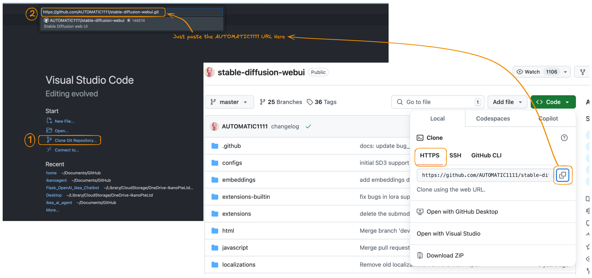

# Installing and Running Stable Diffusion Locally on Mac M3 Pro/Max

In this guide, I’ll walk you through how to run **Stable Diffusion** on your Mac M3 Pro/Max using the **AUTOMATIC1111** Web UI. The basic idea is straightforward: we’ll clone the [AUTOMATIC1111/stable-diffusion-webui](https://github.com/AUTOMATIC1111/stable-diffusion-webui) repository and then run everything locally. I’m demonstrating the process using **VS Code**, which helps keep things organized and reduces the chance of version conflicts.

---

## Prerequisites

Before we start, you need to have:

- **Git**  
- **Python 3.10.6**

Even if you have other versions of Python installed, I recommend installing Python 3.10.6 specifically for this project to avoid version conflicts.


---

## Steps

### 1. Clone the Repository

First, open your project or a folder in VS Code and clone the [AUTOMATIC1111/stable-diffusion-webui](https://github.com/AUTOMATIC1111/stable-diffusion-webui.git) repository:



---

### 2. Select the Python Interpreter

After cloning, select **Python 3.10.6** as your interpreter in VS Code. This step ensures that you won’t run into version conflicts later on.


---

### 3. Open the Terminal

In VS Code, open a terminal and navigate to the folder where you cloned the repository:


---

### 4. (Optional) Create a Virtual Environment

Although the `webui.sh` script will create a virtual environment for you by default, you can also set up your own venv beforehand. If you do so, the script will skip creating another one.

Make sure you’re still using **Python 3.10.6**, then run:

```bash
python3 -m venv venv
source venv/bin/activate
```

You’ll know you’re in the virtual environment if `(venv)` appears in your terminal prompt.

---

### 5. Place Your Model Checkpoint

- Download your preferred model from Hugging Face (for example, **Stable Diffusion v1.5**).  
- You’ll end up with a file such as `v1-5-pruned.safetensors` or `v1-5-pruned.ckpt`.  
- Move that file into the following path:

   ```
   stable-diffusion-webui/models/Stable-diffusion/
   ```

   So your folder structure might look like:

      ```
      stable-diffusion-webui/
      ├─ models/
      │  └─ Stable-diffusion/
      │     └─ v1-5-pruned.safetensors
      ```

---

### 6. Run the `webui.sh` Script

Now that everything is in place, it’s time to actually run the web UI. While still in the `stable-diffusion-webui` folder:

1. Make the startup script executable, if necessary:
   ```bash
   chmod +x webui.sh
   ```
2. Launch it:
   ```bash
   ./webui.sh
   ```

   

**What’s happening here?**  
- The script checks if you have the required dependencies (like PyTorch, transformers, etc.) and installs them if needed.  
- It also looks for a GPU backend. Because you’re on an Apple Silicon M3 Pro/Max, the script will detect **MPS** (Metal Performance Shaders). That means you’ll get hardware acceleration without needing an NVIDIA GPU.

---

### 7. Access the Web UI

After the installation finishes, you should see a message in the terminal that looks like this:

```
Running on local URL:  http://127.0.0.1:7860
```

Go to that address in your web browser. You’ll be greeted by the AUTOMATIC1111 **Stable Diffusion Web UI**, ready to generate images!


---

## Using the AUTOMATIC1111 Web UI

Once you’re in the web interface, here’s a quick rundown of the main tabs:

1. **txt2img**:  
      - Enter your prompt text.  
      - Tweak settings like **Sampling Steps**, **Sampling Method** (Euler, DPM++, etc.), and **Batch Size** if you want multiple images.  
      - Click **Generate** to watch the magic happen.

2. **img2img**:  
      - Upload an existing image and provide a text prompt to transform it.  
      - Adjust the **Denoising Strength** to control how different your final image is from the original.

3. **Inpainting**:  
      - Mask out parts of an image you'd like to overwrite.  
      - Let Stable Diffusion fill those areas according to your prompt.

4. **Settings & Extensions**:  
      - Tinker with advanced configurations like paths, optimization, or UI tweaks in the **Settings** tab.  
      - Install or manage community plugins under **Extensions** (e.g., **ControlNet**, **textual inversions**, **LoRAs**, and more).

---

## Wrap-Up

In my experience, the setup was  smooth—it worked on the very first try! With the default settings, I got a decent image in about 40 seconds, though a more elaborate prompt gave me some hilariously nonsensical output. On the bright side, even under heavy load, my system’s memory usage never went past 40 GB.
