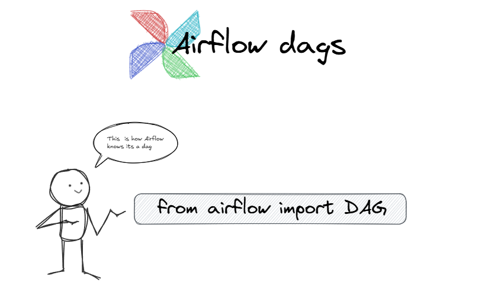
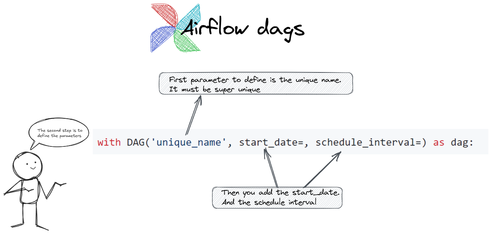

## <span style="color: #00574F; font-family: Segoe UI, sans-serif;">A DAG's Anatomy</span>

A DAG in Airflow is basically a Python file (.py file) that lives inside the `dags` folder. It has to be on the web server, and usually, this folder is mapped to the `/opt/airflow/dags` folder across all servers.

### So, how do you create a DAG?

First you create a `blabla.py` python file inside the /dags folder. Then, you need to import the `DAG` object. This is how Airflow knows that your Python file is a DAG:

   

Then, you define the DAG itself using a unique name:


   

- **Unique DAG ID:** This name has to be super unique across your entire Airflow setup.
- **Start Date:** You need to tell Airflow when to start running this DAG.
- **Schedule Interval:** This is where you define how often the DAG should run, usually with a cron expression.
- **catchup=False** This prevents Airflow from trying to catch up with all the past runs, which can save you from a lot of unnecessary DAG runs and give you more manual control.

Finally, you would add your tasks under this DAG. To keep it simple we can just add `None`.

So, total code would look like:

```python
from airflow import DAG
from datetime import datetime

with DAG('donald_kim', start_date=datetime(2022,1,1), schedule_interval='@daily', catchup=False) as dag:

None
```

### We've created our base let's create a task

Now, we will create a task to create a table in Postgress.

Firs step would be to import hte postgres operator:

`from airflow.providers.postgres.operators.postgres  import PostgresOperator`

Then we create a table. Inside it we create a task_id. It has to be unique.

create_table = PostgresOperator(task_id='create_table', postgres_conn_id='postgres', sql=''' CREATE TABLE IF NOT EXISTS users(firstname text NOT NULL)''')
