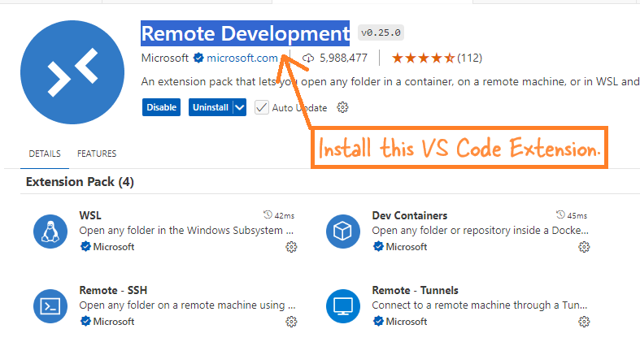

- [Setup Airflow on Docker and create a simple dag](#setup-airflow-on-docker-and-create-a-simple-dag)
- [Steps](#steps)
  - [1. **Create the Airflow Container**](#1-create-the-airflow-container)
    - [Download Airflow Docker Image](#download-airflow-docker-image)
    - [Create a Docker Volume](#create-a-docker-volume)
    - [Initialize Airflow Database](#initialize-airflow-database)
    - [Start the Airflow Webserver](#start-the-airflow-webserver)
  - [2. **Connect to Your Container from VS Code**](#2-connect-to-your-container-from-vs-code)
  - [3. **Create our first dag - a `hello_world.py` Script**](#3-create-our-first-dag---a-hello_worldpy-script)
  - [4. **Start the Airflow Scheduler**](#4-start-the-airflow-scheduler)


# <span style="color: #00796B; font-family: Segoe UI, sans-serif;">Setup Airflow on Docker and create a simple dag</span>

This article serves as your first step into the Airflow fold. Here, I'll walk you through creating a standalone Airflow container with all necessary components, and then guide you in setting up your first DAG.

Our envionrment will contain these components:

1. A Windows laptop
2. Docker Desktop installed
3. Visual Studio Code
4. VS Code **Remote Development** pack - This lets you connect to the container and develop code locally.


      


# <span style="color: #00796B; font-family: Segoe UI, sans-serif;">Steps</span>

## <span style="color: #00574F; font-family: Segoe UI, sans-serif;">1. **Create the Airflow Container**</span>

### <span style="color: #003366;font-family: Segoe UI, sans-serif;">Download Airflow Docker Image</span>
Run the following command in your command prompt or power shell to pull the latest Airflow Docker image: `docker pull apache/airflow:latest`

### <span style="color: #003366;font-family: Segoe UI, sans-serif;">Create a Docker Volume</span>
Execute this command to create a Docker volume named `airflow-volume` for data persistence: `docker volume create airflow-volume`

### <span style="color: #003366;font-family: Segoe UI, sans-serif;">Initialize Airflow Database</span>
Initialize the Airflow database using the following two commands:
```bash
docker run --rm --network dasnet -v airflow-volume:/opt/airflow apache/airflow:latest db init
```
```bash
docker run --rm --network dasnet -v airflow-volume:/opt/airflow apache/airflow:latest users create  --username airflow  --firstname FIRST_NAME  --lastname LAST_NAME   --role Admin   --email admin@example.com   --password airflow
```
> Note: I use a network dasnet. Hence --network part. You can totally remove the --network.

### <span style="color: #003366;font-family: Segoe UI, sans-serif;">Start the Airflow Webserver</span>
To start the Airflow webserver, use this command:

```bash
docker run -d --name airflow --network dasnet -p 8080:8080 -e AIRFLOW_UID=50000 -v airflow-volume:/opt/airflow apache/airflow:latest webserver
```

> Note: I use a network `dasnet`, which is why I added the `--network` part. You can skip the `--network` if you don’t need it. Also, 8080 is a very common port. If it clashes with any other apps on your laptop, you can change it to something like 8084:8084 or any other random number that might not cause a conflict.

## <span style="color: #00574F; font-family: Segoe UI, sans-serif;">2. **Connect to Your Container from VS Code**</span>
   After creating the container, connect to it using Visual Studio Code:

   - Open VS Code and click on the "Remote Explorer" icon on the left sidebar.
   - Click on the **Remote Development** icon (usually in the bottom left corner).
   - Select the Airflow container from the list to connect.

      

## <span style="color: #00574F; font-family: Segoe UI, sans-serif;">3. **Create our first dag - a `hello_world.py` Script**</span>
   
Now, let’s create your first DAG inside the container:

> Note: For this example we are using a single-node Airflow container. As there is only one machine(container). The dags folder will be inside the /opt/airflow/dags inside the conatienr. Also, to make it simple we haven't mounted it anywhere on the local system.

   - In VS Code, go to **File** > **New File**.
   - Select **Python** as the file type.
   - Go to the `/opt/airflow/dags` directory.
   - Name the file `hello_world.py`.

       


   - Paste the following code into the file and save it:
  ```python
  # Contact: das.d@hotmail.com

  # Import necessary modules from Airflow and Python
  from airflow import DAG  # All DAGs(.py files) MUST have this import.
  from airflow.operators.python import PythonOperator  # Used to define tasks that run Python functions
  from datetime import datetime  # This is always imported as you need to schedule the dag and it needs date and time

  # Define a simple Python function that prints 'Hello World'
  # This function will be the task executed by the DAG
  def print_hello():
      print('Hello World')

  #This block, the DAG instance dag, is what makes this code an actual DAG.
  with DAG(
      'hello_world',  # Unique identifier for the DAG; should be descriptive
      start_date=datetime(2023, 1, 1),  # The date when the DAG will start running; set to a past date for immediate start
      schedule_interval='@daily'  # How often the DAG should run; '@daily' means it runs once a day
  ) as dag:

      # Define a task using PythonOperator
      # Any task defined inside the 'with' becomes part of the dag
      t1 = PythonOperator(
          task_id='print_hello',  # 'task_id' is a unique identifier for the task within the DAG
          python_callable=print_hello  # 'python_callable' is the function that the task will execute. The function to be executed when this task runs
      )

  # The DAG and task are now defined
  # Airflow will take care of scheduling and running the task based on the DAG's schedule
```


## <span style="color: #00574F; font-family: Segoe UI, sans-serif;">4. **Start the Airflow Scheduler**</span>

To run your DAG, you need to start the Airflow scheduler:

- Open the terminal in VS Code (which is already connected to the container).
- Run the following command:

```bash
airflow scheduler
```
- The scheduler will start, and it will pick up your `hello_world` DAG to run it according to the schedule you've set (daily in this case).
  
    


