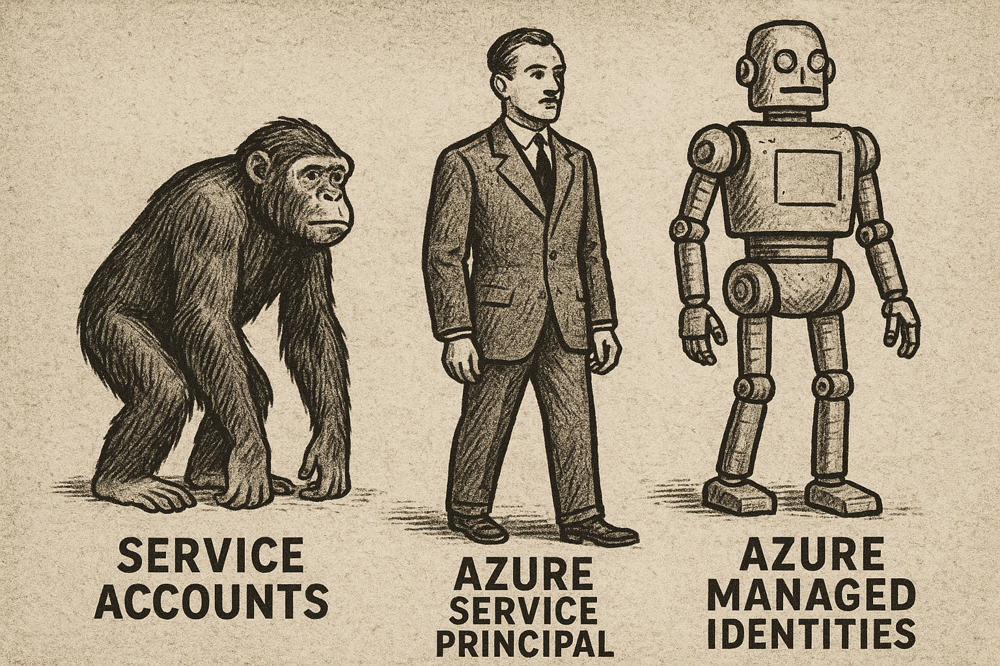

# <span style="color: teal;Font-family: Segoe UI, sans-serif;">Understanding Azure Service Principals and Managed Identities</span>

In this article, I will explain the difference between a Service Principal and a Managed Identity in Azure, using comparision with how it was done in old days with on-premises Active Directory (AD).

## Service Principal: Like a Service Account in On-Prem AD

**In old days:**
Remember when we used to create dedicated service accounts (also called Functional IDs) for running Windows services like SQL Server? Instead of using a regular user account, we'd create these special accounts so the service wasn't tied to any particular person and could be used across multiple servers. And we all experienced those dreaded scenarios when the service account password expired and suddenly all the Windows services running under that account went down across the environment!

**In Azure, this is a Service Principal:**
It's the same concept - a dedicated identity for an application or service, but in the cloud. You manually create it, manage its credentials, and control its lifecycle just like your AD service accounts.

## Managed Identity: Like a Service Account++

In old days when a new server was added to the domain, the computer used to get a *computer account*, don't confuse it with the hostname. That computer account has an identity but you never see or manage its password - it's handled automatically in the background. They used to appear in AD as a computer console. They would have names like `SERVER01$`. They had passwords which were never seen by anyone and the computer itself handleded the authentication process using these credentials in the domain. You could reset the computer account if needed, which forced the computer to re-establish trust. But, never the password.

**In Azure, this is a Managed Identity, the diference beeing its not just for computers but also for applications.**
Managed identities are automatically created and managed by Azure, so you don't have to worry about creating, storing, or rotating credentials. They are tied to the Azure resource (like an App Service or VM) and can be given permission to access downstream resources, e.g. Azure SQL Database, without any passwords.


## Real-World Examples

### Example 1: Web App Accessing Azure SQL Database
Let's say you have a .NET web application running in **Azure App Service** that needs to securely connect to an Azure SQL Database to retrieve customer data.

#### Option 1: Using a Service Principal
This is like the old days when you created service accounts for applications:

1. You create an application registration in Azure AD (creating a service principal)
2. You generate a client secret (essentially a password)
3. You store this secret in your App Service's configuration settings:
   ```
   CONNECTION_STRING="Server=myserver.database.windows.net;User ID=app_client_id;Password=app_client_secret;"
   ```
4. You assign permissions for this service principal to access the SQL Database
5. Your application code uses this connection string to authenticate
6. Every 90 days, you must rotate this secret manually and update your configuration


#### Option 2: Using a Managed Identity (Modern Approach)
This simplifies everything:

1. Go to your App Service in Azure Portal, click on "Identity" in the left menu
2. Toggle "System assigned" to "On" and save
3. Go to your SQL Database and grant permissions to this managed identity
4. Modify your application code to use managed identity authentication:
   ```csharp
   // Connection string has no secrets
   string connectionString = "Server=myserver.database.windows.net;Database=mydb;";
   
   // The DefaultAzureCredential automatically uses the App Service's managed identity
   var conn = new SqlConnection(connectionString);
   conn.AccessToken = (await new DefaultAzureCredential().GetTokenAsync(
       new TokenRequestContext(new[] { "https://database.windows.net/.default" }))).Token;
   await conn.OpenAsync();
   ```
5. That's it! No secrets to manage, store, or rotate

**Real-world benefit:** When a developer leaves the company, there's no risk of them taking credentials with them because there are no credentials to take.


## Example 2: Accessing Azure Storage Blobs

Let's say your App Service needs to read files from Azure Blob Storage:

### Service Principal Approach (Little older way)
```csharp
// Store these credentials in app settings
string accountName = "mystorageaccount";
string accountKey = "fj39f93jf93jf93j93jf93=="; // Secret that must be managed

var storageAccount = new CloudStorageAccount(
    new StorageCredentials(accountName, accountKey), 
    true);
```

### Managed Identity Approach (Modern Way)
```csharp
// No secrets needed
var blobServiceClient = new BlobServiceClient(
    new Uri("https://mystorageaccount.blob.core.windows.net"),
    new DefaultAzureCredential());
```
The managed identity is automatically used behind the scenes, with Azure handling all the authentication transparently. No passwords or secrets to manage, store, or rotate.

## Conclusion
Service Principals are like old-days Service accounts/Functional IDs. Managed Identities are like computer accounts in Active Directory, but for all computer resources (VMs, App Services, etc.).
