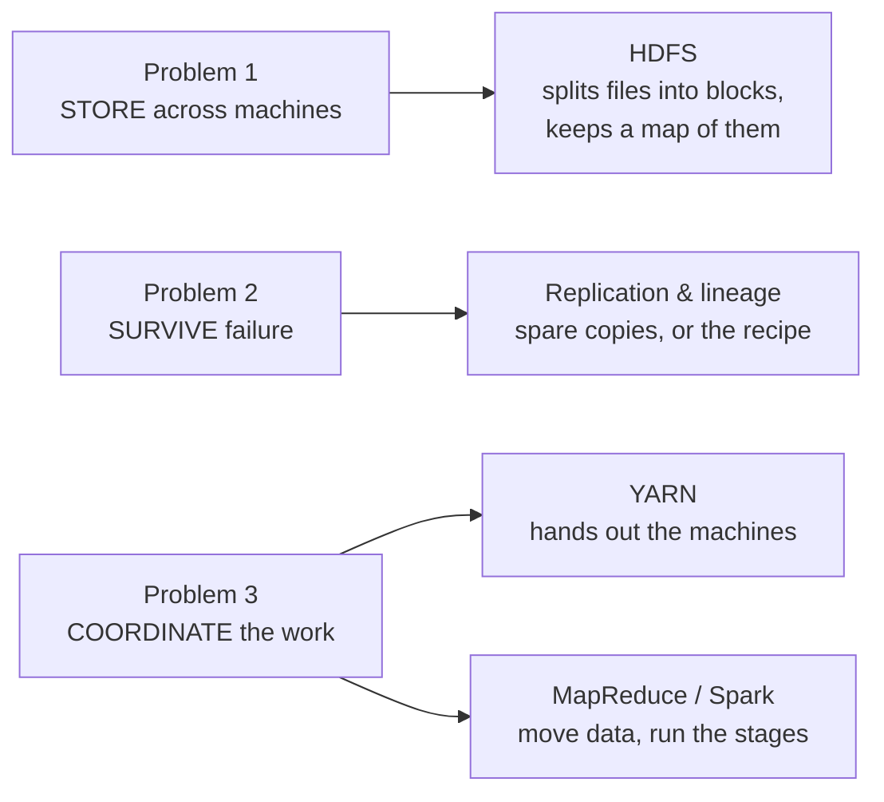

# The Three Hard Problems of Distributed Data

In the last article we made a decision: when one machine hits the wall of price, reliability, or read speed, you stop scaling *up* and start scaling *out*, solving the problem with **many ordinary machines instead of one heroic one.**

We also promised that this decision is not free. The moment you spread a job across many machines, you inherit a family of problems that a single machine simply never had. This article names them, because they are the same three problems, in disguise, at *every* layer of everything that follows. Once you can see them, the whole ecosystem stops looking like a bag of unrelated tools and starts looking like what it actually is: **a stack of answers to three questions.**

Here they are, and we will take them one at a time:

1. **Storage.** The data does not fit on one machine. How do you split it across many and still find it again?
2. **Failure.** With many machines, one is *always* breaking. How does the work survive that?
3. **Coordination.** Each machine sees only a slice. How do they cooperate to produce an answer that needs the whole?

Keep one concrete task in mind the whole way through, the same one the Spark article opens with: *someone hands you two terabytes of logs and asks how many unique users visited last Tuesday.* Watch how all three problems show up in that single innocent question.

---

## Problem 1: Storing what will not fit

A two-terabyte file does not fit on a machine with a one-terabyte disk. This is not a performance problem; it is an arithmetic one. There is no clever code that squeezes two terabytes onto one terabyte of disk. The only way through is to **cut the data into pieces and put different pieces on different machines.**

That sounds simple, and the cutting *is* simple. The hard part is the sentence that comes after it: *and still find it again.* Once your file is scattered as a thousand pieces across a hundred machines, "open the file" is no longer a thing one machine can do. Something, somewhere, has to remember which machine holds which piece, and if that memory is ever lost, the data is *still there*, on all hundred machines, and completely useless, because nobody knows how to put it back together.

<!-- ILLUSTRATION: warehouse-manifest  (REWORK to the funny+title bar before generating, pitch the joke first.)
Concept:     data too big for one place is split across many, and is worthless without a manifest saying which piece went where.
Analogy:     a shipment too big for one aisle, spread across many warehouse aisles, tracked by a clipboard at the door.
Labels:      "AISLE 3" · "MANIFEST" · "LOST?"
Caption:     Splitting the shipment is easy. The manifest that says which aisle holds what is the whole game: lose it and the goods are still there and still lost.
Style:       use the master prompt in STYLE.md verbatim; include a hand-lettered title.
-->

So Problem 1 is really two problems wearing one coat: **split the data across machines**, and **keep a reliable map of where every piece went.** The map turns out to be so important that an entire component will exist just to hold it and protect it. When we reach HDFS in the next module, that clipboard-at-the-door has a name, and losing it is exactly the disaster the design works hardest to prevent.

---

## Problem 2: Surviving the failure that is always happening

On one machine, a hardware failure is a bad day. It is rare, it is memorable, and when it happens you sigh and restart.

Change the arithmetic. Suppose a single machine fails, on average, once every three years. That is very reliable. Now run a hundred of them. The chance that *some* machine in the group is down at any given moment is no longer a rare event; it is roughly one failure every **two weeks**, and climbing with every machine you add. At a thousand machines, something is broken essentially all the time.

This flips the whole mindset. On one machine, failure is an *exception* you can afford to treat as "should never happen." On a cluster, failure is the **normal operating condition.** A distributed system that treats a dead machine as a surprise is a distributed system that is always surprised.

<!-- ILLUSTRATION: understudy-steps-in  (REWORK to the funny+title bar before generating, pitch the joke first.)
Concept:     with many parts, something is always broken, so recovery must be built in ahead of time, not improvised.
Analogy:     a theatre with understudies: any actor might fall ill, so every role has a replacement waiting in the wings, and the show goes on.
Labels:      "UNDERSTUDY" · "SHOW GOES ON"
Caption:     At scale, failure isn't the emergency. Having no understudy is.
Style:       use the master prompt in STYLE.md verbatim; include a hand-lettered title.
-->

There are two broad ways to build the understudy, and the whole ecosystem uses both:

- **Keep spare copies.** Store every piece of data on more than one machine, so when one dies its pieces are still readable elsewhere. This is *replication*, and it is how storage layers survive. It is safe and simple, and it costs you several times the disk.
- **Keep the recipe.** Instead of copying the *data*, remember the exact steps that produced it, so a lost piece can be *recomputed* from scratch. This is *lineage*, and it is how Spark survives without copying everything. It is cheap on storage and clever, and it costs you the recomputation when something breaks.

You do not need the details yet. Both ideas get their own article later. The point for now is only this: **because failure is constant, every serious layer has a deliberate answer to it,** and "just don't fail" was never on the menu.

---

## Problem 3: Making machines that each see a slice agree on the whole

This is the subtlest of the three, and the one that separates people who *use* distributed systems from people who *understand* them.

Go back to the question: *how many **unique** users visited last Tuesday?* Split the two terabytes of logs across a hundred machines and hand each one its slice. Each machine can happily count the rows in its own slice. That part is trivially parallel, no cooperation needed.

But "unique users" is not a question any single machine can answer about its own slice, because **the same user's events are scattered across many machines.** User `42` might appear on machine 3, machine 50, and machine 91. To count them once, every event for user `42` has to end up in the *same place* first. Which means data has to **move**: off the machine that happens to hold it, across the network, to whichever machine is responsible for user `42`.

That movement is the expensive part of distributed computing. The gathering, not the counting, is what costs you.

<!-- ILLUSTRATION: jigsaw-to-one-table  (REWORK to the funny+title bar before generating, pitch the joke first.)
Concept:     each worker holds only a piece; producing the whole answer means bringing the pieces together, and the bringing-together is where the cost lives.
Analogy:     four people who each assembled one corner of a jigsaw must carry their corners to one table to see the finished picture.
Labels:      "LOCAL WORK (EASY)" · "MOVING IT (COSTLY)" · "THE ANSWER"
Caption:     Counting your own slice is free. Getting the right slices into the same place is what you pay for.
Style:       use the master prompt in STYLE.md verbatim; include a hand-lettered title.
-->

Coordination is actually a cluster of related jobs, and it is worth seeing that they are all the same problem:

- **Dividing the work.** Deciding which machine handles which slice, and which is responsible for user `42`.
- **Moving data to where it is needed.** This is the gathering above, and it has a name you will meet often: the **shuffle**, the single most common reason a distributed job is slow.
- **Tracking progress and stragglers.** Noticing that ninety-nine machines have finished and one is buried, and deciding what to do about it.

Every one of these needs *someone in charge*, a coordinator that hands out work, watches for the slow and the dead, and decides when the whole job is done. On one machine there was no such role, because there was nothing to coordinate. On a cluster it is a full-time job, and it is why layers like YARN exist.

---

## The same three problems, all the way down

Here is the pay-off, and the reason this short article is worth remembering better than most.

Every layer of the big-data ecosystem you are about to learn is, underneath, an answer to one or more of these exact three problems:

HDFS is mostly an answer to Problem 1 and part of Problem 2. YARN is an answer to part of Problem 3. MapReduce, and then Spark, are answers to the rest of Problem 3, with Spark adding a cleverer answer to Problem 2. Hive sits on top and hides all three behind SQL. Nothing in the stack is arbitrary. Each piece is there because one of these three problems demanded it.

!!! quote "The lens to read the rest of the site with"
    Whenever you meet a new tool in this ecosystem, ask the one diagnostic question: **which of the three problems is this solving: storing, surviving, or coordinating?** Almost every design choice inside that tool falls out of the answer. A tool that seems baffling in isolation is usually obvious once you know which problem it was built to fight.

---

## The mental model to carry forward

> Splitting work across many machines is the easy part. What you actually pay for is everything that comes after the split: **storing** the pieces so you can find them, **surviving** the machines that keep dying, and **coordinating** the machines so their separate slices add up to one correct answer.

You now have the two ideas the entire foundation rests on: *why* we use many machines (the three walls, from the last article) and *what it costs* us when we do (the three problems, from this one). One thing remains before we start meeting the tools themselves: a single map showing how all of them fit together, so that no name in this ecosystem ever arrives as a stranger again.

---

*Next: **[A map of the ecosystem](ecosystem-map.md)**, one picture of how HDFS, YARN, MapReduce, Hive, and Spark relate, and the "you are here" we will return to at the end of every module.*
