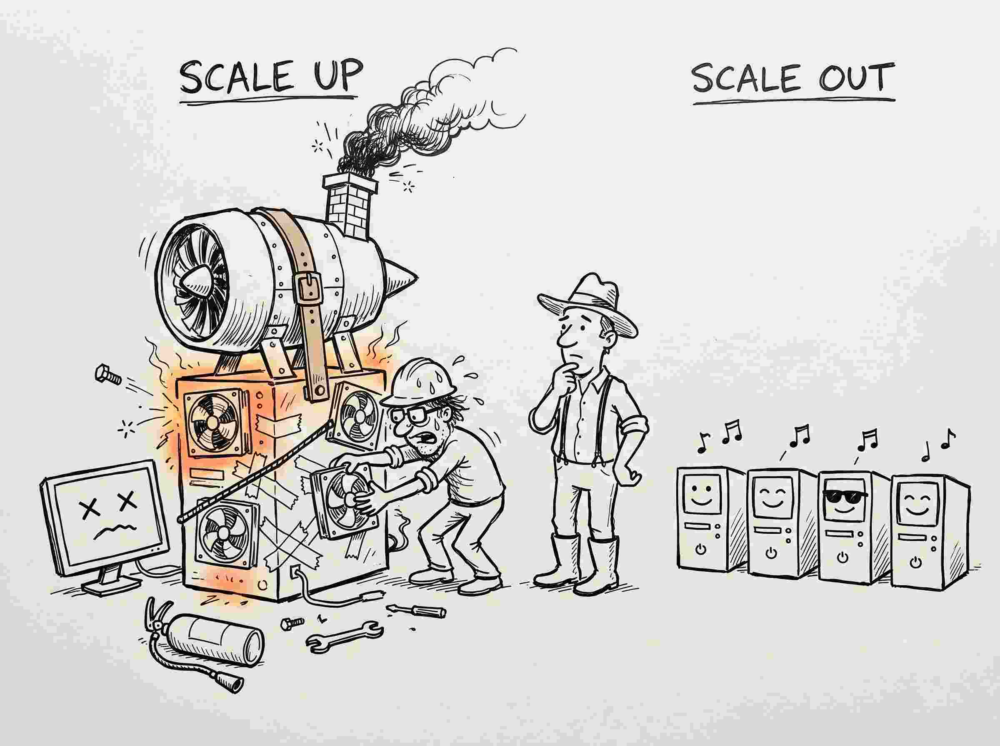

# When One Machine Stops Being Enough

You run a shop, and the stock lives in a shed behind it.

For years the shed is fine. Then the shop does well, and one afternoon you walk out to find the crates stacked to the roof, the aisle blocked, and the delivery driver waiting because there is nowhere to put what he has brought. You have one shed and too much stock, so you do the obvious thing, the thing anyone would do.

You price a bigger shed.

That instinct is a good one. Hold on to it, because it is also the right answer far more often than anyone in this field admits. A shed twice the size solves your problem completely, today, with no cleverness required, and the same is true of computers. The machine you are reading this on has more computing power than the machines that ran entire banks thirty years ago, and for almost everything you will ever do, **one computer is enough.** Most of "big data" is a story about the rare afternoon when it stops being true.

This article is about that afternoon: the exact moment the bigger shed stops being the answer, and what an experienced engineer reaches for instead. Two phrases carry the whole field, and they are simply the two things you can do about a full shed:

- **Scaling up** (*vertical scaling*): build a bigger shed. One machine, more CPU, more memory, faster disk.
- **Scaling out** (*horizontal scaling*): rent more ordinary sheds. Keep the machines cheap, but use **more of them** at once.

Everything below is a single question: when do you stop scaling up and start scaling out?

<figure class="sketch" markdown>

<figcaption>You can't upgrade one machine forever. Use many cheap ones instead.</figcaption>
</figure>

---

## The bigger-box instinct works for a long time

Before we bury vertical scaling, let us give it its due, because it is quietly the right answer most of the time.

A single virtual machine you can rent today, by the hour, can have **over a hundred CPU cores and several terabytes of memory.** The largest cloud instances reach into the tens of terabytes of RAM. That is not a toy. A machine like that will hold a dataset that would have been called "big data" a decade ago *entirely in memory*, and chew through it without a cluster, without a framework, without any of the complexity the rest of this site is about.

!!! tip "Reach for the bigger box first"
    A huge fraction of problems labelled "big data" are nothing of the sort. They fit on one large machine with room to spare. The simplest system that solves your problem is almost always the right one, and one machine is the simplest system there is. **Do not reach for a cluster before you have to.** The rest of this article is about how to know when you have to.

So if one machine goes this far, why does anyone build clusters at all? Because vertical scaling runs into **three separate walls,** and a bigger box does not help you climb any of them.

---

## Wall 1: the price stops being fair, and then the box runs out

Go back to the shed. Doubling its floor space does not double the rent, it more than doubles it, and past a certain size you stop finding sheds at all. You are no longer choosing between prices. You are being told that the thing you want to rent does not exist.

Machines behave the same way. Doubling a machine does not double its price. In the commodity range, price and power rise together roughly fairly. Past that range, the curve bends sharply upward: the parts that go into the very largest servers are specialised, low-volume, and priced accordingly. You pay a steep premium for the privilege of keeping everything on one box.

And then the box runs out. That is the part people forget. There is a largest machine that money can buy. When you have rented the biggest instance your cloud offers, there is no "twice as big" to rent at any price. The ceiling is not financial at that point. It is physical.

<!-- ILLUSTRATION: bigger-box-price-ceiling  (SUPERSEDED, regenerating as the funnier "top-of-the-range": a computer shop where the biggest box has burst through the roof into the clouds, price $99,999,999, a moth flying from the customer's wallet, a NO BIGGER! card on the empty shelf; title "TOP OF THE RANGE". Swap in top-of-the-range.jpg when it lands.)
Purpose:     kill the belief that you can always just buy a bigger machine.
Concept:     vertical scaling gets disproportionately expensive and then simply hits a ceiling: there is no bigger box.
Labels:      "TOP OF THE RANGE" (title) · "$99,999,999" · "NO BIGGER!"
Caption:     Sooner or later, there's no bigger box to buy.
Style:       use the master prompt in STYLE.md verbatim; include a hand-lettered title across the top.
-->

Two ordinary machines cost far less than one machine twice as powerful, and unlike that machine, they actually exist. That alone is a strong hint about where this is heading.

---

## Wall 2: one machine is one thing that can break

A shed with every crate you own in it has a property you would rather not think about: it can burn down. When it does, you do not lose some of your stock. You lose all of it. Notice that the bigger shed made this *worse*, because you put more in it.

Here is the same failure mode in a machine, and no amount of money fixes it either. Your job has been running for nine hours. At hour nine, the machine's power supply dies.

You have **nothing.** Not a partial answer, not a checkpoint you didn't write, nothing. And a bigger machine makes this *worse*, not better: it concentrates more of your work behind a single point of failure. Adding RAM does not buy you reliability. It buys you a larger, more expensive single thing to lose.

<!-- ILLUSTRATION: all-eggs-one-basket  (REWORK to the funny+title bar before generating; pitch the joke first. Idea: one smug giant server tripping over its own power cord and going dark, while the little cluster beside it just shrugs and carries on.)
Purpose:     show that reliability is not a quantity you can add to one machine.
Concept:     one machine holding everything means one failure loses everything.
Labels:      "ONE MACHINE" · "MANY MACHINES"
Caption:     One machine dies, you lose everything. Many machines, you just lose one.
Style:       use the master prompt in STYLE.md verbatim; include a hand-lettered title.
-->

Reliability, it turns out, is not a component you can order. It is a *property of having more than one of something.* One machine cannot have it, however large.

---

## Wall 3: a fast brain still reads one page at a time

This is the wall that surprises people most, because it has nothing to do with how clever or fast the CPU is.

The shed has one loading door. It does not matter how large you build the shed, how many staff you hire, or how quickly they work: every crate that comes in or goes out passes through that one door, one at a time. Hire ten more pickers and they will queue at the door. The door is the limit, and the door does not get faster.

A disk is a loading door. Suppose you must scan a 10 TB file: just read it once, cover to cover. A *fast* local NVMe drive reads at roughly 2 GB per second, and most storage is slower than that. Do the division: 10 TB at 2 GB/s is still about **an hour and a half of pure reading** on the fast disk, and many hours on the ordinary network or cloud storage where big files actually live. The whole time, the CPU sits idle, waiting for bytes to arrive.

Now here is the trap. Buying a faster CPU does *nothing*, because the CPU was never the bottleneck. And you cannot make a single disk read meaningfully faster than a single disk reads. You have hit a physical rate limit on one machine, and no upgrade you can bolt onto that machine moves it.

There is exactly one way to read faster than one disk: **read from many disks at the same time.** More doors, not a wider door.

<!-- ILLUSTRATION: many-hands-one-book  (REWORK to the funny+title bar before generating.)
Purpose:     separate "processing speed" from "how fast you can get the data in", the real bottleneck.
Concept:     one disk reads at one fixed speed; the only way to read faster is to read many at once.
Labels:      "ONE DISK" · "MANY DISKS" · "SAME TIME"
Caption:     One disk reads at one speed. Many disks read faster.
Style:       use the master prompt in STYLE.md verbatim; include a hand-lettered title.
-->

Notice that the three walls are not really about money at all. They are three *different* ceilings: **price, reliability, and throughput**, and a bigger box slams into all three. No single machine, however expensive, escapes even one of them.

---

## The other kind of bigger: more boxes

So stop trying to rent the impossible shed, and rent ten ordinary ones across town instead, each with its own door and its own crew. Nothing about that idea is clever. It is what any shopkeeper would do once the big shed turned out not to exist, and it is the whole of horizontal scaling: instead of one heroic machine, **many ordinary ones working on the problem together.**

Look at what the ten sheds buy you against all three walls at once:

- **Price.** Ten ordinary sheds cost far less than one mythical shed ten times the size, which is not for rent at any price. Commodity machines are cheap and plentiful precisely *because* they are ordinary.
- **Reliability.** If one shed burns down, you lose a tenth of your stock and the shop stays open. Many machines can lose one and carry on.
- **Throughput.** Ten sheds have ten doors, and ten trucks can load at once. A hundred machines each read their own 100 GB slice of that 10 TB file *simultaneously*, so each does one-hundredth of the reading, and the hour and a half collapses toward a minute.

That is the whole promise of horizontal scaling, and it is genuinely transformative. A hundred cheap machines beat one impossible machine on cost, on survival, and on speed, all three.

This shed and its fleet of trucks will follow you through the rest of the site, because every tool ahead is a warehouse problem in disguise. The crates are your data, the sheds are the machines that hold them, and the trucks are how the data moves.

---

## Nothing is free: the bill comes due later

If horizontal scaling were pure upside, this site would be one page long. It is not, and here is the honest catch: **the moment you split a job across many machines, you inherit a whole family of problems that a single machine never had.**

A single machine never had to ask any of these. A cluster asks all of them, constantly:

- A 10 TB file will not fit on any one machine. So **how do you store a file across many machines** that each hold only a slice of it, and find it again later?
- Machines fail. With a hundred of them, one failing is not a rare disaster; it is *Tuesday*. So **how does a job survive a machine dying** halfway through, without starting over?
- Counting unique users, or joining two tables, needs to see *all* the data, but each machine only holds a fraction. So **how do machines that each see one piece cooperate** to produce an answer that depends on the whole?
- Some machines finish early; one unlucky machine gets the hard slice and lags. So **how do you keep ninety-nine machines from waiting on the one slow one?**

These are **the three hard problems of distributed data**: storing across machines, surviving failure, and coordinating work. They are the subject of the very next article. For now, hold on to just one idea, because it is the key that unlocks everything that follows:

!!! quote "The idea to carry forward"
    Every tool you are about to meet on this site, from HDFS and YARN through MapReduce and Hive to Spark itself, is at bottom **an answer to a problem that horizontal scaling created.** You chose many machines to beat the three walls. The entire ecosystem is the bill for that choice, paid down one clever idea at a time.

---

## So when should you actually scale out?

Because the bill is real, the discipline is to scale out **only when a wall forces you to.** A useful rule of thumb, in order:

1. **Start on one machine.** It is simpler, cheaper to reason about, and has no distributed bugs, because there is nothing distributed. Most jobs never need to leave here.
2. **Scale it up** if it is slow or tight. Rent the bigger box. This buys you a long runway with almost no added complexity.
3. **Scale out only when you hit a wall the bigger box cannot climb:** the data will not fit or cannot be read fast enough even at full disk speed, or you must survive machine failure, or the largest single machine on offer still is not enough.

!!! warning "The most expensive mistake in this whole field"
    It is reaching for a cluster too early. A distributed system makes you pay a permanent **coordination tax**, the cost of all four questions above, on *every* job, forever. Pay that tax for a job a single machine would have finished, and you have bought yourself slower results, more moving parts, and a harder system to debug, in exchange for nothing. When we reach Spark, you will see this exact mistake has a name and a shape: [the giant crane lowered to lift a single grocery bag](../../Spark-DataBricks/1.0_Spark/1.0_Spark-Concepts.md). Keep it in mind the whole way there.

---

## The mental model to carry forward

If you remember one thing from this page, remember the shape of the decision, not the numbers in it:

> You scale **up** by making one machine bigger, until you hit the wall of price, reliability, or read speed. Then you scale **out** by using many ordinary machines instead, which beats all three walls and in return hands you the problems of *storing, surviving, and coordinating* across those machines.

Everything else on this site is what people built to solve those three problems well. You now know *why* the big-data ecosystem exists. Next, we look at the three problems themselves in detail, the foundation every later tool is standing on.

---

## Where the shed analogy breaks

The warehouse will carry you a long way, so it is worth saying plainly where it lies to you, before the lie turns into a habit.

**Sheds are independent. Machines are not.** Ten sheds across town do not need to talk to each other, and your ten machines do, constantly. That conversation runs over a network, the network is far slower than a machine's own memory, and almost every performance problem in this entire field traces back to it. The warehouse quietly hides the single biggest cost in distributed computing.

**Stock gets moved. Data gets copied.** Move a crate from one shed to another and the first shed is empty. Copy a file to another machine and both machines have it, which is why "keep three copies in three sheds" is a sane thing to say about data and an absurd thing to say about furniture.

**A shopkeeper counts crates. A cluster answers questions about all of them at once.** Counting your total stock across ten sheds means someone gathers ten numbers and adds them, and that gathering step, trivial in a warehouse, is the expensive thing called a shuffle. It is coming.

Keep the sheds. Just remember that the trucks between them are the part that costs you.

---

## Test yourself

Answer each one in your head before you open it.

??? question "Your job takes six hours on a machine with 64 GB of memory. Your first move?"
    Rent a bigger machine. Not a cluster. Six hours is not a wall, it is an inconvenience, and vertical scaling buys you the improvement with none of the coordination tax. Reach for a cluster only when a wall stops you: the data does not fit, the read is too slow at full disk speed, or you must survive a machine dying.

??? question "A colleague says a bigger machine will make the job more reliable, because the hardware is better. What do you tell them?"
    Reliability is not a component you can order. It is a property of having more than one of something. Better hardware fails less often, but when it fails you still lose everything, and a bigger machine loses *more*. One is one, however expensive it is.

??? question "You need to read a 10 TB file faster. Would a faster CPU help?"
    No, and this is the wall people miss. The CPU was never the bottleneck; it sits idle waiting for bytes. The single disk is the loading door, and no upgrade bolted onto that machine widens it. The only way to read faster than one disk is to read from many disks at once.

---

*Next: **[The three hard problems of distributed data](three-hard-problems.md)**, storing across machines, surviving failure, and coordinating the work.*
